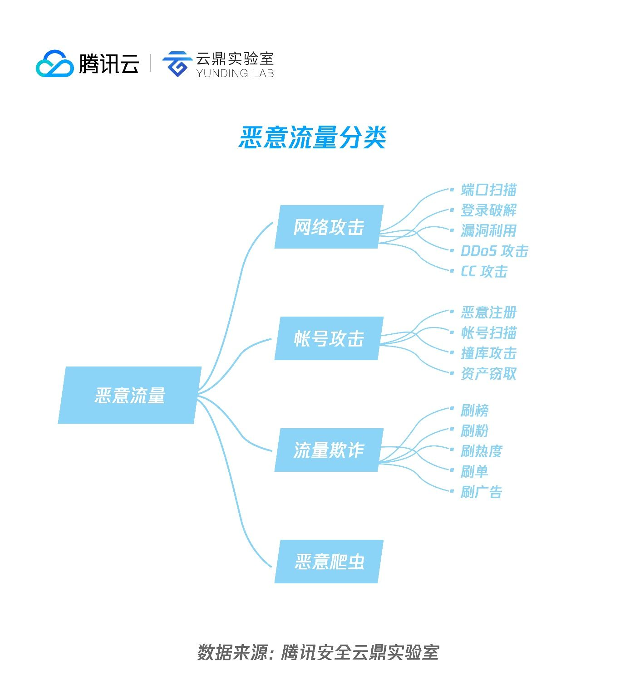

## 黄赌毒
### 网络公害流量的定义
（几乎找不到相关的定义。根据公害的定义和一些资料可以做出如下介绍。凡影响三人以上并侵害他们作为公众成员而应享有的权益的妨扰为“公众性妨扰”，简称“公害”。）


网络公害流量泛指干扰和破坏正常网络活动、侵害公众网络权益的内容，通常伴随着网络公害行为产生。网络公害行为包括窃取用户信息、恶意广告、金融诈骗、传播黄赌毒、网络诈骗和勒索、恶意安装和卸载软件、网络监听、网络霸权、网络攻击、非法交易。严重干扰用户的日常工作、数据安全和个人隐私。

* 网络霸权：希望只有自己发言，其他人等，要么和自己的语意一致，要么闭嘴。
* 网络窃密、网络暴力、网络侵权、网络暴恐、网络攻击。
* 恶意流量是指通过网络创建或接收的任何可疑链接、文件或连接。恶意流量是一种造成事件的威胁，可能会影响组织的安全，也可能会危害您的个人计算机。
* 恶意软件或恶意软件会渗透并控制计算机系统或移动设备，以窃取有价值的信息或损坏数据。恶意软件有很多种，它们在执行攻击时可以相互补充。广告软件、后门/远程访问木马（RAT）、僵尸网络、间谍软件、木马蠕虫
* 恶意爬虫、自动机、模拟器等产生，伪造真实用户发起的请求，都属于恶意机器流量（Bad Bots）。恶意流量的存在严重危害了互联网的健康发展。这些流量通过在应用层攻击网站、APP或是API，以达到获利的目的，同时也会对企业造成经济上的巨大损失。恶意流量具有三大特点：攻击普遍性、攻击持续性、攻击目的性。
<!-- *   -->

### 网络犯罪
* 涉及基本罪，侵犯的个人或企业隐私，比如在攻击完整的数字托管保存的信息和使用非法获得的数字信息敲诈一个公司或个人。此外，身份盗窃的犯罪活动也在不断增加。包括基于交易的犯罪，例如欺诈、贩卖儿童色情制品、数字盗版、洗钱和伪造。
* 涉及企图破坏互联网实际运作的犯罪。这些范围从垃圾邮件、黑客攻击和针对特定站点的拒绝服务攻击到网络恐怖主义——即利用互联网引起公众骚乱甚至死亡。

    * 电子邮件和网络欺诈。
    * 身份欺诈（个人信息被盗和使用）。
    * 盗窃财务或卡支付数据。
    * 盗窃和出售公司数据。
    * 网络勒索（索要金钱以防止受到威胁的攻击）。
    * 勒索软件攻击（一种网络勒索）。
    * Cryptojacking（黑客使用他们不拥有的资源挖掘加密货币）。
    * 网络间谍（黑客访问政府或公司数据的地方）。
### 产业链

编写恶意代码、散发恶意代码、收集/控制受害主机、利用受害主机赚钱和地下交易平台.其中,散发恶意代码的方式有垃圾邮件、网站和聊天工具等,收集/控制受害主机的方式有僵尸网络和木马网络,利用受害主机赚钱的方式有受雇从事针对竞争对手的网络病毒攻击、散发商业垃圾邮件、构建钓鱼网站、制造虚假流量、盗取和售卖账号密码和隐私信息


### 黄赌毒网站特点

* 网站重定向。劫持网站，篡改网页。重定向到特定的恶意网址。
* 欺骗搜索引擎。bot。让搜索引擎误以为是正常网站。
* 诱导下载APP。使用专用加密协议向用户推送恶意内容。
* 国外运营，逃避监管。
* 仅靠技术不足以区分不同犯罪活动领域之间可能存在的任何区别。必须结合内容。

### 网络公害流量有什么特点（可以从哪些角度）

* 内容与技术融合。例如赌博总是与黄色内容、恶意广告结合在一块发布。而且赌博越来越与社交媒体、网络游戏等内容融合。

### 网络公害加密流量的特征
* 解密前的报头特征
```
2.3.1 会话的统计特征分析
    (1)包数量的特征
    (2)包长序列的特征
    (3)会话持续时间的特征
    (4)数据包顺序与大小特征
2.3.2 TLS协议特征分析
    (1)加密套件使用的特征
    (2)扩展加密套件使用的特征
2.3.3 服务器证书特征
2.3.4 服务器域名特征
```

* 解密后的负载特征

## 网络公安

### 公安如何侦察
* 内容审核。各平台也要加强审核力度，强化底线思维和社会责任感，谨防自身成为毒流量生长传播的温床，与政府部门、媒体、网民等社会各界携手营造清朗的网络空间。
* 网络违法犯罪举报。
* 搜索引擎一般是不收录的。


### 分析步骤

* 网络流量====>网络信息内容


## 2021年6月22日会议记录

### 

* 交互的行为特征
* 公害流量知识库
  * 上层的API调用层
  * 下层的网络通信层