# 电话

## 电话与未来
* 电话是什么
  * 原理和技术上的东西就不说了。一种可以传送与接收声音的远程通信设备。电话主要的功能是“沟通”
  * 我觉得电话的含义也在不断地扩充。包括电话手表，eyephone,smartphone,earphon等，人们愿意保留phone这个词在这些物品中，很大一部分原因，是它发挥了连通的作用。通过某种手段，将无法见面的人的声音传递过来。
* 科幻
  * 科学幻想（Science Fiction）根据有限的科学假设（某些东西的存在，某些事件的发生），在不与人类的已知信息冲突的前提下（如现有的科学理论，有据可考的事件记录），虚构可能发生的事件。科幻目前已发展成为一种文化和风格，而科幻文化也成为了一种由科幻作品衍变出来的新文化。
  * “依据科学技术上的新发现、新成就以及在这些基础上可能达到的预见，用幻想的方式描述人类利用这些新成果完成某些奇迹的新型小说。”其实这个定义是有必要的，其中因为有一点，我认为科幻最重要的不是科学的假设的部分，如何描绘未来科技或者幻想的场景（像很多漫威英雄一样），虽然看起来可能很爽，但不应该是科幻作品的探讨的东西。我觉得，科幻作品应该是那种基于很小的假设，可能对某个人生命轨迹的改变或者带来的人类文明与社会上的巨大冲击。
* 题目
  * 再说会这个题目。我觉得起的不好。因为与未来通话是一件十分简单的事情，只要我们在纸上写下一行字，就可以对未来产生影响。同样，如果我们打通了大洋彼岸的电话，如果延迟足够大，我们就能切实的体验到，其实我们是在对未来的说话。而在这个命题下，我们没有实现的，科学幻想出来的，应该是向过去说话。这么说的目的，当然是起到未来的人能打通与我们的电话，哪天接起一个电话，说不定就是来自未来的。
  * 我感觉我可能对这方面的理解，与各位其实还相差很远，就只能查查资料，给各位汇报一下了。

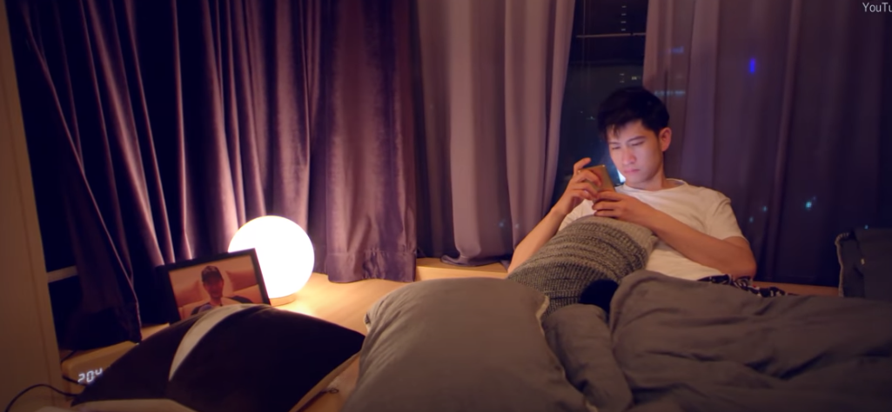
> 我应该区讲什么。是有各式各样的电话吗？我觉得不是，我更想去讲，关于电话的科学幻想。在这些科学幻想中电话具有怎样的功能。这种功能会给其中的人类世界带来哪些改变？以及这样的科幻反映了人自身的哪些内在需求。
> 我觉得这都是一些宏达的问题，我可能根本讲不了，甚至这些东西都是以电话为凭借，世界上是在将科幻中的药解答的问题。

## 电影
### 漫威中的电话

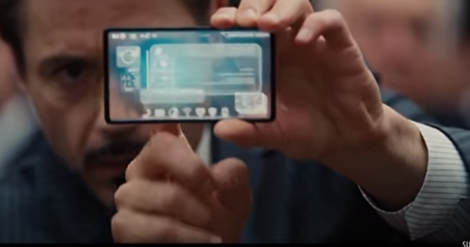

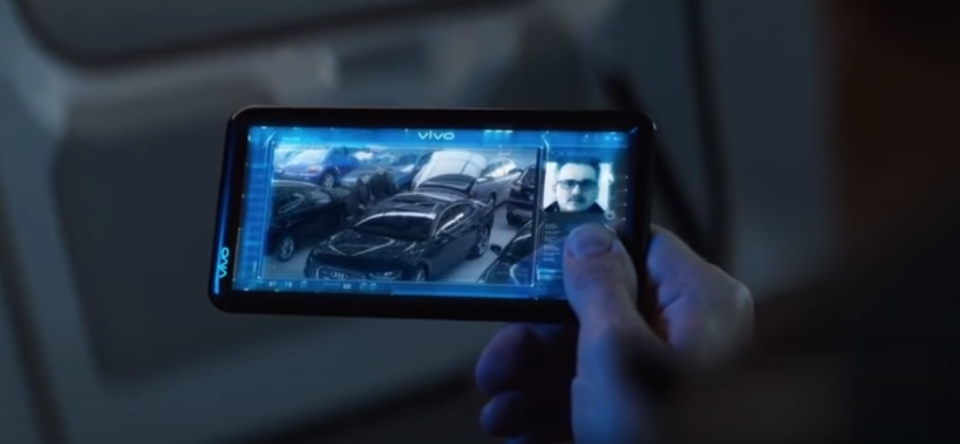

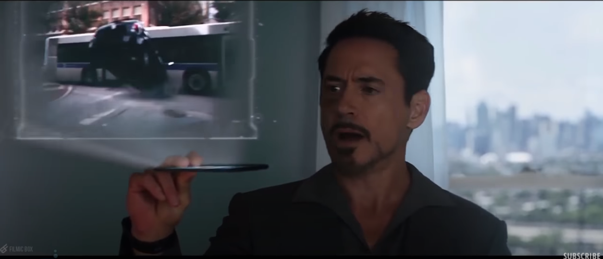

### 黑客帝国

> 一个伟大的科幻电影

* 尼奥挣脱由一个名叫“母体”控制的虚拟世界进入现实世界的故事。人们在母体中就像他们饲养的动物，没有自由和思想，而尼奥就是能够拯救人类的救世主。

* 接线员，负责将母体中的电话与现实世界的肉体信号接通，传送回来

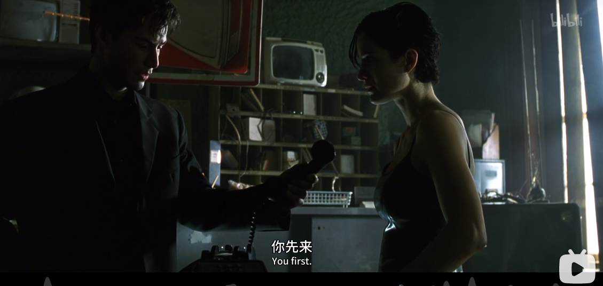
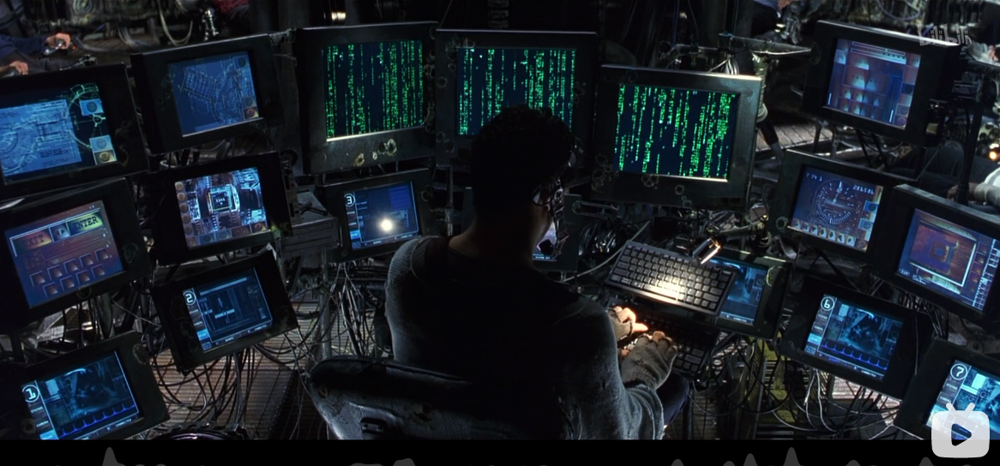

* 我觉得电话，在这里，是一个“门”的作用，从一个世界，向另外一个世界过度的门，穿过话筒的不再是声音，还包括自己的精神与意识。
* 塞佛“你知道吗，我知道这块牛排并不存在。我知道当我把他放进嘴里时，母体就会告诉我的大脑，这东西鲜嫩多汁。九年后的今天，你知道我领悟了什么吗？无知，就是幸福”。再这样的世界中既有像他们这样的抗争着，又有接受了现实，觉得这才是真正的幸福的东西。
* 有的时候，我觉我们所说的快乐就是最好的，但我觉得，如果只是为了快乐，不如多注射点多巴胺，沉迷在无所不能的世界就好了。我想我们追求的应该是更多的东西

## 动漫

### 多啦A梦
> 根据科幻的定义，它应该是一部伟大的科幻作品。

* 传物电话——给老爸送邮件。除了这个偷了两次静香的裙子，还抓住了哪个打骚扰电话的同学。用这种电话，说不定以后真的就没有骚扰电话。

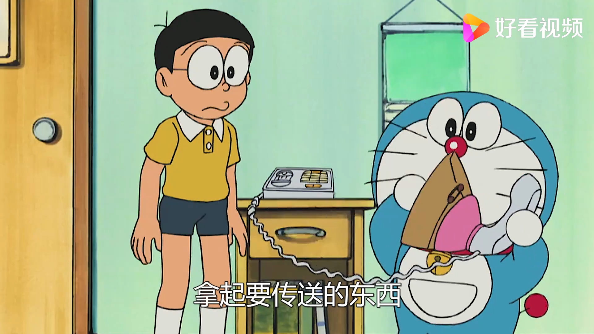
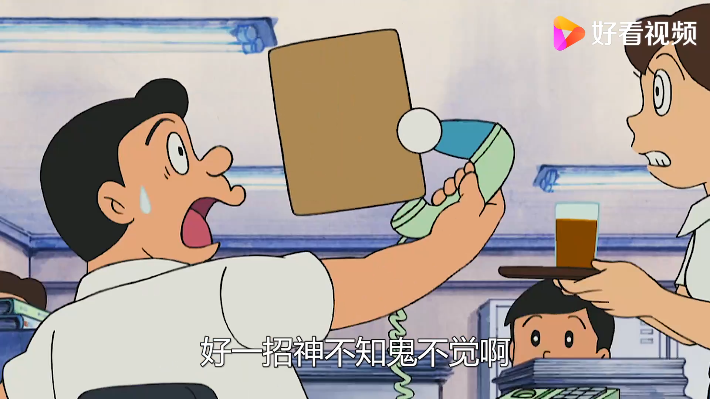
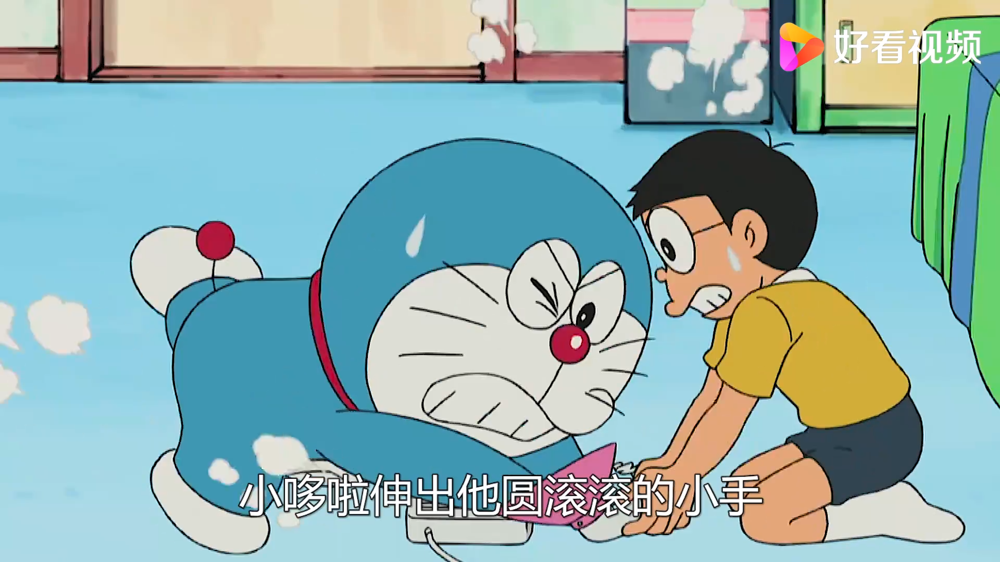

* 随叫随到电话——如果能到朋友家去的话，那我干嘛还需要电话。
  * 我觉得电话未来的发展，无非也是这样。我无法想象，多年前，第一次接通电话的那群发明家，与远处的人交流的时候的有多么冲动。但是人们总是不满足于现状，期待接听电话可以传送更多的东西，传送现实中的物体，甚至是人们自己。我觉得，这是对电话的通信与传输的属性，进行发散。

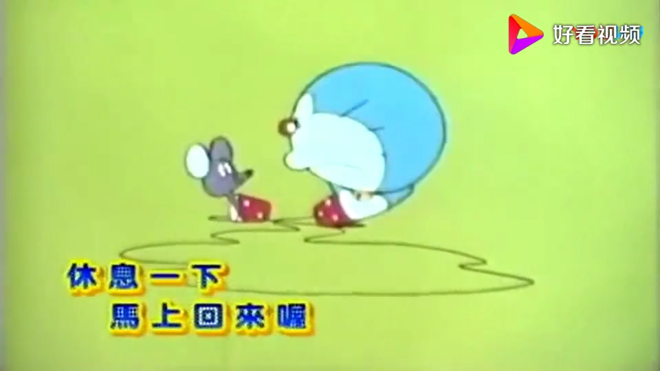
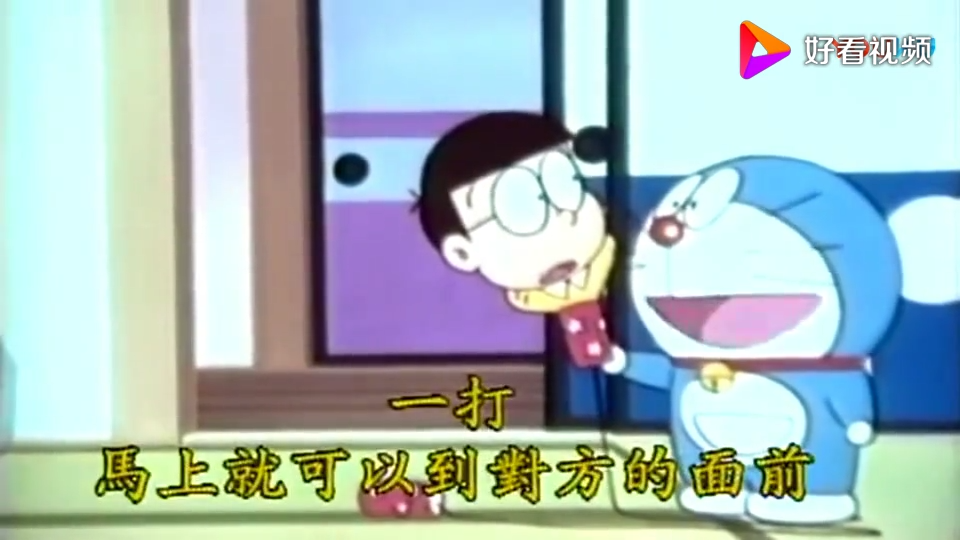

* 如意电话亭——没有放风筝，没有羽毛毽，没有抽陀螺的世界。风筝飞到天上，怎么拉都拉不下来。
  * 如果接到电话，我们第一件事是干嘛，“喂你好，哪位”。电话另一端的人，总是未知的陌生的，也可能是某个能够实现我们的愿望的神明。不像现在，一堆骚扰电话，以前家里每次电话响了，总会有点期待，有种开盲盒的兴奋与快乐。
  * 我想这也是电话这种发明带给我们的一些乐趣。

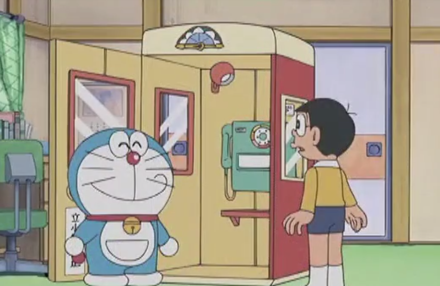
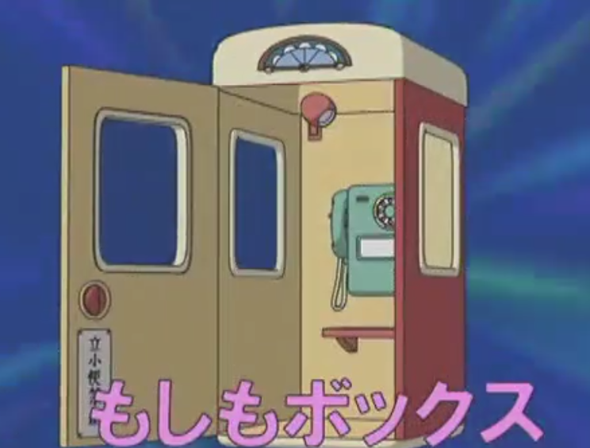
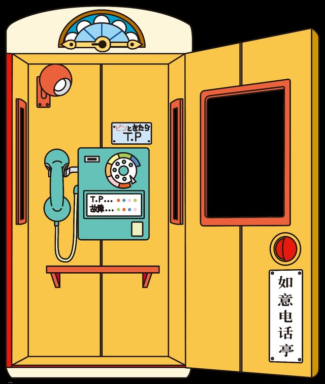

* 我想多啦A梦，不只是单单的拿出了神奇的道具，让我们觉得神奇。更重要的是，即是在伟大的发明与科技进步下，人与人之间的感情，多啦A梦与大熊的陪伴，仍旧是最可贵的。

### 命运石之门
* 主角发明了电话微波炉，通过电话向微波炉发送信息，微波炉逆向旋转，最终信息发送到了过去。然后主角因为向过去发送了信息，结果产生了两个时间线，为了满足同伴的梦想以及做测试，先后发送多封dmail，造成多次跳线。即发送的信息回到过去，会导致过去发生变更，但不会出现祖父悖论，而是产生一条新的时间线。但最终会时间线会收束到一块，即使改变了过去，未来还是一样。
* 直到有一天，他在alpha和beta之间穿梭。然后青梅竹马和女主之间必有一人会死。balabala

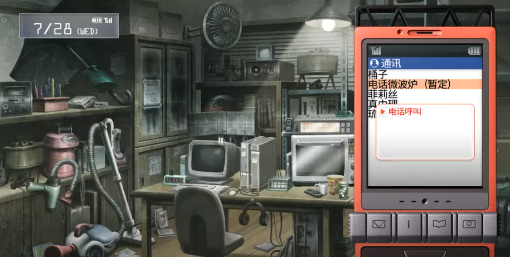

* 电话可能只是一个媒介，也是通向过去的一个方法或者说钥匙。无论穿越多少次，也无法得到完美的现在，不如好好珍惜。

### rick and morty

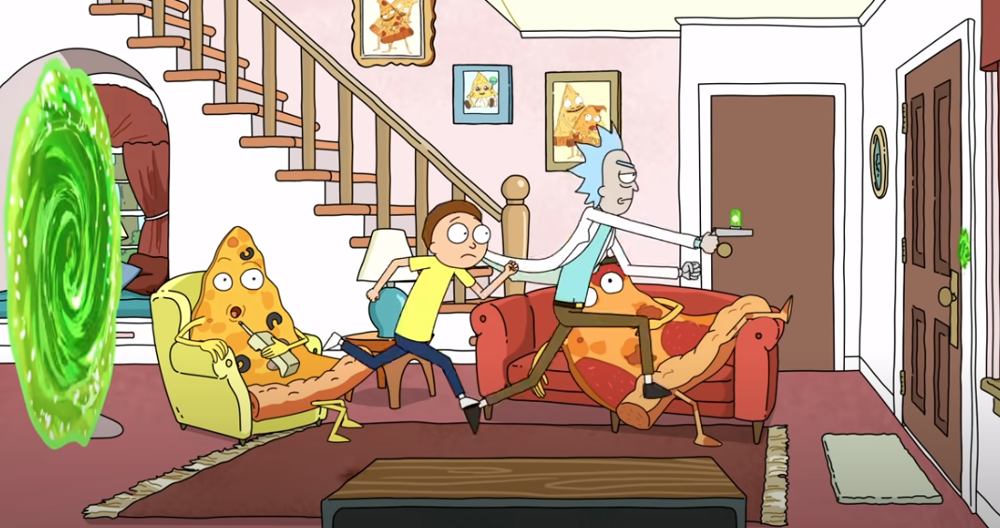
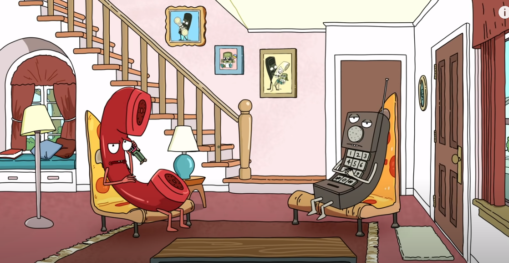
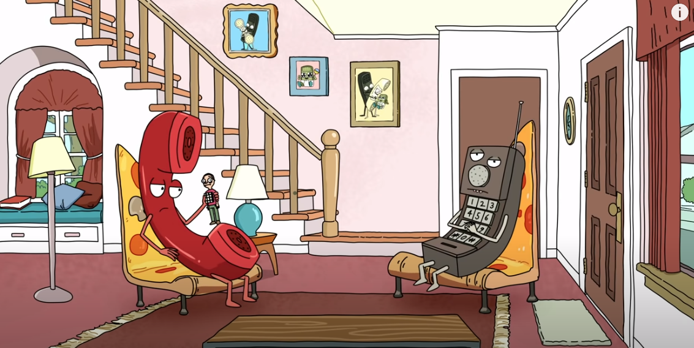
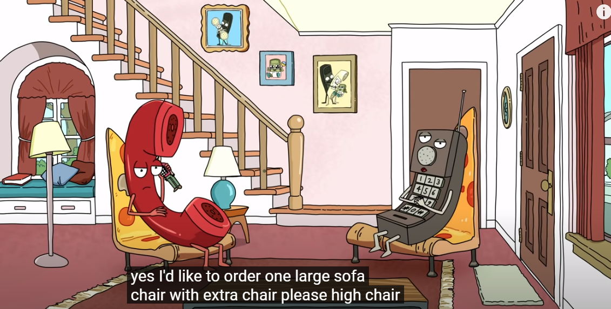
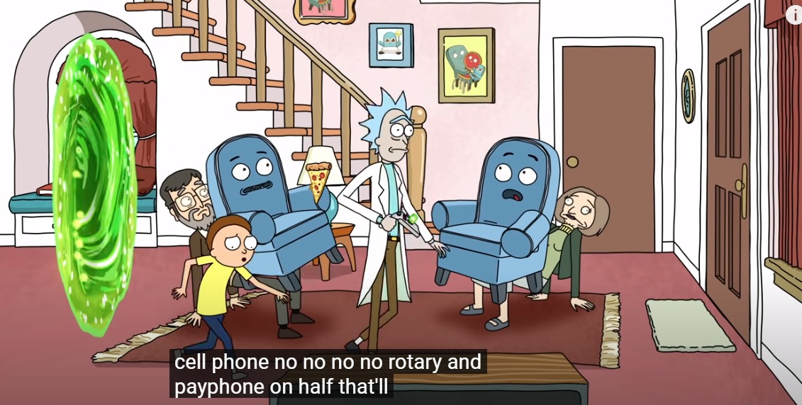

* rick 姥爷和morty 逃离过程中，地球C-137。遇到的一堆奇怪的星球。是不是有一个星球上的主角是电话，电话门也发明了电话在打电话，我觉的这种递归的世界应该会很有意思。最后一个图是沙发坐在人身上用披萨打电话。

## 小说

* “反向延时电路”一种向过去通信的方法。也是电话的一种吧。其实科幻作品的本质并非科学。而是社会学。无论是三体当中，逻辑作为社会学家成为一个成功的面壁者还是程心最终导致了同归于尽结局，所有的原因，都是人性，而不是科技。哪怕是银河帝国，也是描述的披着高科技外衣的帝国政治，而非漫威那种通过科技和力量来左右社会。真正能够左右社会的，只有社会规律，只有组成社会的个体——人。

* 本篇与第一篇更相似。第一篇是对时间穿梭的积极响应，而这里却展示了如何通过因果律来摧毁人的自由意志。在不违背因果的情况下与过去通信，等价与失去自由意志。我觉得我们可以讨论这种设定的巧妙之处，针对这种设定造成的社会现象，讨论可能出现的一些问题。

* 一个能在你按下一秒之前闪烁的预测器。通过一个所谓的反向延时电路实现。负延时为一秒钟。
* “通常来说，一个人会着魔般地连续玩好几天，拿给朋友看，绞尽脑汁瞒骗装置。这个人可以假装对它失去兴趣，但他不可能忘记其中的内涵——接下来几周里，‘未来无法改变’这个年头深入他的脑海。有一部分人意识到选择毫无意义，从此拒绝再做出任何决定。他们纷纷停止了一起自发活动，最后甚至三分之一的玩家必须入院治疗，因为他们连自己吃饭都做不到。终极状态是运动不能性缄默，醒状昏迷的一种。他们能用眼球追踪动作，偶尔改变躺姿，但仅止于此。运动能力依然存在，动因却已经消失”

* “我正在你的额未来一年以后想你发送这个警告，它是兆秒级反向延时电路首次应用于通信设备后收到的第一个长信息。关于其他问题的消息将陆续送来。我给你的信息是这样的：假装你拥有自由意志。关键在于你必须假装你的决定至关重要，即使你知道事实并非如此。显示不重要，重要的是你相信什么，而相信谎言是避免醒状昏迷的唯一方法。文明如今维系于自我欺骗智商。也许一向如此。”

* “我既然直到无法改变，那我为何还要这样做呢？因为我无法选择。”

## 科幻中电话的总结

### “科幻世界的电话”——融合尖端科技的设备，像是研究中的横向。
* 电话的外形更加符合人们对于科技的向往。向那种透明的电话、全息投影，越来越多的东西移植到电话上面，我们的电话不再是单纯的电话。

### “科幻世界的电话”——通向异世界的大门。

* 像是黑客帝国中，在虚拟和现实世界总穿梭。像是命运石之门中，在两个时间线之间移动。大多这种电话，还保留其“沟通”的最基本的能力，并在这种能力上进行延伸拓展，像是做电话的纵向。

* 门。一扇门。人们总在赋予它更多的含义。刚开始，打开这扇门，你能听到电话线另外一段的声音，再后来，可能听到来自更遥远的声音，甚至是千里之外的影像图片。基于这种门的思路，越来越多的人，想要通过这扇门看到更多的东西。像现在手机上已经可以传递货币，可以传递爱情，但究其本质还是一种数据。而科幻无非基于两点，空间上的延展与时间上的穿梭。
* 人们希望通过这扇门能够传递物质，实现瞬间的转移，也想要通过这扇门跨越时间，向过去与未来发送信息。说不定真的可以实现，而且还可以很好的解决某个悖论。我们没有收到未来的信息，是因为我们还没有造出第一扇门，迎接未来的人。

## “电话”
* 科幻，源于未知的浪漫。而科幻作品，在探讨某一科技出现之后的社会学问题。我觉得科幻作品中的科幻元素只是背景，而真正让人思考的是其中的人文社会变化。
* 我觉得我抛出的每一个观点都有很强的主观色彩，很容易出现矛盾和冲突。要讨论的可能还真的挺多。

* 科技的发展会放大人们自身的缺陷