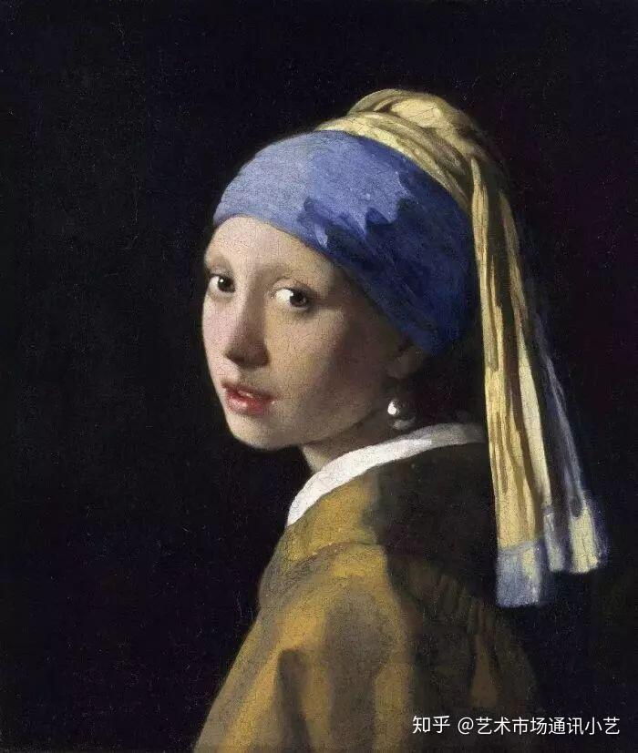
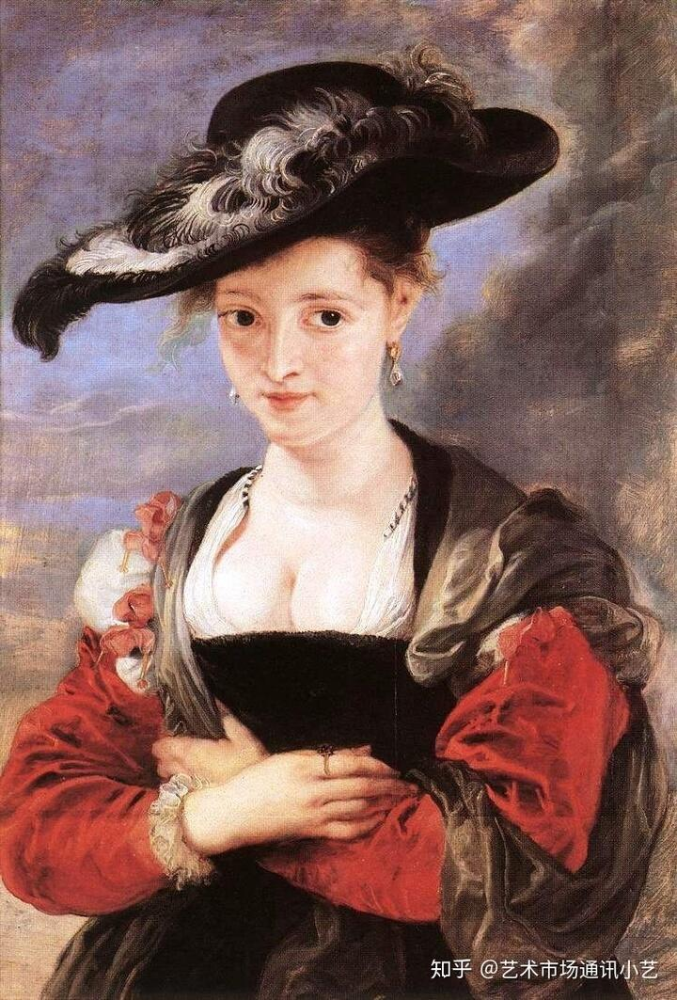
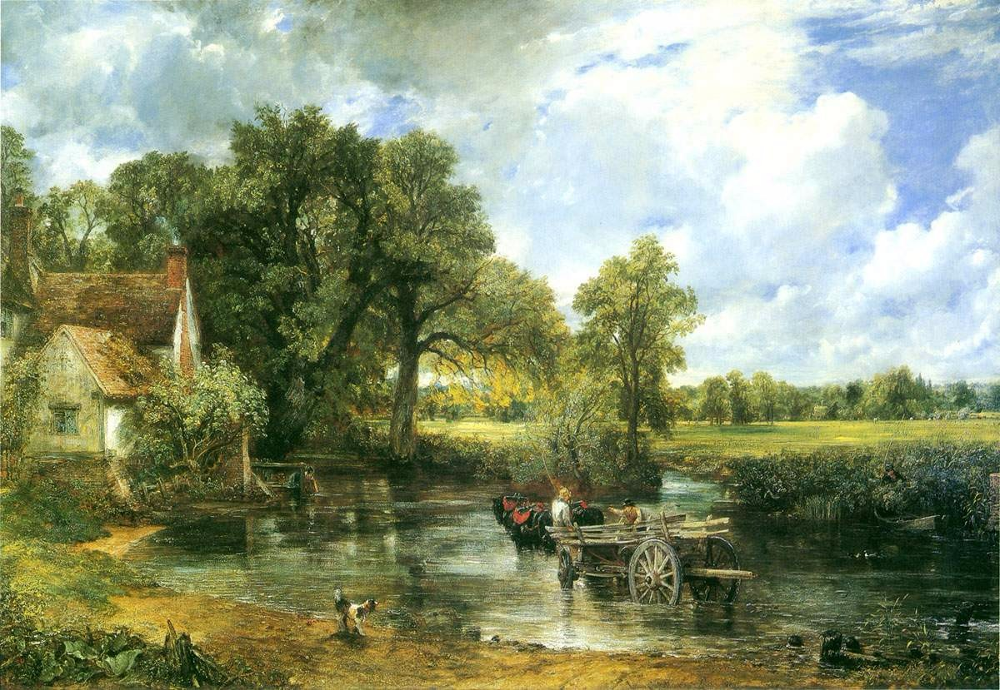
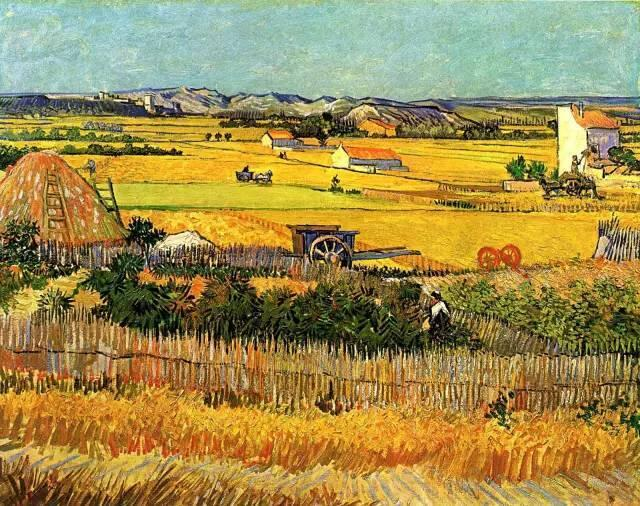
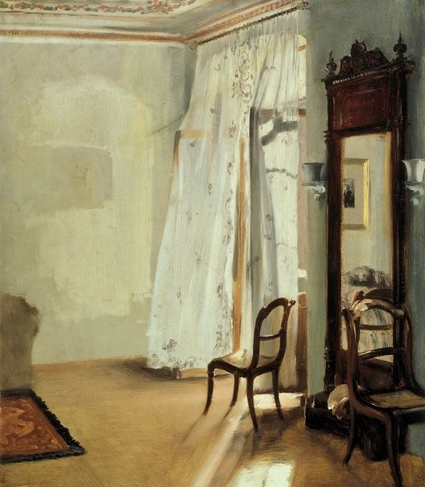
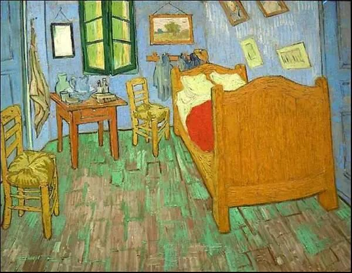
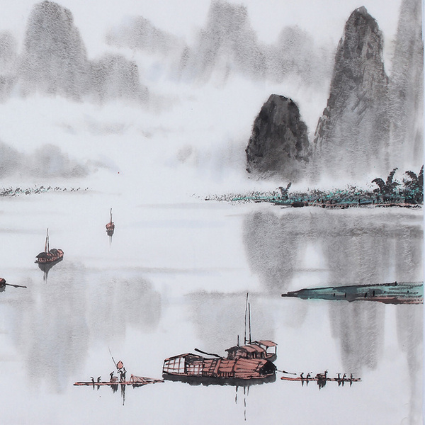
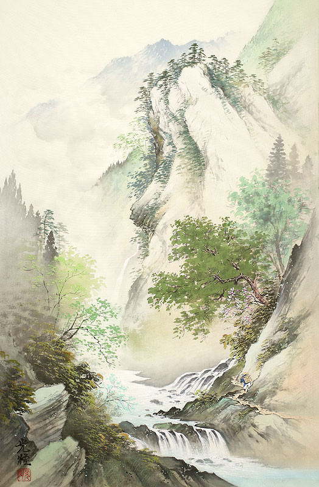
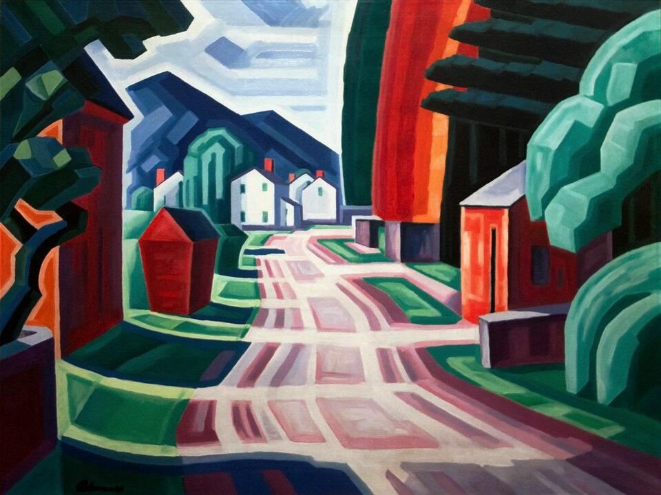

# “音乐”主题分享——麻瓜与魔法

## 初衷

1. 我是一个麻瓜。对于魔法师创造的伟大魔法，感觉很神奇，但神奇这个词，也表示我对这个领域一无所知，但不知为何，却心生赞美。只能说神奇啊，太神奇了。
2. 所以我想知道，对于一幅画，由伟大的魔法师创作的魔法，跟我一样的麻瓜，看了之后到底有什么感觉，怎么看待这幅画，以及怎么看待“看待这幅画”这种东西。
3. 如何欣赏一幅画。我想我去咨询一些懂画的人肯定就好了。如果只是咨询或者调研就能明白的话，我想很多人都可以进行欣赏。
   1. 但事实是，作品大多数都是面向不懂得创作的人，那么普通人到底怎样评价一幅画的好坏呢？到底对画又怎样的认知呢。专业的人肯定能够从专业的角度各种分析，可是普通人呢。
   2. 欣赏画的目的，从“画”中得到什么？

## 采访心得

1. 去掉语气词，陈述一个事实，比什么都重要。不要带有太多的个人感情讨论学术上的事情，感觉做什么都像是在吵架，太容易情绪化了，包括说话的时候老想笑，刻意突出身份关系，那种抱歉的感觉，强调的语气。学会情绪化的陈述。
2. 思考下一句该说什么，慢慢来。等别人说完再说。动脑子讲东西。一定不要抢话。让别人尽情的说。
3. 表情管理。太喜欢笑，也不见得是一件很好的事情。

## 画作准备

> 从对比的角度分析。相同主题。不同画作。

### 肖像画
《海伦娜·弗尔曼肖像》

《戴珍珠耳环的少女》

### 风景画
《干草车》

《麦田》

### 室内画
《有阳台的房间》

《卧室》

### 山水画

## 问卷

1. （性格）我见你每天都开开心的，好快乐啊，你小时也是这样吗，是大家的开心果？（别人的特点+往事的回溯。主要确定对方的性格，跟最终对画的认知的关系）

----

2. （经历）是什么促使你成为一个这么优秀的人。感觉能够如此坚定的奋斗，一步步走到北航，一定很不容易把，必然有过人的智慧，加上你的美貌，应该无敌了？（别人的特点+往事回溯，主要是确定对方的性格，成长经历，跟最终对画的认知的关系）

----

3. （魔法）那成长过程中，你有没有觉得周围的海西都是多才多艺的，有没有想去，搞搞琴棋书画啊，毕竟这么优秀了，学习肯定就是次要的，业余时间你都做些什么呢？（兴趣爱好，主要询问对方关于画的一些经历，一次判断对方是不是麻瓜）

----

1. （内容）那我能问一些很无聊很艰难的问题吗？（降低对方的预期）你就尽量把你想到的东西，尽可能的告诉我，你觉得这幅画画了什么内容。你可以按照自己喜欢的顺序介绍一下这个画作里的内容。

----

2. （形式）你觉得这幅画的表现形式怎么样。包括色彩啊、光影啊、线条啊、构图啊。（顺便给一些提示例如从颜色的角度，你觉得色彩、光线、里边的事物给你的感觉是怎样的的，画的好吗。）

----

3. （感情）你看到这幅画有什么感觉，快乐，积极向上？压抑？我觉得创作一幅画可能是为了表达某种情绪或者达到某种目的。你觉得画家在这里边倾注了什么感情，或者想要达到什么目的（可以进一步询问，给你的感觉，你对这幅画的评价。觉得心上一个东西包括两个，外在的评价，和内在的感受。）

----

4. （联想）接下来的问题可能比较抽象。若果置身与这幅画中，你会是一个怎样的存在（非肖像画，你会在哪里，在忙什么，称为这幅画中的一个事物）。你能想象一下，作者创作这幅画的过程吗（在什么样的时间，受到什么样的启发，创作这样的内容，是谁主动呢）？

----

1. （题外话）你觉得去看画展。主要是为了看什么。甚至有些插画书看起来比文字书籍要有趣的多。但是，如果是为了这样的比目的，看视频岂不是更高效地获取更多的信息。

## 张玄和殷康龙

1. 张玄

首先可以看到，这个场景的光线是非常强烈的，阳光位于左侧画面以外，灿烂的白光表明是个晴朗的、稍微有一点云上午或者中午。“光线强烈”的观感一方面来自于整体偏向白色的色调，另一方面来自于阴影部分与向光部分的对比。此外，左侧房子、右前方的树（？）的周围有白色勾勒，感觉阳光强烈到整个物体都在反光，甚至带着一轮光晕。整个场景单看上去就能想到盛夏时节晒到头晕目眩的那种炽热。
然后是色彩和纹理，我感觉作者很好地画出了各种材料所应当具有地那种特点。比如，右侧屋子面向光源的墙体，红色地墙体上有斑驳的黄色，表现出了墙面的磨损和风化，感觉有很明显的木头和漆的质感。左侧房子背光的墙、左侧小房子面向观察者的墙则更多表现出来了木头的质感。相较于木头房屋的纹理，远处的白房子则是没有任何纹理的，对阳光的反射是很均匀地漫反射，能够让人想到是一堵用石灰腻得很好的墙。
然后是物体的形体，虽然像树、远处的山等等都被简化过，但是得益于作者卓越的处理光线明暗和色彩纹理的能力，我感觉树木和山的质感还是传达的很好的，树木是那种饱满多汁的大叶片，山则是嶙峋的山。天空中有云，虽然简化到这种程度但仍然足以分辨出是那种淡淡的云。
总之我感觉，这幅画描绘场景是热烈而又和煦的，打个比方就是一只被正午的阳光晒困了的野猫（）

2. 殷康龙

一堆奇奇怪怪的房子，居然有的是白色有的是红色，那个红色的高楼一样的东西是啥。路是红色的，路边是绿色的草，感觉很不和谐。有一条不知道通向何方的路，有点神秘，但应该是那种悠长宁静的生活，却用红色的墙壁，似乎又在强调某种浓烈的情感。有些不和谐，有点阴森。

## 张小玉

1. 你在学素描期间学到了哪些   

“所以还没有到有自己东西的那一步，只是在照猫画虎学一下。”

以前的时候学过素描，已经不能称之为严格意义上的被访者了。我看见它的桌面上有很多五颜六色的绘本。而且她应该也对动漫很感兴趣。

2. 海伦娜福尔曼 肖像

“画作很写实，很浪漫。女主角非常好看，像是修过的照片。颜色很搭，很和谐，看起来很高贵，像是宫廷里的。非常害羞，眼神向下，手的姿势也好像很抗拒，有一些拘谨。”

“不像是特意的造型，更像是在平常发现了这个美丽的细节，然后记录下来，带着一种欣赏的目光。”

我觉得我选肖像画十个失败，肖像画的细节太多了。容易让人凌乱不知道从哪里入手。

3. 卧室  梵高

“画作的颜色很常见，像是一个人刚起的时候卧室的样子，感觉很随意，凳子都没有摆好。没有统一的色调，就会让人觉得新的一天刚刚开始。如果所有的东西都是一个颜色，就会有一点压抑，让人想要睡觉。”

4. 为什么要去看画呢？

“我们平时看到的都是生活中的东西，去看画展，能够看到别人创作的世界，甚至只存在于想想中的世界。不一样的事物，能给自己的生活带来灵感”

获取灵感，画作更像是精神世界的一种表达。

5. 看画与看视频有什么优势？视频包含了更多的影音内容。

“感觉画更难一些。与视频相比，画更多思考的是静态下的一帧的细节，更加精致。”

> 我也曾经去看过很多几个画作。在济南、在青岛的时候，只是随手拍一拍，忘记作者是谁了。最多的体验，能是什么门。
> 刚从它哪里拿到一个绘本。我看到那个绘本上的内容。“晒在午后三点的阳光下；雨天一个人读书；抬头遇见初雪……”。其实我还有一个问题，你觉得人生中最快乐的三件事情是什么？

## 赵浩鹏

1. 你觉得这两幅画，哪一幅更符合你的口味。你能描述一下这幅画的内容吗。

“干草车。我觉得这幅画的内容更精致，画的更细腻。里边有一只狗，还有一个马车，像是从集市买完东西赶回来，拉着马车还是牛车，经过门前的积水。相比右边的那个，场景更生动一些。右边的线条比较粗旷。”

2. 你觉得作者处于什么理由创作这幅画？

“应该很随意吧，那时候后没什么照相机，突然经过看到了，随便画的。我觉得这种搞艺术的都挺随意”

3. 如果个人置身与这样的场景的话。你会作为什么事物，或者人，或者想与其中的什么东西进行互动。

“啊？我并不想。我就想安静的看着人画画。对接触美的东西不感兴趣，就远远的看着这幅画就好。”

4. 如果一个人去画展，或者欣赏一幅画的画，主要是看什么东西？

“就我个人而言，我想去看着个画展，肯定先看这个画家，是不是我知道的画家，或者感兴趣的。这个画家肯定是比较有名的作者，画作肯定是有可取之处的。然后看他的画展，他想从画中表达的感情，或者作画的技巧，开创了什么流派。”

5. 欣赏这些画，你觉得能给自己的生活带来什么变化，或者处于什么样的目的，走进画室画展看一眼，主要是处于什么理由。

“对我个人而言，肯定就是单纯的好奇。”

6. 你觉得他们创作这些东西，价值在哪里，怎么样获取对自己有利的部分。

“我看到它的画，我觉得很舒服。”

这么抽象，很难描述。抽象的感觉。

“画里都是看不到的东西。有很去。”

## 总结

1. 我跟玄哥的见解完全相反。我觉得对于麻瓜来说，欣赏一幅画，不仅仅是欣赏一幅画，更多的是通过画作的欣赏过程，来审视现在的自己。同样一幅画，可能会因为观察者的心情、状态、经历不同，而完全相反。会将自己当下的紧张焦虑，投射到画作当中，而玄哥明显是春风得意马蹄疾，生活舒舒服服快快乐乐，前途一片光明。麻瓜的关注点，都是千差万别的，一千个人心中，有一万的哈姆雷特。

2. 欣赏一幅画的目的，更多的是接触从未见过的精神世界。给自己的生活更多的思考和灵感。相比视频，它的优势恰恰在于信息量的减少，让人能够静下心来，慢慢思考，细细品味。

3. 麻瓜如何欣赏一幅画。色彩？形象？我觉得问题需要改进。从三个层次，对比的角度进行提问。
   1. 形式。包括色彩、光线、构图、线条、节奏、比例、顺序。
   2. 内容。什么人，做什么事，有什么东西。
   3. 情感与联想。画作给人的感觉（我们得到情感）、画家创作的感觉（画家倾注情感）、画作内容的联想（背后的故事或画中的场景联想）。

