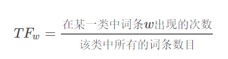
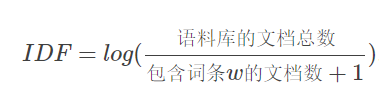
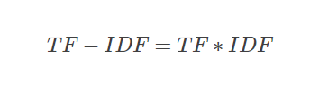

# 简历说明

## 1 教育经历
你好。我叫殷康龙，现就读于北京航空航天大学计算机学院，主要研究联邦学习在恶意软件检测领域的应用。本科就读于西北工业大学软件与微电子学院，主修软件工程。

在学校主要学习了C++程序设计、数据结构与算法、面向对象程序设计，综合测评成绩在250人中排名第8。

## 2 校园经历

在学校里积极参加社团和活动。曾任软微学院科创部干事，组织一行代码大赛和程序设计比赛。曾任西工大新闻中心副部长，负责开发新文中心的功能网站，培训技术人员。


## 3 主要成果

* 校一等奖学金，华为奖学金，国家励志奖学金，电子工业出版社助学金，“优秀共青团员”称号，优秀学生称号
* 2016-2017年连续两届FIRA机器人世界杯、SimuRoSot项目国际特等奖（冠军），Air Challenge项目国际一等奖（亚军）
* 2017中国机器人大赛、无人机大战水果项目一等奖
* 2019年获得两个国家级大创项目优秀结题、三个计算机软件著作权

## 4 项目经历

> 项目概述、主要工作、最终成果

### 竞技策略开发——仿真5VS5SimuRosot
* 项目概述：15个人的开发团队，长期开发项目。C++。基于simurosot机器人仿真平台，在国内比赛和国外有相关比赛。工程主要采用分层架构：
  * 第一层是运动模型，包括球的运动模型和轮式机器人的运动模型。控制机器人的轮速，完成前进、后退、旋转等基本动作。
  * 第二层是跑位动作，给定目标点，机器人通过基本动作，完成避障行为，以最快的速度到达目标点。
  * 第三层是击球动作，在跑位的基础上，根据球的运动状态、击球者的运动状态、击球的目标方向等，完成击球过程。直接撞击、旋转甩球，
  * 第四层是策略控制，用于协调多个机器人，完成统一目标的动作。进行角色选择，像前场包括sender、defender、helper等角色。然后目标计算，分别计算每个机器人的目标点，选择机器人的运动方法。最后是策略切换控制，为了增强策略的稳定性，还包括策略的进入和退出控制。
  * 第五层是策略选择，包括态势评估，通过过去和当前的机器人和球的状态完成一系列态势分析，选择进入前场、后场、边路、底线等不同的策略中。
  * 辅助模块，包括日志模块。态势预测模块。
  * 设计模式：单例模式（小球的控制句柄、态势评估类的对象和态势预测的对象）、策略模式（不同策略、统一接口）
  * 存在问题：策略的稳定性(最难的)。设置不同的严格的进入条件、宽松的退出条件，控制反转，每个策略类提供自己的进入退出条件和执行内容，然后注册成为一个策略树，由运行控制中心，负责执行策略树上的分支。IF-ELSE爆炸，将条件判断与条件执行分开、switchcase
* 主要工作：
  * 负责开发前场的相关策略，构建子策略（优势前场、保守前场、边路前场）、角色选择和策略切换控制（角色的稳定性，进入退出分开控制。）、目标计算模块（保持相对的阵型，减少阵型的抖动）、移动跑位模块、射门模块。使用PID控制方法对机器人控制，增强了前场的稳定性。通过面向对象的方法对代码进行重构。
* 主要工作：使用JAVA为团队开发了数据测试平台，实现了对数据仿真、策略测试、可视化。开发测试平台主要使用java swing开发跨平台图形界面，提供了一系列GUI组件。主要包括数据导入模块、动态演示模块、数据显示模块。使用java io random_accessfile读取并解析file文件。使用java thread实现数据加载与数据展示的并行过程。通过事件监听与响应机制，实现对数据仿真动态演示过程的控制，包括仿真速度调节和仿真进度调节。使用javadoc生成标准的java文档供后续开发使用，方便开发维护。
* 最终成果：暑假期间带领团队前往日照参加了2017中国机器人大赛，前往台湾 参加了FIRA机器人世界杯，取得多项冠军。

### 基于网络爬虫和数据分析的高校信息整合系统

* 项目概述：5个人，Python、MySQL。利用爬虫综合网络信息，搭建web服务器，对数据进行二次处理，使用机器学习算法提供面向用户提供文章推荐功能、标签云索引功能和分类浏览功能，面向信息发布者提供了热点倾向功能、数据分析功能。

* 主要工作：项目架构、服务器搭建，包括爬虫模块（数据解析模块xpath、URL获取与去重模块）、服务器模块（MySQL数据库设计、Json数据封装）、Android客户端（数据请求模块HTTP请求、数据展示）、数据处理模块。通过Scrapy完成网络信息爬虫，构建了Mysql数据库，使用Django后端框架和Bootstrap前端框架开发了项目网站，使用大数据的算法对信息分析处理，并将整个项目部署到腾讯云提供的CentOS服务器上。使用Github进行代码管理。

* 关键技术：scrapy框架介绍。使用request模块进行爬虫，通过调度去缓存下一条URL，控制网站访问的频率；使用xpath解析数据内容并将数据存储到mysql数据库中。
* 关键技术：Django框架。使用Apache服务器，处理http请求。Django框架，MVC（model-view-control）的代码架构模式。从数据库中获取数据，封装成json格式，最后将响应的数据传递给android客户端。
* 关键技术：* 标签计算算法：jieba分词统计词频，TF-IDF算法进行词频统计，去除无关词汇，字词的重要性随着它在文件中出现的次数成正比增加，但同时会随着它在语料库中出现的频率成反比下降。
  * 词频 (term frequency, TF) 指的是某一个给定的词语在该文件中出现的次数。逆向文件频率 (inverse document frequency, IDF) 
  
  * IDF的主要思想是：如果包含词条t的文档越少, IDF越大，则说明词条具有很好的类别区分能力。某一特定词语的IDF，可以由总文件数目除以包含该词语之文件的数目，再将得到的商取对数得到。
  
  * 标签云算法：某一特定文件内的高词语频率，以及该词语在整个文件集合中的低文件频率，可以产生出高权重的TF-IDF。因此，TF-IDF倾向于过滤掉常见的词语，保留重要的词语。
  
* 关键技术：分类算法：学科竞赛、科研信息、行政信息、招生信息、招聘就业、校园活动、升学留学、生活娱乐这八类，使用朴素贝叶斯分类器进行分类。贝叶斯分类，一个事件出现在各个类别中的概率不同。可以通过贝叶斯公式得到，出现概率最大的类别作为其类别。
```
提取所有文档中的词条并进行去重
获取文档的所有类别
计算每个类别中的文档数目
对每篇训练文档: 
    对每个类别: 
        如果词条出现在文档中-->增加该词条的计数值（for循环或者矩阵相加）
        增加所有词条的计数值（此类别下词条总数）
对每个类别: 
    对每个词条: 
        将该词条的数目除以总词条数目得到的条件概率（P(词条|类别)）
返回该文档属于每个类别的条件概率（P(类别|文档的所有词条)）
```
* 关键技术：推荐算法：系统采用的ＫＮＮ算法目的在于匹配项目中Ｋ个相似度最高的项目，用户浏览的历史文章，生成用户关联的词向量。
* 最终成果：两个国家级大创项目均获得优秀结题。


### 无人机协同系统

* 项目概述：无人机通信和可视化
* 主要工作：主要是在Android平台（DJ无人机的地面站android手机开发），使用Java多线程和Socket编程，实现无人机之间的通信连接。主要通过UDP网络通信、心跳测试保持连接、回调处理等方式实现线程通信。在加密通信过程中，使用C++开发加密仿真环境。使用nodejs+electron对通信过程进行可视化。使用网页技术HTML、CSS、JavaScript做前端，使用C++做为本地的后端。通过封装C++通信的代码，提供C++通信接口，供nodejs调用。（代码的封装，接口提供，）
* 主要成果：完成实验室项目验收。


## 实习经历
### 电子钱包JavaEE企业及开发项目

* 项目概述：在中科金财上市公司参与电子钱包项目的实习。
* 主要负责使用Java从合作方获取并解析数据，使用MyBatis存储到MySQL数据库中，并使用Redis做一级数据缓存。使用Spring框架提供信息访问的服务。
* 关键技术：Spring框架应用实践
  * 本项目后端的主要开发框架，是基于java的Spring框架。Spring框架主要依赖与两个重要的特性——控制反转和依赖注入。控制反转（IOC），即控制权的转移，将我们创建对象的方式反转了,以前对象的创建是由我们开发人员自己维护,包括依赖关系也是自己注入。使用了spring之后，对象的创建以及依赖关系可以由spring完成创建以及注入，反转控制就是反转了对象的创建方式，从我们自己创建反转给了程序创建。依赖注入（DI）spring这个容器中，替你管理着一系列的类，前提是你需要将这些类交给spring容器进行管理，然后在你需要的时候，不是自己去定义，而是直接向spring容器索取，当spring容器知道你的需求之后，就会去它所管理的组件中进行查找，然后直接给你所需要的组件。
  * 在实践过程中，使用静态工厂方法创建了一系列的java Bean对象，通过配置XML文件，将对象注入到具体执行的类当中。Spring框架本身还保证了事务的原子性、一致性、隔离性和持久性。为了使Spring boot应用能够快速加载配置，使用YAML文件快速配置Spring项目的依赖。YAML支持对象、数组、字面量三种数据结构。同时Spring boot通过大量的注解实现配置的绑定和容器的注入。
  * 在开发前端的时候，开发框架主要使用了基于nodejs的vuejs框架，用于获取并渲染数据到前端页面。使用bootstrap作为模板，构建基于H5的应用页面，能够动态自适应页面的大小，并将页面扁平化。
* 关键技术：数据存储技术
  * 在开发过程中主要使用MySQL关系型数据库存储数据，使用Redis非关系型数据库做数据缓存，使用Spring-MyBatis框架，封装对数据库的增删查改操作。数据操作主要包括两部分，第一部分是从远程接口请求数据，存储到关系型数据库中。第二部分是从关系型数据库中访问数据，返回前端，渲染到页面上。对于第二部分需要Redis做一级缓存，为了加快数据访问。为了能够进行事务管理，MySQL的数据库引擎选择InnoDB。所有的表都保存在同一个数据文件中。
  * 使用Spring访问数据库的时候，选择了比较流行的MyBatis框架。MyBatis是一个半自动化的 ORM 框架，支持定制化 SQL、存储过程以及高级映射。支持将数据库查出的数据映射到POJO实体类上，而实体到数据库的映射则需要我们自己编写SQL语句实现
  * 为了提升用户的体验，加快前端的访问速度，解决MySQL数据库存储和访问的瓶颈。使用Redis数据库提供了以及数据缓存。使得系统能够快速相应用户的数据存储和访问操作。redis是一个开源的、使用C语言编写的、支持网络交互的、可基于内存也可持久化的Key-Value数据库。

### 字节跳动财经业务部

* 项目概述：实现担保交易的系统。
* 主要负责财经退款业务。完成支付营销预计算、分账后退款等业务需求。基于Kite框架设计实现多个微服务的接口和逻辑，进行项目管理、版本控制、联调测试、报警处理等工作。
  * 当时负责支付营销预计算和分账后退款两个业务，涉及担保退款guarantee_refund(单纯的路由和参数校验)、退款请求ecrefund(查询校验请求参数，构造ectrade的不同类型的退款请求参数，请求计费系统，得到支付营销的值)、财经tp_ectrade(各种支付、退款的主要业务逻辑)微服务。担保退款业务负责接收来自其他应用的退款请求，查询数据库中的订单，校验请求的准确性，同时通过幂等校验对重复的请求进行处理。
  * 退款请求业务，接收担保退款微服务的请求，对请求进一步校验，根据订单状态、支付状态、业务方的需求将退款业务划分为不同的退款方式（急速退款、普通退款、分账后退款、超售后退款等），然后执行不同的退款逻辑。
  * 微服务的技术选型：服务注册与发现机制（consul）、敏捷开发流程（devops）、远程调用方式（thrift）、服务监控平台（Grafana）、数据分析平台（Hive）、链路系统跟踪平台、服务网关（Gateway）等。实现一系列微服务开发、部署、运维任务。
* 关键技术：支付与退款业务逻辑
  * 在担保交易系统中，总的业务流可以分为四个部分：支付、分账、退款、提现。
  * 支付：当用户付款后（自有支付、第三方支付），不能立即存到商家的账户中，需要暂存到商家的待结算户中，防止出现资金安全问题。
  * 分账：当用户点击确认收款后，资金从商家的待结算户，分账到商家账户和其他分账方的账户（达人带货分账、平台营销分账等），其中还涉及到平台的营销问题。
  * 退款：当用户发起退款是，会根据不同的情况，走完全不同的退款流程，主要包括普通退款、分账前退款、分账后退款、超售后退款和急速退款。
  * 提现：商户从现金户中提款到自己的银行账户。
  * 针对退款：每一种退款都实现了统一的接口，需要校验大量的请求参数和订单内容，保证请求和订单的一致性，需要调用电商接口，计算每一个分账方的分账金额，根据分账方的分分钟金额校验账单系统中的分账单，针对每一个分账单，生成分账的退款单，然后请求支付核心，将商家待结算户中的金额退给用户。如果已经部分分账，需要将所有分账的金额退到商家现金户，推进分账进程，然后从商家的现金户，将金额退还给支付账户，并将平台补贴金额退回。每次退款过程前，需要事先请求计算支付营销金额，如果保证金额正确才可以进行后续的退款，否则返回退款失败。
* 关键技术：订单模型。订单子系统，实现后端订单的数据流图。
  * 业务方可能会产生多种类型的订单，例如在购物的时候，会生成支付单、商户单、商品单等。
  * 退款的时候根据退款创建的时间不同，可能产生各种类型的退款单，通过区分是否在售后内或者超售后，是否满足优质用户的急速退款条件，订单是否已经分账，产生不同类型的退款单。在财经部分，根据业务方的需求，建立财经部分的订单系统，该系统主要融合了业务方订单和支付方订单。财经部分订单包括商品单、支付单、分账单、补贴单、退款单等。退款中会生成退款单包括多种类型，如退款子单、急速退款单、退分账单、退补贴单、退税单等。由于支付场景负责，各种订单的准确性必须要有保证。

* 关键技术：资金安全
  * 财经部分最重要的是对金额和流水的保证。建立了从上到下的对账系统，通过流水信息、数据库信息、日志信息等，进行不间断的对账，保证了交易金额的准确性。杜绝发生严重的金融风险。同时增强开发人员的金融管控意识。防止出现资金安全问题。

* 基于kite的微服务技术
  * 将后端拆解为多个独立的微服务，并行建设发展。很好地保证了各个模块的独立性，提高了开发效率，同时又由于微服务的弹性部署方式，使得系统的鲁棒性增强，服务的效率增高。
  * 微服务一种软件开发技术，服务是细粒度的，协议是轻量级的。使得应用系统具备快速响应、灵活部署、敏捷交付、持续演进的特性成为可能。微服务是由以单一应用程序构成的小服务，自己拥有自己的行程与轻量化处理，服务依业务功能设计，以全自动的方式部署，同时服务会使用最小的规模的集中管理能力，服务可以用不同的编程语言与数据库等组件实现 。
  * 微服务架构与敏捷研发流程一脉相承。微服务是将一个完整的系统分割成若干微小的、具备独立性的功能单元，每个功能单元是可以具备一个实际意义的小功能集。各个功能单元之间尽量是解耦或松耦合的，可以实现独立开发而不依赖其他功能单元。而敏捷保证微服务架构能够更好地适应需求的变化，保持团队的高效沟通，敏捷利用小型工作增量、频繁迭代与原型设计等手段，可以使我们摆脱大规模单体软件开发的风险。微服务架构更多地从技术的角度提升开发和运维的效率，而敏捷方法论贯穿了软件工程的整个流程，它重视流程、沟通、协作。可以说，敏捷在管理流程上是对微服务架构落地的有益补充和保障。微服务的开发大致遵循DevOps的流程和原则，一个软件从零开始到最终交付，大概包括以下几个阶段：规划、编码、构建、测试、发布、部署和维护。DevOps是一组过程、方法与系统的统称，用于促进开发、技术运营和质量保障（QA）部门之间的沟通、协作与整合。通过自动化流程来使得软件整体过程更加快捷和可靠。用于实现敏捷开发的目标。
  * 微服务主要面临的问题，主要是故障的排查，通过多方考虑建立了微服务的故障排查系统。首先是微服务的监控系统（指标接口），实时监控流量的运转，尽量能够快速的发现存在的潜在问题，包括一些设定的报警规则，如网络流量异常、内存占用异常、数据库链接异常、响应延迟异常、qps导致某个节点不堪重负等。让各个组件提供报告自己当前状态的接口（metrics接口），这个接口输出的数据格式应该是一致的。然后部署一个指标采集器组件，定时从这些接口获取并保持组件状态，同时提供查询服务。最后还需要一个UI，从指标采集器查询各项指标，绘制监控界面或者根据阈值发出告警。我们最终使用RedisExporter和MySQLExporter，这两个组件分别提供了Redis缓存和MySQL数据库的指标接口。微服务则根据各个服务的业务逻辑实现自定义的指标接口。然后采用Prometheus作为指标采集器，Grafana配置监控界面和邮件告警。
  * 通过链路跟踪系统，定位问题出现的位置。使用Zipkin工具，实现链路的跟踪过程，实现每一个节点的日志收集。为了能够快速的实现日志分析，使用ELK日志分析组件。包括一个日志搜索引擎、日志收集存储器和UI组件。为了能够控制微服务的访问权限，进行服务治理，搭建了一套网关系统。在调用者和被调用者中间加一层网关，每次调用时进行权限校验。另外，网关也可以作为一个提供服务接口文档的平台。能够进行各个微服务的接口管理，通过页面访问和调试微服务。
  * 微服务的注册和发现系统。每当有新的微服务或者微服务的某个新节点出现的时候，完成服务信息发布、存活检测、客户端负载均衡等任务。各个应用服务在启动时自动将自己注册到服务发现服务上。并且应用服务启动后会实时（定期）从服务发现服务同步各个应用服务的地址列表到本地。服务发现服务也会定期检查应用服务的健康状态，去掉不健康的实例地址。服务发现系统还会进行服务之间的负载均衡，防止某一个服务流量过大，称为微服务链路上的流量瓶颈。

## 5 个人能力

1. C++后端开发、熟悉Java/Go/Python/Nodejs、了解Mysql数据库/Redis数据库相关的知识
2. 主要关于项目开发中某一方面的知识经验总结
   * 网络编程（各种语言的实现方法。异步并发，并发通信方式。）
   * web开发（自己所开发过的web网站。主要用到的框架和技术。）
   * 并发编程（各种语言实现并发编程的手段和方式，例如协程、多线程、多进程等）

## 6 个人性格

1. 生活上，乐观开朗，心里素质较强。喜欢积极的应对生活中的困难。待人友善，团结合作，有较强的领导能力、组织能力和团队精神。勤奋好学，思维敏捷。
2. 工作上，具有良好的专业能力，基础知识扎实，自学能力强。参与了多个项目的开发过程，具有丰富的项目开发经验。对软件工程领域的知识有很高的热情，希望通过自己的努力，创作完美的作品。


### 补充项目：TensorFlowIO优化

* 项目概述：分析TensorFlow源代码，对源代码进行修改重新编译。使用mmap方法，优化TensorFlow数据加载过程中的IO操作。
* 主要工作：阅读源代码分析TensorFlow架构，使用多线程以流的方式读取多个文件。mmap封装大文件读取过程。编译并测试TensorFlow最后的优化效果。


1. 首先阅读了TensorFlow的源代码以及相关的研究资料，对TensorFlow的代码架构进行分析。
2. 第一层设备通信层，负责网络通信和设备管理。设备管理模块可以实现TensorFlow的异构性，提供了对不同平台不同设备的支持，统一封装成相同的接口，使得上层模块在调用过程中，不必考虑具体的底层实现。通信模块主要通过两种协议实现不同设备之间的通信过程，分别是gRPC协议和RDMA协议。
3. 第二层内核实现层，实现了核心算子（Operation）与张量（Tensor）的操作。所有的算子都是以张量为操作对象，依赖底层实现张量的内存分配和计算。
4. 第三层图计算层，实现了计算图（Graph），包括本地计算流图和分布式的计算流图的实现。主要实现了计算图的创建、编译、优化和执行的细节。计算图中的每个节点都是内核实现层中的算子，计算图中的每条边代表内核实现层中的张量。
5. 第四层API接口层，TensorFlow提供了原始的C API的实现，方便其他语言和平台进行调用。通过C API进一步实现其他语言的API，方便不同语言开发者选择熟悉的语言构建计算图。
6. 第五层应用层，不同的编程语言通过API接口层调用TensorFlow的内核，实现相关的模型和应用。


1. 使用linux的mmap方法申请内存空间，建立内存映射。
2. 使用platform模块，对底层方法进行封装，实现异常情况处理，并记录内存映射的地址及相关信息，提供上层接口
3. 利用platform模块提供的内存映射接口，创建读取器，复写父类中的数据读取方法。创建一个读取数据的算子，并注册到内核当中，提供其他语言的接口。
4. 编写前端，调用内核新方法，使用MmapReader模型进行数据读取。
5. 重新编译

* 最终成果：毕业答辩顺利完成。
