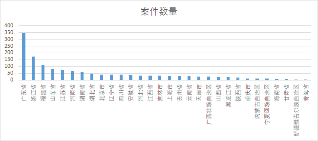

# 地下钱庄

## 1 定义

首先我们定义一下地下钱庄。

地下钱庄（英文：Underground banks）是一种非法金融机构，地下钱庄游离于金融监管体系之外，利用或部分利用金融机构的资金结算网络，非法从事资金存储借贷等金融业务，中国地下钱庄的数量和资金吞吐量难以准确统计。

地下钱庄是民间对从事地下非法金融业务的一类组织的俗称，是指未经国家主管部门批准，擅自从事跨境汇款、资金支付结算业务等活动，根据1998年6月30日国务院颁布施行的《非法金融机构和非法金融业务活动取缔办法》第3条规定：“非法金融机构，是指未经中国人民银行批准，擅自设立从事或者从事吸收存款、发放贷款、融资担保等金融业务活动的机构。”

什么是地下钱庄，其实就是地下银行，有些人手里有钱，想放开让钱生钱，但是没有银行资质，有些人需要钱，可是去银行贷款需要抵押，不是吗？所以他们愿意支付更多的利息，这下供需双方都有了，来几个中介业务也就可以开展了，如果用一句话概括，那就是没有牌照的私人银行。

地下钱庄在国外也有多种表现形态。在美国、加拿大、日本等地的华人区称为“地下银行”，主要从事社区华人的汇款、收款业务。类似地下钱庄的组织机构在亚洲还有很多，一些地下钱庄在印度、巴基斯坦已发展成为网络化、专业化的地下银行系统。

初衷，我对这个东西也不太了解，源于我跟我爸的一些谈话，我爸也会把家里的闲钱，交给一些我不认识的人，然后出去放贷，有的时候还会做贷款的担保人。很多乡镇企业都是通过这种方式融资的，似乎在某种程度上来说，这种地下贷款业务，并非违法的，反而促进了很多中小型企业的融资过程。

## 2 法律案例

然后我们通过一系列信息，来了解地下钱庄。地下钱庄是一种非法的金融组织，助长贪腐、走私、贩毒、赌博、骗税、诈骗等多类犯罪。据了解，近年来，外汇管理部门与公安机关连续开展打击地下钱庄专项行动，2020年以来已破获地下钱庄案件150余起。

### 统计信息

* 随着经济发展和金融也的蓬勃兴起，以及金融规范的指定，地下钱庄相关的案件也越来越多。

* 我们可以看到，“地下钱庄”关键词相关的案件，主要集中在广东省和江浙沪一带。小商品经济、小工厂、创业公司有很大关系。可能北京上海金融管控太强，导致这一类时间反而很少。庆幸的是山东居然能排到第四。也算是经济指标之一了。

### 具体案例

1. 2013年3月合同纠纷案件中。银融公司将2000万元直接支付到赵青利个人账户（而非公司账户），赵通过地下钱庄，将这2000万元转到邢福楹在香港的账户。涉嫌偷逃国家外汇罪。
2. 2019年8月地下钱庄案件中。外汇管理部门与公安机关日前在湖北联合破获一起特大地下钱庄案件，涉案金额达143亿元，涉案人员遍布全国25个省，是一起集境内外勾结、地下钱庄及上游犯罪相互交织的复合型案件。一家劳务公司，办公地点平时很少有人出入，账户上却有着大量的流水数额：日均交易额达到了两百多万，总账户里面的资金总额达到了四个多亿。
3. 2021年8月跨境转款案件中。地下钱庄持有并控制着1000多张银行卡，专门提供跨境转款“服务”；“客户”在境内将人民币转入“钱庄”，“钱庄”在境外取现交给“客户”，从而赚取“取现服务费”。
4. 2016年5月15日东莞地下钱庄案。广东警方通报东莞市公安机关破获系列地下钱庄案。抓获犯罪嫌疑人11名，现场扣押现金人民币1497.75万元、港币50.4万元；冻结涉案资金折合人民币4278万元，查扣账本13本、存折120本、银行卡237张、支票175份，U盾、电脑、手机、车辆等作案工具一大批，该案涉案金额超过200亿元人民币

### 借条居然还分借据和收据。

借据指借用别人的钱或器物时所立的字据，由出借的人保存，是一种债权债务的证据。借是暂时使用别人的物品或金钱，把物品或金钱暂时供别人使用。借条”不仅表明在出借人与借款人或借用人之间存在债权债务关系，同时还能表明债发生的原因，出借人只需出具“借条”便能证明其对借款人或借用人享有债权，且无须对债发生的原因进行举证。

收据指收到钱或东西后写给对方的字据。“收”是指“取自己有权取的东西或原来属于自己的东西”;“收条”则有可能是“取原来属于自己的东西”所形成，也有可能是依约定或法律规定“取自己有权取的东西”所形成，本身并不表明对双方当事人之间债权债务关系的确认，只是表明了一种“收到款或物”的事实状态，要确认双方当事人之间是否具有债权债务关系，有待于对“收条”产生的原因进行分析，以确定当事人之间是否具有权利义务关系。总之，“收条”产生的原因很多，不能把“收条”当然作为当事人之间具有债权债务关系的凭证。

## 3  历史发展

1. 西方的圣殿骑士团
2. 美第奇家族
3. 几大银行家族其实都是这类型机构，而且国家层面搞银行这事儿出现得非常晚，远远晚于私人银行
4. 在我国，这玩意从古至今一直都有，古代的地主们都是地方上的钱庄，他们一般在每年春天会放贷给农民，农民们去买种子农具，等到秋收的时候再还回来，当时的利息动不动就60%以上，等到王安石变法，国家给定了个比较低的20%，跟现在高利贷也没什么差别。如果碰上了荒年还不上了，那就得用土地和喜儿来抵债了。古代土地兼并大部分都是通过这种信贷方式来兼并的。

## 4 钱庄业务

做借贷和做汇兑的两帮人互相鄙视着。

* 从事非法买卖外汇业务的眼里看自己，是“促进国内进出口行业发展，帮助企业参与国际竞争，弥补国家外汇管理不足，为人民币全球化出一份力的青年才俊”。他们看做借贷业务的，就是“放高利贷的黑社会”。

* 在借贷业务的眼里自己是“加强资金流动，盘活闲散资金，帮助企业发展，快速解决企业需要的金融专业人士”，他们看做汇兑的，都是“洗黑钱的白手套”。

### 借贷

### 换汇

“地下钱庄”最常用的洗钱方式是“两头资金池”，“懂行的”管这个叫“哈瓦那”。说白了，这种模式下，钱并没有真的在跨境流动，客户只是把钱交给地下钱庄境内资金池，并在“钱庄”本来就有的境外资金池里得到相应外汇。 除了“两头资金池”，也有一些南方口岸地区的“地下钱庄”是真的有活生生的钱进出境的——听比较原始的办法就是通过“水客”将钱分批带过境，“先进”一些的办法是靠假的单证和贸易合同来汇钱，“最先进”的办法则是做真实信用证下的虚假贸易。

资金规模大约是2000万~3000万元人民币，手续费约为3%~5%。但如果需要清洗的资金数额巨大，如数亿或数十亿元，那就必须通过跨国洗钱组织有计划有组织的操作，手续费约为总额的10%左右。

### 集资
* 很多地下钱庄就是这种村内集资，一个村子动不动几十亿的资金规模，在1994年的时候就曾出现过32亿的集资，现在的规模更是大到离谱了

### 洗钱

概念
* 洗钱就是通过隐瞒、掩饰非法资金的来源和性质，通过某种手法把它变成看似合法资金的行为和过程。主要包括提供资金账户、协助转换财产形式、协助转移资金或汇往境外等。

方法
* 为了达到隐瞒、掩饰非法资金的来源和性质的目的不法分子常利用银行、证券、保险等金融机构，利用地下钱庄等非法金融主体，利用进出口贸易，利用互联网，利用拍卖行、珠宝商等特定非金融机构通过现金交易，通过投资等渠道进行洗钱。

过程

1. 处置阶段：亦称放置阶段，是指将犯罪所得投入到清洗系统的过程，是最容易被防线的阶段。利用金融机构或特定非金融机构，将犯罪所得存入银行，或转换为银行票据、国债、信用证以及股票、保险单证或其他形式的资产，有的也将犯罪所得投入地下钱庄等非正规汇款体系转移到境外。
2. 离析阶段：也叫培植阶段，即通过复杂的交易，将犯罪所得与其来源分开，并进行最大限度的分散，使得犯罪所得与合法财产难以分辨。
3. 融合阶段：又叫归并阶段，整合阶段，即将分散的犯罪所得与合法财产融为一体，为犯罪所得提供表面的合法掩饰，在犯罪所得披上合法外衣后，犯罪分子就能够自由地享用这些非法收益。

实例
* 你把非法得来的钱交给地下钱庄，再去网上挂个不值钱的产品，比如垃圾游戏的垃圾装备，钱庄再操作客户过来买，这样钱就成了你的合法收入。你去把税交上，从此就可以安心花了，不过这中间抽成很厉害，经常高达20%~30%。
* 有时候非法的资金还要转出去或转进来，那么就涉及非法买卖外汇的地下钱庄。他们很可能在境内境外都有一个资金池，最主要的交易方式叫“对敲”。当地下钱庄在境内收取“客户”人民币，按照汇率计算好对应外币，然后通知境外合伙人将扣除佣金后的对应外币，转到“客户”指定的境外账户。
* 也有的地下钱庄，利用其控制的大量空壳公司账户和个人账户，采用网银转账等方式协助他人将资金从对公账户转到对私账户、套取现金等，从而实现偷逃税款，非法套现等不法目的。

## 5 法律说明

相关司法解释。

《刑法》
* 第四节 破坏金融管理秩序罪
  * 第一百七十四条 【擅自设立金融机构罪】
  * 第一百七十五条 【高利转贷罪】
  * 第一百七十六条 【非法吸收公众存款罪】
  * 第一百九十条 【逃汇罪】公司、企业或者其他单位，违反国家规定，擅自将外汇存放境外，或者将境内的外汇非法转移到境外，数额较大的，对单位判处逃汇数额百分之五以上百分之三十以下罚金，并对其直接负责的主管人员和其他直接责任人员处五年以下有期徒刑或者拘役;数额巨大或者有其他严重情节的，对单位判处逃汇数额百分之五以上百分之三十以下罚金，并对其直接负责的主管人员和其他直接责任人员处五年以上有期徒刑。
  * 第一百九十一条 【洗钱罪】为掩饰、隐瞒毒品犯罪、黑社会性质的组织犯罪、恐怖活动犯罪、走私犯罪、贪污贿赂犯罪、破坏金融管理秩序犯罪、金融诈骗犯罪的所得及其产生的收益的来源和性质，有下列行为之一的，没收实施以上犯罪的所得及其产生的收益，处五年以下有期徒刑或者拘役，并处或者单处罚金;情节严重的，处五年以上十年以下有期徒刑，并处罚金

《中国银监会办公厅关于防范银行业金融机构员工参与地下钱庄非法活动的通知》——银监会

《非法金融机构和非法金融业务活动取缔办法》——人民银行
* 人民银行各分行、营业管理部要组织力量摸清当地地下钱庄和高利借贷活动的情况；对非法设立金融机构、非法吸收或者变相吸收公众存款以及非法集资活动，一经发现，应立即调查、核实，经初步认定后，及时提请公安机关依法立案侦查；对经调查认定的各类形式的地下钱庄和高利借贷活动，要坚决取缔，予以公告，没收其非法所得，并依法处以罚款；构成犯罪的，由司法机关依法追究刑事责任。
* 发现金融机构为非法金融机构和非法金融业务开立账户、办理结算和提供贷款的，应当责令该金融机构立即停止有关业务活动，并依法给予处罚。

《非法金融机构和非法金融业务活动取缔办法》——中华人民共和国国务院令。认定方法和取缔方法
* （一）非法吸收公众存款或者变相吸收公众存款；
* （二）未经依法批准，以任何名义向社会不特定对象进行的非法集资；
* （三）非法发放贷款、办理结算、票据贴现、资金拆借、信托投资、金融租赁、融资担保、外汇买卖；
* （四）中国人民银行认定的其他非法金融业务活动。

## 6 评价

有的人说起来就摇头，把它视为洗钱的温床，扰乱金融秩序的罪魁祸首；有的人则把它视为激活民间经济、制造富翁的摇篮。

最为重要的是，地下钱庄并没有因为其非法性质而裹足不前，也没有因为政府的不断的打击而销声匿迹，其规模反而越来越大。从经济发达的沿海地区到边远的新疆，地下钱庄遍布各地。而且，经营组织也随业务不同而各异，既有在街头游逛的“倒汇黄牛”，也有部分地区公开地以公司形式经营的职业机构。在中国的温州，地下钱庄采用的就是现代企业管理制度——股份制。