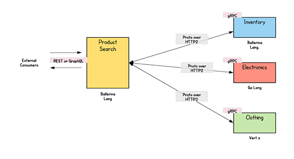

l  开题报告中确定的论文研究计划，按计划应该完成的工作；

l  已完成的论文研究工作和取得的阶段性成果；

l  存在的问题、尚未完成的工作及后期工作的设想和安排。

截止时间为2021年8月30日
分组，学生才能打印中期检查表
报告时间15分钟左右，其中学生汇报不超过10分钟，专家提问不超过5分钟。

　gRPC中默认支持两种授权方式,分别是：SSL/TLS认证方式、基于Token的认证方式。

1.1 SSL/TLS认证方式
　　SSL全称是Secure Sockets Layer，又被称之为安全套接字层，是一种标准安全协议，用于在通信过程中建立客户端与服务器之间的加密链接。

　　TLS的全称是Transport Layer Security，TLS是SSL的升级版。在使用的过程中，往往习惯于将SSL和TLS组合在一起写作SSL/TLS。

　　简而言之，SSL/TLS是一种用于网络通信中加密的安全协议。

1.1.1 SSL/TLS工作原理
　　使用SSL/TLS协议对通信连接进行安全加密，是通过非对称加密的方式来实现的。所谓非对称加密方式又称之为公钥加密，密钥对由公钥和私钥两种密钥组成。私钥和公钥成对存在，先生成私钥，通过私钥生成对应的公钥。公钥可以公开，私钥进行妥善保存。

　　在加密过程中：客户端想要向服务器发起链接，首先会先向服务端请求要加密的公钥。获取到公钥后客户端使用公钥将信息进行加密，服务端接收到加密信息，使用私钥对信息进行解密并进行其他后续处理，完成整个信道加密并实现数据传输的过程。

服务端启动并且向注册中心发送服务信息，注册中心收到后会定时监控服务状态（常见心跳检测）；
客户端需要开始调用服务的时候，首先去注册中心获取服务信息；
客户端创建远程调用连接，连接后服务端返回处理信息；
1.1.2 制作证书
　　可以自己在本机计算机上安装openssl，并生成相应的证书。

openssl ecparam -genkey -name secp384r1 -out server.key
openssl req -new -x509 -sha256 -key server.key -out server.pem -days 3650

1. 面向恶意软件的联邦元学习算法
2. 融合差分隐私的隐私保护技术
3. 基于微服务的可扩展联邦学习系统