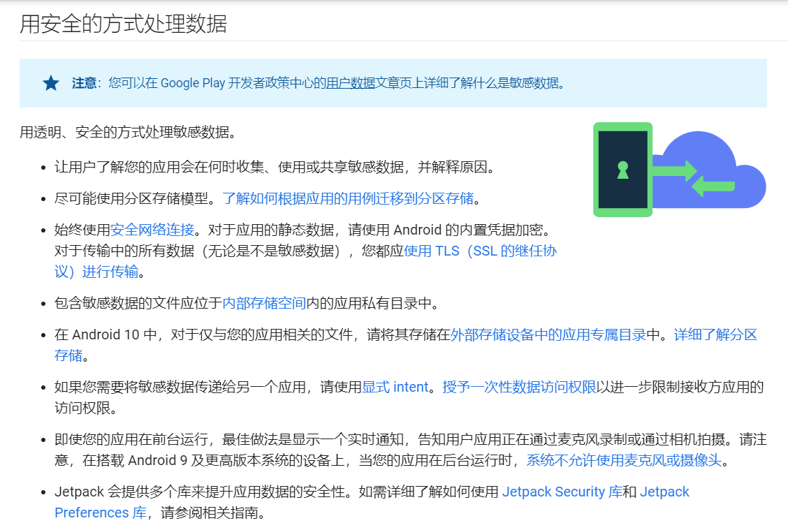

## 1 Android studio
### 隐私保护
* 可以用来论证Android隐私保护的总要性。
* [隐私权限进行重大更新，采取的措施](https://developer.android.google.cn/privacy/best-practices#minimize_your_use_of_location)

## 2 数据集搜集

> 恶意软件数据分享网站

### 2.1 androzoo
* 正在申请。
* 已经申请到了，正在下载。
* 下载了3000条，如果后续还需要使用的话，可以继续下载。

### 2.2 VirusTotal

* 在VirusTotal的实时样本流中应用YARA的魔力，并根据历史数据及时回溯，以跟踪某些威胁因素，您感兴趣的恶意软件家族的演变并自动生成IoC以保护您的组织。
* 需要了解VirusTotal做的事情。
  * 1.提供恶意软件数据集，并提供检索的方法。
  * 2.利用YARA规则进行实时流浪分析，并生成IOC描述特定活动。
  * 3.VT图，描述关系。（可以最后生成这种东西）
* Virustotal已经申请了更高级的数据集权限。
* 等权限申请完毕后，需要通过API下载恶意软件数据集。
* 已经获取了2018-2020，3年的数据集。非常多，大部分都是恶意软件，可以用来做书分析。

### 2.3 kaggle-goorax数据集
* 上边有部分数据集。已经下载。
* goorax有关于相同样本的不同工具的分析结果。包括了正向样本和逆向样本。可以直接使用。可以作为非常好的数据集。
* 是已经分析完成的数据，没有数据的源代码。

### 2.4 virusshare

* 不知道怎么注册，是否有恶意和非恶意的数据集。

### 2.5 AMD、Geometry、drebin数据集等
* 不在需要。如果需要，等以后再说。

### 2.6 其他论文——DeepAMD的数据集
* 当前下载不了，网络连接不可用。

### 2.7 github-sk3ptre数据集

------------------------
### ~~contagio~~
> 质量参差不起，已经放弃
* https://contagiominidump.blogspot.com/
* 数据都进行了加密，可以申请下载，但好麻烦。就没有直接公开好的别人研究过的数据集吗？我觉得还是看论文，用别人的数据集比较靠谱。有很多相关研究，公开数据及一般会在这里有。可以参考这上边的数据集。现在进行数据集下载
* 下载完了需要密码。

## 3 数据处理

### androguard

* virustotal工具本身提供了androidgurad分析的json文件。是否可以通过生成良性软件的相同格式的json文件，作为恶意软件分析程序的分析工具？我觉得可以。用scan结果作为良性非良性的输出。使用androidguard的分析结果作为输入。
* 存在缺陷，没有接口的统计。one-hot编码？没有比重。能否考虑将接口的比重作为编码对象？似乎没有必要。因为可以用大量正常的代码稀释恶意代码的比重。
* 

### flowdroid

### apktool

### apkanalyzer
* 也是可以使用的工具
### virustotal
* 了解网站的相关用法，看一看能够提供哪种有用的服务。

## 4 提取特征相关的工作

## 5 