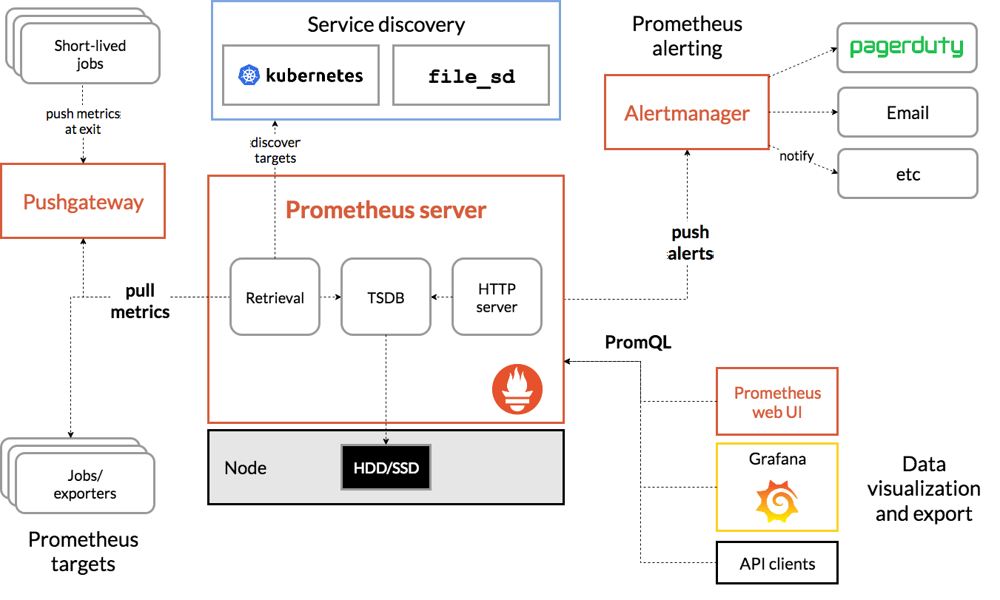
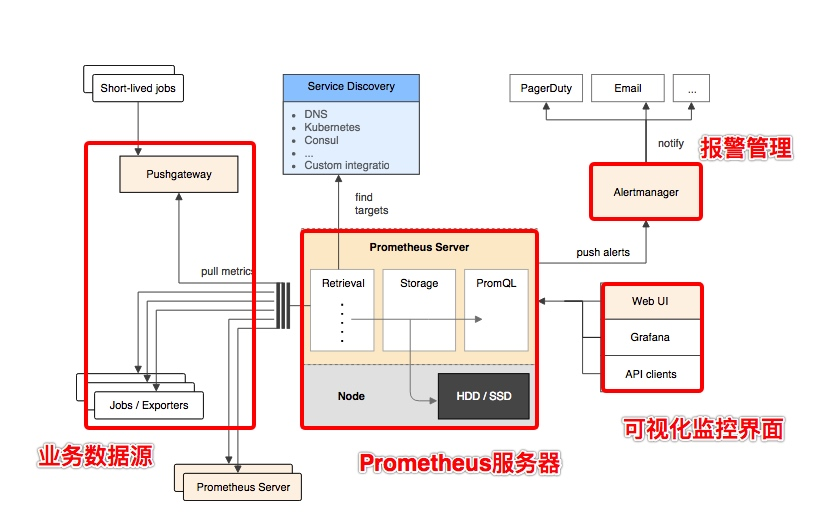

## 1 概述

### 简介
Prometheus 就是一个时序数据库，每隔一段时间收集一次数据，连起来就是一段时间的监控数据。


一种多维数据模型，其中包含通过 metric 名称和键/值对标识的时间序列数据
* 可利用各种维度的灵活的查询语句 PromQL
* 不依赖分布式存储；单服务节点是自治的
* 时间序列通过 HTTP 拉取方式进行收集
* 支持通过中间网关推送时间序列
* 通过服务发现或静态配置发现目标
* 多种图形和仪表板支持模式

### 架构





* Prometheus 服务器
Prometheus Server 是 Prometheus组件中的核心部分，负责实现对监控数据的获取，存储以及查询。

* NodeExporter 业务数据源
业务数据源通过 Pull/Push 两种方式推送数据到 Prometheus Server。

* AlertManager 报警管理器
Prometheus 通过配置报警规则，如果符合报警规则，那么就将报警推送到 AlertManager，由其进行报警处理。

* 可视化监控界面
Prometheus 收集到数据之后，由 WebUI 界面进行可视化图标展示。目前我们可以通过自定义的 API 客户端进行调用数据展示，也可以直接使用 Grafana 解决方案来展示。

## 2 核心概念
### 任务和实例


* job(任务名称，可以对应到应用名称)一组用于相同采集目的的实例，或者同一个采集进程的多个副本则通过一个一个任务(Job)进行管理。
* targets（不同目标，可以对应到不同的节点）可以访问http://192.168.33.10:9090/targets  直接从Prometheus的UI中查看当前所有的任务以及每个任务对应的实例信息。
```
scrape_configs:
  - job_name: 'prometheus'
    static_configs:
      - targets: ['localhost:9090']
  # 采集node exporter监控数据
  - job_name: 'node'
    static_configs:
      - targets: ['localhost:9100']
```


### 样本

在time-series中的每一个点称为一个样本（sample），样本由以下三部分组成：
* 指标(metric)：metric name和描述当前样本特征的labelsets;
* 时间戳(timestamp)：一个精确到毫秒的时间戳;
* 样本值(value)： 一个float64的浮点型数据表示当前样本的值。

```cs
<--------------- metric ---------------------><-timestamp -><-value->
http_request_total{status="200", method="GET"}@1434417560938 => 94355
http_request_total{status="200", method="GET"}@1434417561287 => 94334

http_request_total{status="404", method="GET"}@1434417560938 => 38473
http_request_total{status="404", method="GET"}@1434417561287 => 38544

http_request_total{status="200", method="POST"}@1434417560938 => 4748
http_request_total{status="200", method="POST"}@1434417561287 => 4785
```

### 指标
在形式上，所有的指标(Metric)都通过如下格式标示：
```
<metric name>{<label name>=<label value>, ...}
```
* 指标的名称(metric name)可以反映被监控样本的含义（比如，http_request_total - 表示当前系统接收到的HTTP请求总量）。指标名称只能由ASCII字符、数字、下划线以及冒号组成并必须符合正则表达式[a-zA-Z_:][a-zA-Z0-9_:]*。metric_name(配置名称，对应一个指标)
* 标签(label)反映了当前样本的特征维度，通过这些维度Prometheus可以对样本数据进行过滤，聚合等。标签的名称只能由ASCII字符、数字以及下划线组成并满足正则表达式[a-zA-Z_][a-zA-Z0-9_]*。label（同一个指标的不同标签，可以是QPS种的方法名、不同的节点名称等、不同的Job应用名称等，类似于Excel的横向的维度。）

## 3 指标类型
Prometheus定义了4种不同的指标类型(metric type)：Counter（计数器）、Gauge（仪表盘）、Histogram（直方图）、Summary（摘要）。


### Counter：只增不减的计数器

Counter类型的指标其工作方式和计数器一样，只增不减（除非系统发生重置）。常见的监控指标，如http_requests_total，node_cpu都是Counter类型的监控指标。 一般在定义Counter类型指标的名称时推荐使用_total作为后缀。

* 通过rate()函数获取HTTP请求量的增长率：
```
rate(http_requests_total[5m])
```
查询当前系统中，访问量前10的HTTP地址：
```
topk(10, http_requests_total)
```
### Gauge：可增可减的仪表盘

Gauge类型的指标侧重于反应系统的当前状态。因此这类指标的样本数据可增可减。常见指标如：node_memory_MemFree（主机当前空闲的内容大小）、node_memory_MemAvailable（可用内存大小）都是Gauge类型的监控指标。

* 通过PromQL内置函数delta()可以获取样本在一段时间返回内的变化情况。例如，计算CPU温度在两个小时内的差异：
```
delta(cpu_temp_celsius{host="zeus"}[2h])
```
* 使用deriv()计算样本的线性回归模型，甚至是直接使用predict_linear()对数据的变化趋势进行预测。例如，预测系统磁盘空间在4个小时之后的剩余情况：
```
predict_linear(node_filesystem_free{job="node"}[1h], 4 * 3600)
```

### Histogram和Summary分析数据分布情况
通过Histogram和Summary类型的监控指标，我们可以快速了解监控样本的分布情况。请求处理的时间等。

* Histogram类型的样本会反应当前指标的记录的总数(以_count作为后缀)以及其值的总量（以_sum作为后缀）。Histogram指标**直接反应了在不同区间内样本的个数**，区间通过标签len进行定义。

```properties
# HELP prometheus_tsdb_compaction_chunk_range Final time range of chunks on their first compaction
# TYPE prometheus_tsdb_compaction_chunk_range histogram
prometheus_tsdb_compaction_chunk_range_bucket{le="100"} 0
prometheus_tsdb_compaction_chunk_range_bucket{le="400"} 0
prometheus_tsdb_compaction_chunk_range_bucket{le="1600"} 0
prometheus_tsdb_compaction_chunk_range_bucket{le="6400"} 0
prometheus_tsdb_compaction_chunk_range_bucket{le="25600"} 0
prometheus_tsdb_compaction_chunk_range_bucket{le="102400"} 0
prometheus_tsdb_compaction_chunk_range_bucket{le="409600"} 0
prometheus_tsdb_compaction_chunk_range_bucket{le="1.6384e+06"} 260
prometheus_tsdb_compaction_chunk_range_bucket{le="6.5536e+06"} 780
prometheus_tsdb_compaction_chunk_range_bucket{le="2.62144e+07"} 780
prometheus_tsdb_compaction_chunk_range_bucket{le="+Inf"} 780
prometheus_tsdb_compaction_chunk_range_sum 1.1540798e+09
prometheus_tsdb_compaction_chunk_range_count 780
```


* 指标prometheus_tsdb_wal_fsync_duration_seconds的指标类型为Summary。 它记录了Prometheus Server中wal_fsync处理的处理时间，通过访问Prometheus Server的/metrics地址，可以获取到以下监控样本数据：
```properties
# HELP prometheus_tsdb_wal_fsync_duration_seconds Duration of WAL fsync.
# TYPE prometheus_tsdb_wal_fsync_duration_seconds summary
prometheus_tsdb_wal_fsync_duration_seconds{quantile="0.5"} 0.012352463
prometheus_tsdb_wal_fsync_duration_seconds{quantile="0.9"} 0.014458005
prometheus_tsdb_wal_fsync_duration_seconds{quantile="0.99"} 0.017316173
prometheus_tsdb_wal_fsync_duration_seconds_sum 2.888716127000002
prometheus_tsdb_wal_fsync_duration_seconds_count 216
```


## 5 配置文件

### configuration

https://prometheus.io/docs/prometheus/latest/configuration/configuration/

### 配置监控指标

https://prometheus.io/docs/prometheus/latest/configuration/recording_rules/


### 配置告警指标

https://prometheus.io/docs/prometheus/latest/configuration/alerting_rules/