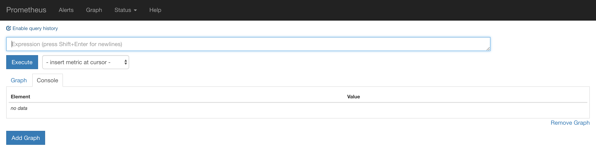
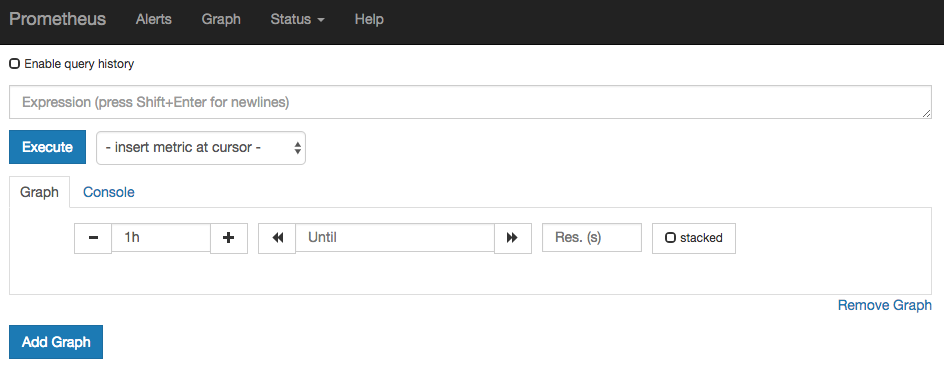
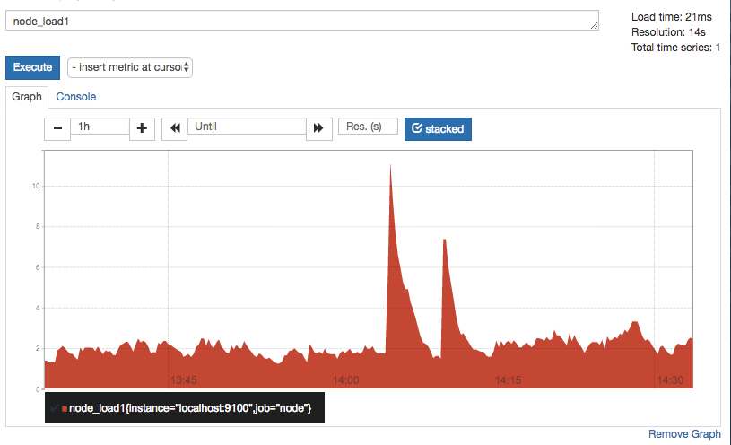
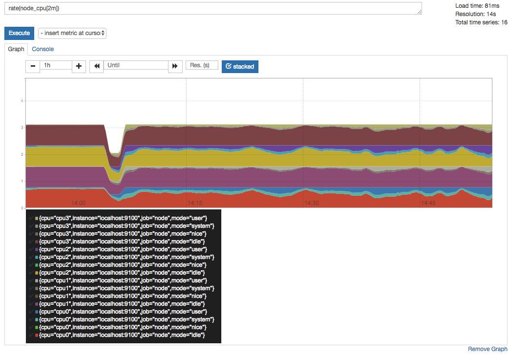
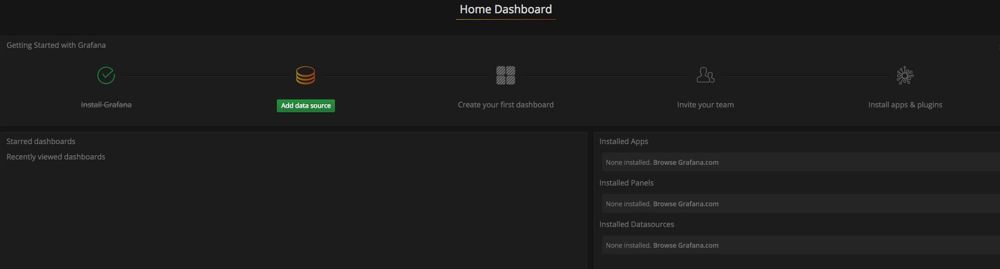
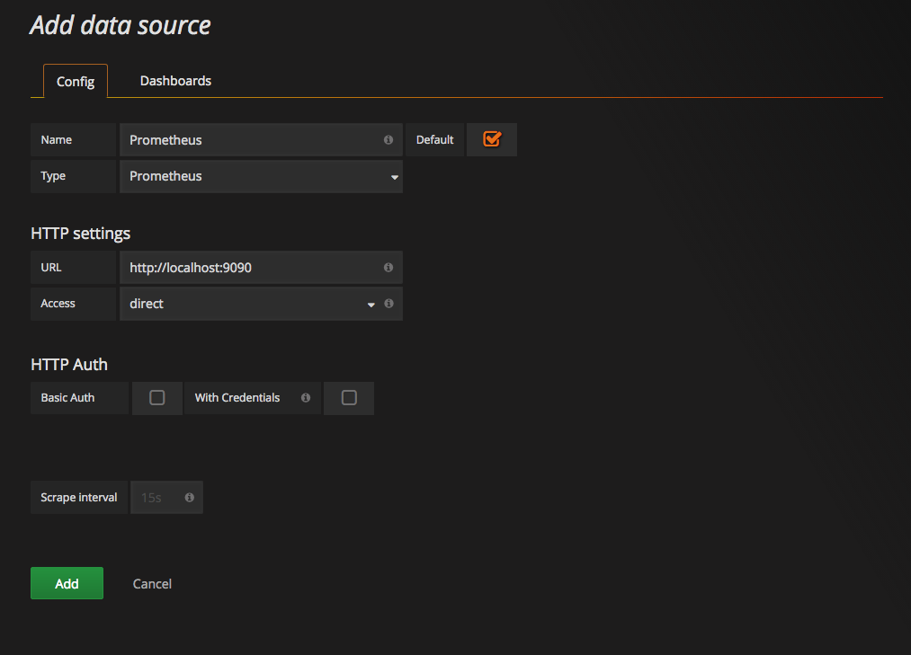
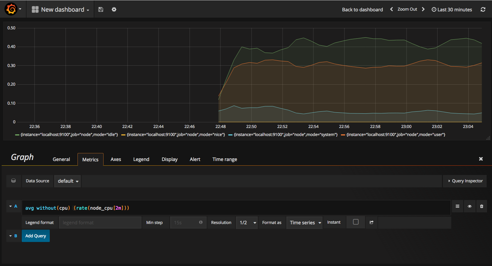
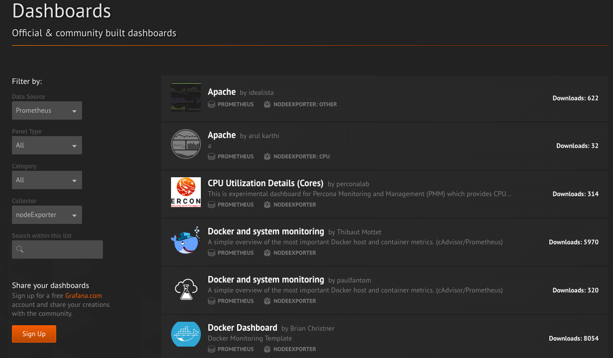

# 快速开始


## 1 Prometheus
1. 从https://prometheus.io/download/找到最新版本的Prometheus Sevrer软件包：

```
export VERSION=2.4.3
curl -LO  https://github.com/prometheus/prometheus/releases/download/v$VERSION/prometheus-$VERSION.darwin-amd64.tar.gz

tar -xzf prometheus-${VERSION}.darwin-amd64.tar.gz
cd prometheus-${VERSION}.darwin-amd64
```

Promtheus作为一个时间序列数据库，其采集的数据会以文件的形式存储在本地中，默认的存储路径为data/ .用户也可以通过参数--storage.tsdb.path="data/"修改本地数据存储的路径。启动命令如下
```sh
./prometheus
```


2. mac brew 安装

```sh
 9828  brew install prometheus
 9829  brew install grafana
 9842  brew install homebrew/services
 9868  brew install node_exporter

9860  brew services start prometheus
 9869  brew services start node_exporter
 9888  brew services start grafana
```
3. docker 安装

```shell
docker run -p 9090:9090 -v /etc/prometheus/prometheus.yml:/etc/prometheus/prometheus.yml prom/prometheus
```

4. 查看控制面。通过http://localhost:9090访问Prometheus的UI界面



## 2 配置文件
```java
# my global config
global:
  scrape_interval:     15s # Set the scrape interval to every 15 seconds. Default is every 1 minute.
  evaluation_interval: 15s # Evaluate rules every 15 seconds. The default is every 1 minute.
  # scrape_timeout is set to the global default (10s).

# Alertmanager configuration
alerting:
  alertmanagers:
  - static_configs:
    - targets:
      # - alertmanager:9093

# Load rules once and periodically evaluate them according to the global 'evaluation_interval'.
rule_files:
  # - "first_rules.yml"
  # - "second_rules.yml"

# A scrape configuration containing exactly one endpoint to scrape:
# Here it's Prometheus itself.
scrape_configs:
  # The job name is added as a label `job=<job_name>` to any timeseries scraped from this config.
  - job_name: 'prometheus'

    # metrics_path defaults to '/metrics'
    # scheme defaults to 'http'.

    static_configs:
    - targets: ['localhost:9090']
```

## 3 NodeExporter
1. 安装。可以从https://prometheus.io/download/获取最新的node exporter版本的二进制包。
```sh
curl -OL https://github.com/prometheus/node_exporter/releases/download/v0.15.2/node_exporter-0.15.2.darwin-amd64.tar.gz

cd node_exporter-0.15.2.darwin-amd64
cp node_exporter-0.15.2.darwin-amd64/node_exporter /usr/local/bin/
node_exporter
```
2. 访问http://localhost:9100/

```
node_boot_time：系统启动时间
node_cpu：系统CPU使用量
nodedisk*：磁盘IO
nodefilesystem*：文件系统用量
node_load1：系统负载
nodememeory*：内存使用量
nodenetwork*：网络带宽
node_time：当前系统时间
go_*：node exporter中go相关指标
process_*：node exporter自身进程相关运行指标
```

3. 修改配置文件，并重启prometheus

```yaml
scrape_configs:
  - job_name: 'prometheus'
    static_configs:
      - targets: ['localhost:9090']
  # 采集node exporter监控数据
  - job_name: 'node'
    static_configs:
      - targets: ['localhost:9100']
```

## 4 PromQL

Prometheus UI是Prometheus内置的一个可视化管理界面，通过Prometheus UI用户能够轻松的了解Prometheus当前的配置，监控任务运行状态等。 通过Graph面板，用户还能直接使用PromQL实时查询监控数据：

切换到Graph面板，用户可以使用PromQL表达式查询特定监控指标的监控数据。如下所示，查询主机负载变化情况，可以使用关键字node_load1可以查询出Prometheus采集到的主机负载的样本数据，这些样本数据按照时间先后顺序展示，形成了主机负载随时间变化的趋势图表：


PromQL是Prometheus自定义的一套强大的数据查询语言，除了使用监控指标作为查询关键字以为，还内置了大量的函数，帮助用户进一步对时序数据进行处理。例如使用rate()函数，可以计算在单位时间内样本数据的变化情况即增长率，因此通过该函数我们可以近似的通过CPU使用时间计算CPU的利用率：

rate(node_cpu[2m])



## 5 Grafana

1. 安装启动grafana.访问http://localhost:3000就可以进入到Grafana的界面中，默认情况下使用账户admin/admin进行登录。在Grafana首页中显示默认的使用向导，包括：安装、添加数据源、创建Dashboard、邀请成员、以及安装应用和插件等主要流程.


```sh
docker run -d -p 3000:3000 grafana/grafana
```

1. 这里将添加Prometheus作为默认的数据源

1. 在完成数据源的添加之后就可以在Grafana中创建我们可视化Dashboard了。Grafana提供了对PromQL的完整支持，如下所示，通过Grafana添加Dashboard并且为该Dashboard添加一个类型为“Graph”的面板。 并在该面板的“Metrics”选项下通过PromQL查询需要可视化的数据

1. 当然作为开源软件，Grafana社区鼓励用户分享Dashboard通过https://grafana.com/dashboards网站，可以找到大量可直接使用的Dashboard.Grafana中所有的Dashboard通过JSON进行共享，下载并且导入这些JSON文件，就可以直接使用这些已经定义好的Dashboard
