## 1 Registry
### 引入依赖
通过添加如下依赖可以将 Micrometer 收集的服务指标数据发布到 Prometheus 中。
```xml
<dependency>
  <groupId>io.micrometer</groupId>
  <artifactId>micrometer-registry-prometheus</artifactId>
  <version>${micrometer.version}</version>
</dependency>
```
当然如果你还没有确定好接入哪种监测系统，也可以先直接依赖micrometer-core，然后创建一个SimpleMeterRegistry。

### 可接入监控系统Registry
Micrometer 有一组包含各种监控系统实现的模块，其中的每一种实现被称为registry。

在深入了解 Micrometer 之前，我们首先来看一下监控系统的三个重要特征：

* 维度（Dimensionality）：描述系统是否支持多维度数据模型。
* 速率聚合（Rate Aggregation）：指的是在规定的时间间隔内的一组样本聚合。一种是指标数据发送前在客户端做速率聚合，另一种是直接发送聚合值。
* 发布（Publishing）：描述的是指标数据的发布方式，一种是客户端定时将数据推送给监控系统，还有一种是监控系统在空闲时间自己调客户端接口拉数据。

Meter是一个用于收集应用程序各项指标数据的接口，Micrometer 中的所有的Meters都通过MeterRegistry创建并管理，Micrometer 支持的每一种监控系统都有对应的MeterRegistry实现。

### SimpleMeterRegistry
最简单的Register就是SimpleMeterRegistry（在 Spring-based 的应用程序中自动装配），它会在内存中保存每个meter的最新值，但是不会将这个值发布到任何地方。
```java
MeterRegistry registry = new SimpleMeterRegistry();
```

### Composite Registries
Micrometer 提供了一个CompositeMeterRegistry，允许开发者通过添加多个 registry 的方式将指标数据同时发布到多个监控系统中。
```java
CompositeMeterRegistry composite = new CompositeMeterRegistry();

Counter compositeCounter = composite.counter("counter");
// 此处increment语句处于等待状态，直到CompositeMeterRegistry注册了一个registry。
// 此时counter计数器值为0
compositeCounter.increment(); (1)

SimpleMeterRegistry simple = new SimpleMeterRegistry();
// counter计数器注册到simple registry
composite.add(simple); (2)

// simple registry counter 与CompositeMeterRegistry中的其他registries的counter一起递增
compositeCounter.increment(); (3)
```

### Global Registry
Micrometer 提供了一个全局注册表Metrics.globalRegistry，它也是一个CompositeMeterRegistry，其内部提供了一系列用于构建 meters 的方法。
```java
public class Metrics {
    public static final CompositeMeterRegistry globalRegistry = new CompositeMeterRegistry();
    private static final More more = new More();

    /**
     * 当使用Metrics.counter(…​)之类的方法构建meters之后，就可以向globalRegistry中添加registry了
     * 这些meters会被添加到每个registry中
     *
     * @param registry Registry to add.
     */
    public static void addRegistry(MeterRegistry registry) {
        globalRegistry.add(registry);
    }

    /**
     * Remove a registry from the global composite registry. Removing a registry does not remove any meters
     * that were added to it by previous participation in the global composite.
     *
     * @param registry Registry to remove.
     */
    public static void removeRegistry(MeterRegistry registry) {
        globalRegistry.remove(registry);
    }

    /**
     * Tracks a monotonically increasing value.
     *
     * @param name The base metric name
     * @param tags Sequence of dimensions for breaking down the name.
     * @return A new or existing counter.
     */
    public static Counter counter(String name, Iterable<Tag> tags) {
        return globalRegistry.counter(name, tags);
    }

    ...
}
```

### 自定义 Registry
Micrometer 为我们提供了很多开箱即用的 Registry，基本上可以满足大多数的业务场景。同时也支持用户根据实际场景需求，自定义 registry。

通常我们可以通过继承MeterRegistry, PushMeterRegistry, 或者 StepMeterRegistry来创建定制化的 Registry。
```java
// 自定义registry config
public interface CustomRegistryConfig extends StepRegistryConfig {

  CustomRegistryConfig DEFAULT = k -> null;

  @Override
  default String prefix() {
    return "custom";
  }

}


// 自定义registry
public class CustomMeterRegistry extends StepMeterRegistry {

  public CustomMeterRegistry(CustomRegistryConfig config, Clock clock) {
    super(config, clock);

    start(new NamedThreadFactory("custom-metrics-publisher"));
  }

  @Override
  protected void publish() {
    getMeters().stream().forEach(meter -> System.out.println("Publishing " + meter.getId()));
  }

  @Override
  protected TimeUnit getBaseTimeUnit() {
    return TimeUnit.MILLISECONDS;
  }

}

/**
 *
 */
@Configuration
public class MetricsConfig {

  @Bean
  public CustomRegistryConfig customRegistryConfig() {
    return CustomRegistryConfig.DEFAULT;
  }

  @Bean
  public CustomMeterRegistry customMeterRegistry(CustomRegistryConfig customRegistryConfig, Clock clock) {
    return new CustomMeterRegistry(customRegistryConfig, clock);
  }

}
```

## 2 Meters

Micrometer 支持多种类型的度量器，包括Timer, Counter, Gauge, DistributionSummary, LongTaskTimer, FunctionCounter, FunctionTimer以及TimeGauge。

在 Micrometer 中，通过名称和维度（dimensions，也可以称为"tags"，即 API 中的Tag标签）来唯一确定一种meter。引入维度的概念便于我们对某一指标数据进行更细粒度的拆分研究。

### Naming Meters
每种监控系统都有自己的命名风格，不同系统间的命名规则可能是不兼容的。Micrometer 采用的命名约定是通过.来分隔小写单词。在 Micrometer 中，针对每种监控系统的不同实现都会将这种.分隔单词的命名风格转换为各个监控系统推荐的命名约定，同时也会去除命名中禁止出现的特殊字符。
```java
// Micrometer naming convention
registry.timer("http.server.requests");

// Prometheus naming convention
registry.timer("http_server_requests_duration_seconds");

// Atlas naming convention
registry.timer("httpServerRequests");

// Graphite naming convention
registry.timer("http.server.requests");

// InfluxDB naming convention
registry.timer("http_server_requests");
```
当然，我们可以通过实现NamingConvention接口来覆盖默认的命名约定规则：
```
registry.config().namingConvention(myCustomNamingConvention);
```
### Tag Naming
对于 Tag 的命名，建议也采用跟 meter 一致的点号分隔小写单词的方式，这同样有助于将命名风格转换为各个监控系统推荐的命名模式。

推荐写法
```java
registry.counter("database.calls", "db", "users")
registry.counter("http.requests", "uri", "/api/users")
```

这种命名方式为我们分析数据提供了足够的上下文语义，设想如果我们只通过 name 分析数据，得到的数据也是有意义的。比如，选择database.calls，那我们就可以得到针对所有数据库的访问情况。接下来如果想要深入分析，就可以通过Tag标签db来对数据做进一步的筛选。

错误示例
```java
registry.counter("calls",
    "class", "database",
    "db", "users");

registry.counter("calls",
    "class", "http",
    "uri", "/api/users");
```
再来看一下上面这种命名方式，此时如果仅仅通过 name 属性calls来查看数据，得到的是包含了 db 访问和 http 调用的所有的指标数据。显然这种数据对于我们分析生产问题来说是毫无意义的，需要进一步选择class标签来细化数据维度。

### Common Tags
common tags 属于 registry 级别的 tag，它会被应用到报告给监控系统的所有 metric 中，这类 tag 通常是系统维度的一些属性，比如 host、instance、region、堆栈信息等等。
```
registry.config().commonTags("stack", "prod", "region", "us-east-1");
registry.config().commonTags(Arrays.asList(Tag.of("stack", "prod"), Tag.of("region", "us-east-1"))); // equivalently
```
common tags 必须在添加任何 meter 之前就被加入到 registry 中。

### Tag Values
首先，tag values 不能为空。

除此之外，我们还需要做的就是对 tag 值做规范化，对其可能取值做限制。比如针对 HTTP 请求中的 404 异常响应，可以将这类异常的响应值设置为统一返回NOT_FOUND，否则指标数据的度量维度将会随着这类找不到资源异常数量的增加而增长，导致本该聚合的指标数据变得很离散。

## 3 Meter Filters
Meter Filter 用于控制meter注册时机、可以发布哪些类型的统计数据，我们可以给每一个 registry 配置过滤器。

过滤器提供以下三个基本功能：

* 拒绝/接受meter注册。
* 变更meter的 ID 信息（io.micrometer.core.instrument.Meter.Id）
* 针对某些类型的meter配置分布统计。
```
registry.config()
    // 多个filter配置按顺序生效
    .meterFilter(MeterFilter.ignoreTags("too.much.information"))
    .meterFilter(MeterFilter.denyNameStartsWith("jvm"));
```

### 拒绝/接受Meters
用于配置只接受指定形式的meters，或者屏蔽某些meters。
```java
new MeterFilter() {
    @Override
    public MeterFilterReply accept(Meter.Id id) {
       if(id.getName().contains("test")) {
          return MeterFilterReply.DENY;
       }
       return MeterFilterReply.NEUTRAL;
    }
}


public enum MeterFilterReply {
    // 拒绝meter注册请求，registry将会返回一个该meter的NOOP版本（如NoopCounter、NoopTimer）
    DENY,

    // 当没有任何过滤器返回DENY时，meter的注册流程继续向前推进
    NEUTRAL,

    // 表示meter注册成功，无需继续向下流转“询问”其他filter的accept(...)方法
    ACCEPT
}
```

针对Meter的 deny/accept 策略， MeterFilter为我们提供了一些常用的方法：

* accept()：接受所有的meter注册，该方法之后的任何 filter 都是无效的。
* accept(Predicate<Meter.Id>)：接收满足给定条件的meter注册。
* acceptNameStartsWith(String)：接收 name 以指定字符打头的meter注册。
* deny()：拒绝所有meter的注册请求，该方法之后的任何 filter 都是无效的。
* denyNameStartsWith(String)：拒绝所有 name 以指定字符串打头的meter的注册请求。
* deny(Predicate<Meter.Id>)：拒绝满足特定条件的meter的注册请求。
* maximumAllowableMetrics(int)：当已注册的meters数量达到允许的注册上限时，拒绝之后的所有注册请求。
* maximumAllowableTags(String meterNamePrefix, String tagKey, int maximumTagValues, MeterFilter onMaxReached)：设置一个tags上限，达到这个上限时拒绝之后的注册请求。
* denyUnless(Predicate<Meter.Id>)：白名单机制，拒绝不满足给定条件的所有meter的注册请求。


### 变更Meter的 ID 信息
```
new MeterFilter() {
    @Override
    public Meter.Id map(Meter.Id id) {
       if(id.getName().startsWith("test")) {
          return id.withName("extra." + id.getName()).withTag("extra.tag", "value");
       }
       return id;
    }
}
```
常用方法：

* commonTags(Iterable<Tag>)：为所有指标添加一组公共 tags。通常建议开发者为应用程序名称、host、region 等信息添加公共 tags。
* ignoreTags(String…​)：用于从所有meter中去除指定的 tag key。比如当我们发现某个 tag 具有过高的基数，并且已经对监控系统构成压力，此时可以在无法立即改变所有检测点的前提下优先采用这种方式来快速减轻系统压力。
* replaceTagValues(String tagKey, Function<String, String> replacement, String…​ exceptions)：替换满足指定条件的所有 tag 值。通过这种方式可以某个 tag 的基数大小。
* renameTag(String meterNamePrefix, String fromTagKey, String toTagKey)：重命名所有以给定前缀命名的metric的 tag key。


### 配置分布统计信息
```java
new MeterFilter() {
    @Override
    public DistributionStatisticConfig configure(Meter.Id id, DistributionStatisticConfig config) {
        if (id.getName().startsWith(prefix)) {
            return DistributionStatisticConfig.builder()
                    // ID名称以指定前缀开头的请求提供指标统计直方图信息
                    .publishPercentiles(0.9, 0.95)
                    .build()
                    .merge(config);
        }
        return config;
    }
};
```

## 4 速率聚合
速率聚合可以在指标数据发布之前在客户端完成，也可以作为服务器查询的一部分在服务端临时聚合。Micrometer 可以根据每种监控系统的风格

并不是所有的指标都需要被视为一种速率来发布或查看。例如，gauge值或者长期定时任务中的活跃任务数都不是速率。

### 服务端聚合
执行服务端速率计算的监控系统期望能在每个发布间隔报告计数绝对值。例如，从应用程序启动开始 counter 计数器在每个发布间隔产生的所有增量的绝对计数和。

当服务重启时 counter 的计数值就会降为零。一旦新的服务实例启动成功，速率聚合图示曲线将会返回到 11:45 左右的数值。
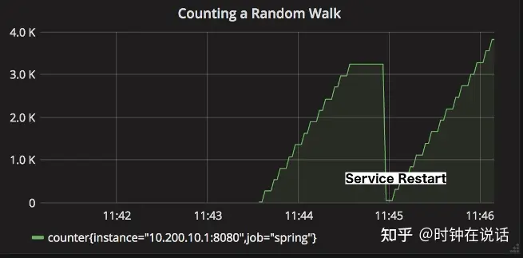

下图表示的是一个没有速率聚合的 counter，这种计数器几乎没什么用，因为它反映的只是 counter 的增长速度随时间的变化关系。

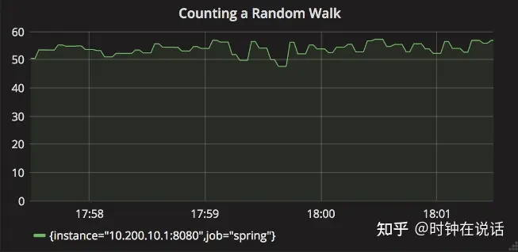

通过以上图示对比可以发现，如果在实际生产环境中，我们实现了零停机部署（例如红黑部署），那么就可以通过设定速率聚合曲线的最小报警阈值来实现服务异常监测（零停机部署环境下无需担心因服务重启导致 counter 计数值下降）。

### 客户端聚合
在实际应用中，有以下两类监控系统期望客户端在发布指标数据之前完成速率聚合。

* 期望得到聚合数据。生产环境中大多数情况下我们都需要基于服务指标的速率作出决策，这种情况下服务端需要做更少的计算来满足查询要求。
* 查询阶段只有少量或者根本没有数学计算允许我们做速率聚合。对于这些系统，发布一个预先聚合的数据是非常有意义的事情。


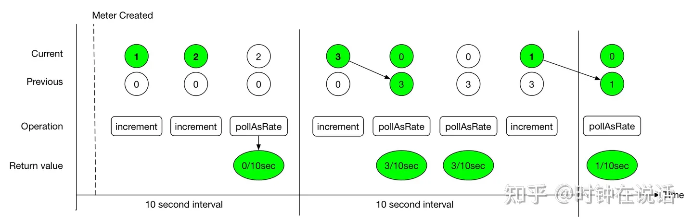

Micrometer 的Timer会分别记录count值和totalTime值。比如我们配置的发布间隔是 10s，然后有 20 个请求，每个请求的耗时是 100ms。那么，对于第一个时间区间来说：
```
count = 10 seconds * (20 requests / 10 seconds) = 20 requests；
totalTime = 10 seconds _ (20 _ 100 ms / 10 seconds) = 2 seconds。
```
count统计表示的是服务的吞吐量信息，totalTime表示的是整个时间区间内所有请求的总耗时情况。
```
totalTime / count = 2 seconds / 20 requests = 0.1 seconds / request = 100 ms / request
```
表示的是所有请求的平均时延情况。

## 5 指标类型
### Counters
Counters 用于报告一个单一的计数指标。Counter 接口允许按照一个固定正向值递增。

当使用counter构建图表和报警时，通常我们最感兴趣的是事件在给定的时间间隔内发生的速率。例如给定一个队列，我们可以使用counter度量数据项写入队列以及从队列中移除的速度。
```java
Normal rand = ...; // a random generator

MeterRegistry registry = ...
Counter counter = registry.counter("counter"); (1)

Flux.interval(Duration.ofMillis(10))
        .doOnEach(d -> {
            if (rand.nextDouble() + 0.1 > 0) { (2)
                counter.increment(); (3)
            }
        })
        .blockLast();

// counter流式调用
Counter counter = Counter
    .builder("counter")
    .baseUnit("beans") // optional
    .description("a description of what this counter does") // optional
    .tags("region", "test") // optional
    .register(registry);
```

### Gauges
gauge用于获取当前值。常见的应用场景比如实时统计当前运行的线程数。

gauge对于监测那些具有自然上限的属性来说比较有用。它不适合用于统计应用程序的请求数，因为请求数会随着服务生命周期的增加而无限延长。

永远不要用gauge度量那些本可以使用counter计数的数据。
```java
List<String> list = registry.gauge("listGauge", Collections.emptyList(), new ArrayList<>(), List::size); (1)
List<String> list2 = registry.gaugeCollectionSize("listSize2", Tags.empty(), new ArrayList<>()); (2)
Map<String, Integer> map = registry.gaugeMapSize("mapGauge", Tags.empty(), new HashMap<>());

// maintain a reference to myGauge
AtomicInteger myGauge = registry.gauge("numberGauge", new AtomicInteger(0));

// ... elsewhere you can update the value it holds using the object reference
myGauge.set(27);
myGauge.set(11);
```
还有一种特殊类型的Gauge-MultiGauge，可以一次发布一组 metric。
```java
// SELECT count(*) from job group by status WHERE job = 'dirty'
MultiGauge statuses = MultiGauge.builder("statuses")
    .tag("job", "dirty")
    .description("The number of widgets in various statuses")
    .baseUnit("widgets")
    .register(registry);

...

// run this periodically whenever you re-run your query
statuses.register(
    resultSet.stream()
        .map(result -> Row.of(Tags.of("status", result.getAsString("status")), result.getAsInt("count"))));
```

### Timers
Timer用于度量短时间内的事件时延和响应频率。所有的Timer实现都记录了事件响应总耗时和事件总数。Timer不支持负数，此外如果使用它来记录大批量、长时延事件的话，容易导致指标值数据越界（超过Long.MAX_VALUE）。
```java
public interface Timer extends Meter {
    ...
    void record(long amount, TimeUnit unit);
    void record(Duration duration);
    double totalTime(TimeUnit unit);
}
```
对于Timer的基本实现（如CumulativeTimer、StepTimer）中定义的最大统计值，指的都是一个时间窗口中的最大值（TimeWindowMax）。如果时间窗口范围内没有新值记录，随着一个新的时间窗口开始，最大值会被重置为零。

时间窗口大小默认是MeterRegistry定义的步长大小，也可以通过DistributionStatisticConfig的expiry(...)方法显式设置。
```java
/**
 * @return The step size to use in computing windowed statistics like max. The default is 1 minute.
 * To get the most out of these statistics, align the step interval to be close to your scrape interval.
 */
default Duration step() {
    // PrometheusMeterRegistry默认步长一分钟
    return getDuration(this, "step").orElse(Duration.ofMinutes(1));
}


// 也可以通过DistributionStatisticConfig自定义步长
public class DistributionStatisticConfig implements Mergeable<DistributionStatisticConfig> {
    public static final DistributionStatisticConfig DEFAULT = builder()
            .percentilesHistogram(false)
            .percentilePrecision(1)
            .minimumExpectedValue(1.0)
            .maximumExpectedValue(Double.POSITIVE_INFINITY)
            .expiry(Duration.ofMinutes(2))
            .bufferLength(3)
            .build();

     ...
}


public Builder expiry(@Nullable Duration expiry) {
    config.expiry = expiry;
    return this;
}
```
### Timer.Sample
可以用它来统计方法执行耗时。在方法开始执行之前，通过sample记录启动时刻的时间戳，之后当方法执行完毕时通过调用stop操作完成计时任务。
```
Timer.Sample sample = Timer.start(registry);

// do stuff
Response response = ...

sample.stop(registry.timer("my.timer", "response", response.status()));
```

### @Timed
@Timed可以被添加到包括 Web 方法在内的任何一个方法中，加入该注解后可以支持方法计时功能。

Micrometer 的 Spring Boot 配置中无法识别@Timed。

micrometer-core中提供了一个 AspectJ 切面，使得我们可以通过 Spring AOP 的方式使得@Timed注解在任意方法上可用。
```java
@Configuration
public class TimedConfiguration {
   @Bean
   public TimedAspect timedAspect(MeterRegistry registry) {
      return new TimedAspect(registry);
   }
}

@Service
public class ExampleService {

  @Timed
  public void sync() {
    // @Timed will record the execution time of this method,
    // from the start and until it exits normally or exceptionally.
    ...
  }

  @Async
  @Timed
  public CompletableFuture<?> async() {
    // @Timed will record the execution time of this method,
    // from the start and until the returned CompletableFuture
    // completes normally or exceptionally.
    return CompletableFuture.supplyAsync(...);
  }

}
```
### Distribution Summaries
分布式摘要记录的是事件的分布情况，结构上与Timer类似，但是记录的并不是一个时间单位中的值。比如，我们可以通过分布式摘要记录命中服务器的请求负载大小。

通过以下方式可以创建分布式摘要：
```java
DistributionSummary summary = registry.summary("response.size");

DistributionSummary summary = DistributionSummary
    .builder("response.size")
    .description("a description of what this summary does") // optional
    .baseUnit("bytes") // optional (1)
    .tags("region", "test") // optional
    .scale(100) // optional (2)
    .register(registry);
```
### Long Task Timers

长任务计时器是一种特殊的计时器，它允许你在被检测任务仍在运行时度量时间。普通定时器只在任务完成时记录其持续时间。

长任务计时器会统计以下数据：

* 活跃任务数；
* 所有活跃任务的总持续时间；
* 活跃任务中的最大持续时间。

与Timer不同的是，长任务计时器不会发布关于已完成任务的统计信息。

设想一下这样的场景：一个后台进程定时将数据库中的数据刷新的 metadata 中，正常情况下整个刷新任务几分钟内就可以完成。一旦服务出现异常，刷新任务可能需要占用较长时间，此时长任务计时器可以用来记录刷新数据的总活跃时间。
```java
@Timed(value = "aws.scrape", longTask = true)
@Scheduled(fixedDelay = 360000)
void scrapeResources() {
    // find instances, volumes, auto-scaling groups, etc...
}
```
如果你所用框架不支持@Timed，可以通过如下方式创建长任务计时器。
```java
LongTaskTimer scrapeTimer = registry.more().longTaskTimer("scrape");
void scrapeResources() {
    scrapeTimer.record(() => {
        // find instances, volumes, auto-scaling groups, etc...
    });
}
```
还有一点需要注意的是，如果我们想在进程超过指定阈值时触发报警，当使用长任务定时器时，在任务超过指定阈值后的首次报告间隔内我们就可以收到报警。如果使用的是常规的Timer，只能一直等到任务结束后的首次报告间隔时才能收到报警，此时可能已经过去很长时间了。

### Histograms
Timer和distribution summaries 支持收集数据来观察数据分布占比。通常有以下两种方式查看占比：

* Percentile histograms：Micrometer 首先将所有值累积到一个底层直方图中，之后将一组预定的 buckets 发送到监控系统。监控系统的查询语言负责计算这个直方图的百分位。
目前，只有 Prometheus, Atlas, and Wavefront 支持基于直方图的百分比近似计算（通过histogram_quantile, :percentile, 和hs()）。如果你选择的监控系统是以上几种，推荐使用这种方式，因为基于这种方式可以实现跨维度聚合直方图，并从直方图中得出可聚合的百分比。
* Client-side percentiles：由 Micrometer 负责计算每个 meter ID 下的百分比近似值，然后将其发送到监控系统。这种方式显示没有Percentile histograms灵活，因为它不支持跨维度聚合百分比近似值。
不过，这种方式给那些不支持服务器端基于直方图做百分比计算的监控系统提供了一定程度上的百分比分布情况的洞察能力。
```java
Timer.builder("my.timer")
   .publishPercentiles(0.5, 0.95) // 用于设置应用程序中计算的百分比值，不可跨维度聚合
   .publishPercentileHistogram() // (2)
   .serviceLevelObjectives(Duration.ofMillis(100)) // (3)
   .minimumExpectedValue(Duration.ofMillis(1)) // (4)
   .maximumExpectedValue(Duration.ofSeconds(10))
```


## 6 接入 Prometheus
Prometheus 基于服务发现的模式，定时从应用程序实例上拉取指标数据，它支持自定义查询的语言以及数学操作。

1. 接入 Prometheus 时首先需要引入如下的 maven 依赖：
```xml
<dependency>
<groupId>io.micrometer</groupId>
<artifactId>micrometer-registry-prometheus</artifactId>
<version>${micrometer.version}</version>
</dependency>
```
2. 创建 Prometheus Registry，同时需要给 Prometheus 的 scraper 暴露一个 HTTP 端点用于数据拉取。

```java
PrometheusMeterRegistry prometheusRegistry = new PrometheusMeterRegistry(PrometheusConfig.DEFAULT);

try {
HttpServer server = HttpServer.create(new InetSocketAddress(8080), 0);
server.createContext("/prometheus", httpExchange -> {
String response = prometheusRegistry.scrape(); (1)
httpExchange.sendResponseHeaders(200, response.getBytes().length);
try (OutputStream os = httpExchange.getResponseBody()) {
os.write(response.getBytes());
}
});

new Thread(server::start).start();
} catch (IOException e) {
throw new RuntimeException(e);
}
```

3. 设置拉取的数据格式。默认情况下PrometheusMeterRegistry的scrape()方法返回的是 Prometheus 默认的文本格式。从 Micrometer 1.7.0 开始，也可以通过如下方式指定数据格式为OpenMetrics定义的数据格式：
`String openMetricsScrape = registry.scrape(TextFormat.CONTENT_TYPE_OPENMETRICS_100)`;

4. 图形化展示。将 Prometheus 抓取的指标数据展示到 Grafana 面板中，下图使用的是官方公开的一种 Grafana dashboard 模板（JVM-dashboard）

## 7 SpringBoot 中如何使用
1. Spring Boot Actuator 为 Micrometer 提供依赖项管理以及自动配置。需要先引入以下配置：
```xml
<dependency>
<groupId>org.springframework.boot</groupId>
<artifactId>spring-boot-starter-actuator</artifactId>
</dependency>
<dependency>
<groupId>io.micrometer</groupId>
<artifactId>micrometer-registry-prometheus</artifactId>
</dependency>
<dependency>
<groupId>org.springframework</groupId>
<artifactId>spring-aop</artifactId>
</dependency>
<dependency>
<groupId>org.aspectj</groupId>
<artifactId>aspectjweaver</artifactId>
</dependency>
```

2. 接下来通过MeterRegistryCustomizer配置registry，比如在meter注册到registry之前配置registry级别的公共标签属性。
```java
@Configuration
public class MicroMeterConfig {

@Bean
public MeterRegistryCustomizer<MeterRegistry> meterRegistryCustomizer() {
return meterRegistry -> meterRegistry.config().commonTags(Collections.singletonList(Tag.of("application", "mf-micrometer-example")));
}


// Spring Boot中无法直接使用@Timed，需要引入TimedAspect切面支持。
@Bean
public TimedAspect timedAspect(MeterRegistry registry) {
return new TimedAspect(registry);
}
}


@RequestMapping("health")
@RestController
public class MetricController {

@Timed(percentiles = {0.5, 0.80, 0.90, 0.99, 0.999})
@GetMapping("v1")
public ApiResp health(String message) {
try {
Thread.sleep(new Random().nextInt(1000));
} catch (InterruptedException e) {
e.printStackTrace();
}
return ApiResp.ok(new JSONObject().fluentPut("message", message));
}


@GetMapping("v2")
@Timed(percentiles = {0.5, 0.80, 0.90, 0.99, 0.999})
public ApiResp ping() {
return ApiResp.ok(new JSONObject().fluentPut("message", "OK"));
}
}
```
3. Spring Boot 默认提供了一个/actuator/promethues端点用于服务指标数据拉取，端点暴露的数据中可能包含应用敏感数据，通过以下配置可以限制端点数据暴露（exclude 优先级高于 include 优先级）。

启动服务，访问http://localhost:8800/actuator/prometheus  可以看到以下服务指标数据：

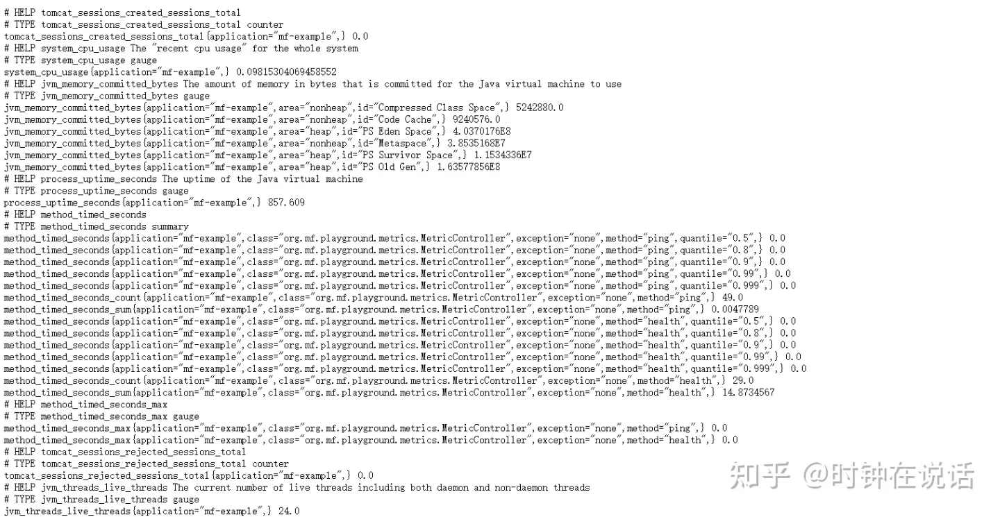

接下来就可以配置 Prometheus 了，在 prometheus.yml 中加入以下内容：
```yaml
# my global config
global:
scrape_interval: 15s # Set the scrape interval to every 15 seconds. Default is every 1 minute.
evaluation_interval: 15s # Evaluate rules every 15 seconds. The default is every 1 minute.
# scrape_timeout is set to the global default (10s).

# Alertmanager configuration
alerting:
alertmanagers:
- static_configs:
- targets:
# - alertmanager:9093

# Load rules once and periodically evaluate them according to the global 'evaluation_interval'.
rule_files:
# - "first_rules.yml"
# - "second_rules.yml"

# A scrape configuration containing exactly one endpoint to scrape:
# Here it's Prometheus itself.
scrape_configs:
# The job name is added as a label `job=<job_name>` to any timeseries scraped from this config.
- job_name: 'mf-micrometer-example'
scrape_interval: 5s
metrics_path: '/actuator/prometheus'
static_configs:
- targets: ['127.0.0.1:8800']
labels:
instance: 'mf-example'
```
4. 访问Prometheus控制台（http://localhost:9090），Targets页面中可以看到当前连接到这台Prometheus的所有客户端及其状态。同时，在Graph界面可以通过查询语句查询指定条件的指标数据：

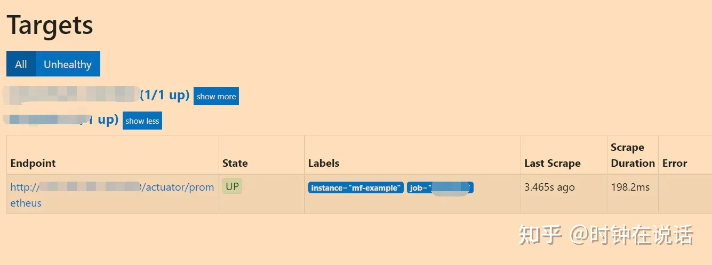
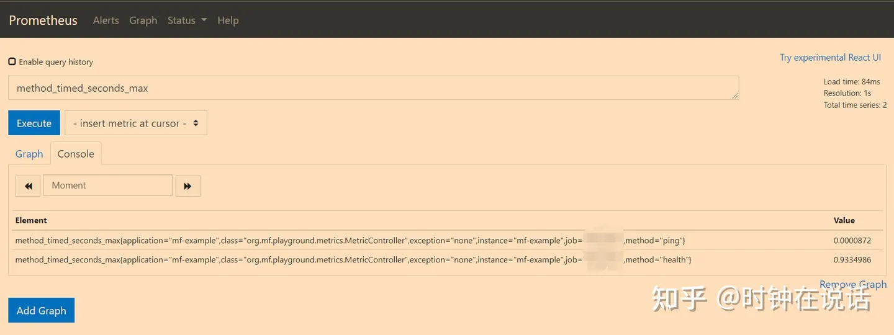

到这一步，我们已经完成了服务指标数据度量及抓取的工作。最后，我们需要将 Prometheus 抓取的数据做图形化展示，这里我们使用 Grafana。

## 8 Grafana

1. 首先创建数据源，Grafana 支持多种数据源接入，此处我们选择 Prometheus。
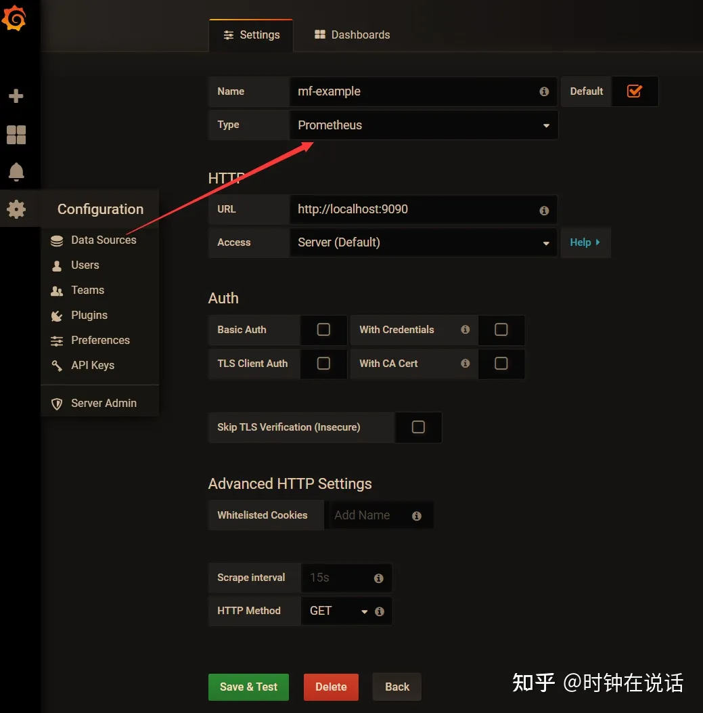

2. 创建 Dashboard，可以自定义，也可以使用官方发布的一些模板，比如4701模板。导入模板后选择我们刚才创建好的数据源即可。
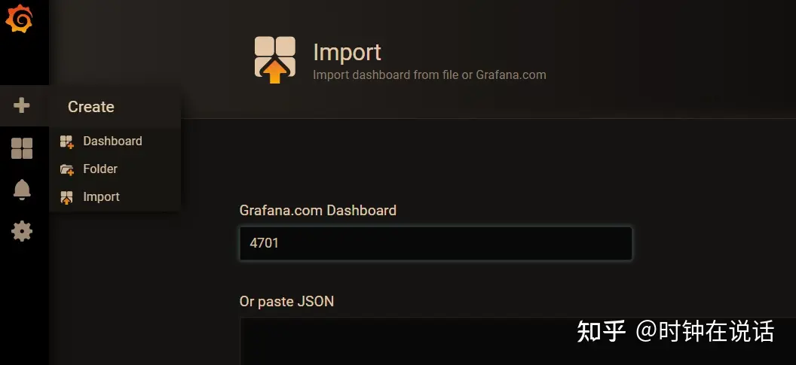

3. 可以看到这是指标数据图形化展示的结果，可以非常直观地看到服务调用量。
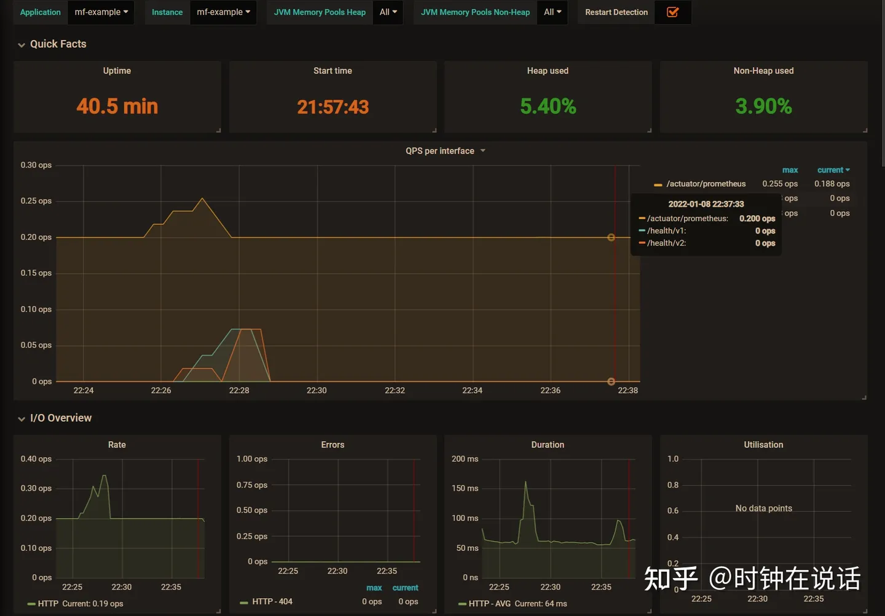


## 9 其他问题
### 批处理作业指标抓取
除此之外，针对临时性或者批处理作业，他们执行的时间可能不够长，使得 Prometheus 没法抓取指标数据。对于这类作业，可以使用 Prometheus Pushgateway 主动推送数据到 Prometheus（PrometheusPushGatewayManager用于管理将数据推送到 Prometheus）。
```xml
<dependency>
    <groupId>io.prometheus</groupId>
    <artifactId>simpleclient_pushgateway</artifactId>
</dependency>
```

使用 pushgateway 需要同时设置`management.metrics.export.prometheus.pushgateway.enabled=true`。

### 关于@Timed
前文中我们提到官方文档中说 Spring Boot 中无法直接使用@Timed，需要引入TimedAspect切面支持。但是经过实际测试发现，对于 SpringMVC 请求，不引入TimedAspect也可以记录接口调用耗时。

通过分析源码可以发现，Spring Boot Actuator 中有一个WebMvcMetricsFilter类，这个类会对请求做拦截，其内部会判断接口所在方法、类上是否加了@Timed。
```java
public class WebMvcMetricsFilter extends OncePerRequestFilter {

    private void record(WebMvcMetricsFilter.TimingContext timingContext, HttpServletRequest request, HttpServletResponse response, Throwable exception) {
      Object handler = this.getHandler(request);
      // 查找类、方法上的@Timed注解
      Set<Timed> annotations = this.getTimedAnnotations(handler);
      Sample timerSample = timingContext.getTimerSample();
      if(annotations.isEmpty()) {
        if(this.autoTimer.isEnabled()) {
          // 未加@Timed，使用默认配置构造Timer。此处metricName="http.server.requests"
          Builder builder = this.autoTimer.builder(this.metricName);
          timerSample.stop(this.getTimer(builder, handler, request, response, exception));
        }
      } else {
        Iterator var11 = annotations.iterator();

        while(var11.hasNext()) {
          Timed annotation = (Timed)var11.next();
          // 方法上有@Timed，构造timer builder，此处metricName="http.server.requests"
          Builder builder = Timer.builder(annotation, this.metricName);
          timerSample.stop(this.getTimer(builder, handler, request, response, exception));
        }
      }

    }


   /**
     * 先查找方法中是否存在@Timed注解，如果方法上没有，则继续在类上查找
     */
    private Set<Timed> getTimedAnnotations(HandlerMethod handler) {
        Set<Timed> methodAnnotations = this.findTimedAnnotations(handler.getMethod());
        return !methodAnnotations.isEmpty()?methodAnnotations:this.findTimedAnnotations(handler.getBeanType());
    }

}
```
所以，基于以上分析，我们去掉代码中的TimedAspect，然后再次查看指标数据统计情况：
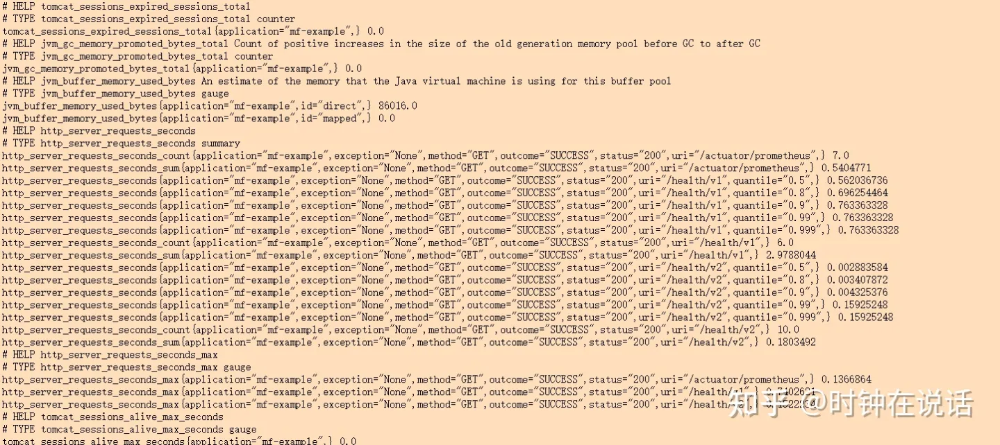

加入TimedAspect后的指标数据统计情况，可以看到同时记录了method_timed_seconds和http_server_requests_seconds两种名称的指标数据。并且这两种统计方式显示的接口耗时有一定误差，从执行流程上来看，使用TimedAspect方式计算耗时更接近方法本身逻辑执行占用时间

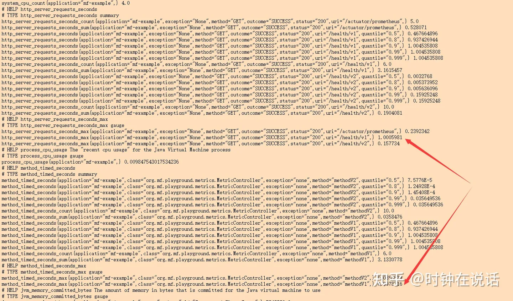