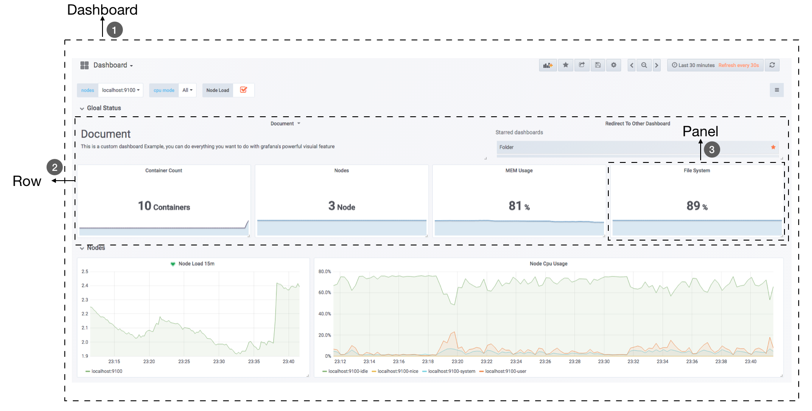
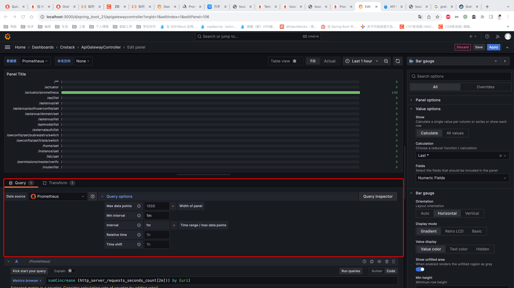
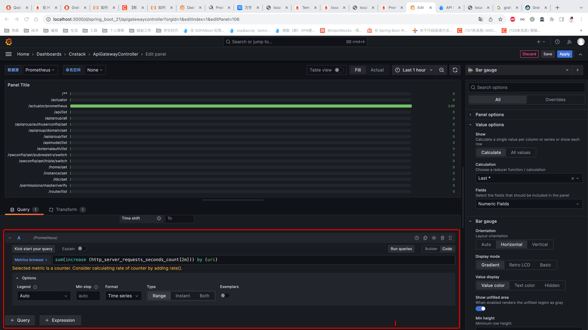
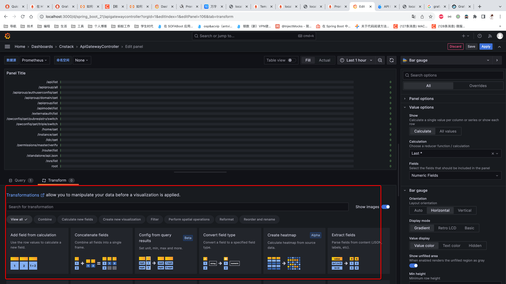
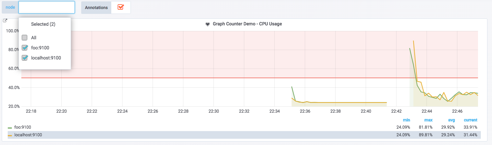

## 1 基本概念

### 数据源（Data Source）
对于Grafana而言，Prometheus这类为其提供数据的对象均称为数据源（Data Source）。目前，Grafana官方提供了对：Graphite, InfluxDB, OpenTSDB, Prometheus, Elasticsearch, CloudWatch的支持。

### 仪表盘（Dashboard）
通过数据源定义好可视化的数据来源之后，对于用户而言最重要的事情就是实现数据的可视化。在Grafana中，我们通过Dashboard来组织和管理我们的数据可视化图表：

1. 在一个Dashboard中一个最基本的可视化单元为一个Panel（面板），Panel通过如趋势图，热力图的形式展示可视化数据。 
   1. 并且在Dashboard中每一个Panel是一个完全独立的部分，通过Panel的Query Editor（查询编辑器）我们可以为每一个Panel自己查询的数据源以及数据查询方式，例如，如果以Prometheus作为数据源，那在Query Editor中，我们实际上使用的是PromQL，而Panel则会负责从特定的Prometheus中查询出相应的数据，并且将其可视化。由于每个Panel是完全独立的，因此在一个Dashboard中，往往可能会包含来自多个Data Source的数据。
   2. Grafana通过插件的形式提供了多种Panel的实现，常用的如：Graph Panel，Heatmap Panel，SingleStat Panel以及Table Panel等。用户还可通过插件安装更多类型的Panel面板。
2. 除了Panel以外，在Dashboard页面中，我们还可以定义一个Row（行），来组织和管理一组相关的Panel。
3. Grafana还允许用户为Dashboard定义Templating variables（模板参数），从而实现可以与用户动态交互的Dashboard页面。

## 2 可操作界面

### Query数据查询

1. 编辑数据源。定义数据源的查询和计算时间间隔、采样比例等。

2. 定义数据列（可以添加多个不同的query表达式）

### Transformer转换
1. 对原有的数据进行组合转换显示。添加字段（相加、最大最小等）

### 其他

每种不同的面板，其他配置不同。一般有以下的基础配置
1. Legend 图例
   
## 模板化与Varible

### 变量

在Grafana中用户可以为Dashboard定义一组变量（Variables），变量一般包含一个到多个可选值。如下所示，Grafana通过将变量渲染为一个下拉框选项，从而使用户可以动态的改变变量的值：

用户需要指定变量的名称，后续用户就可以通过$variable_name的形式引用该变量。Grafana目前支持6种不同的变量类型，而能和Prometheus一起工作的主要包含以下5种类型：

