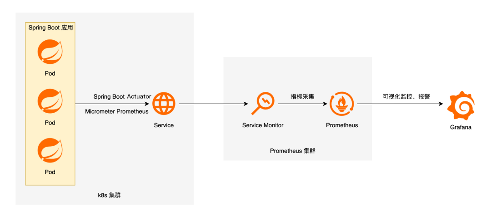
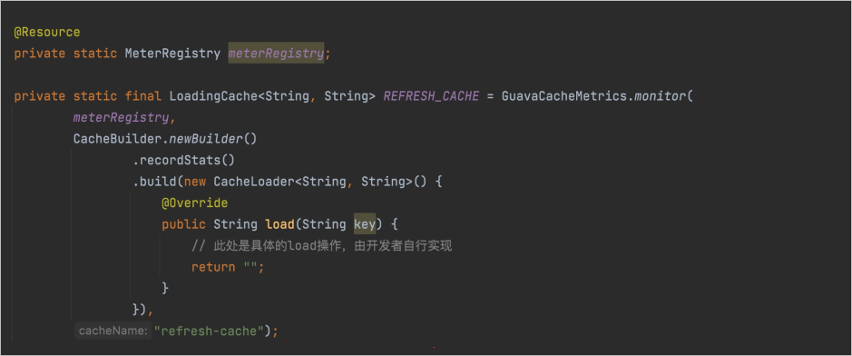
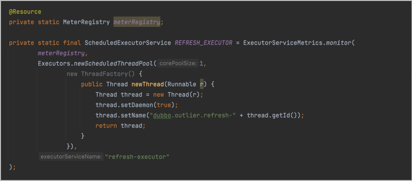

## SpringBoot如何接入Prometheus

> micrometer 是springboot项目的一个exporter

## 0 概述
### 背景介绍
* 收集监测数据。
  * 行业常见的收集监测数据方式主要分为推送（Push）和抓取（Pull）两个模式。以越来越广泛应用的Prometheus监测体系举例，可观测监控 Prometheus 版就是以抓取（Pull）模式运行的典型系统。应用及基础设施的监测数据以OpenMetrics标准接口的形式暴露给可观测监控 Prometheus 版，然后由可观测监控 Prometheus 版进行定期抓取并长期存储。
  * OpenMetrics，是云原生、高度可扩展的指标协议。 OpenMetrics定义了大规模上报云原生指标的事实标准，并支持文本表示协议和Protocol Buffers协议，文本表示协议在其中更为常见，也是在可观测监控 Prometheus 版进行数据抓取时默认采用的协议。
  * 指标的数据模型由指标（Metric）名，以及一组Key/Value标签（Label）定义的，具有相同的度量名称以及标签属于相同时序集合。例如acme_http_router_request_seconds_sum{path="/api/v1",method="GET"} 可以表示指标名为acme_http_router_request_seconds_sum，标签method值为POST的一次采样点数据。采样点内包含一个Float64值和一个毫秒级的UNIX时间戳。随着时间推移，这些收集起来的采样点数据将在图表上实时绘制动态变化的线条。
* 数据可视化及分析
  * 在获取应用或基础设施运行状态、资源使用情况，以及服务运行状态等直观信息后，通过查询和分析多类型、多维度信息能够方便的对节点进行跟踪和比较。同时，通过标准易用的可视化大盘去获知当前系统的运行状态。比较常见的解决方案就是Grafana，作为开源社区中目前热度很高的数据可视化解决方案，Grafana提供了丰富的图表形式与模板。在可观测监控 Prometheus 版中，也为您提供了基于Grafana全托管版的监测数据查询、分析及可视化。
* 及时的告警和应急管理
  * 当业务即将出现故障时，监测系统需要迅速反应并通知管理员，从而能够对问题进行快速的处理或者提前预防问题的发生，避免出现对业务的影响。当问题发生后，管理员需要对问题进行认领和处理。通过对不同监测指标以及历史数据的分析，能够找到并解决根源问题。


### 指标映射

Micrometer在将可观测监控 Prometheus 版指标对接到Java应用的指标。


* Micrometer中的Counter指标类型对应于可观测监控 Prometheus 版中的Counter指标类型，用来描述一个单调递增的变量。如某个接口的访问次数、缓存命中或者访问总次数等。Timer在逻辑上蕴含了Counter，即如果使用Timer采集每个接口的响应时间，必然也会采集访问次数。因此无需为某个接口同时指定Timer与Counter两个指标。计数器，单调递增场景。例如，统计PV和UV，接口调用次数等。

* MicroMeter中的Gauge指标类型对应于可观测监控 Prometheus 版中的Gauge指标类型，用来描述在一个范围内持续波动的变量。如CPU使用率、线程池任务队列数等。持续波动的变量。例如，资源使用率、系统负载、请求队列长度等。

* MicroMeter中的Timer指标类型对应于可观测监控 Prometheus 版中的Histogram，用来描述与时间相关的数据。如某个接口RT时间分布等。统计数据分布。例如，统计某接口调用延时的P50、P90、P99等。

* Micrometer中的DistributionSummary指标类型对应可观测监控 Prometheus 版中的Summary指标类型 ，与Histogram类似，Summary也是用于统计数据分布的，但由于数据的分布情况是在客户端计算完成后再传入可观测监控 Prometheus 版进行存储，因此Summary的结果无法在多个机器之间进行数据聚合，无法统计全局视图的数据分布，使用起来有一定局限性。统计数据分布，与Histogram用途类似。


### 接入流程



1. 首先，您需要在代码中引入Spring Boot Actuator相关Maven依赖，并对您需要监测的数据进行注册，或对Controller内的方法打上响应的注解。

2. 其次，您需要将埋点后的应用部署在Kubernetes中，并向可观测监控 Prometheus 版注册向应用拉取监测数据的端点（即可观测监控 Prometheus 版的服务发现）。阿里云Prometheus服务提供了使用ServiceMonitor CRD进行服务发现的方法。

3. 最后，在目标应用的监测采集端点被可观测监控 Prometheus 版成功发现后，您就可以在Grafana上配置数据源及相应的大盘。同时您也可以根据某些关键指标进行对应的告警配置。

### 最终目标

通过将部署在Kubernetes集群中的Spring Boot应用接入到可观测监控 Prometheus 版，希望能够实现以下几点目标：

* 监测系统的入口：Frontend服务是一个基于SpringMVC开发的入口应用，承接外部的客户流量，这里主要关注的是外部接口的关键RED指标。例如，调用率Rate、失败数Error、请求耗时Duration。
* 监测系统的关键链路：对后端服务critical path上的对象进行监测。例如，线程池的队列情况、进程内Guava Cache缓存的命中情况。
* 实现对业务强相关的自定义指标进行监测。例如，某个接口的UV等。
* 实现对JVM GC及内存使用情况进行监测。
* 实现对上述指标进行统一汇聚展示、以及配置关键指标的告警。


## 1 步骤一：代码埋点Exporter

### 引入依赖

```xml
执行如下代码段，引入Spring Boot Actuator的相关依赖。
<!-- spring-boot-actuator依赖 -->
<dependency>
    <groupId>org.springframework.boot</groupId>
    <artifactId>spring-boot-starter-actuator</artifactId>
</dependency>
<!-- prometheus依赖 -->
<dependency>
    <groupId>io.micrometer</groupId>
    <artifactId>micrometer-registry-prometheus</artifactId>
</dependency>
```


### 暴露端口
在application.properties中添加相关配置暴露监测数据端口。例如，端口为8091。
```properties
# application.properties添加以下配置用于暴露指标
spring.application.name=frontend

management.server.port=8091
management.endpoints.web.exposure.include=*
management.metrics.tags.application=${spring.application.name}
```

配置成功后，即可访问该应用的8091端口，然后您可以在该端口的/actuator/prometheus路径中获取OpenMetrics标准的监测数据。

### 接口改造
若要获取某个API接口的RED指标，您需要在对应的接口方法上打@Timed注解。这里以index页面接口为例打@Timed注解，如下代码段所示。


```java
@Timed(value = "main_page_request_duration", description = "Time taken to return main page", histogram = true)
@ApiOperation(value = "首页", tags = {"首页操作页面"})
@GetMapping("/")
public String index(Model model) {
    model.addAttribute("products", productDAO.getProductList());

    model.addAttribute("FRONTEND_APP_NAME", Application.APP_NAME);
    model.addAttribute("FRONTEND_SERVICE_TAG", Application.SERVICE_TAG);
    model.addAttribute("FRONTEND_IP", registration.getHost());

    model.addAttribute("PRODUCT_APP_NAME", PRODUCT_APP_NAME);
    model.addAttribute("PRODUCT_SERVICE_TAG", PRODUCT_SERVICE_TAG);
    model.addAttribute("PRODUCT_IP", PRODUCT_IP);

    model.addAttribute("new_version", StringUtils.isBlank(env));
    return "index.html";
}
```

### GuavaCache改造

1. 注入MeterRegistry，这里注入的具体实现是PrometheusMeterRegistry，由Spring Boot自行注入即可。
1. 使用工具类API包装本地缓存，即如下图中的GuavaCacheMetrics.monitor。
1. 开启缓存数据记录，即调用.recordStats()方法。
1. 为Cache对象命名，用于生成对应的指标。



### 线程池改造
1. 注入MeterRegistry，这里注入的具体实现是PrometheusMeterRegistry。
1. 使用工具类API包装线程池。
1. 为线程池命名，用于生成对应的指标。




### 业务监控

在开发过程中还会涉及许多业务强相关的自定义指标，为了监测这些指标，在往Bean中注入MeterRegistry后，您还需要按照需求和对应场景构造Counter、Gauge或Timer来进行数据统计，并将其注册到MeterRegistry进行指标暴露，示例如下。

```java
@Service
public class DemoService {

    Counter visitCounter;

    public DemoService(MeterRegistry registry) {
        visitCounter = Counter.builder("visit_counter")
            .description("Number of visits to the site")
            .register(registry);
    }

    public String visit() {
        visitCounter.increment();
        return "Hello World!";
    }    
}
```

## 2 数据上报

通过添加ServiceMonitor、PodMonitor配置可观测监控 Prometheus 版的采集规则

### serviceMonitor
ServiceMonitor的适用场景包括监控Kubernetes集群内的应用的业务数据，例如订单信息。


```yml
apiVersion: monitoring.coreos.com/v1
kind: ServiceMonitor
metadata:
  name: tomcat-demo     # 填写一个唯一名称。
  namespace: default    # 填写目标命名空间。
spec:
  endpoints:
  - interval: 30s
    port: tomcat-monitor    # 填写service.yaml中Prometheus Exporter对应的Port的Name字段的值。
    path: /metrics      # 填写Prometheus Exporter对应的Path的值。
  namespaceSelector:      # Nginx Demo的命名空间。
    any: true
  selector:
    matchLabels:
      #  填写service.yaml的Label字段的值以定位目标service.yaml。
      app: tomcat
```

### PodMonitor
```yaml
apiVersion: monitoring.coreos.com/v1
kind: PodMonitor
metadata:
  #  填写一个唯一名称
  name: podmonitor-demo
  #  填写目标命名空间
  namespace: default
#https://github.com/prometheus-operator/prometheus-operator/blob/master/Documentation/api.md#podmonitorspec
spec:
  selector:
    matchLabels:
    #  填写pod.yaml的Label字段的值以定位目标pod
      app: nginx2-exporter
  namespaceSelector:
    # https://github.com/prometheus-operator/prometheus-operator/blob/master/Documentation/api.md#namespaceselector
    any: true
  podMetricsEndpoints:
  - interval: 30s
    #  填写pod.yaml中Prometheus Exporter对应的Port的Name字段的值
    port: tomcat-monitor
    #  填写Prometheus Exporter对应的Path的值
    path: /metrics
```

### prometheus配置文件

```yaml
#just support scrape_configs configure,Configuring Multiple Jobs,yaml uses the list format.other configure can by setting prometheus.yaml
- job_name: prometheus
  metrics_path: /metric
  static_configs:
  - targets: 
    - 127.0.0.1:9090
- job_name: grafana_exporter
  scrape_interval: 30s
  scrape_timeout: 30s
  metrics_path: /metric
  static_configs:
  - targets:
    - 127.0.0.1:3000
```

## 3 看板可视化

应用的监测数据已成功收集并存储到可观测监控 Prometheus 版，因此您可以配置相应的大盘及告警来查看监控到的数据。这里，为您提供以下两个Grafana社区中的开源大盘模板来构建您自己的业务监测模板。

1. [springboot statistic](https://grafana.com/grafana/dashboards/10280?spm=a2c6h.12873639.article-detail.6.7c6941fdmzMdL2)
2. [JVM statistic](https://grafana.com/grafana/dashboards/4701?spm=a2c6h.12873639.article-detail.7.7c6941fdmzMdL2)

借助以上模板以及可观测监控 Prometheus 版内置的Grafana服务，您可以根据自己的需求，将日常开发和运维过程中需要重点关注的指标展示在同一个Grafana Dashboard页面上，创建属于您的个性化大盘，便于日常监测。例如，这里基于上述模板和自身业务构建了一个真实的大盘，包含总览、组件运行时间，内存使用率、堆内堆外内存、分代GC情况等。

