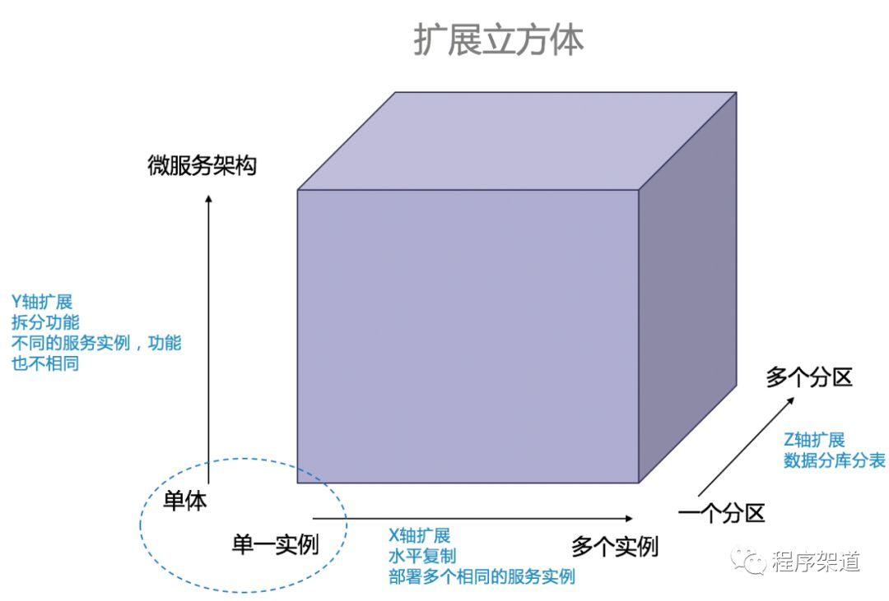

## 1 简单的几个问题

### 问题一：单体应用程序的典型结构？

对于一个外卖应用程序的核心是一系列领域业务模块，包括订单管理、支付系统、送餐系统等。领域对象，泛指一个系统中的一个特定业务。

通过若干适配器完成与外部系统的对接和交互工作。主要包括入站适配器，提供了对该系统的访问，包括 Web、Rest 等。还有出站适配器，适配不同的支付系统、数据库系统、消息系统、邮件服务。

### 问题二：单体架构的劣势？

开发变更、测试、部署、横向扩展都比较简单。

- 可读性。应用结构庞大复杂，很难被理解。
- 开发效率。增加一个功能，构建时间非常长、启动缓慢。影响开发效率。
- 可交付性。各个团队维护的模块相互影响，影响构建和部署。
- 可扩展性。不同模块对资源的需求是相互冲突的。有的模块需要计算资源、有的需要大量的存储资源。
- 可维护性。难以维护升级，升级基础依赖，意味着每个模块都需要单独适配。

### 问题三：微服务架构解决了哪些问题？

**软件架构对功能性需求影响不大**。在任何架构下甚至是一团糟的架构之上，你都可以实现一组用力。

**架构的重要性在与它影响了非功能性需求**，也被称为质量属性。提升了（可开发性）开发效率、可交付性（交付速度）、可扩展性、可维护性、可测试性。

不同阶段的非质量属性说明。敏捷开发着力提升各个阶段的效率。

- 设计阶段：可扩展性。开发功能上的扩展、运行过程中的扩展。
- 开发阶段：开发效率。编译运行速度加快
- 测试阶段：测试效率。
- 交付阶段：交付集成效率、部署效率。
- 维护阶段：可维护性
- 运行阶段：吞吐量和可用性

### 问题四：架构如何通过扩展立方体实现非功能性需求

1. X 轴扩展、水平复制。通过克隆实例的方式扩展。多个实例之间的负载均衡。
2. Y 轴扩展、功能拆分。垂直拆分，功能性分解，通过分解成不同的功能实现扩展。
3. Z 轴扩展、数据分区。通过分片键吧相似的数据分区。

X 轴和 Z 轴扩展能够有效提升系统的吞吐量和可用性。然而这两种方式都没有解决日益增长的开发问题和应用复杂性。Y 轴扩展通过功能性分解，把单体应用分解成了一组服务。服务可以在需要的时候借助 X 轴水平复制和 Z 轴数据分区进行扩展。

微服务概念：把应用程序功能性分解为一组服务的架构风格。微服务是一种支持 Y 轴功能拆分扩展的架构风格。

## 2 另一些关键问题

### 模块化的历程

 编译时隔离：
> 具备独立的命名空间，防止代码中的命名冲突，方便合作开发。

0. 命令脚本
1. 函数
2. 类
3. 包和模块（package/jar/lib/dll）

运行时隔离：

0. 框架上下文隔离（现成隔离，运行时对象隔离，可以解决对象冲突）
1. JVM隔离（sofaArk热部署/合并部署，虚拟机隔离，运行时类隔离，可以解决包类冲突。）
2. 面向服务SOA（进程隔离）
3. 微服务docker（进程隔离）