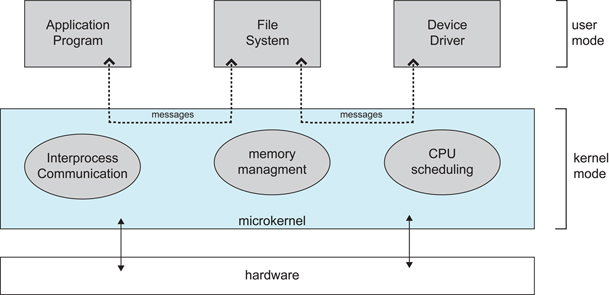

# 计算机组成

> 目录
> 1. 操作系统的目标和作用
> 2. 操作系统的发展过程
> 3. 操作系统的基本特性
> 4. 操作系统的主要功能
> 5. OS结构设计

## 1 操作系统的目标和作用

### 定义

* 操作系统（Operating System，OS）是计算机系统最基础的系统软件，管理软硬件资源、控制程序执行，改善人机界面，合理组织计算机工作流程，为用户使用计算机提供良好运行环境。

### 目标

### 作用

### 分类

1. 操作控制方式
   1. 多道批处理操作系统，脱机控制方式
   2. 分时操作系统，交互式控制方式
   3. 实时操作系统
2. 应用领域
    1. 服务器操作系统、并行操作系统
    2. 网络操作系统、分布式操作系统
    3. 个人机操作系统、手机操作系统
    4. 嵌入式操作系统、传感器操作系统

### 资源分类

1. 硬件资源
   1. 处理器资源：哪个程序占有处理器运行
   2. 内存资源：程序/数据在内存中如何分布
   3. 设备管理：如何分配、去配和使用设备
2. 信息资源
   1. 数据、程序
   2. 信息资源管理：如何访问文件信息
   3. 信号量资源：如何管理进程之间的通信

### 资源使用
3. 资源使用原则：屏蔽资源使用的底层细节
   1. 驱动程序：最底层的、直接控制和监视各类硬件资源。职责是隐藏底层硬件的具体细节，并向其他部分提供一个抽象的、通用的接口
4. 资源共享方式
   1. 独占使用方式
   2. 并发使用方式
5. 资源分配策略
   1. 静态分配方式
   2. 动态分配方式
   3. 资源抢占方式

## 2 基本特征

### 2.1 并发

* 并发是指宏观上在一段时间内能同时运行多个程序，而并行则指同一时刻能运行多个指令。

* 并行需要硬件支持，如多流水线、多核处理器或者分布式计算系统。

* 操作系统通过引入进程和线程，使得程序能够并发运行。

### 2.2 共享

* 共享是指系统中的资源可以被多个并发进程共同使用。

* 有两种共享方式：互斥共享和同时共享。

* 互斥共享的资源称为临界资源，例如打印机等，在同一时刻只允许一个进程访问，需要用同步机制来实现互斥访问。

### 2.3 虚拟

* 虚拟技术把一个物理实体转换为多个逻辑实体。

* 主要有两种虚拟技术：时（时间）分复用技术和空（空间）分复用技术。

* 多个进程能在同一个处理器上并发执行使用了时分复用技术，让每个进程轮流占用处理器，每次只执行一小个时间片并快速切换。

* 虚拟内存使用了空分复用技术，它将物理内存抽象为地址空间，每个进程都有各自的地址空间。地址空间的页被映射到物理内存，地址空间的页并不需要全部在物理内存中，当使用到一个没有在物理内存的页时，执行页面置换算法，将该页置换到内存中。

### 2.4 异步

* 异步指进程不是一次性执行完毕，而是走走停停，以不可知的速度向前推进。

## 3 基本功能

### 进程管理

* 进程控制、进程同步、进程通信、死锁处理、处理机调度等。

### 内存管理

* 内存分配、地址映射、内存保护与共享、虚拟内存等。

### 文件管理

* 文件存储空间的管理、目录管理、文件读写管理和保护等。

### 设备管理

* 完成用户的 I/O 请求，方便用户使用各种设备，并提高设备的利用率。
* 主要包括缓冲管理、设备分配、设备处理、虛拟设备等。

##  4 系统调用

### 定义

1. 如果一个进程在用户态需要使用内核态的功能，就进行系统调用从而陷入内核，由操作系统代为完成。
    1. 操作系统实现的完成某种特定功能的过程
    2. 为所有运行程序提供访问操作系统的接口
2. 系统调用实现
    1. 编写系统调用处理程序
    2. 设计一张系统调用入口地址表，每个入口地址指向一个系统调用的处理程序，并包含系统调用自带参数的个数
    3. 陷入处理机制需开辟现场保护区，以保存发生系统调用时的处理器现场

3. Linux 的系统调用主要有以下这些：

| Task | Commands |
| :---: | --- |
| 进程控制 | fork(); exit(); wait(); |
| 进程通信 | pipe(); shmget(); mmap(); |
| 文件操作 | open(); read(); write(); |
| 设备操作 | ioctl(); read(); write(); |
| 信息维护 | getpid(); alarm(); sleep(); |
| 安全 | chmod(); umask(); chown(); |

## 5 宏内核和微内核

### 宏内核

* 宏内核是将操作系统功能作为一个紧密结合的整体放到内核。由于各模块共享信息，因此有很高的性能。

### 微内核

* 由于操作系统不断复杂，因此将一部分操作系统功能移出内核，从而降低内核的复杂性。移出的部分根据分层的原则划分成若干服务，相互独立。

* 在微内核结构下，操作系统被划分成小的、定义良好的模块，只有微内核这一个模块运行在内核态，其余模块运行在用户态。

* 因为需要频繁地在用户态和核心态之间进行切换，所以会有一定的性能损失。

## 6 中断分类

### 外中断

* 由 CPU 执行指令以外的事件引起，如 I/O 完成中断，表示设备输入/输出处理已经完成，处理器能够发送下一个输入/输出请求。此外还有时钟中断、控制台中断等。

### 内中断

1. 异常中断。由 CPU 执行指令的内部事件引起，如非法操作码、地址越界、算术溢出等。
2. 陷入中断。在用户程序中使用**系统调用**。

## 7 硬件资源

### 中央处理器

1. 中央处理器（CPU）是计算机的运算核心（Core）和控制单元（Control Unit），主要包括：
    1. 运算逻辑部件：一个或多个运算器
    2. 寄存器部件：包括通用寄存器、控制与状态寄存器，以及高速缓冲存储器（Cache）
    3. 控制部件：实现各部件间联系的数据、控制及状态的内部总线；负责对指令译码、发出为完成每条指令所要执行操作的控制信号、实现数据传输等功能的部件
2. 处理器与寄存器
    1. 运算单元
    2. 控制单元
    3. 内部总线
    4. PC/IR/Flag（程序计数器/指令暂存器/标志寄存器）
    5. MAR/MDR（内存地址寄存器MAR/内存数据寄存器MDR）
    6. 寄存器
    7. Cache
    8. IOAR/IODR

### 主存储器

1. 存储器的组织层次（由上到下，容量更大、速度更慢、价格更低，单位都是字节）
    1. L0：寄存器
    2. L1：L1 Cache（SRAM，静态随机存储器）
    3. L2：L2 Cache（SRAM）
    4. L3：L3 Cache（SRAM）
    5. L4：主存（DRAM，动态随机存储器）
    6. L5：SSD（本地固态硬盘）
    7. L6：本地外存储器（本地硬盘）
    8. L7：远程外存储器（分布式文件系统、Web服务器）

### 外围设备

1. 类型
    1. 输入设备
    2. 输出设备
    3. 存储设备
    4. 网络通信设备
2. 控制方式
    1. 轮询方式：CPU忙式控制+数据交换
    2. 中断方式：CPU启动/中断+数据交换
    3. DMA方式：CPU启动/中断，DMA数据交换

### 总线
1. 定义及其组成
    1. 总线（Bus）是计算机各种功能部件之间传送信息的公共通信干线，它是CPU、内存、输入输出设备传递信息的公用通道
    2. 计算机的各个部件通过总线相连接，外围设备通过相应的接口电路再与总线相连接，从而形成了计算机硬件系统
    3. 按照所传输的信息种类，总线包括一组控制线，一组数据线和一组地址线
2. 类型
    1. 内部总线：用于CPU芯片内部连接各元件
    2. 系统总线：用于连接CPU、存储器和各种I/O模块等主要部件
    3. 通信总线：用于计算机系统之间的通信

## 8 软件资源

1. 系统软件：操作系统、实用程序、语言处理程序、数据库管理系统
    1. 操作系统实施对各种软硬件资源的管理控制
    2. 实用程序为方便用户所设，如文本编辑等
    3. 语言处理程序把汇编语言/高级语言编写的程序，翻译成可执行的机器语言程序
2. 支撑软件的有接口软件、工具软件、环境数据库
3. 支持用户使用计算机的环境，提供开发工具也可以认为是系统软件的一部分
4. 应用软件是用户按其需要自行编写的专用程序
