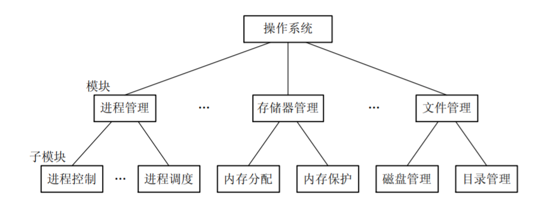
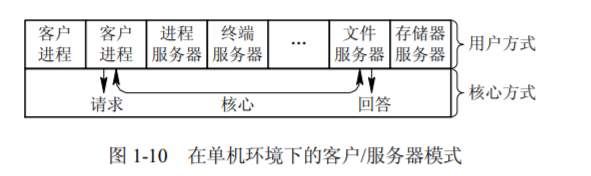
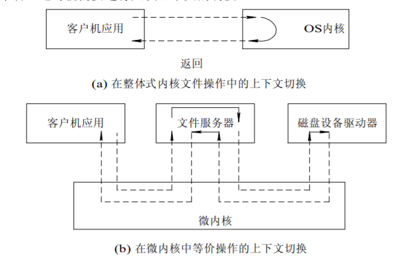

# 计算机组成

> 目录
> 1. 操作系统的目标和作用
> 2. 操作系统的发展过程
> 3. 操作系统的基本特性
> 4. 操作系统的主要功能
> 5. OS结构设计

## 1 操作系统的目标和作用

### 定义

* 操作系统（Operating System，OS）是计算机系统最基础的系统软件，管理软硬件资源、控制程序执行，改善人机界面，合理组织计算机工作流程，为用户使用计算机提供良好运行环境。

### 目标
* 有效性。提高系统资源利用率，提高系统吞吐量。
* 方便性
* 可扩充性
* 开放性

### 作用

* OS 作为用户与计算机硬件系统之间的接口。有三种接口方式：命令方式、系统调用方式、图形窗口方式。
* OS 作为计算机系统资源的管理者。资源主要包括：处理器、存储器、设备以及信息(数据和程序)等资源。
* OS 实现了对计算机资源的抽象。

## 2 操作系统的发展过程

### OS发展
1. 单道批处理系统。自动性、顺序性、单道性。
1. 多道批处理操作系统，脱机控制方式。资源利用率高，系统吞吐量大，平均运转周期长，无交互能力。
2. 分时操作系统，交互式控制方式。人机交互，共享主机。
3. 实时操作系统
### OS分类

* 根据应用领域可以分为
  1. 服务器操作系统、并行操作系统
  2. 网络操作系统、分布式操作系统
  3. 个人机操作系统、手机操作系统
  4. 嵌入式操作系统、传感器操作系统

## 3 基本特征

### 3.1 并发性

* 并发是指宏观上在一段时间内能同时运行多个程序，而并行则指同一时刻能运行多个指令。

* 并行需要硬件支持，如多流水线、多核处理器或者分布式计算系统。

* 操作系统通过引入进程和线程，使得程序能够并发运行。

### 3.2 共享性

* 共享是指系统中的资源可以被多个并发进程共同使用。
* 主要由两种共享方式：互斥共享和同步共享
  * **互斥共享**。互斥共享的资源称为临界资源，例如打印机等，在同一时刻只允许一个进程访问，需要用同步机制来实现互斥访问。
  * **同时共享**。允许在一段时间内由多个进程“同时”对它们进行访问

### 3.3 虚拟性

* 虚拟技术把一个物理实体转换为多个逻辑实体。

* 主要有两种虚拟技术：时（时间）分复用技术和空（空间）分复用技术。
  * **时分复用技术**：多个进程能在同一个处理器上并发执行使用了时分复用技术，让每个进程轮流占用处理器，每次只执行一小个时间片并快速切换。

  * **空分复用技术**：虚拟内存使用了空分复用技术，它将物理内存抽象为地址空间，每个进程都有各自的地址空间。地址空间的页被映射到物理内存，地址空间的页并不需要全部在物理内存中，当使用到一个没有在物理内存的页时，执行页面置换算法，将该页置换到内存中。

### 2.4 异步性

* 异步指进程不是一次性执行完毕，而是走走停停，以不可知的速度向前推进。

## 4 基本功能

### 4.1 进程管理功能（属于处理机管理的一部分）

* 进程控制、进程同步、进程通信
### 4.2 处理机管理功能

* 死锁处理、处理机调度（作业调度和进程调度）等。

### 4.3 存储器管理功能

* 内存分配、地址映射、内存保护与共享、虚拟内存等。

### 4.4 设备管理功能

* 完成用户的 I/O 请求，方便用户使用各种设备，并提高设备的利用率。
* 主要包括缓冲管理、设备分配、设备处理、虛拟设备等。

### 4.5 文件管理功能

* 文件存储空间的管理、目录管理、文件读写管理和保护等。

### 4.6 接口功能

* 提供给用户的接口
  * 图形界面
  * 命令行接口
* 提供给程序的接口
  * 系统调用接口

## 5 OS结构设计

### 传统操作系统结构
* 无结构OS
* 模块化结构OS。高内聚低耦合。

* 分层式结构OS。易于保证正确性。易于维护。
### 客户端服务器模式

* 组成：客户端、服务器、网络系统
* 流程：客户端发送消息、服务器接收消息、服务器会送消息、客户端接收消息。
* 优缺点：数据分布式存储和处理、便于集中管理、灵活性和可扩充性、易于改变应用软件。

### 面向对象程序设计

* 关键概念：对象、对象类、继承
* 优缺点：重用提高代码复用率、易修改性和易扩展性、易于保证可靠性和正确性。

### 宏内核与微内核OS结构

* 宏内核概念：宏内核是将操作系统功能作为一个紧密结合的整体放到内核。由于各模块共享信息，因此有很高的性能。
* 微内核概念：由于操作系统不断复杂，因此将一部分操作系统功能移出内核，从而降低内核的复杂性。移出的部分根据分层的原则划分成若干服务，相互独立。在微内核结构下，操作系统被划分成小的、定义良好的模块，只有微内核这一个模块运行在内核态，其余模块运行在用户态。
* 微内核特点：足够小的内核、基于客户服务器模式、应用“机制与策略分离”的原理、采用面向对象技术。
* 微内核优缺点：可扩展性、可靠性、可移植性、分布式系统支持、面向对象技术、频繁地在用户态和核心态之间进行切换造成性能损失。

## 6 操作系统的资源
### 资源分类

1. 硬件资源
   1. 处理器资源：哪个程序占有处理器运行
   2. 内存资源：程序/数据在内存中如何分布
   3. 设备管理：如何分配、去配和使用设备
2. 信息资源
   1. 数据、程序
   2. 信息资源管理：如何访问文件信息
   3. 信号量资源：如何管理进程之间的通信

### 资源使用
3. 资源使用原则：屏蔽资源使用的底层细节
   1. 驱动程序：最底层的、直接控制和监视各类硬件资源。职责是隐藏底层硬件的具体细节，并向其他部分提供一个抽象的、通用的接口
4. 资源共享方式
   1. 独占使用方式
   2. 并发使用方式
5. 资源分配策略
   1. 静态分配方式
   2. 动态分配方式
   3. 资源抢占方式

## 7 硬件资源

### 处理器资源

1. 中央处理器（CPU）是计算机的运算核心（Core）和控制单元（Control Unit），主要包括：
    1. 运算逻辑部件：一个或多个运算器
    2. 寄存器部件：包括通用寄存器、控制与状态寄存器，以及高速缓冲存储器（Cache）
    3. 控制部件：实现各部件间联系的数据、控制及状态的内部总线；负责对指令译码、发出为完成每条指令所要执行操作的控制信号、实现数据传输等功能的部件
2. 处理器与寄存器
    1. 运算单元
    2. 控制单元
    3. 内部总线
    4. PC/IR/Flag（程序计数器/指令暂存器/标志寄存器）
    5. MAR/MDR（内存地址寄存器MAR/内存数据寄存器MDR）
    6. 寄存器
    7. Cache
    8. IOAR/IODR

### 存储器资源

1. 存储器的组织层次（由上到下，容量更大、速度更慢、价格更低，单位都是字节）
    1. L0：寄存器
    2. L1：L1 Cache（SRAM，静态随机存储器）
    3. L2：L2 Cache（SRAM）
    4. L3：L3 Cache（SRAM）
    5. L4：主存（DRAM，动态随机存储器）
    6. L5：SSD（本地固态硬盘）
    7. L6：本地外存储器（本地硬盘）
    8. L7：远程外存储器（分布式文件系统、Web服务器）

### IO设备资源

1. 类型
    1. 输入设备
    2. 输出设备
    3. 存储设备
    4. 网络通信设备
2. 控制方式
    1. 轮询方式：CPU忙式控制+数据交换
    2. 中断方式：CPU启动/中断+数据交换
    3. DMA方式：CPU启动/中断，DMA数据交换

### 总线
1. 定义及其组成
    1. 总线（Bus）是计算机各种功能部件之间传送信息的公共通信干线，它是CPU、内存、输入输出设备传递信息的公用通道
    2. 计算机的各个部件通过总线相连接，外围设备通过相应的接口电路再与总线相连接，从而形成了计算机硬件系统
    3. 按照所传输的信息种类，总线包括一组控制线，一组数据线和一组地址线
2. 类型
    1. 内部总线：用于CPU芯片内部连接各元件
    2. 系统总线：用于连接CPU、存储器和各种I/O模块等主要部件
    3. 通信总线：用于计算机系统之间的通信

## 8 软件资源

1. 系统软件：操作系统、实用程序、语言处理程序、数据库管理系统
    1. 操作系统实施对各种软硬件资源的管理控制
    2. 实用程序为方便用户所设，如文本编辑等
    3. 语言处理程序把汇编语言/高级语言编写的程序，翻译成可执行的机器语言程序
2. 支撑软件的有接口软件、工具软件、环境数据库
3. 支持用户使用计算机的环境，提供开发工具也可以认为是系统软件的一部分
4. 应用软件是用户按其需要自行编写的专用程序
