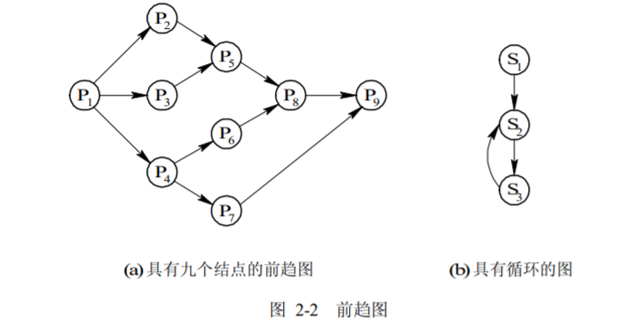
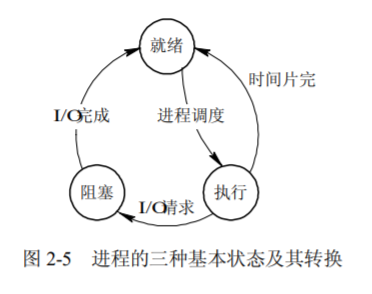
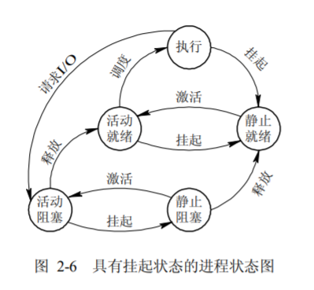
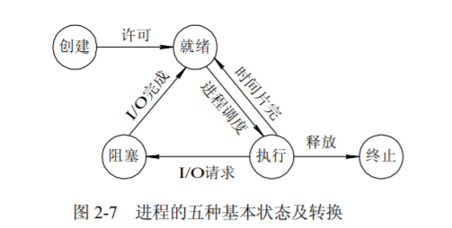
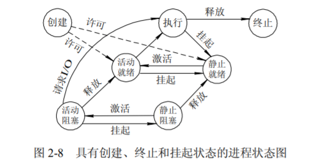
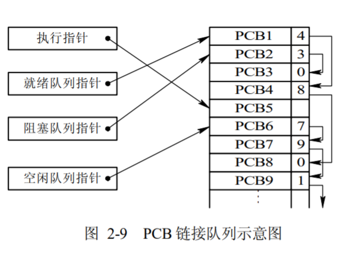
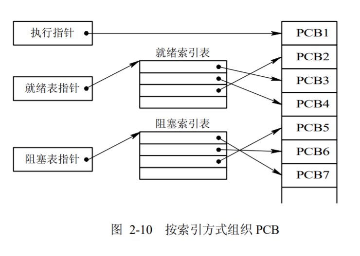

# 2.1 进程的基本概念

> 关系概述
> * 程序不能独立运行。只能作为进程执行。程序是静态的，进程是动态的。
> * 程序有两种执行方式：程序的顺序执行和程序的并发执行。并发执行通过多进程实现。

## 1 程序的顺序执行

### 程序顺序执行时的特征

1. 顺序性。严格按照程序规定的特征执行
2. 封闭性。程序运行时独占全机资源。程序一旦开始，其结果不受外界影响。
3. 可再现性。只要程序运行的环境和初始条件相同，结果相同

## 2 前驱图

### 定义

* 前趋图(Precedence Graph)是一个有向无环图，记为 DAG(Directed Acyclic Graph)，用于描述进程之间执行的前后关系。图中的每个结点可用于描述一个程序段或进程，乃至一条语句；结点间的有向边则用于表示两个结点之间存在的偏序(Partial Order，亦称偏序关系)或前趋关系(Precedence Relation)“→”。

## 3 程序的并发执行

### 定义
* 程序并发执行的前驱图表示
  

### 程序并发执行时的特征

1. 间断性。执行-暂停-执行，间断性活动。
2. 失去封闭性。多个程序共享系统中的各个资源。
3. 不可再现性。其计算结果与并发执行的进程有关。相互影响。

## 4 进程的定义和特征

### 进程的定义
* 操作系统用来实现程序并发执行的实体。
* 作为操作系统**资源分配**和**独立运行**的基本单位。

### 进程的特征

* 结构特征：由程序段、数据段和 PCB 三部分便构成了进程实体。
* 动态性：进程的实质是进程实体的一次执行过程，包含创建、调度、撤销。进程具有一定的声明周期。程序是一组指令的集合，是静态的。
* 并发性：这是指多个进程实体同存于内存中，且能在一段时间内同时运行。
* 独立性：独立性是指进程实体是一个能独立运行、独立分配资源和独立接受调度的基本单位。
* 异步性：这是指进程按各自独立的、 不可预知的速度向前推进，或说进程实体按异步方式运行。

### 进程的构成

1. （OS管理程序的）数据结构PCP
2. （运行程序的）内存代码段Code
3. （运行程序的）内存数据段Data
4. （运行程序的）通用寄存器信息Register
5. （OS控制程序的）程序状态字信息PSW

## 5 进程的状态
### 就绪状态、执行状态、阻塞状态
1. 就绪(Ready)状态：当进程已分配到除 CPU 以外的所有必要资源后，只要再获得 CPU，便可立即执行，进程这时的状态称为就绪状态。就绪队列管理就绪状态的进程。
2. 执行状态：进程已获得 CPU，其程序正在执行。在单处理机系统中，只有一个进程处于执行状态；在多处理机系统中，则有多个进程处于执行状态。
3. 阻塞状态：正在执行的进程由于发生某事件而暂时无法继续执行时，放弃处理机而处于暂停状态，把这种暂停状态称为阻塞状态。

### 3态模型的转换

1. 运行态→等待态：等待资源、I/O、信号
2. 等待态→就绪态：资源满足、I/O结束、信号完成
3. 就绪态→运行态；处理器空闲时选择更高优先权进程抢占
4. 运行态→就绪态：运行时间片刻、有更高优先权进程

### 挂起状态

*  由于终端用户的请求、父进程请求、负荷调节的需要、操作系统的需要。程序需要暂时挂起。不再接受操作系统的调度。

### 5态模型的转换（挂起）

1. 活动就绪→静止就绪。当进程处于未被挂起的就绪状态时，称此为活动就绪状态，表示为 Readya。当用挂起原语 Suspend 将该进程挂起后，该进程便转变为静止就绪状态，表示为 Readys，处于 Readys 状态的进程不再被调度执行。
2. 活动阻塞→静止阻塞。当进程处于未被挂起的阻塞状态时，称它是处于活动阻塞状态，表示为 Blockeda。当用 Suspend 原语将它挂起后，进程便转变为静止阻塞状态，表示为Blockeds。
3. 静止就绪→活动就绪。处于 Readys 状态的进程，若用激活原语 Active 激活后，该进程将转变为 Readya 状态。
4. 静止阻塞→活动阻塞。处于 Blockeds 状态的进程，若用激活原语 Active 激活后，该进程将转变为 Blockeda 状态。

### 创建状态、终止状态

1. 创建状态：创建一个进程一般要通过两个步骤：首先，为一个新进程创建 PCB，并填写必要的管理信息；其次，把该进程转入就绪状态并插入就绪队列之中。
2. 终止状态；进程的终止也要通过两个步骤：首先等待操作系统进行善后处理；然后将其 PCB 清零，并将 PCB 空间返还系统。

### 5态模型的转换（创建、终止）

### 7态模型的转换

## 6 进程控制块

### 进程控制块定义
* PCB（Process Control Block）记录了操作系统所需的、用于描述进程的当前情况以及控制进程运行的全部信息。
* OS用于管理进程物理实体，刻画进程的执行现状，控制进程的执行。

### 进程控制块信息
* 进程标识信息（用于唯一的标识进程）
  1. 系统进程标识符（操作系统分配的进程标识符）
  2. 用户进程标识符（用户自定义的进程名、进程组名）
* 进程状态信息（用于存放该进程运行时的处理器现场信息）
  1. 寄存器内容
     1. 用户可见寄存器内容：数据寄存器、地址寄存器
     2. 控制与状态寄存器内容：程序计数器PC、指令寄存器IR、程序状态字PSW
  2. 核心栈与用户栈指针内容

* 进程控制信息：用于存放与管理、调度进程相关的信息
  1. 进程组成信息：代码/数据地址、外存映像地址
  2. 进程通信信息：消息队列、信号量、锁
  3. 进程权限信息：内存访问权限、处理器特权
  4. 处理器使用信息：占用的处理器、时间片、处理器使用事件/已执行总时间、记账信息
  5. 资源清单信息：正占用的资源、已使用的资源

* 进程调度信息
  1. 进程状态，指明进程的当前状态，作为进程调度和对换时的依据；
  2. 进程优先级，用于描述进程使用处理机的优先级别的一个整数，优先级高的进程应优先获得处理机；
  3. 进程调度所需的其它信息，它们与所采用的进程调度算法有关，比如，进程已等待 CPU 的时间总和、进程已执行的时间总和等；
  4. 事件，指进程由执行状态转变为阻塞状态所等待发生的事件，即阻塞原因。

### 进程控制块的组织方式

1. 链接方式这是把具有同一状态的 PCB，用其中的链接字链接成一个队列。这样，可以形成就绪队列、若干个阻塞队列和空白队列等。

2.  索引方式系统根据所有进程的状态建立几张索引表。例如，就绪索引表、阻塞索引表等。
