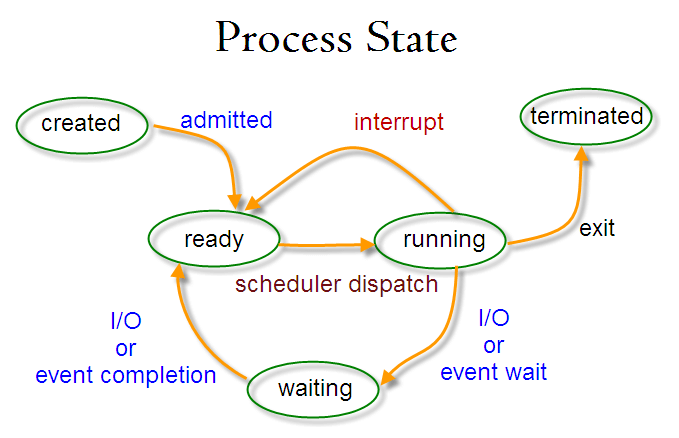
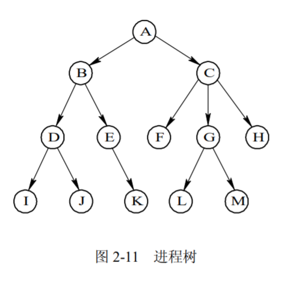

# 2.2 进程控制

> 上一节主要从状态的角度介绍了静态的状态有哪些。这一节朱啊哟介绍状态之间如何切换，引起切换的原因，和切换的步骤。
> 7中状态主要包括创建、终止、就绪、阻塞、执行、静态阻塞、静态就绪。
> 状态转换主要包括：创建、终止（释放）、阻塞、唤醒、调度、挂起、激活。

## 1 进程的创建

### 进程创建示意图

* 进程图是用于描述一个进程的家族关系的有向树。为了标识进程之间的家族关系，在 PCB 中都设置了家族关系表项，以标明自己的父进程及所有的子进程。

### 引起进程创建的事件

* 用户登录
* 作业调度
* 提供服务
* 应用请求

### 进程创建过程

1. 申请空白的PCB。获得操作系统唯一的表示信息。
2. 为进程分配资源。程序和数据以及用户栈分配必要的内存空间。
3. 初始化进程控制块。包括标识信息、处理机状态信息、处理机控制信息。
4. 将新进程插入就绪队列。

## 2 进程的终止

### 引起进程终止的事件

* 正常结束。一个用于表示进程已经运行完成的指示，产生一个中断，去通知 OS 进程已运行完毕。
* 异常结束。在进程运行期间，由于出现某些错误和故障而迫使进程终止：越界、非法访问。
* 外界干预。指进程应外界的请求而终止运行。

### 进程终止过程

1. 根据被终止进程的标识符，从 PCB 集合中检索出该进程的 PCB，从中读出该进程的状态。
2. 若被终止进程正处于执行状态，应立即终止该进程的执行，并置调度标志为真，用于指示该进程被终止后应重新进行调度。
3. 若该进程还有子孙进程，还应将其所有子孙进程予以终止，以防它们成为不可控的进程。
4. 将被终止进程所拥有的全部资源，或者归还给其父进程，或者归还给系统。
5. 将被终止进程(PCB)从所在队列(或链表)中移出，等待其他程序来搜集信息。

## 3 进程的阻塞与唤醒

### 引起进程阻塞与唤醒的事件

* 请求系统服务。
* 资源未被满足。
* 没有任务可做。

### 进程阻塞过程

1. 进程无法继续执行，于是进程便通过调用阻塞原语 block 把自己阻塞。可见，进程的阻塞是进程自身的一种主动行为。
2. 把进程控制块中的现行状态由“执行”改为“阻塞”，并将 PCB 插入阻塞队列。

### 进程唤醒过程

1. 当被阻塞进程所期待的事件出现时，如 I/O 完成或其所期待的数据已经到达，则由有关进程(比如用完并释放了该 I/O 设备的进程)调用唤醒原语 wakeup( )，将等待该事件的进程唤醒。
2. 将其PCB 中的现行状态由阻塞改为就绪，然后再将该 PCB 插入到就绪队列中。

## 4 进程的挂起与激活

### 引起进程挂起和激活的原因

* 用户进程请求将自己挂起，或父进程请求将自己的某个子进程挂起，系统将利用挂起原语 suspend( )将指定进程或处于阻塞状态的进程挂起。
* 当发生激活进程的事件时，系统将利用激活原语 active( )将指定进程激活。

### 进程挂起的过程

1. 首先检查被挂起进程的状态，若处于活动就绪状态，便将其改为静止就绪； 对于活动阻塞状态的进程，则将之改为静止阻塞。为
2. 了方便用户或父进程考查该进程的运行情况而把该进程的 PCB 复制到某指定的内存区域。
3. 最后，若被挂起的进程正在执行，则转向调度程序重新调度

### 进程激活的过程
1. 激活原语先将进程从外存调入内存，检查该进程的现行状态，若是静止就绪，便将之改为活动就绪；若为静止阻塞，便将之改为活动阻塞。

## 5 注意事项

- 只有就绪态和运行态可以相互转换，其它的都是单向转换。就绪状态的进程通过调度算法从而获得 CPU 时间，转为运行状态；而运行状态的进程，在分配给它的 CPU 时间片用完之后就会转为就绪状态，等待下一次调度。
- 阻塞状态是缺少需要的资源从而由运行状态转换而来，但是该资源不包括 CPU 时间，缺少 CPU 时间会从运行态转换为就绪态。

