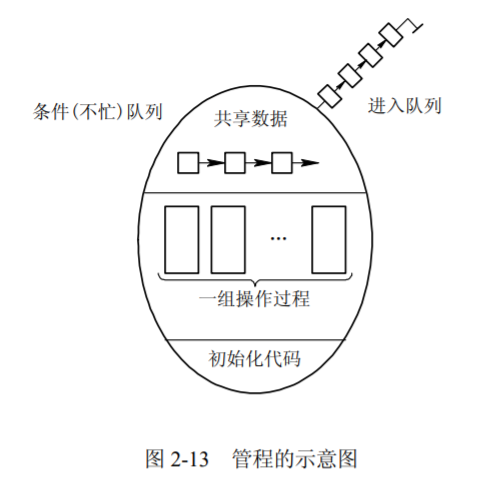
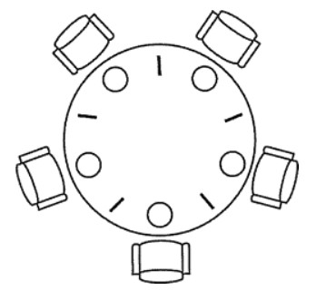

## 2.3 进程同步

## 1 进程同步的基本概念
> 进程同步指的是同步和互斥两种行为。
### 两种制约关系
> 针对两种制约关系，合作制约关系和互斥制约关系，需要通过同步机制实现。

- 直接制约关系（合作/同步）。由于多个进程相互合作产生，使得进程有一定的先后执行关系。
- 间接制约关系（互斥）。由于多个进程资源共享产生，多个进程在同一时刻只有一个进程能进入临界区。

### 临界资源和临界区
* 共享的互斥资源称为**临界资源**。
* 对临界资源进行访问的那段代码称为**临界区**。
* 为了互斥访问临界资源，每个进程在进入临界区之前，需要先进行检查。

```
repeat
    entry section
        critical section;//临界区
    exit section
until false
```
### 同步机制的规则

1. **空闲让进**。当无进程处于临界区时，表明临界资源处于空闲状态，应允许一个请求进入临界区的进程立即进入自己的临界区，以有效地利用临界资源。
2. **忙则等待**。当已有进程进入临界区时，表明临界资源正在被访问，因而其它试图进入临界区的进程必须等待，以保证对临界资源的互斥访问。
3. **有限等待**。对要求访问临界资源的进程，应保证在有限时间内能进入自己的临界区，以免陷入“死等”状态。
4. **让权等待**。当进程不能进入自己的临界区时，应立即释放处理机，以免进程陷入“忙等”状态。

## 2 信号量机制

### 信号量

* 信号量（Semaphore）是一个整型变量，可以对其执行 down 和 up 操作，也就是常见的 P 和 V 操作。
  - **down/wait** ：如果信号量大于 0 ，执行 -1 操作；如果信号量等于 0，进程睡眠，等待信号量大于 0；
  - **up/signal** ：对信号量执行 +1 操作，唤醒睡眠的进程让其完成 down 操作。

* down 和 up 操作需要被设计成原语，不可分割，通常的做法是在执行这些操作的时候屏蔽中断。

* 如果信号量的取值只能为 0 或者 1，那么就成为了 **互斥量（Mutex）**  ，0 表示临界区已经加锁，1 表示临界区解锁。

```c
typedef int semaphore;
semaphore mutex = 1;
void P1() {
    down(&mutex);
    // 临界区
    up(&mutex);
}

void P2() {
    down(&mutex);
    // 临界区
    up(&mutex);
}
```

## 3 管程
### 管程定义
* 使用信号量机制实现同步机制，使大量的同步操作分散在各个进程中。这不仅给系统的管理带来了麻烦，而且还会因同步操作的使用不当而导致系统死锁。而管程把控制的代码独立出来，不仅不容易出错，也使得客户端代码调用更容易。
* 利用共享数据结构抽象地表示系统中的共享资源，而把对该共享数据结构实施的操作定义为一组过程，如资源的请求和释放过程 request 和 release。进程对共享资源的申请、释放和其它操作，都是通过这组过程对共享数据结构的操作来实现的，这组过程还可以根据资源的情况，或接受或阻塞进程的访问，确保每次仅有一个进程使用共享资源，这样就可以统一管理对共享资源的所有访问，实现进程互斥。

### 管程组成
* 管程的名称；
* 局部于管程内部的共享数据结构说明；
* 对该数据结构进行操作的一组过程；
* 对局部于管程内部的共享数据设置初始值的语句。


### 管程实现


* 管程有一个重要特性：在一个时刻只能有一个进程使用管程。进程在无法继续执行的时候不能一直占用管程，否则其它进程永远不能使用管程。

* 管程引入了条件变量**condition**以及相关的操作**wait()** 和 **signal()** 来实现同步操作。对条件变量执行 wait() 操作会导致调用进程阻塞，把管程让出来给另一个进程持有。signal() 操作用于唤醒被阻塞的进程。


* c 语言不支持管程，下面的示例代码使用了类 Pascal 语言来描述管程。示例代码的管程提供了 insert() 和 remove() 方法，客户端代码通过调用这两个方法来解决生产者-消费者问题。

```pascal
monitor ProducerConsumer
    integer i;
    condition c;

    procedure insert();
    begin
        // ...
    end;

    procedure remove();
    begin
        // ...
    end;
end monitor;
```


### 管程与线程对比

1. 虽然二者都定义了数据结构，但进程定义的是私有数据结构 PCB，管程定义的是公共数据结构，如消息队列等；
2. 二者都存在对各自数据结构上的操作，但进程是由顺序程序执行有关的操作，而管程主要是进行同步操作和初始化操作；
3. 设置进程的目的在于实现系统的并发性，而管程的设置则是解决共享资源的互斥使用问题；
4. 进程通过调用管程中的过程对共享数据结构实行操作，该过程就如通常的子程序一样被调用，因而管程为被动工作方式，进程则为主动工作方式；
5. 进程之间能并发执行，而管程则不能与其调用者并发；
6. 进程具有动态性，由“创建”而诞生，由“撤销”而消亡，而管程则是操作系统中的一个资源管理模块，供进程调用。


### 使用管程实现生产者-消费者问题

```pascal
// 管程
monitor ProducerConsumer
    condition full, empty;
    integer count := 0;
    condition c;

    procedure insert(item: integer);
    begin
        if count = N then wait(full);
        insert_item(item);
        count := count + 1;
        if count = 1 then signal(empty);
    end;

    function remove: integer;
    begin
        if count = 0 then wait(empty);
        remove = remove_item;
        count := count - 1;
        if count = N -1 then signal(full);
    end;
end monitor;

// 生产者客户端
procedure producer
begin
    while true do
    begin
        item = produce_item;
        ProducerConsumer.insert(item);
    end
end;

// 消费者客户端
procedure consumer
begin
    while true do
    begin
        item = ProducerConsumer.remove;
        consume_item(item);
    end
end;
```

## 5.1 经典同步问题——生产者消费者问题

### 问题描述

* 使用一个缓冲区来保存物品，只有缓冲区没有满，生产者才可以放入物品；只有缓冲区不为空，消费者才可以拿走物品。

### 问题分析
* 因为缓冲区属于临界资源，因此需要使用一个互斥量 mutex 来控制对缓冲区的互斥访问。

* 为了同步生产者和消费者的行为，需要记录缓冲区中物品的数量。数量可以使用信号量来进行统计，这里需要使用两个信号量：empty 记录空缓冲区的数量，full 记录满缓冲区的数量。其中，empty 信号量是在生产者进程中使用，当 empty 不为 0 时，生产者才可以放入物品；full 信号量是在消费者进程中使用，当 full 信号量不为 0 时，消费者才可以取走物品。

* 注意，不能先对缓冲区进行加锁，再测试信号量。也就是说，不能先执行 down(mutex) 再执行 down(empty)。如果这么做了，那么可能会出现这种情况：生产者对缓冲区加锁后，执行 down(empty) 操作，发现 empty = 0，此时生产者睡眠。消费者不能进入临界区，因为生产者对缓冲区加锁了，消费者就无法执行 up(empty) 操作，empty 永远都为 0，导致生产者永远等待下，不会释放锁，消费者因此也会永远等待下去。

### 算法实现
```c
#define N 100
typedef int semaphore;
semaphore mutex = 1;
semaphore empty = N;
semaphore full = 0;

void producer() {
    while(TRUE) {
        int item = produce_item();
        down(&empty);
        down(&mutex);
        insert_item(item);
        up(&mutex);
        up(&full);
    }
}

void consumer() {
    while(TRUE) {
        down(&full);
        down(&mutex);
        int item = remove_item();
        consume_item(item);
        up(&mutex);
        up(&empty);
    }
}
```

## 5.2 经典同步问题——哲学家进餐问题

### 问题描述

* 五个哲学家围着一张圆桌，每个哲学家面前放着食物。哲学家的生活有两种交替活动：吃饭以及思考。当一个哲学家吃饭时，需要先拿起自己左右两边的两根筷子，并且一次只能拿起一根筷子。


### 问题分析
* 下面是一种错误的解法，如果所有哲学家同时拿起左手边的筷子，那么所有哲学家都在等待其它哲学家吃完并释放自己手中的筷子，导致死锁。

```c
#define N 5

void philosopher(int i) {
    while(TRUE) {
        think();
        take(i);       // 拿起左边的筷子
        take((i+1)%N); // 拿起右边的筷子
        eat();
        put(i);
        put((i+1)%N);
    }
}
```

### 算法实现
* 为了防止死锁的发生，可以设置两个条件：

  - 必须同时拿起左右两根筷子；
  - 只有在两个邻居都没有进餐的情况下才允许进餐。

```c
#define N 5
#define LEFT (i + N - 1) % N // 左邻居
#define RIGHT (i + 1) % N    // 右邻居
#define THINKING 0
#define HUNGRY   1
#define EATING   2
typedef int semaphore;
int state[N];                // 跟踪每个哲学家的状态
semaphore mutex = 1;         // 临界区的互斥，临界区是 state 数组，对其修改需要互斥
semaphore s[N];              // 每个哲学家一个信号量

void philosopher(int i) {
    while(TRUE) {
        think(i);
        take_two(i);
        eat(i);
        put_two(i);
    }
}

void take_two(int i) {
    down(&mutex);
    state[i] = HUNGRY;
    check(i);
    up(&mutex);
    down(&s[i]); // 只有收到通知之后才可以开始吃，否则会一直等下去
}

void put_two(i) {
    down(&mutex);
    state[i] = THINKING;
    check(LEFT); // 尝试通知左右邻居，自己吃完了，你们可以开始吃了
    check(RIGHT);
    up(&mutex);
}

void eat(int i) {
    down(&mutex);
    state[i] = EATING;
    up(&mutex);
}

// 检查两个邻居是否都没有用餐，如果是的话，就 up(&s[i])，使得 down(&s[i]) 能够得到通知并继续执行
void check(i) {         
    if(state[i] == HUNGRY && state[LEFT] != EATING && state[RIGHT] !=EATING) {
        state[i] = EATING;
        up(&s[i]);
    }
}
```

## 5.3 经典同步问题——读者-写者问题

### 问题描述
* 允许多个进程同时对数据进行读操作，但是不允许读和写以及写和写操作同时发生。

### 问题分析
* 一个整型变量 count 记录在对数据进行读操作的进程数量，一个互斥量 count_mutex 用于对 count 加锁，一个互斥量 data_mutex 用于对读写的数据加锁。

### 算法实现
```c
typedef int semaphore;
semaphore count_mutex = 1;
semaphore data_mutex = 1;
int count = 0;

void reader() {
    while(TRUE) {
        down(&count_mutex);
        count++;
        if(count == 1) down(&data_mutex); // 第一个读者需要对数据进行加锁，防止写进程访问
        up(&count_mutex);
        read();
        down(&count_mutex);
        count--;
        if(count == 0) up(&data_mutex);
        up(&count_mutex);
    }
}

void writer() {
    while(TRUE) {
        down(&data_mutex);
        write();
        up(&data_mutex);
    }
}
```

