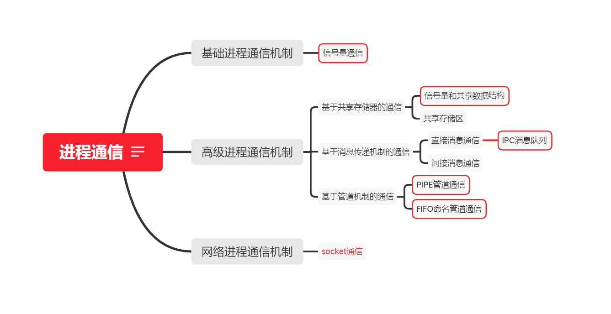
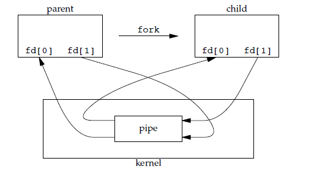
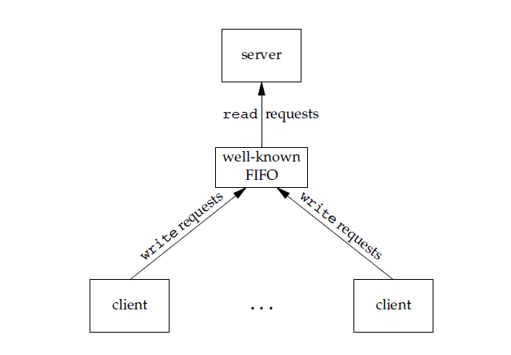
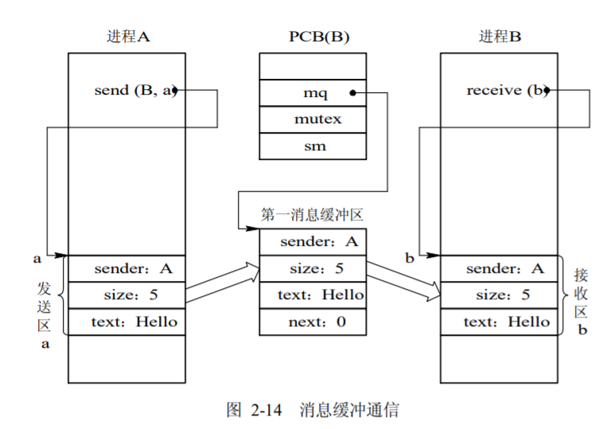
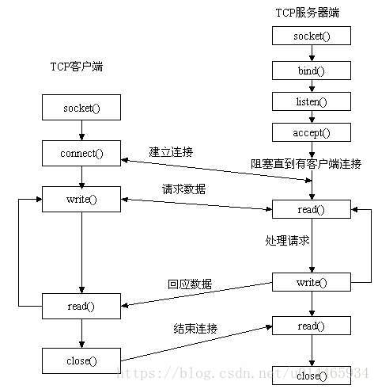

# 2.4 进程通信
> 参考文献
> * [https://blog.csdn.net/qq_40989769/article/details/110481553](https://blog.csdn.net/qq_40989769/article/details/110481553)

> linux实现多线程多进程的方法有很多。可以在linux系统编程部分好好了解。在这里只引入Linux实现几种进程通信的方式。

## 0 进程通信的定义

### 进程通信和进程同步的区别
* 主要的区别在于：进程同步控制多个进程按一定顺序执行；进程通信，实现进程间信息交换。

* 进程通信是一种手段，而进程同步是一种目的。也可以说，为了能够达到进程同步的目的，需要让进程进行通信，传输一些进程同步所需要的信息。

* 信号量机制既能作为一种同步工具，也能做为一种通信工具。信号量机制作为同步工具是卓有成效的，但作为通信工具，则不够理想，主要表现在下述两方面：
  * 效率低，生产者每次只能向缓冲池投放一个产品(消息)，消费者每次只能从缓冲区中取得一个消息；
  * 通信对用户不透明。

### 进程通信的实现划分
* 基础进程通信机制。只能传递状态和整数值（控制信息）。特点：传送信息量小，效率低，每次通信传递的信息量固定，若传递较多信息则需要进行多次通信。编程复杂：用户直接实现通信的细节，容易出错。
  * 条件变量、信号量、管程
  * 信号signal wait notify
* 共享内存通信机制
  * 共享内存。（可以通过信号量控制）
* 管道文件通信机制（文件进程通信机制）
  * PIPE匿名管道
  * FIFO命名管道
  * 高级管道通信
* 消息传递通信机制
  * 消息队列
* 网络进程通信机制。主要是通过socket实现的tcp或者是udp通信。
  * socket



### 进程通信的分类重述
> [参考文献](http://www.xitongzhijia.net/xtjc/20171024/109869.html)
> 
> IPC inter process communication是一组编程接口，让程序员能够协调不同的进程，使之能在一个操作系统里同时运行，并相互传递、交换信息。
1. **信号量通信**。信号量（ semophore ） ： 信号量是一个计数器，可以用来控制多个进程对共享资源的访问。它常作为一种锁机制，防止某进程正在访问共享资源时，其他进程也访问该资源。因此，主要作为进程间以及同一进程内不同线程之间的同步手段。
2. **信号**。信号 （ sinal ） ： 信号是一种比较复杂的通信方式，用于通知接收进程某个事件已经发生。
3. **共享内存通信**。共享内存（ shared memory ） ：共享内存就是映射一段能被其他进程所访问的内存，这段共享内存由一个进程创建，但多个进程都可以访问。共享内存是最快的 IPC 方式，它是针对其他进程间通信方式运行效率低而专门设计的。它往往与其他通信机制，如信号两，配合使用，来实现进程间的同步和通信。
4. **无名管道通信**。无名管道（ pipe ）：管道是一种半双工的通信方式，数据只能单向流动，而且只能在具有亲缘关系的进程间使用。进程的亲缘关系通常是指父子进程关系。
5. **高级管道通**信。高级管道（popen）：将另一个程序当做一个新的进程在当前程序进程中启动，则它算是当前程序的子进程，这种方式我们成为高级管道方式。
6. **有名管道通信**。有名管道 （named pipe） ： 有名管道也是半双工的通信方式，但是它允许无亲缘关系进程间的通信。
7. **消息队列通信**。消息队列（ message queue ） ： 消息队列是由消息的链表，存放在内核中并由消息队列标识符标识。消息队列克服了信号传递信息少、管道只能承载无格式字节流以及缓冲区大小受限等缺点。
8. **套接字通信**。套接字（ socket ） ： 套接口也是一种进程间通信机制，与其他通信机制不同的是，它可用于不同机器间的进程通信。

## 1 信号量通信
> 参考文献
> * [https://blog.csdn.net/csdn_kou/article/details/81240666](https://blog.csdn.net/csdn_kou/article/details/81240666)

### 通信原理
### 函数接口
* linux进程中的信号量函数
```C++
// linux操作系统
```
* linux线程中的信号量函数。
```C++
// linux操作系统
pthread_mutex_t
pthread_mutex_init
pthread_mutex_lock
pthread_mutex_unlock
pthread_mutex_destroy
```

### 编程实现
```C
#include <time.h>
#include <pthread.h>
#include "tlpi_hdr.h"

static pthread_mutex_t mtx = PTHREAD_MUTEX_INITIALIZER;
static pthread_cond_t cond = PTHREAD_COND_INITIALIZER;

static int avail = 0;

static void * threadFunc(void *arg)
{
    int cnt = atoi((char *) arg);
    int s, j;

    for (j = 0; j < cnt; j++) {
        sleep(1);

        /* Code to produce a unit omitted */

        s = pthread_mutex_lock(&mtx);
        if (s != 0)
            errExitEN(s, "pthread_mutex_lock");

        avail++;        /* Let consumer know another unit is available */

        s = pthread_mutex_unlock(&mtx);
        if (s != 0)
            errExitEN(s, "pthread_mutex_unlock");

        s = pthread_cond_signal(&cond);         /* Wake sleeping consumer */
        if (s != 0)
            errExitEN(s, "pthread_cond_signal");
    }

    return NULL;
}

int main(int argc, char *argv[])
{
    pthread_t tid;
    int s, j;
    int totRequired;            /* Total number of units that all threads
                                   will produce */
    int numConsumed;            /* Total units so far consumed */
    Boolean done;
    time_t t;

    t = time(NULL);

    /* Create all threads */

    totRequired = 0;
    for (j = 1; j < argc; j++) {
        totRequired += atoi(argv[j]);

        s = pthread_create(&tid, NULL, threadFunc, argv[j]);
        if (s != 0)
            errExitEN(s, "pthread_create");
    }

    /* Loop to consume available units */

    numConsumed = 0;
    done = FALSE;

    for (;;) {
        s = pthread_mutex_lock(&mtx);
        if (s != 0)
            errExitEN(s, "pthread_mutex_lock");

        while (avail == 0) {            /* Wait for something to consume */
            s = pthread_cond_wait(&cond, &mtx);
            if (s != 0)
                errExitEN(s, "pthread_cond_wait");
        }

        /* At this point, 'mtx' is locked... */

        while (avail > 0) {             /* Consume all available units */

            /* Do something with produced unit */

            numConsumed ++;
            avail--;
            printf("T=%ld: numConsumed=%d\n", (long) (time(NULL) - t),
                    numConsumed);

            done = numConsumed >= totRequired;
        }

        s = pthread_mutex_unlock(&mtx);
        if (s != 0)
            errExitEN(s, "pthread_mutex_unlock");

        if (done)
            break;

        /* Perhaps do other work here that does not require mutex lock */

    }

    exit(EXIT_SUCCESS);
}
```

## 2 信号通信
### 通信原理
### 函数接口
* linux下的信号机制
```
```

### 编程实现
```C
```

## 3 共享内存通信
> 参考文献
> * [https://blog.csdn.net/csdn_kou/article/details/82908922](https://blog.csdn.net/csdn_kou/article/details/82908922)
### 通信原理

* **共享内存** 相互通信的进程共享某些数据结构或共享存储区，进程之间能够通过这些空间进行通信。据此，又可把它们分成以下两种类型：
  * **基于共享数据结构的通信方式**。在这种通信方式中，要求诸进程公用某些数据结构。借以实现诸进程间的信息交换。如在生产者—消费者问题中，就是用有界缓冲区这种数据结构来实现通信的。
  * **基于共享存储区的通信方式**。为了传输大量数据，在存储器中划出了一块共享存储区，诸进程可通过对共享存储区中数据的读或写来实现通信。

### 函数接口
```
int shmget(key_t key, size_t size, int shmflg);
```
* 用来创建共享内存
* 参数
  * key:	这个共享内存段名字
  * size:	共享内存大小
  * shmflg:	由九个权限标志构成，它们的用法和创建文件时使用的mode模式标志是一样的
* 返回值：
  * 成功返回⼀一个⾮非负整数，即该共享内存段的标识码；失败返回-1


```
void *shmat(int shmid, const void *shmaddr, int shmflg);
```
* 功能：	将共享内存段连接到进程地址空间
* 参数
  * shmid:	共享内存标识
  * shmaddr:	指定连接的地址
  * shmflg:	它的两个可能取值是SHM_RND和SHM_RDONLY
* 返回值：	
  * 成功返回⼀一个指针，指向共享内存第⼀一个节；失败返回-1


```
int shmctl(int shmid, int cmd, struct shmid_ds *buf);
```
* 功能：	⽤用于控制共享内存
* 参数
  * shmid:	由shmget返回的共享内存标识码
  * cmd:	将要采取的动作（有三个可取值）
  * buf:	指向⼀一个保存着共享内存的模式状态和访问权限的数据结构
* 返回值:
  * 成功返回0；失败返回-1

```
int shmdt(const void *shmaddr);

```
* 功能：	将共享内存段与当前进程脱离
* 参数
  * shmaddr:	由shmat所返回的指针
* 返回值：
  * 成功返回0；失败返回-1
* 注意：	将共享内存段与当前进程脱离不等于删除共享内存段


### 编程实现
```C
// 1.cpp
#include<stdio.h>
#include<stdlib.h>
#include <sys/ipc.h>
#include <sys/shm.h>
#include<string.h>
#include<errno.h>

typedef struct _Teacher
{
    char name[64];
    int age;
}Teacher;

int main(int argc, char *argv[])
{
    int ret = 0;
    int    shmid;
    //创建共享内存 ，相当于打开文件，文件不存在则创建
    shmid = shmget(0x2234, sizeof(Teacher), IPC_CREAT | 0666); 
    if (shmid == -1)
    {
        perror("shmget err");
        return errno;
    }
    printf("shmid:%d \n", shmid);
    Teacher *p = NULL;
    //将共享内存段连接到进程地址空间
    p = shmat(shmid, NULL, 0);//第二个参数shmaddr为NULL，核心自动选择一个地址
    if (p == (void *)-1 )
    {
        perror("shmget err");
        return errno;
    }
    strcpy(p->name, "aaaa");
    p->age = 33;
    //将共享内存段与当前进程脱离
    shmdt(p);
        
    printf("键入1 删除共享内存，其他不删除\n");
    
    int num;
    scanf("%d", &num);
    if (num == 1)
    {
        //用于控制共享内存
        ret = shmctl(shmid, IPC_RMID, NULL);//IPC_RMID为删除内存段
        if (ret < 0)
        {
            perror("rmerrr\n");
        }
    }                 

    return 0;    
}

// 2.cpp
#include<stdio.h>
#include<stdlib.h>
#include <sys/ipc.h>
#include <sys/shm.h>
#include<string.h>
#include<errno.h>

typedef struct _Teacher
{
    char name[64];
    int age;
}Teacher;

int main(int argc, char *argv[])
{
    int ret = 0;
    int    shmid;
    //shmid = shmget(0x2234, sizeof(Teacher), IPC_CREAT |IPC_EXCL | 0666); 
    //打开获取共享内存
    shmid = shmget(0x2234, 0, 0); 
    if (shmid == -1)
    {
        perror("shmget err");
        return errno;
    }
    printf("shmid:%d \n", shmid);
    Teacher *p = NULL;
    //将共享内存段连接到进程地址空间
    p = shmat(shmid, NULL, 0);
    if (p == (void *)-1 )
    {
        perror("shmget err");
        return errno;
    }
    
    printf("name:%s\n", p->name);
    printf("age:%d \n", p->age);
    //将共享内存段与当前进程脱离
    shmdt(p);
    
    printf("键入1 程序暂停，其他退出\n");
    
    int num;
    scanf("%d", &num);
    if (num == 1)
    {
        pause();
    }                
    return 0;
}
```

## 4 管道通信机制的实例——PIPE匿名管道通信
### 通信原理

* **“管道”** 是指用于连接一个读进程和一个写进程以实现它们之间通信的一个共享文件，又名 pipe 文件，基于文件的通信机制。
* 向管道(共享文件)提供输入的发送进程(即写进程)，以字符流形式将大量的数据送入管道；而接受管道输出的接收进程(即读进程)，则从管道中接收(读)数据。由于发送进程和接收进程是利用管道进行通信的，故又称为管道通信。
* 有部分博客说。管道通信也属于消息通信中的直接通信的一种。
* 它具有以下限制：

  - 只支持半双工通信（单向交替传输）；
  - 只能在父子进程或者兄弟进程中使用。



### 函数接口
* 管道是通过调用 pipe 函数创建的，fd[0] 用于读，fd[1] 用于写。

```c
#include <unistd.h>
int pipe(int fd[2]);
```


### 编程实现
```C
```

## 5 管道通信机制的实例——FIFO命名管道通信
### 通信原理
* 也称为命名管道，去除了管道只能在父子进程中使用的限制。
* FIFO 常用于客户-服务器应用程序中，FIFO 用作汇聚点，在客户进程和服务器进程之间传递数据。


### 函数接口

```c
#include <sys/stat.h>
int mkfifo(const char *path, mode_t mode);
int mkfifoat(int fd, const char *path, mode_t mode);
```
### 编程实现
```C
```
## 6 高级管道通信

### 通信原理
### 函数接口
### 编程实现
```C
```
## 7 消息队列通信

### 定义

* **消息传递系统(Message passing system)** 是当前应用最为广泛的一种进程间的通信机制。在该机制中，进程间的数据交换是以格式化的消息(message)为单位的；
* 在计算机网络中，又把 message 称为报文。程序员直接利用操作系统提供的一组通信命令(原语)，不仅能实现大量数据的传递，而且还隐藏了通信的实现细节，使通信过程对用户是透明的，从而大大减化了通信程序编制的复杂性，因而获得了广泛的应用。
* 消息传递系统的通信方式属于高级通信方式。又因其实现方式的不同而进一步分成**直接通信方式**和**间接通信方式**两种。

> 有博客说明。消息传递直接通信，包括PIPE、FIFO、IPC三种通信方式。分别是管道通信、命名管道通信、消息队列通信。

### 直接通信方式


* 发送进程利用 OS 所提供的发送命令，直接把消息发送给目标进程。

```
Send(Receiver，message)； 发送一个消息给接收进程；
Receive(Sender，message)； 接收 Sender 发来的消息；
```

### 间接通信方式
* 间接通信方式指进程之间的通信需要通过作为共享数据结构的实体。该实体用来暂存发送进程发送给目标进程的消息；接收进程则从该实体中取出对方发送给自己的消息。

* 中间实体称为信箱。消息在信箱中可以安全地保存，只允许核准的目标用户随时读取。因此，利用信箱通信方式，既可实现实时通信，又可实现非实时通信。
  * 信箱的创建和撤消。进程可利用信箱创建原语来建立一个新信箱。创建者进程应给出信箱名字、信箱属性(公用、私用或共享)；对于共享信箱，还应给出共享者的名字。当进程不再需要读信箱时，可用信箱撤消原语将之撤消。
  * 消息的发送和接收。当进程之间要利用信箱进行通信时，必须使用共享信箱，并利用系统提供的下述通信原语进行通信：
```
 Send(mailbox，message)； 将一个消息发送到指定信箱；
 Receive(mailbox，message)； 从指定信箱中接收一个消息；
```
### 间接通信信箱

* 私用信箱。用户进程可为自己建立一个新信箱，并作为该进程的一部分。信箱的拥有者有权从信箱中读取消息，其他用户则只能将自己构成的消息发送到该信箱中。
* 公用信箱。它由操作系统创建，并提供给系统中的所有核准进程使用。核准进程既可把消息发送到该信箱中，也可从信箱中读取发送给自己的消息。
* 共享信箱它由某进程创建，在创建时或创建后指明它是可共享的，同时须指出共享进程(用户)的名字

### 消息传递系统中实现的若干问题。

1. 通信链路。为使在发送进程和接收进程之间能进行通信，必须在两者之间建立一条通信链路(communication link)。单向通信链路、双向通信链路（半双工、全双工）。点对点通信链路、多点通信链路。
2. 消息的格式.在消息传递系统中所传递的消息，必须具有一定的消息格式。

### 实现方式



* 消息缓冲队列通信机制中的数据结构：消息缓冲区，在消息缓冲队列通信方式中，主要利用的数据结构是消息缓冲区；PCB 中有关通信的数据项。
* 发送进程在利用发送原语发送消息之前，应先在自己的内存空间设置一发送区。把待发送的消息正文、发送进程标识符、消息长度等信息填入其中，然后调用发送原语，把消息发送给目标(接收)进程。
* 接收原语。接收进程调用接收原语 receive(b)，从自己的消息缓冲队列 mq 中摘下第一个消息缓冲区 i，并将其中的数据复制到以 b 为首址的指定消息接收区内。

### 相比于 FIFO消息队列具有以下优点：

- 消息队列可以独立于读写进程存在，从而避免了 FIFO 中同步管道的打开和关闭时可能产生的困难；
- 避免了 FIFO 的同步阻塞问题，不需要进程自己提供同步方法；
- 读进程可以根据消息类型有选择地接收消息，而不像 FIFO 那样只能默认地接收。

### 编程实现
```C
```
## 8 网络通信——Socket套接字

> 参考文献
> * [https://blog.csdn.net/u014465934/article/details/81350883](https://blog.csdn.net/u014465934/article/details/81350883)
> * [https://www.cnblogs.com/zzyoucan/p/3801295.html](https://www.cnblogs.com/zzyoucan/p/3801295.html)
### socket概念
* 用于不同机器间的进程通信。
* Socket是应用层与TCP/IP协议族通信的中间软件抽象层，它是一组接口。在设计模式中，Socket其实就是一个门面模式，它把复杂的TCP/IP协议族隐藏在Socket接口后面，对用户来说，一组简单的接口就是全部，让Socket去组织数据，以符合指定的协议。
* Socket主要有流式套接字、数据报套接字和原始套接字三种，其中流式套接字表示传输层使用TCP协议提供面向连接的可靠的传输服务。数据报套接字表示传输层使用UDP协议提供面向连接的可靠的传输服务。流式和数据报就是指数据在传输时的形式，以字节流形式还是以消息结构体（将消息打包封装为一种结构）。

### socket原理

Socket通信过程：先从服务器端说起。服务器端先初始化Socket，然后与端口绑定(bind)，对端口进行监听(listen)，调用accept阻塞，等待客户端连接。在这时如果有个客户端初始化一个Socket，然后连接服务器(connect)，如果连接成功，这时客户端与服务器端的连接就建立了。客户端发送数据请求，服务器端接收请求并处理请求，然后把回应数据发送给客户端，客户端读取数据，最后关闭连接，一次交互结束。



### 实现方式

```
int socket(int domain, int type, int protocol);
```
* socket函数对应于普通文件的打开操作。普通文件的打开操作返回一个文件描述字，而socket()用于创建一个socket描述符（socket descriptor），它唯一标识一个socket。这个socket描述字跟文件描述字一样，后续的操作都有用到它，把它作为参数，通过它来进行一些读写操作。
* 参数描述：
  * domain：即协议域/族，协议族决定了socket的地址类型，在通信中必须采用对应的地址。
  * type：指定socket类型。
  * protocol：指定协议。

```
int bind(int sockfd, const struct sockaddr *addr, socklen_t addrlen);
```
* bind()函数把一个地址族中的特定地址赋给socket。例如对应AF_INET、AF_INET6就是把一个ipv4或ipv6地址和端口号组合赋给socket。
* 参数描述：
  * sockfd：即socket描述字，它是通过socket()函数创建了，唯一标识一个socket。bind()函数就是将给这个描述字绑定一个名字。
  * addr：一个const struct sockaddr *指针，指向要绑定给sockfd的协议地址。这个地址结构根据地址创建socket时的地址协议族的不同而不同。
  * addrlen：对应的是地址的长度。

```
int listen(int sockfd, int backlog);
int connect(int sockfd, const struct sockaddr *addr, socklen_t addrlen);
```
* 如果作为一个服务器，在调用socket()、bind()之后就会调用listen()来监听这个socket，如果客户端这时调用connect()发出连接请求，服务器端就会接收到这个请求。
* listen函数的第一个参数即为要监听的socket描述字，第二个参数为相应socket可以排队的最大连接个数。socket()函数创建的socket默认是一个主动类型的，listen函数将socket变为被动类型的，等待客户的连接请求。
* connect函数的第一个参数即为客户端的socket描述字，第二参数为服务器的socket地址，第三个参数为socket地址的长度。客户端通过调用connect函数来建立与TCP服务器的连接。


```
int accept(int sockfd, struct sockaddr *addr, socklen_t *addrlen);
```
* TCP服务器端依次调用socket()、bind()、listen()之后，就会监听指定的socket地址了。TCP客户端依次调用socket()、connect()之后就想TCP服务器发送了一个连接请求。TCP服务器监听到这个请求之后，就会调用accept()函数取接收请求，这样连接就建立好了。之后就可以开始网络I/O操作了，即类同于普通文件的读写I/O操作。
* accept函数的第一个参数为服务器的socket描述字，第二个参数为指向struct sockaddr *的指针，用于返回客户端的协议地址，第三个参数为协议地址的长度。如果accpet成功，那么其返回值是由内核自动生成的一个全新的描述字，代表与返回客户的TCP连接。
* 注意：accept的第一个参数为服务器的socket描述字，是服务器开始调用socket()函数生成的，称为监听socket描述字；而accept函数返回的是已连接的socket描述字。一个服务器通常通常仅仅只创建一个监听socket描述字，它在该服务器的生命周期内一直存在。内核为每个由服务器进程接受的客户连接创建了一个已连接socket描述字，当服务器完成了对某个客户的服务，相应的已连接socket描述字就被关闭。

```
read()/write()
recv()/send()
readv()/writev()
recvmsg()/sendmsg()
recvfrom()/sendto()
```
* 我推荐使用recvmsg()/sendmsg()函数，这两个函数是最通用的I/O函数，实际上可以把上面的其它函数都替换成这两个函数。
* read函数是负责从fd中读取内容.当读成功时，read返回实际所读的字节数，如果返回的值是0表示已经读到文件的结束了，小于0表示出现了错误。如果错误为EINTR说明读是由中断引起的，如果是ECONNREST表示网络连接出了问题。
* write函数将buf中的nbytes字节内容写入文件描述符fd.成功时返回写的字节 数。失败时返回-1，并设置errno变量。在网络程序中，当我们向套接字文件描述符写时有俩种可能。1)write的返回值大于0，表示写了部分或者是 全部的数据。2)返回的值小于0，此时出现了错误。我们要根据错误类型来处理。如果错误为EINTR表示在写的时候出现了中断错误。如果为EPIPE表示 网络连接出现了问题(对方已经关闭了连接)。

```
int close(int fd);
```
* 在服务器与客户端建立连接之后，会进行一些读写操作，完成了读写操作就要关闭相应的socket描述字，好比操作完打开的文件要调用fclose关闭打开的文件。

### 编程实现
```C
// server
#include<stdio.h>
#include<stdlib.h>
#include<string.h>
#include<errno.h>
#include<sys/types.h>
#include<sys/socket.h>
#include<netinet/in.h>

#define MAXLINE 4096

int main(int argc, char** argv)
{
    int    listenfd, connfd;
    struct sockaddr_in     servaddr;
    char    buff[4096];
    int     n;

    if( (listenfd = socket(AF_INET, SOCK_STREAM, 0)) == -1 ){
    printf("create socket error: %s(errno: %d)/n",strerror(errno),errno);
    exit(0);
    }

    memset(&servaddr, 0, sizeof(servaddr));
    servaddr.sin_family = AF_INET;
    servaddr.sin_addr.s_addr = htonl(INADDR_ANY);
    servaddr.sin_port = htons(6666);

    if( bind(listenfd, (struct sockaddr*)&servaddr, sizeof(servaddr)) == -1){
    printf("bind socket error: %s(errno: %d)/n",strerror(errno),errno);
    exit(0);
    }

    if( listen(listenfd, 10) == -1){
    printf("listen socket error: %s(errno: %d)/n",strerror(errno),errno);
    exit(0);
    }

    printf("======waiting for client's request======/n");
    while(1){
    if( (connfd = accept(listenfd, (struct sockaddr*)NULL, NULL)) == -1){
        printf("accept socket error: %s(errno: %d)",strerror(errno),errno);
        continue;
    }
    n = recv(connfd, buff, MAXLINE, 0);
    buff[n] = '/0';
    printf("recv msg from client: %s/n", buff);
    close(connfd);
    }

    close(listenfd);
}

// client
#include<stdio.h>
#include<stdlib.h>
#include<string.h>
#include<errno.h>
#include<sys/types.h>
#include<sys/socket.h>
#include<netinet/in.h>

#define MAXLINE 4096

int main(int argc, char** argv)
{
    int    sockfd, n;
    char    recvline[4096], sendline[4096];
    struct sockaddr_in    servaddr;

    if( argc != 2){
    printf("usage: ./client <ipaddress>/n");
    exit(0);
    }

    if( (sockfd = socket(AF_INET, SOCK_STREAM, 0)) < 0){
    printf("create socket error: %s(errno: %d)/n", strerror(errno),errno);
    exit(0);
    }

    memset(&servaddr, 0, sizeof(servaddr));
    servaddr.sin_family = AF_INET;
    servaddr.sin_port = htons(6666);
    if( inet_pton(AF_INET, argv[1], &servaddr.sin_addr) <= 0){
    printf("inet_pton error for %s/n",argv[1]);
    exit(0);
    }

    if( connect(sockfd, (struct sockaddr*)&servaddr, sizeof(servaddr)) < 0){
    printf("connect error: %s(errno: %d)/n",strerror(errno),errno);
    exit(0);
    }

    printf("send msg to server: /n");
    fgets(sendline, 4096, stdin);
    if( send(sockfd, sendline, strlen(sendline), 0) < 0)
    {
    printf("send msg error: %s(errno: %d)/n", strerror(errno), errno);
    exit(0);
    }

    close(sockfd);
    exit(0);
}
```

## 9 进程通信的同步与阻塞

### 同步异步、阻塞非阻塞

进程同步方式。在进程之间进行通信时，同样需要有进程同步机制，以使诸进程间能协调通信。不论是发送进程，还是接收进程，在完成消息的发送或接收后，都存在两种可能性，继续或阻塞。
1. 发送进程阻塞，接收进程阻塞。这种情况主要用于进程之间紧密同步(tightsynchronization)，发送进程和接收进程之间无缓冲时。这两个进程平时都处于阻塞状态，直到有消息传递时。这种同步方式称为汇合(rendezrous)。
2. 发送进程不阻塞，接收进程阻塞。这是一种应用最广的进程同步方式。平时，发送进程不阻塞，因而它可以尽快地把一个或多个消息发送给多个目标； 而接收进程平时则处于阻塞状态，直到发送进程发来消息时才被唤醒。在服务器上通常都设置了多个服务进程，它们分别用于提供不同的服务，处于阻塞收状态。
3. 发送进程和接收进程均不阻塞。这也是一种较常见的进程同步形式。平时，发送进程和接收进程都在忙于自己的事情，仅当发生某事件使它无法继续运行时，才把自己阻塞起来等待。在发送进程和接收进程之间联系着一个消息队列时，该消息队列最多能接纳 n 个消息，这样，发送进程便可以连续地向消息队列中发送消息而不必等待；接收进程也可以连续地从消息队列中取得消息，也不必等待。

### 本地进程的实现方式

### 网络进程的实现方式