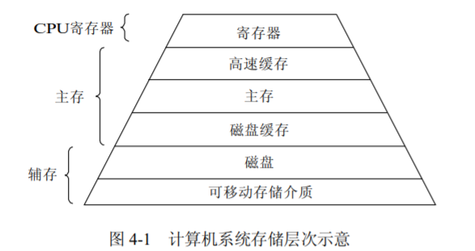
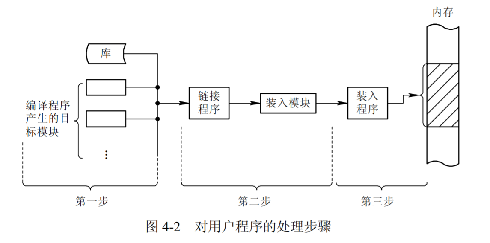
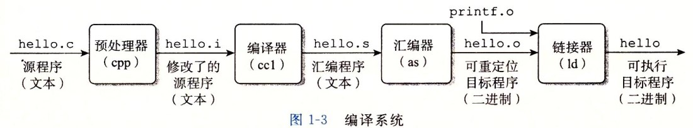
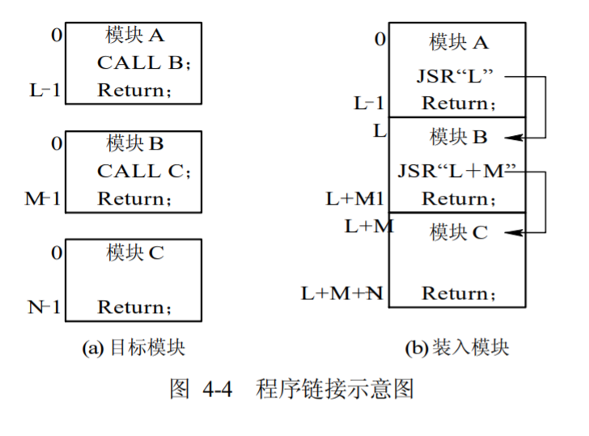
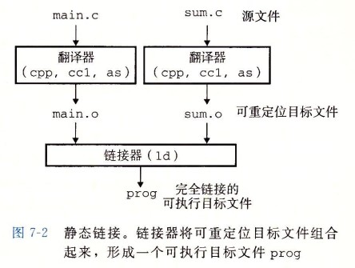
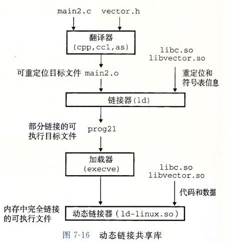

## 1 存储器的层次结构

### 存储器的层次结构



### 寄存器

* 寄存器访问速度最快，完全能与 CPU 协调工作。寄存器用于加速存储器的访问速度，如用寄存器存放操作数，或用作地址寄存器加快地址转换速度等。


### 高速缓存
1. Cache是介于CPU和主存储器间的高速小容量存储器，由静态存储芯片SRAM组成，容量较小但比主存DRAM技术更加昂贵而快速，接近于CPU的速度
2. CPU往往需要重复读取同样的数据库，Cache的引入与缓存容量的增大，可以大幅提升CPU内部读取数据的命中率，从而提高系统性能
3. 分级：由于CPU芯片面积和成本，Cache很小。根据成本控制，划分L1，L2，L3三级。
   1. L1 Cache：分为数据缓存和指令缓存；内置；成本最高，对CPU的性能影响最大；通常在32KB-256KB之间
   2. L2 Cache：分内置和外置两种，后者性能低一些；通常在512KB-8MB之间
   3. L3 Cache：多为外置，在游戏和服务器领域有效；但对很多应用来说，总线改善比设置L3更加有利于提升系统性能

### 主存储器
* 主存储器(简称内存或主存)是计算机系统中一个主要部件，用于保存进程运行时的程序和数据，也称可执行存储器。数据能够从主存储器读取并将它们装入到寄存器中，或者从寄存器存入到主存储器。

### 磁盘缓存
* 由于目前磁盘的 I/O 速度远低于对主存的访问速度，因此将频繁使用的一部分磁盘数据和信息，暂时存放在磁盘缓存中，可减少访问磁盘的次数。

### 磁盘
* 大容量存储设备
* 断电数据保留

### 可移动介质
* 便携式存储设备


## 2 程序的装入和链接

### 程序执行的步骤

1. 首先是要**编译**，由编译程序(Compiler)将用户源代码编译成若干个目标模块(Object Module)；
2. 其次是**链接**，由链接程序(Linker)将编译后形成的一组目标模块，以及它们所需要的库函数链接在一起，形成一个完整的装入模块(Load Module)；
3. 最后是**装入**，由装入程序(Loader)将装入模块装入内存。然后执行



## 2.1 装入

### 逻辑地址（相对地址）
* 从0开始编号，在编译生成可执行文件的时候确定。包括以下两种形式：
  * 一维逻辑地址（地址）
  * 二维逻辑地址（段号：段内地址）

### 物理地址（绝对地址）
* 程序执行所使用的主存地址空间。处理器执行指令时按照物理地址进行

### 地址转换（重定位）
* 把逻辑地址转换成物理地址。包括两种方式：
  * 静态重定位：在程序装入内存时进行地址转换。由装入程序执行，早期小型OS使用
  * 动态重定位：在CPU执行程序时进行地址转换。从效率出发，依赖硬件地址转换机构

### 分类
* 根据地址转换的方式，可以将程序的装入分为三种方式。
  1. **绝对装入方式**。在编译时，如果知道程序将驻留在内存的什么位置，那么，编译程序将产生绝对地址的目标代码。绝对装入程序按照装入模块中的地址，将程序和数据装入内存。装入模块被装入内存后，由于程序中的逻辑地址与实际内存地址完全相同，故不须对程序和数据的地址进行修改。程序中所使用的绝对地址，既可在编译或汇编时给出，也可由程序员直接赋予。
  2. **静态重定位装入方式**。在装入时对目标程序中指令和数据的修改过程称为重定位。又因为地址变换通常是在装入时一次完成的，以后不再改变，故称为静态重定位。
  3. **动态重定位装入方式**。动态运行时的装入程序在把装入模块装入内存后，并不立即把装入模块中的相对地址转换为绝对地址，而是把这种地址转换推迟到程序真正要执行时才进行。因此，装入内存后的所有地址都仍是相对地址。需要一个重定位寄存器的支持。


## 2.2 链接

### 编译系统


* 以下是一个 hello.c 程序：

```c
#include <stdio.h>

int main()
{
    printf("hello, world\n");
    return 0;
}
```

* 在 Unix 系统上，由编译器把源文件转换为目标文件。

```bash
gcc -o hello hello.c
```


1. 预处理阶段：处理以 # 开头的预处理命令；
1. 编译阶段：翻译成汇编文件；
1. 汇编阶段：将汇编文件翻译成**可重定位目标文件**；
2. 链接阶段：将可重定位目标文件和printf.o 等单独预编译好的目标文件进行合并，得到最终的**可执行目标文件**。

### 目标文件

- **可执行目标文件**：可以直接在内存中执行；
- **可重定位目标文件**：可与其它可重定位目标文件在链接阶段合并，创建一个可执行目标文件；
- **共享目标文件**：这是一种特殊的可重定位目标文件，可以在运行时被动态加载进内存并链接；


### 分类

* 源程序经过编译后，可得到一组目标模块，再利用链接程序将这组目标模块链接，形成装入模块。根据链接时间的不同，可把链接分成如下三种：
  1. 静态链接。在程序运行之前，先将各目标模块及它们所需的库函数，链接成一个完整的装配模块，以后不再拆开。我们把这种事先进行链接的方式称为静态链接方式。
  2. 装入时动态链接。这是指将用户源程序编译后所得到的一组目标模块，在装入内存时，采用边装入边链接的链接方式。
  3. 运行时动态链接。这是指对某些目标模块的链接，是在程序执行中需要该(目标)模块时，才对它进行的链接。



### 静态链接

* 静态链接器以一组可重定位目标文件为输入，生成一个完全链接的可执行目标文件作为输出。链接器主要完成以下两个任务：
  1. 符号解析：符号解析的目的是将每个符号引用与一个符号定义关联起来。每个符号对应于一个函数、一个全局变量或一个静态变量。
  2. 重定位：链接器通过把每个符号定义与一个内存位置关联起来。然后修改所有对这些符号的引用，使得它们指向这个内存位置。




### 动态链接

* 静态库有以下两个问题：
  - 当静态库更新时那么整个程序都要重新进行链接；
  - 对于 printf 这种标准函数库，如果每个程序都要有代码，这会极大浪费资源。

* 共享库是为了解决静态库的这两个问题而设计的，在 Linux 系统中通常用 .so 后缀来表示，Windows 系统上它们被称为dll。它具有以下特点：
  - 在给定的文件系统中一个库只有一个文件，所有引用该库的可执行目标文件都共享这个文件，它不会被复制到引用它的可执行文件中；
  - 在内存中，一个共享库的字节码（已编译程序的机器代码）的一个副本可以被不同的正在运行的进程共享。





