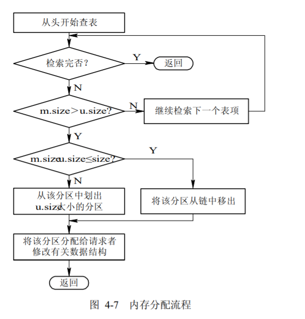
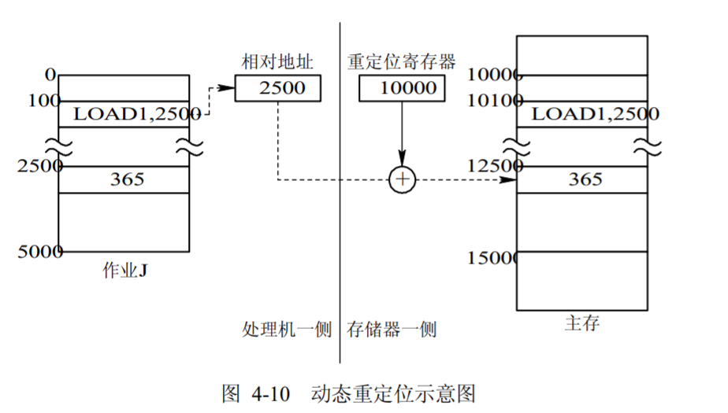

# 4.2 连续分配方式存储管理
> 存储管理方式。内存的分配方式.

### 概念
* 每个进程占用一个物理上完全连续的存储空间（区域）

## 1 单一连续分配

* 只能用于单用户、单任务的操作系统中。
* 把内存分为系统区和用户区两部分.系统区仅提供给 OS 使用，通常是放在内存的低址部分；用户区是指除系统区以外的全部内存空间，提供给用户使用。
* 通常采用静态重定位的方式装入程序。

## 2 固定分区分配

* 这是将内存用户空间划分为若干个固定大小的区域，在每个分区中只装入一道作业，这样，把用户空间划分为几个分区，便允许有几道作业并发运行。

## 3 动态分区分配
> 分区分配中所用的**数据结构**、**分区分配算法**和**分区的分配与回收操作**这样三个问题。

### 数据结构：
* 空闲分区表。在系统中设置一张空闲分区表，用于记录每个空闲分区的情况。每个空闲分区占一个表目，表目中包括分区序号、分区始址及分区的大小等数据项。
* 空闲分区链。为了实现对空闲分区的分配和链接，在每个分区的起始部分，设置一些用于控制分区分配的信息，以及用于链接各分区所用的前向指针；在分区尾部则设置一后向指针，通过前、后向链接指针，可将所有的空闲分区链接成一个双向链，

### 分区分配算法
* 首次适应算法(first fit) 。FF 算法要求空闲分区链以地址递增的次序链接。在分配内存时，从链首开始顺序查找，直至找到一个大小能满足要求的空闲分区为止；然后再按照作业的大小，从该分区中划出一块内存空间分配给请求者，余下的空闲分区仍留在空闲链中。
* 循环首次适应算法(next fit) 是从上次找到的空闲分区的下一个空闲分区开始查找，直至找到一个能满足要求的空闲分区，从中划出一块与请求大小相等的内存空间分配给作业。
* 最佳适应算法(best fit) 总是把能满足要求、又是最小的空闲分区分配给作业，避免“大材小用”。
* 最坏适应算法(worst fit)最坏适应分配算法要扫描整个空闲分区表或链表，总是挑选一个最大的空闲区分割给作业使用，其优点是可使剩下的空闲区不至于太小，产生碎片的几率最小，对中、小作业有利，同时最坏适应分配算法查找效率很高。
* 快速适应算法(quick fit)该算法又称为分类搜索法，是将空闲分区根据其容量大小进行分类，对于每一类具有相同容量的所有空闲分区，单独设立一个空闲分区链表，这样，系统中存在多个空闲分区链表，同时在内存中设立一张管理索引表，该表的每一个表项对应了一种空闲分区类型，并记录了该类型空闲分区链表表头的指针。

### 分区的分配与回收操作
  * 分配内存。系统应利用某种分配算法，从空闲分区链(表)中找到所需大小的分区。

  * 回收内存。当进程运行完毕释放内存时，系统根据回收区的首址，从空闲区链(表)中找到相应的插入点，并与相邻空闲分区合并。

## 4 可重定位的分区分配

### 动态重定位的引入。
  * 在连续分配方式中，必须把一个系统或用户程序装入一连续的内存空间。
  * 将内存中的所有作业进行移动，使它们全都相邻接，这样，即可把原来分散的多个小分区拼接成一个大分区，这时就可把作业装入该区。这种通过移动内存中作业的位置，以把原来多个分散的小分区拼接成一个大分区的方法，称为“拼接”或“紧凑”，需要对其中的程序进行重定位。
### 动态重定位的实现
  * 增设一个重定位寄存器，用它来存放程序(数据)在内存中的起始地址。程序在执行时，真正访问的内存地址是相对地址与重定位寄存器中的地址相加而形成的。

