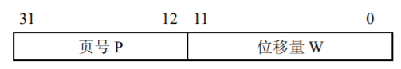
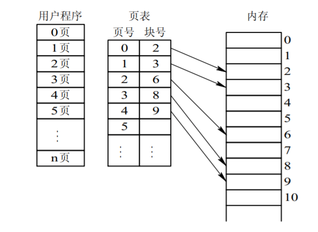
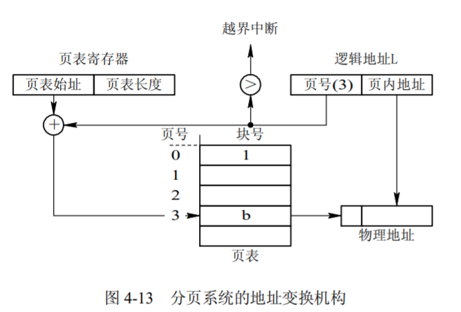
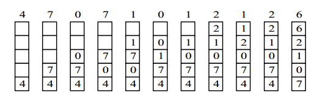
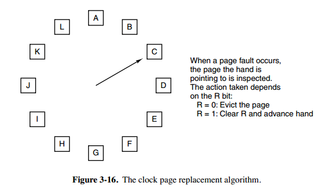
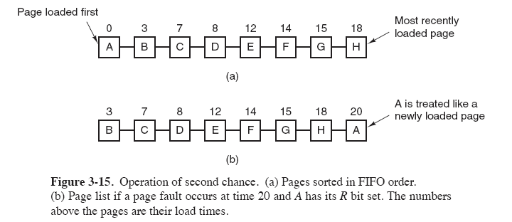

# 4.2 分页存储管理方式

> 参考文献
> * [https://www.cnblogs.com/fkissx/p/4712959.html](https://www.cnblogs.com/fkissx/p/4712959.html)
## 1 页面与页表

### 页面和物理块

* 将一个进程的逻辑地址空间分成若干个大小相等的片，称为**页面或页**，为各页加以编号。
* 把内存空间分成与页面相同大小的若干个存储块，称为 **(物理)块或页框(frame)** ，也同样为它们加以编号。在为进程分配内存时，以块为单位将进程中的若干个页分别装入到多个可以不相邻接的物理块中。
* 由于进程的最后一页经常装不满一块而形成了不可利用的碎片，称之为“**页内碎片**”。
* 页面若太小，一方面虽然可使内存碎片减小，从而减少了内存碎片的总空间，有利于提高内存利用率，但另一方面也会使每个进程占用较多的页面，从而导致进程的页表过长，占用大量内存；此外，还会降低页面换进换出的效率。然而，如果选择的页面较大，虽然可以减少页表的长度，提高页面换进换出的速度，但却又会使页内碎片增大。

### 地址结构

* 前一部分为页号 P，后一部分为位移量 W(或称为页内地址)。


### 页表
* 系统又为每个进程建立了一张页面映像表，简称页表。在进程地址空间内的所有页(0～n)，依次在页表中有一页表项，其中记录了相应页在内存中对应的物理块号。在配置了页表后，进程执行时，通过查找该表，即可找到每页在内存中的物理块号。页表的作用是实现从**页号**到**物理块号**的**地址映射**。



## 2 地址变换结构

### 基本的地址变换结构

* 页表大多驻留在内存中。在系统中只设置一个页表寄存器 PTR(Page-Table Register)，在其中存放页表在内存的始址和页表的长度。
* 进程未执行时，页表的始址和页表长度存放在本进程的 PCB 中。当调度程序调度到某进程时，才将这两个数据装入页表寄存器中。


### 具有快表的地址变换结构
* 地址变换机构中增设一个具有并行查寻能力的特殊高速缓冲寄存器，又称为“联想寄存器”(Associative Memory)，或称为“快表”，
* 快表表项包括：页号，页架号。这种高速存储器是联想存储器，即按照内容寻址，而非按照地址访问。
* 在 CPU 给出有效地址后，由地址变换机构自动地将页号 P 送入高速缓冲寄存器，并将此页号与高速缓存中的所有页号进行比较，若其中有与此相匹配的页号，便表示所要访问的页表项在快表中。于是，可直接从快表中读出该页所对应的物理块号，并送到物理地址寄存器中。如在块表中未找到对应的页表项，则还须再访问内存中的页表，找到后，把从页表项中读出的物理块号送地址寄存器；同时，再将此页表项存入快表的一个寄存器单元中，亦即，重新修改快表。但如果联想寄存器已满，则 OS 必须找到一个老的且已被认为不再需要的页表项，将它换出。


### 基于快表的地址变换流程
1. 按逻辑地址中的页号查快表
2. 若该页已在快表中，则由物理块号和单元号形成绝对地址
3. 若该页不在快表中，则再查主存页表形成绝对地址，同时将该页登记到快表中
4. 当快表填满后，又要登记新页时，则需在快表中按一定策略淘汰一个旧登记项


### 地址转换代价
1. 页表放在主存：每次地址转换必须访问两次主存
    1. 按页号读出页表中的相应物理块号
    2. 按计算出来的绝对地址进行读写
2. 存在问题：降低了存取速度
3. 解决办法：利用Cache存放部分页表

## 3 两级页表和多级页表

、、、、、、

## 4 页面置换算法

### 概述
1. 在程序运行过程中，如果要访问的页面不在内存中，就发生缺页中断从而将该页调入内存中。此时如果内存已无空闲空间，系统必须从内存中调出一个页面到磁盘对换区中来腾出空间。
2. 页面置换算法和缓存淘汰策略类似，可以将内存看成磁盘的缓存。在缓存系统中，缓存的大小有限，当有新的缓存到达时，需要淘汰一部分已经存在的缓存，这样才有空间存放新的缓存数据。
3. 页面置换算法的主要目标是使页面置换频率最低（也可以说缺页率最低）。
4. 页面调度算法设计不当，会出现（刚被淘汰的页面立即又要调入，并如此反复）这种现象称为抖动或颠簸。


### 4.1 最优替换算法OPT, Optimal replacement algorithm

1. 所选择的被换出的页面将是最长时间内不再被访问，通常可以保证获得最低的缺页率。
2. 是一种理论上的算法，因为无法知道一个页面多长时间不再被访问。
3. 举例：一个系统为某进程分配了三个物理块，并有如下页面引用序列：

```html
7，0，1，2，0，3，0，4，2，3，0，3，2，1，2，0，1，7，0，1
```

4. 开始运行时，先将 7, 0, 1 三个页面装入内存。当进程要访问页面 2 时，产生缺页中断，会将页面 7 换出，因为页面 7 再次被访问的时间最长。


### 4.2 先进先出FIFO First In First Out

1. 总是淘汰最先调入主存的那一页，或者说主存驻留时间最长的那一页（常驻的除外）
2. 选择换出的页面是最先进入的页面。该算法会将那些经常被访问的页面换出，导致缺页率升高。
3. 模拟的是程序执行的顺序性，有一定合理性


### 4.3 最近最少用LRU，Least Recently Used

1. 为了实现 LRU，需要在内存中维护一个所有页面的链表。当一个页面被访问时，将这个页面移到链表表头。这样就能保证链表表尾的页面是最近最久未访问的。
2. 因为每次访问都需要更新链表，因此这种方式实现的 LRU 代价很高。

```
4，7，0，7，1，0，1，2，1，2，6
```



### 4.4 时钟CLOCK==最近未使用NRU, Not Recently Used

每个页面都有两个状态位：R 与 M，当页面被访问时设置页面的 R=1，当页面被修改时设置 M=1。其中 R 位会定时被清零。可以将页面分成以下四类：

- R=0，M=0
- R=0，M=1
- R=1，M=0
- R=1，M=1

当发生缺页中断时，NRU 算法随机地从类编号最小的非空类中挑选一个页面将它换出。

NRU 优先换出已经被修改的脏页面（R=0，M=1），而不是被频繁使用的干净页面（R=1，M=0）。

> 算法执行如下操作步骤：

从指针的当前位置开始，扫描帧缓冲区。在这次扫描过程中，对使用位不做任何修改。选择遇到的第一个帧(u=0, m=0)用于替换。
如果第1)步失败，则重新扫描，查找(u=0, m=1)的帧。选择遇到的第一个这样的帧用于替换。在这个扫描过程中，对每个跳过的帧，把它的使用位设置成0。
如果第2)步失败，指针将回到它的最初位置，并且集合中所有帧的使用位均为0。重复第1步，并且如果有必要，重复第2步。这样将可以找到供替换的帧
> 第二个解析

1. 第二次机会算法需要在链表中移动页面，降低了效率。时钟算法使用环形链表将页面连接起来，再使用一个指针指向最老的页面。
2. 采用循环队列机制构造页面队列，形成了一个类似于钟表面的环形表
3. 队列指针则相当于钟表面上的表针，指向可能要淘汰的页面
4. 使用页引用标志位
5. 工作流程：
  1. 页面调入主存时，其引用标志位置1
  2. 访问主存页面时，其引用标志位置1
  3. 淘汰页面时，从指针当前指向的页面开始扫描循环队列
      1. 把所遇到的引用标志位是1的页面的引用标志位清0，并跳过
      2. 把所遇到的引用标志位是0的页面淘汰，指针推进一步



### 4.3 第二次机会算法

FIFO 算法可能会把经常使用的页面置换出去，为了避免这一问题，对该算法做一个简单的修改：

当页面被访问 (读或写) 时设置该页面的 R 位为 1。需要替换的时候，检查最老页面的 R 位。如果 R 位是 0，那么这个页面既老又没有被使用，可以立刻置换掉；如果是 1，就将 R 位清 0，并把该页面放到链表的尾端，修改它的装入时间使它就像刚装入的一样，然后继续从链表的头部开始搜索。



### 4.5 最不常用LFU 
1. 淘汰最近一段时间内访问次数较少的页面，对OPT的模拟性比LRU更好
2. 基于时间间隔中断，并给每一页设置一个计数器
3. 时间间隔中断发生后，所有计数器清0
4. 每访问页1次就给计数器加1
5. 选择计数值最小的页面淘汰
## 5 反置页表
### 提出：
1. 页面及相关硬件机制在地址转换、存储保护、虚拟地址访问中发挥了关键作用
2. 为页式存储管理设置专门硬件机构
3. 内存管理单元MMU：CPU管理虚拟/物理存储器的控制线路，把虚拟地址映射为物理地址，并提供存储保护，必要时确定淘汰页面
4. 反置页表IPT：MMU用的数据结构

### 基本设计思想
1. 针对内存中的每个页架建立一个页表，按照块号排序
2. 表项包含：正在访问改页框的进程标识、页号及特征位和哈希链指针等
3. 用来完成内存页架到访问进程页号的对应，即物理地址到逻辑地址的转换

### 页表项
1. 页号：虚拟地址页号
2. 进程标志符：使用该页的进程号（页号和进程标志符结合起来标志一个特定进程的虚拟地址空间的一页）
3. 标志位：有效、引用、修改、保护的锁定等标志信息
4. 链指针：哈希链

### 基于反置页表的地址转换过程
1. MMU通过哈希表把进程标识和虚页号转换成一个哈希值，指向IPT的一个表目
2. MMU遍历哈希链找到所需进程的虚页号，该项的索引就是页架号，通过拼接位移便可生成物理地址
3. 若遍历整个反置页表中未能找到匹配页表项，说明该页不在内存，产生缺页中断，请求操作系统调入