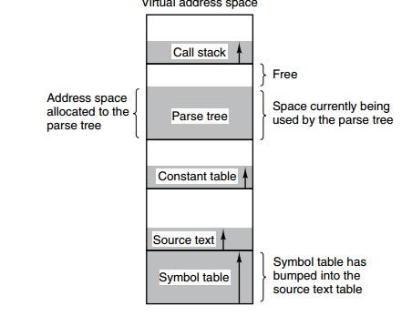
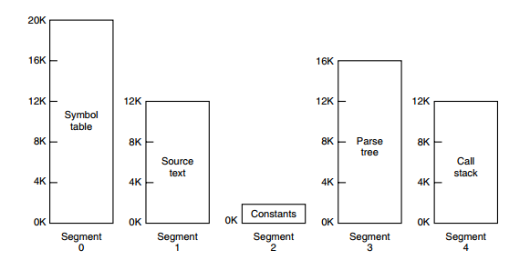
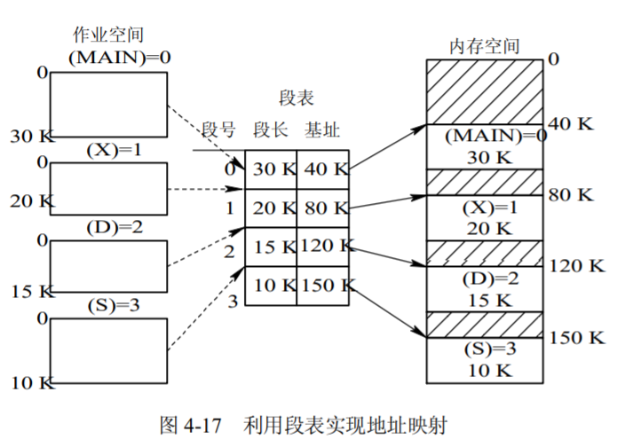
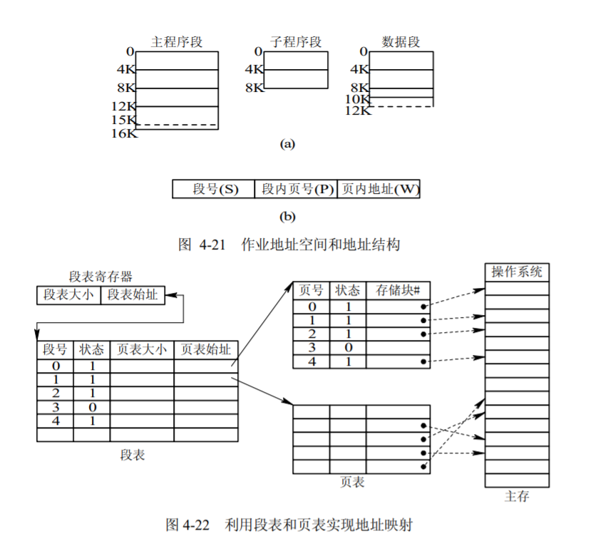

# 4.4 分段存储管理方式

## 1 分段存储管理

### 引入

* 虚拟内存采用的是分页技术，也就是将地址空间划分成固定大小的页，每一页再与内存进行映射。

* 下图为一个编译器在编译过程中建立的多个表，有 4 个表是动态增长的，如果使用分页系统的一维地址空间，动态增长的特点会导致覆盖问题的出现。

* 分段的做法是把每个表分成段，一个段构成一个独立的地址空间。每个段的长度可以不同，并且可以动态增长。

### 概念
1. 每个程序可由若干段组成，每一段都可以从“0”开始编址，段内的地址是连续的
2. 分段存储器的逻辑地址由两部分组成，段号、单元号

### 基本思想
1. 段式存储管理基于可变分区存储管理实现，一个进程要占用多个分区
2. 硬件需要增加一组用户可见的段地址寄存器（代码段、数据段、堆栈段、附加段），供地址转换使用
3. 存储管理需要增加设置一个段表，每个段占用一个段表项，包括：段始址、段限长，以及存储保护、可移动、可扩充等标志位

## 2 分段管理基本原理

### 分段地址结构

* 地址结构
  

### 段表

* 每个分段分配一个连续的分区，而进程中的各个段可以离散地移入内存中不同的分区中。为使程序能正常运行，亦即，能从物理内存中找出每个逻辑段所对应的位置，应像分页系统那样，在系统中为每个进程建立一张段映射表，简称“段表”
* 每个段在表中占有一个表项，其中记录了该段在内存中的起始地址(又称为“基址”)和段的长度，如图 4-17 所示。段表可以存放在一组寄存器中，这样有利于提高地址转换速度，但更常见的是将段表放在内存中。

### 地址变换结构

* 为了实现从进程的逻辑地址到物理地址的变换功能，在系统中设置了段表寄存器，用于存放段表始址和段表长度 TL。在进行地址变换时，系统将逻辑地址中的段号与段表长度TL 进行比较。

### 分页和分段的比较
* 相同点：
  * 两者都采用离散分配方式，且都要通过地址映射机构来实现地址变换。
* 不同点
  * 实现上：页是信息的物理单位，分页是为实现离散分配方式，以消减内存的外零头，提高内存的利用率。或者说，分页仅仅是由于系统管理的需要而不是用户的需要。段则是信息的逻辑单位，它含有一组其意义相对完整的信息。分段的目的是为了能更好地满足用户的需要。
  * 页的大小固定且由系统决定，由系统把逻辑地址划分为页号和页内地址两部分，是由机器硬件实现的，因而在系统中只能有一种大小的页面；而段的长度却不固定，决定于用户所编写的程序，通常由编译程序在对源程序进行编译时，根据信息的性质来划分。
  * 分页的作业地址空间是一维的，即单一的线性地址空间，程序员只需利用一个记忆符，即可表示一个地址；而分段的作业地址空间则是二维的，程序员在标识一个地址时，既需给出段名，又需给出段内地址。
  * 出现的原因：分页主要用于实现虚拟内存，从而获得更大的地址空间；分段主要是为了使程序和数据可以被划分为逻辑上独立的地址空间并且有助于共享和保护。

### 段的共享
1. 通过不同进程段表中的项指向同一个段基址来实现
2. 对共享段的信息必须进行保护，如规定只能独处不能写入，不满足保护条件则产生保护中断

## 3 段页式存储管理
### 基本原理
1. 段式存储管理可以基于页式存储管理实现。是分段和分页原理的结合。
2. 每一段不必占据连续的存储空间，可存放在不连续的主存物理块中
3. 能够扩充为段页式虚拟存储管理
4. 装入部分段，或者装入段中部分页面

### 地址变换结构
* 先将用户程序分成若干个段，再把每个段分成若干个页，并为每一个段赋予一个段名。图 4-21 示出了一个作业地址空间的结构。该作业有三个段，页面大小为 4 KB。在段页式系统中，其地址结构由段号、段内页号及页内地址三部分所组成。

### 地址变换过程

1. 首先利用段号 S，将它与段表长 TL 进行比较。若 $S<TL$表示未越界，于是利用段表始址和段号来求出该段所对应的段表项在段表中的位置，从中得到该段的页表始址
2. 并利用逻辑地址中的段内页号 P 来获得对应页的页表项位置，从中读出该页所在的物理块号 b
3. 再利用块号 b 和页内地址来构成物理地址。

### 地址变换的代价
* 为了获得一条指令或数据，须三次访问内存。第一次访问是访问内存中的段表，从中取得页表始址；
* 第二次访问是访问内存中的页表，从中取出该页所在的物理块号，并将该块号与页内地址一起形成指令或数据的物理地址；
* 第三次访问才是真正从第二次访问所得的地址中，取出指令或数据。

