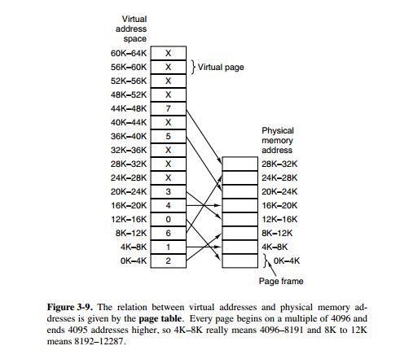

# 4.5 虚拟存储器的基本概念

## 1 虚拟存储器

### 引入
* 虚拟内存的目的是为了让物理内存扩充成更大的逻辑内存，从而让程序获得更多的可用内存。
* 为了更好的管理内存，操作系统将内存抽象成地址空间。每个程序拥有自己的地址空间，这个地址空间被分割成多个块，每一块称为一页。这些页被映射到物理内存，但不需要映射到连续的物理内存，也不需要所有页都必须在物理内存中。当程序引用到不在物理内存中的页时，由硬件执行必要的映射，将缺失的部分装入物理内存并重新执行失败的指令。
* 从上面的描述中可以看出，虚拟内存允许程序不用将地址空间中的每一页都映射到物理内存，也就是说一个程序不需要全部调入内存就可以运行，这使得有限的内存运行大程序成为可能。例如有一台计算机可以产生 16 位地址，那么一个程序的地址空间范围是 0\~64K。该计算机只有 32KB 的物理内存，虚拟内存技术允许该计算机运行一个 64K 大小的程序。

### 概念

* 没有必要全部装入内存，仅须将那些当前要运行的少数页面或段先装入内存便可运行，其余部分暂留在盘上。
  * 程序在运行时，如果它所要访问的页(段)已调入内存，便可继续执行下去；
  * 但如果程序所要访问的页(段)尚未调入内存(称为缺页或缺段)，此时程序应利用 OS 所提供的请求调页(段)功能，将它们调入内存，以使进程能继续执行下去。
  * 如果此时内存已满，无法再装入新的页(段)，则还须再利用页(段)的置换功能，将内存中暂时不用的页(段)调至盘上，腾出足够的内存空间后，再将要访问的页(段)调入内存，使程序继续执行下去。
* 虚拟存储器，是指具有请求调入功能和置换功能，能从逻辑上对内存容量加以扩充的一种存储器系统。

## 2 虚拟存储器的实现
### 分页请求系统
* 增加了**请求调页功能**和**页面置换功**能所形成的页式虚拟存储系统。它允许只装入少数页面的程序(及数据)，便启动运行。以后，再通过调页功能及页面置换功能，陆续地把即将要运行的页面调入内存，同时把暂不运行的页面换出到外存上。
  * 请求分页

### 请求分段系统
* 这是在分段系统的基础上，增加了**请求调段**及**分段置换功能**后所形成的段式虚拟存储系统。它允许只装入少数段(而非所有的段)的用户程序和数据，即可启动运行。以后再通过调段功能和段的置换功能将暂不运行的段调出，同时调入即将运行的段。置换是以段为单位进行的。

### 虚拟存储器的特征

* 多次性
* 兑换性
* 虚拟性

## 3 请求分页功能
<!-- 用来实现虚拟内存的功能 -->
## 4 请求分段功能
<!-- 用来实现虚拟内存的功能 -->