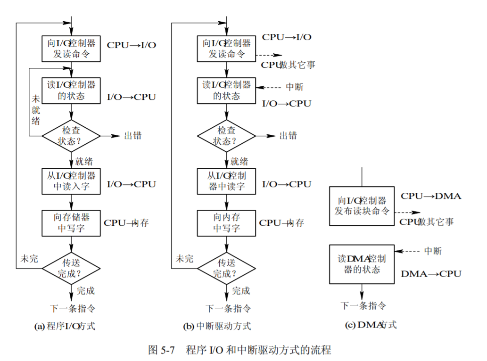
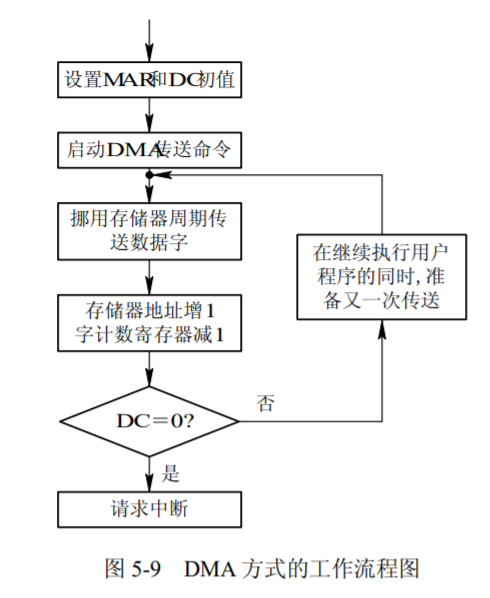
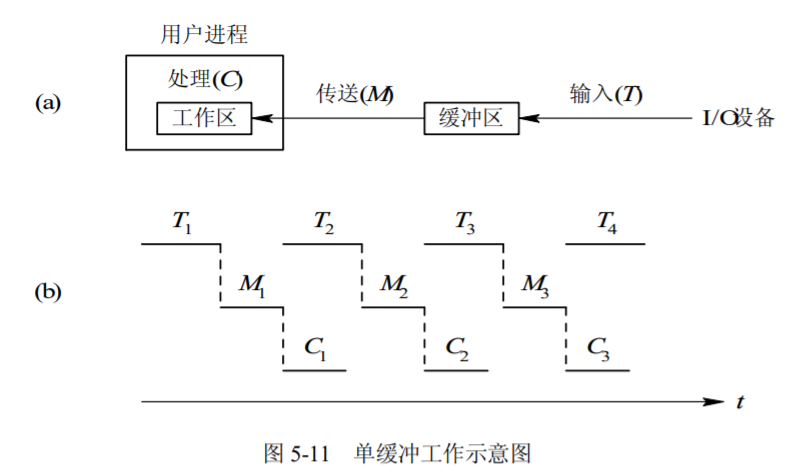
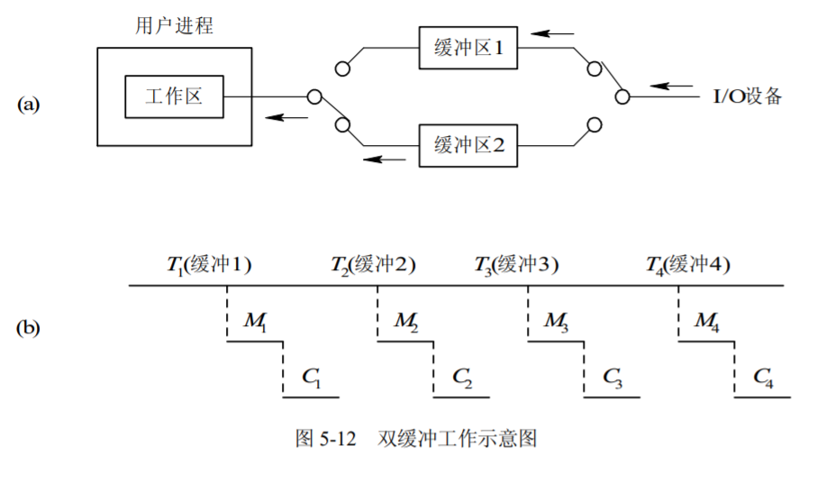
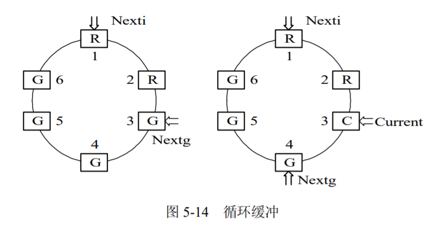
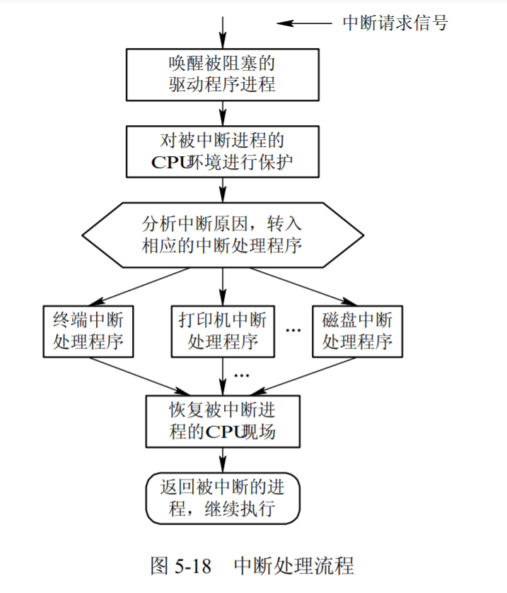
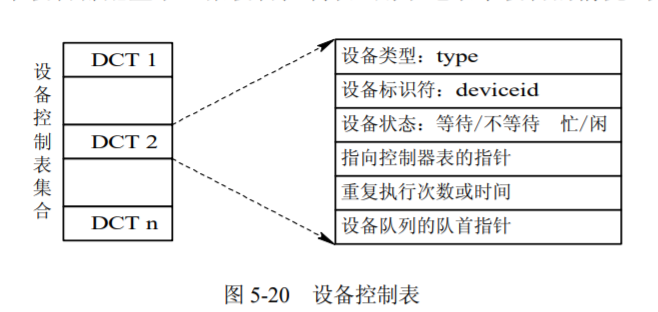
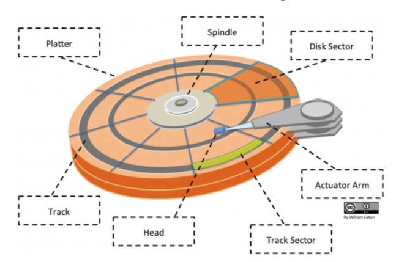
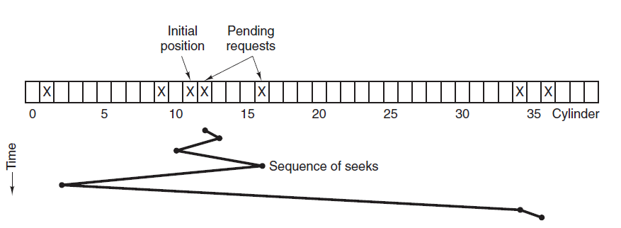
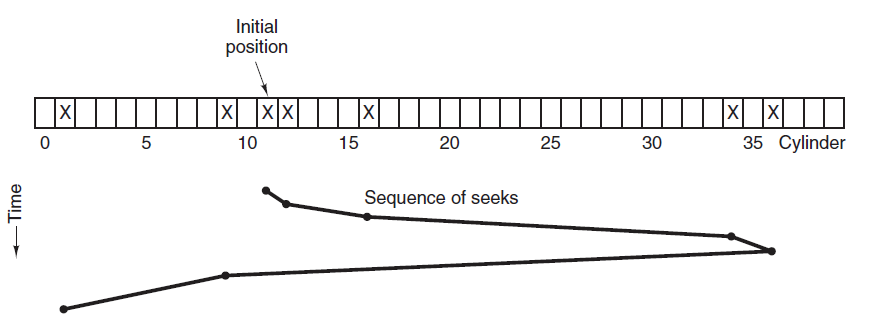

# 设备管理

> ## 目录
> 
> 1. IO系统
> 2. IO控制方式
> 3. 缓冲管理
> 4. IO软件
> 5. 设备分配
> 6. 磁盘存储器管理

## 1.1 IO系统

### 定义
* IO设备。用于计算机系统与外部世界进行信息交换或存储。
* IO操作。内存和IO设备之间的信息传送操作。不仅影响计算机的通用性和可扩充性，也是计算机系统综合处理能力及性价比的重要因素。

### 分类
1. 按信息传输方向划分
    1. 输入设备：将外界信息输入计算机（键盘、鼠标、扫描仪等）
    2. 输出设备：将计算结果输出（显示器、打印机等）
    3. 输入输出设备：既可以输入信息，也可以输出信息（磁盘驱动器、网卡等）
2. 按交互功能划分
    1. 人机交互设别：用于用户与计算机之间的交互通信（鼠标、键盘、显示器等）
    2. 存储设备：持久性存储大量信息并快速检索（磁盘驱动器、光盘驱动器等）
    3. 机机通信设备：用于计算机和计算机之间的通信（网卡、调制解调器等）
3. 按设备管理划分
    1. 字符设备：以字符为单位进行信息交换，发送或接收一个字符流（鼠标、显示器等）
    2. 块设备：以固定大小的数据块（块是存储介质上联系信息组成的一个区域）进行信息交换（磁盘驱动器等）
    3. 网络设备：用于与远程设备通信的设备（网卡等，可以抽象为传送字符流的特殊字符设备，也可以抽象为传送连续小块数据的块设备）

### 设备管理目标
1. 克服设备和CPU速度的不匹配所引起的问题，使主机和设备并行工作，提高设备使用效率
2. 对设备进行抽象，屏蔽设备的物理细节和操作过程，配置驱动程序，提供统一界面，供用户或高层软件使用
    * 抽象为文件系统中的节点，统一管理
    * 裸设备：不被操作系统直接管理，由应用程序读写，I/O效率更高

### 设备管理功能
1. 设备中断处理
2. 缓冲区处理
3. 设备的分配和去配
4. 设备驱动调度
5. 实现虚拟设备

### 设备管理层次
1. I/O硬件
    1. I/O设备及其接口线路
    2. 控制部件
    3. 通道
2. I/O软件
    1. 系统I/O软件
    2. 用户空间I/O软件

## 1.2 设备控制器
### 定义
1. 为达到模块化和通用性的设计目标，通常将I/O设备中的机械部件和电子部件分开处理其中，电子部件称为设备控制器。
2. 操作系统与控制器交互，而非与设备交互

### 功能：CPU与设备之间的接口
1. 接收和识别CPU或通道发来的命令
2. 实现数据交换
3. 发现和记录设备及自身的状态信息，供CPU处理使用
4. 当连接多台设备时，设备地址识别

### 组成部分
1. 状态/控制寄存器
2. 数据缓冲寄存器
3. 地址译码器和I/O控制逻辑
4. 外设接口控制逻辑

## 1.3 IO通道

### 概念

* 使一些原来由 CPU 处理的 I/O 任务转由通道来承担，从而把 CPU 从繁杂的 I/O 任务中解脱出来。在设置了通道后，CPU 只需向通道发送一条 I/O指令。通道在收到该指令后，便从内存中取出本次要执行的通道程序，然后执行该通道程序，仅当通道完成了规定的 I/O 任务后，才向 CPU 发中断信号。
* I/O 通道是一种特殊的处理机，它具有执行 I/O 指令的能力，并通过执行通道(I/O)程序来控制 I/O 操作。

### 通道类型

* 字节多路通道(Byte Multiplexor Channel)
* 数组选择通道(Block Selector Channel) 
* 数组多路通道(Block Multiplexor Channel) 

## 1.4 总线系统

### 单总线
1. 将CPU、主存和I/O模块连接到同一组总线上
2. 优点：结构简单，易于扩充
3. 缺点：主存需要和I/O模块共用总线；设备增多会造成总线变长，进而增加传输时延；无法适用于大量高速设备

### 传统的三级总线
1. 主存和Cache通过主存总线传送数据，主存总线和扩展总线上的I/O设备之间传送数据通过扩展总线接口缓冲
2. 优点：主存与I/O之间的数据传送与处理器的活动分离；可以支持更多的I/O设备
3. 缺点：不适用于I/O设备数据速率相差太大的情形

### 采用南北桥的多级总线
1. 通过存储总线、PCI总线、E（ISA）总线分别连接主存、高速I/O设备和低速I/O设备
2. 优点：可以支持不同数据速率的I/O设备

### 采用I/O通道的多级总线
1. 支持CPU、主存和多个I/O通道之间的数据传送
2. 支持I/O通道和I/O控制器，以及I/O控制器，以及I/O控制器和设备之间的数据传送

## 2 IO控制方式

### 轮询方式
1. 流程：
    1. 处理器向控制器发送一个I/O命令
    2. 如果设备未就绪，则重复测试过程，直至设备就绪
    3. 执行数据交换
    4. 等待I/O操作完成后，才可以继续其他操作
2. 处理I/O请求会终止原程序的执行
3. CPU需要等待I/O设备就绪
4. CPU需要参与数据传送
5. CPU和设备只能串行工作，效率低下

### 中断方式

1. 流程：
    1. 处理器向控制器发出一个I/O命令，然后继续执行后续指令
        1. 如果该进程不需要等待I/O完成，后续指令可以仍是该进程中的指令
        2. 否则，该进程在这个中断上挂起，处理器执行其他工作
    2. 控制器检查设备状态，就绪后发起中断
    3. CPU响应中断，转向中断处理程序
    4. 中断处理程序执行数据读写操作
    5. 恢复执行原先的程序
2. 响应中断后会终止原程序的执行
3. CPU不需要等待I/O设备就绪
4. CPU需要参与数据传送
5. CPU和设备部分并行操作，效率有所提高

### 直接存储器访问（DMA）

1. DMA模块：模仿处理器来控制主存和设备控制器之间的数据交换
2. 流程：
    1. 处理器向DMA模块发出I/O命令
    2. 处理器继续执行其他工作，DMA模块负责传送全部数据
    3. 数据传送结束后，DMA中断处理器
3. 方式
    1. CPU不会终止原程序的执行
    2. CPU只在数据传送的开始和结束时参与
        1. 开始时，CPU需要对DMA模块进行初始化
        2. 结束时，CPU响应中断，但不必保存现场
    3. 周期窃取
        1. 当DMA和CPU同时经总线访问内存时，CPU总是将总线的占有权让给DMA一个或几个主存周期
        2. 周期窃取对延迟CPU与主存的数据交换影响不大
            1. 数据传送过程是不连续的和不规则的
            2. CPU大部分情况下与Cache进行数据交换，直接访问内存较少

### I/O控制方式的演化
1. 采用轮询方式的设备控制器：CPU需要等待设备就绪，且参与数据传送
2. 采用中断方式的设备控制器：CPU无需等待设备就绪，但响应中断后参与数据传送
3. 通过DMA直接控制存储器：CPU在数据传送开始和结束时参与，与主存进行数据交换时不参与

## 3 缓冲管理

### 目的
* 解决CPU与设备之间速度不匹配的矛盾，协调逻辑记录大小和物理记录大小不一致的问题，提高CPU和设备的并行性，减少I/O操作对CPU的中断次数，放宽对CPU中断响应时间的要求
* 缓冲区：在内存中开辟的存储区，专门用于临时存放I/O操作的数据
### 操作
1. 写操作：将数据送至缓冲区，直到装满，进程继续计算，同时系统将缓冲区的内容写到设备上
2. 读操作：系统将设备上的物理记录读至缓冲区，根据要求将当前所需要的数据从缓冲区中读出并传送给进程

### 单缓冲

* 操作系统在主存的系统区中开设一个缓冲区
  1. 输入：将数据读至缓冲区，系统将缓冲区数据送至用户区，应用程序对数据进行处理，同时系统读入接下来的数据
  2. 输出：把数据从用户区复制到缓冲区，系统将数据输出后，应用程序继续请求输出

### 双缓冲

* 使用两个缓冲区
  1. 输入：设备先将数据输入缓冲区1，系统从缓冲区1把数据传到用户区，供应用程序处理，同时设备将数据传送到缓冲区2
  2. 输出：应用程序将数据从用户传送到缓冲区1，系统将数据传送到设备，同时应用程序将数据传送到缓冲区2

### 循环缓冲

* 操作系统分配一组缓冲区，每个缓冲区都有指向下一个缓冲区的链接指针，构成循环缓冲
  1. 解决设备和进程速度不匹配的问题
  2. 为系统公共资源，供进程共享并由系统统一分配和管理

### 缓冲池

* 缓冲池(Buffer Pool)，在池中设置了多个可供若干个进程共享的缓冲区。包括以下三种内容
  * 空闲缓冲区。空缓冲队列
  * 装满输入数据缓冲区。输入队列
  * 装满输出数据缓冲区。输出队列
* 两个操作
  * getbuf
  * putbuf

## 4 IO软件
### 设计目标
1. 高效率：改善设备效率，尤其是磁盘I/O操作的效率
2. 通用性：用统一的标准来管理所有设备

### 设计思路
1. 把软件组织称层次结构，低层软件用来屏蔽硬件细节，高层软件向用户提供简洁、友善的界面

### 主要考虑的问题
1. 设备无关性：编写访问文件的程序与具体设备无关
2. 出错处理：低层软件能处理的错误不让高层软件感知
3. 同步/异步传输：支持阻塞和中断驱动两种工作方式
4. 缓冲技术：建立数据缓冲区，提高吞吐率

### 用户空间的I/O软件
* 库函数
    1. 一小部分I/O软件不在操作系统中，是与应用程序链接在一起的库函数，甚至完全由运行于用户态的程序组成
    2. 系统调用通常由库函数封装后供用户使用，封装函数只是将系统调用所用的参数放在合适位置，然后执行访管指令来陷入内核，再由内核函数实现真正的IO操作
*  SPOOLing软件
    1. 在内核外运行的系统I/O软件，采用预输入、缓输出和井管理技术，通过创建守护进程和特殊目录解决独占型设备的空占问题

### I/O中断处理程序

1. 位于操作系统底层，与硬件设备密切相关，与系统其余部分尽可能少地发生联系
2. 进程请求I/O操作时，通常被挂起，直到数据传输结束后并产生I/O中断时，操作系统接管CPU后转向中断处理程序
3. 当设备向CPU提出中断请求时，CPU响应请求并转入中断处理程序
4. 功能：
    1. 检查设备状态寄存器内容，判断产生中断的原因，根据I/O操作的完成情况进行相应的处理
        1. 如果数据传输有错，向上层软件报告设备的出错信息，实施重新执行
        2. 如果正常结束，唤醒等待传输的过程，使其转换为就绪态
        3. 如果有等待传输的I/O命令，通知相关软件启动下一个I/O请求

### 独立于设备的I/O软件
1. 执行适用于所有设备的常用I/O功能，并向用户层软件提供一致性接口
2. 功能：
    1. 设备命名：通过路径名寻址设备
    2. 设备保护：检查用户是否有权访问所申请设备
    3. 提供与设备无关的数据单位：字符数量，块尺寸
    4. 缓冲技术：传输速率，时间约束，不能直接送达目的地
    5. 设备分配和状态跟踪：分配到不同类型的设备
    6. 错误处理和报告：驱动程序无法处理的错误

### 设备驱动程序
1. 包括与设备密切相关的所有代码
2. 从独立于设备的软件中接收并执行I/O请求
    1. 把用户提交的逻辑I/O请求转化为物理I/O操作的启动和执行
    2. 监督设备是否正确执行，管理数据缓冲区，进行必要的纠错处理
3. 功能：
    1. 设备初始化
        1. 在系统初次启动或设备传输数据时，预置设备和控制器以及通道状态
    2. 执行设备驱动例程
        1. 负责启动设备，进行数据传输
        2. 对于具有通道方式，还负责生成通道指令和通道程序，启动通道工作
    3. 调用和执行中断处理程序
        1. 负责处理设备和控制器及通道所发出的各种中断
4. 层次：
    1. 每个设备驱动程序只处理一种设备，或者一类紧密相关的设备
    2. 设备驱动程序分为整体驱动程序和分层驱动程序
        1. 整体驱动程序直接向操作系统提供接口和控制硬件
            1. 适用于功能简单的驱动程序，效率较高，但较难迁移
        2. 分层驱动程序将驱动程序分成多层，放在栈中，系统接到I/O请求时先调用栈顶的驱动程序，栈顶的驱动程序可以直接处理请求或向下调用更底层的驱动程序，直至请求被处理
            1. 适用于功能复杂，重用性要求较高的驱动程序，结构清晰且便于移植，但会增加一部分系统开销
## 5 设备分配

### 设备独立性
1. 作业执行前会对设备提出申请时，指定某台具体的物理设备会让设备分配变得简单，但如果所指定设备出现故障，即便计算机系统中有同类设备也不能运行
2. 设备独立性
1. 用户通常不指定物理设备，而是指定逻辑设备，使得用户作业和物理设备分离开来，再通过其他途径建立逻辑设备和物理设备之间的映射
3. 设备管理中需要将逻辑设备名转换为物理设备名，为此系统需要提供逻辑设备名和物理设备名的对应表以供转换使用
4. 微型计算机的操作系统中不一定支持设备独立性
5. 优点：
    1. 应用程序与具体物理设备无关，系统增减或变更设备时不需要修改源程序
    2. 易于应对I/O设备故障，提高系统可靠性
    3. 增加设备分配的灵活性，更有效地利用设备资源，实现多道程序设计

### 设备分配方式
* 独占设备
  1. 只能由一个进程独占式使用
  2. 可以让多个进程同时使用的设备称为"共享设备“，其管理工作主要是驱动调度和实施驱动，一般不必分配

* 分配方式
  1. 静态分配：实现简单，能够防止系统发生死锁，但会降低设备利用率
  2. 动态分配：提高设备利用率

### 设备分配的数据结构
* 设备类表
  1. 每类设备对应于设备类表的中一栏
  2. 包括：设备类，总台数，空闲台数，设备表起始地址等
  3. 支持设备独立性时才会使用

*  设备表
   1. 每类设备都有各自的设备表，用来登记这类设备中的每台物理设备
   2. 包括：物理设备名（号），逻辑设备名（号），占有设备的进程号，是否分配，好/坏标志等

## 6 磁盘存储器管理

### 磁盘结构

- 盘面（Platter）：一个磁盘有多个盘面；
- 磁道（Track）：盘面上的圆形带状区域，一个盘面可以有多个磁道；
- 扇区（Track Sector）：磁道上的一个弧段，一个磁道可以有多个扇区，它是最小的物理储存单位，目前主要有 512 bytes 与 4 K 两种大小；
- 磁头（Head）：与盘面非常接近，能够将盘面上的磁场转换为电信号（读），或者将电信号转换为盘面的磁场（写）；
- 制动手臂（Actuator arm）：用于在磁道之间移动磁头；
- 主轴（Spindle）：使整个盘面转动。

### 磁盘读写数据
1. 读写数据时，磁头必须定位到指定的磁道上的指定扇区的开始处
2. 过程：
    1. 寻道：控制移动臂到达指定柱面，选择磁头号
    2. 旋转：等待要读写的扇区旋转到磁头下
    3. 数据传送

### 磁盘存取时间：

* 磁盘完成数据读写所需要的时间=寻道时间、旋转延迟、传送时间的总和 
  1. Ta：存取时间
  2. Ts：寻道时间
  3. r：磁盘旋转速度（单位：转/秒）
  4. B：要传送的字节数
  5. N：一个磁道中的字节数

$$T_a=T_s+\frac{1}{2r}+\frac{b}{rN}$$
 

### 磁盘调度算法

* 读写一个磁盘块的时间的影响因素有一下三种。其中，寻道时间最长，因此磁盘调度的主要目标是使磁盘的平均寻道时间最短。
  - 旋转时间（主轴转动盘面，使得磁头移动到适当的扇区上）
  - 寻道时间（制动手臂移动，使得磁头移动到适当的磁道上）
  - 实际的数据传输时间

1. 先来先服务FCFS, First Come First Served
   * 按照磁盘请求的顺序进行调度。

   * 优点是公平和简单。缺点也很明显，因为未对寻道做任何优化，使平均寻道时间可能较长。

2. 最短寻道时间优先SSTF, Shortest Seek Time First

    * 优先调度与当前磁头所在磁道距离最近的磁道。

    * 虽然平均寻道时间比较低，但是不够公平。如果新到达的磁道请求总是比一个在等待的磁道请求近，那么在等待的磁道请求会一直等待下去，也就是出现饥饿现象。具体来说，两端的磁道请求更容易出现饥饿现象。

3. 电梯算法SCAN

    * 电梯总是保持一个方向运行，直到该方向没有请求为止，然后改变运行方向。
    * 电梯算法（扫描算法）和电梯的运行过程类似，总是按一个方向来进行磁盘调度，直到该方向上没有未完成的磁盘请求，然后改变方向。因为考虑了移动方向，因此所有的磁盘请求都会被满足，解决了 SSTF 的饥饿问题。
    

## 7 虚拟设备
### 概念

* 使用一类物理设备模拟另一类物理设备的技术。比如：内存卡模拟磁盘、块设备模拟字符设备、输入输出重定向……
### 经典的SPOOLing系统
1. 为存放输入数据和输出数据，系统在磁盘上开辟输入井和输出井
    1. 井是用作缓冲的存储区域
2. 组成
    1. 预输入程序：将数据从输入设备传送到磁盘输入井
    2. 缓输出程序：将数据从磁盘输出井传送到输出设备
    3. 井管理程序：控制作业和井之间的数据交换
3. 作用
    1. 预输入：操作系统将作业需要的输入数据成批从输入设备上预先输入至磁盘的输入缓冲区中暂存
        1. 调度作业执行时，作业使用数据不必再启动输入设备，从磁盘的输入缓冲区读入即可
    2. 缓输出：作业不启动输出设备，只是将输出数据暂存到磁盘的输出缓冲区
        1. 作业执行完毕后，由操作系统成批输出
4. 不仅设备利用率提高，作业的运行时间也会缩短，每个作业都感觉各自拥有所需的独占设备

### 打印机SPOOLing
1. 打印机空占问题
    1. 如果用户进程通过打开打印机的设备文件来申请和使用打印机，往往会造成该进程打开设备文件后长达数小时不用，但其他进程又无法使用打印机
2. 打印机守护进程和SPOOLing打印目录
    1. 守护进程是唯一有特权使用打印机设备的进程
    2. 打印文件前，用户进程先产生完整的带输出文件，并存放在打印目录下
    3. 打印机空闲时，启动守护进程，打印带输出文件
