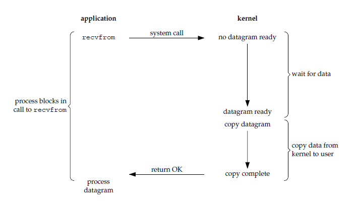
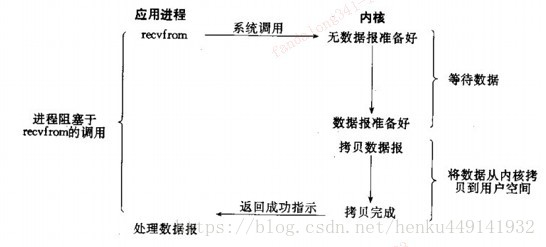
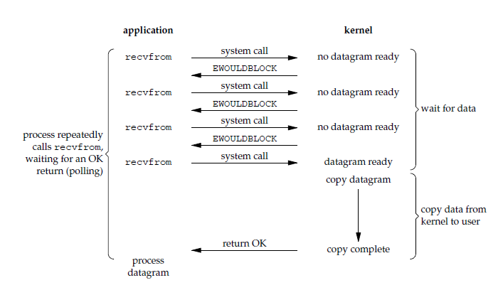
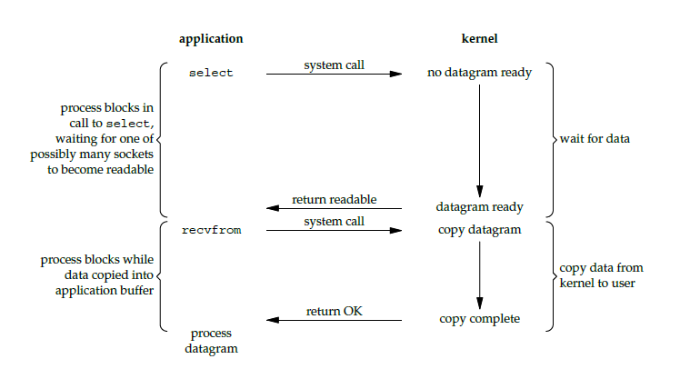
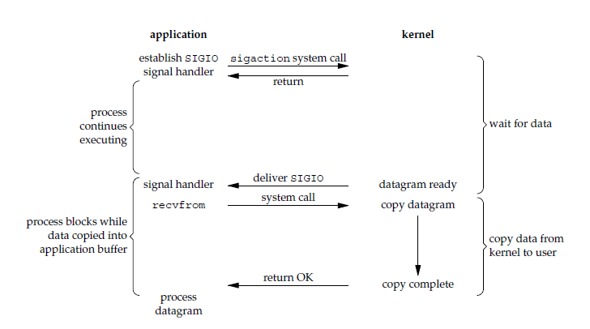
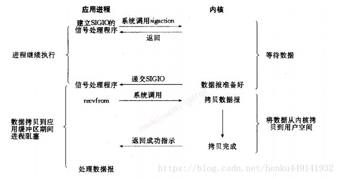
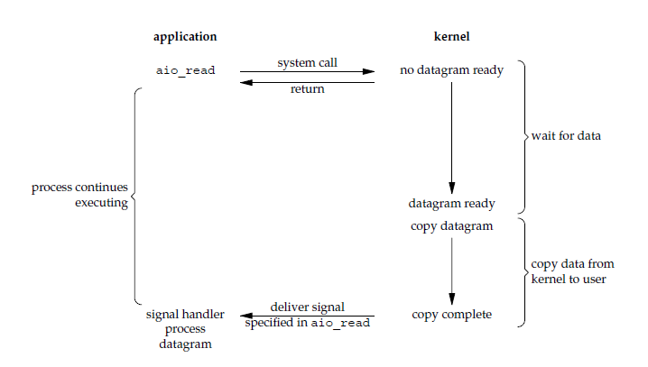
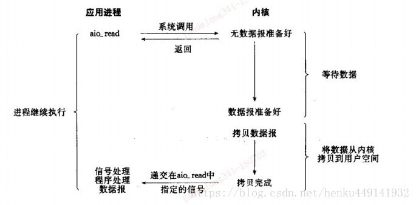
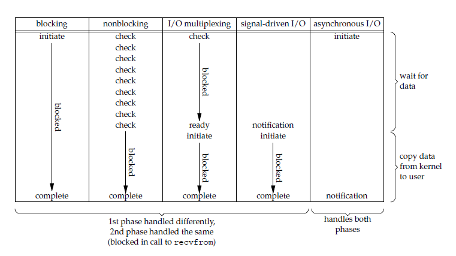

# 五种IO模型

> linux实现IO过程的方法有很多。这里只对五种模型进行介绍。如果要实现五种IO过程，在linux系统编程部分进行学习。


## 1 I/O 模型

* 一个输入操作通常包括两个阶段：

    - 等待数据准备好
    - 从内核向进程复制数据

* 对于一个套接字上的输入操作，第一步通常涉及等待数据从网络中到达。当所等待数据到达时，它被复制到内核中的某个缓冲区。第二步就是把数据从内核缓冲区复制到应用进程缓冲区。

* Unix 有五种 I/O 模型：

  - 阻塞式 I/O
  - 非阻塞式 I/O
  - I/O 复用（select 和 poll）
  - 信号驱动式 I/O（SIGIO）
  - 异步 I/O（AIO）

### 阻塞式 I/O

* 应用进程被阻塞，直到数据从内核缓冲区复制到应用进程缓冲区中才返回。

* 应该注意到，在阻塞的过程中，其它应用进程还可以执行，因此阻塞不意味着整个操作系统都被阻塞。因为其它应用进程还可以执行，所以不消耗 CPU 时间，这种模型的 CPU 利用率会比较高。

* 下图中，recvfrom() 用于接收 Socket 传来的数据，并复制到应用进程的缓冲区 buf 中。这里把 recvfrom() 当成系统调用。

```c
ssize_t recvfrom(int sockfd, void *buf, size_t len, int flags, struct sockaddr *src_addr, socklen_t *addrlen);
```




### 非阻塞式 I/O

* 应用进程执行系统调用之后，内核返回一个错误码。应用进程可以继续执行，但是需要不断的执行系统调用来获知 I/O 是否完成，这种方式称为轮询（polling）。

* 由于 CPU 要处理更多的系统调用，因此这种模型的 CPU 利用率比较低。



### I/O 复用（事件驱动IO）
* I/O多路复用。I/O指的是I/O事件（包括I/O读写、I/O异常等事件）,多路指多个独立连接(或多个Channel)，复用指多个事件复用一个控制流（线程或进程）。串起来理解就是很多个独立I/O事件的处理依赖于一个控制流。
* 主要是select、poll、epoll；对一个IO端口，两次调用，两次返回，比阻塞IO并没有什么优越性；关键是能实现同时对**多个IO端口进行监听**；
* I/O复用模型会用到select、poll、epoll函数，这几个函数也会使进程阻塞，但是和阻塞I/O所不同的的，这两个函数可以同时阻塞多个I/O操作。而且可以同时对多个读操作，多个写操作的I/O函数进行检测，直到有数据可读或可写时，才真正调用I/O操作函数。当某一个套接字可读时返回，之后再使用 recvfrom 把数据从内核复制到进程中。
* 它可以让**单个进程具有处理多个 I/O 事件的能力**。又被称为 Event Driven I/O，即**事件驱动 I/O**。

* 如果一个 Web 服务器没有 I/O 复用，那么每一个 Socket 连接都需要创建一个线程去处理。如果同时有几万个连接，那么就需要创建相同数量的线程。相比于多进程和多线程技术，I/O 复用不需要进程线程创建和切换的开销，系统开销更小。



### 信号驱动 I/O

* 应用进程使用 sigaction 系统调用，内核立即返回，应用进程可以继续执行，也就是说等待数据阶段应用进程是非阻塞的。内核在数据到达时向应用进程发送 SIGIO 信号，应用进程收到之后在信号处理程序中调用 recvfrom 将数据从内核复制到应用进程中。

* 相比于非阻塞式 I/O 的轮询方式，信号驱动 I/O 的 CPU 利用率更高。





### 异步 I/O

* 应用进程执行 aio_read 系统调用会立即返回，应用进程可以继续执行，不会被阻塞，内核会在所有操作完成之后向应用进程发送信号。

* 异步 I/O 与信号驱动 I/O 的区别在于，异步 I/O 的信号是通知应用进程 I/O 完成，而信号驱动 I/O 的信号是通知应用进程可以开始 I/O。




### 五大 IO 模型比较

- 同步IO：将数据从内核缓冲区复制到应用进程缓冲区的阶段（第二阶段），应用进程会阻塞。包括阻塞式 IO、非阻塞式 IO、IO 复用和信号驱动 IO 。
- 异步IO：第一阶段和第二阶段应用进程不会阻塞。

* 同步IO的主要区别在第一个阶段。阻塞式IO、IO复用第一阶段会阻塞。非阻塞式IO、信号驱动IO在第一阶段不会阻塞。



## 2 I/O 复用实现方式

> select/poll/epoll 都是 I/O 多路复用的具体实现，select 出现的最早，之后是 poll，再是 epoll。

## 2.1 select
* select 允许应用程序监视一组文件描述符，等待一个或者多个描述符成为就绪状态，从而完成 I/O 操作。


### 函数说明
```c
int select(int n, fd_set *readfds, fd_set *writefds, fd_set *exceptfds, struct timeval *timeout);
```

* 参数
    - fd_set 使用数组实现，数组大小使用 FD_SETSIZE 定义，所以只能监听少于 FD_SETSIZE 数量的描述符。有三种类型的描述符类型：readset、writeset、exceptset，分别对应读、写、异常条件的描述符集合。

    - timeout 为超时参数，调用 select 会一直阻塞直到有描述符的事件到达或者等待的时间超过 timeout。

* 返回值
    - 成功调用返回结果大于 0，出错返回结果为 -1，超时返回结果为 0。

### 代码实现
```c
fd_set fd_in, fd_out;
struct timeval tv;

// Reset the sets
FD_ZERO( &fd_in );
FD_ZERO( &fd_out );

// Monitor sock1 for input events
FD_SET( sock1, &fd_in );

// Monitor sock2 for output events
FD_SET( sock2, &fd_out );

// Find out which socket has the largest numeric value as select requires it
int largest_sock = sock1 > sock2 ? sock1 : sock2;

// Wait up to 10 seconds
tv.tv_sec = 10;
tv.tv_usec = 0;

// Call the select
int ret = select( largest_sock + 1, &fd_in, &fd_out, NULL, &tv );

// Check if select actually succeed
if ( ret == -1 )
    // report error and abort
else if ( ret == 0 )
    // timeout; no event detected
else
{
    if ( FD_ISSET( sock1, &fd_in ) )
        // input event on sock1

    if ( FD_ISSET( sock2, &fd_out ) )
        // output event on sock2
}
```
### 运行机制

* select()的机制中提供一种fd_set的数据结构，实际上是一个long类型的数组，每一个数组元素都能与一打开的文件句柄（不管是Socket句柄,还是其他文件或命名管道或设备句柄）建立联系，建立联系的工作由程序员完成，当调用select()时，由内核根据IO状态修改fd_set的内容，由此来通知执行了select()的进程哪一Socket或文件可读。
* 从流程上来看，使用select函数进行IO请求和同步阻塞模型没有太大的区别，甚至还多了添加监视socket，以及调用select函数的额外操作，效率更差。但是，使用select以后最大的优势是用户可以在一个线程内同时处理多个socket的IO请求。用户可以注册多个socket，然后不断地调用select读取被激活的socket，即可达到在同一个线程内同时处理多个IO请求的目的。而在同步阻塞模型中，必须通过多线程的方式才能达到这个目的。

### select机制的问题
* 每次调用select，都需要把fd_set集合从用户态拷贝到内核态，如果fd_set集合很大时，那这个开销也很大
* 同时每次调用select都需要在内核遍历传递进来的所有fd_set，如果fd_set集合很大时，那这个开销也很大
* 为了减少数据拷贝带来的性能损坏，内核对被监控的fd_set集合大小做了限制，并且这个是通过宏控制的，大小不可改变(限制为1024)

## 2.2 poll

* poll的机制与select类似，与select在本质上没有多大差别，管理多个描述符也是进行轮询，根据描述符的状态进行处理，但是poll没有最大文件描述符数量的限制。poll 的功能与 select 类似，也是等待一组描述符中的一个成为就绪状态。也就是说，poll只解决了上面的问题3，并没有解决问题1，2的性能开销问题。

### 函数说明
```c
int poll(struct pollfd *fds, unsigned int nfds, int timeout);
// poll 中的描述符是 pollfd 类型的数组，pollfd 的定义如下：
struct pollfd {
    int   fd;         /* file descriptor */
    short events;     /* requested events */
    short revents;    /* returned events */
};
```
* 参数
  * struct pollfd *fds fds是一个struct pollfd类型的数组，用于存放需要检测其状态的socket描述符，并且调用poll函数之后fds数组不会被清空；一个pollfd结构体表示一个被监视的文件描述符，通过传递fds指示 poll() 监视多个文件描述符。其中，结构体的events域是监视该文件描述符的事件掩码，由用户来设置这个域，结构体的revents域是文件描述符的操作结果事件掩码，内核在调用返回时设置这个域
  * nfds_t nfds 记录数组fds中描述符的总数量

* 返回值
  * int 函数返回fds集合中就绪的读、写，或出错的描述符数量，返回0表示超时，返回-1表示出错；

### 代码实现
```c
// The structure for two events
struct pollfd fds[2];

// Monitor sock1 for input
fds[0].fd = sock1;
fds[0].events = POLLIN;

// Monitor sock2 for output
fds[1].fd = sock2;
fds[1].events = POLLOUT;

// Wait 10 seconds
int ret = poll( &fds, 2, 10000 );
// Check if poll actually succeed
if ( ret == -1 )
    // report error and abort
else if ( ret == 0 )
    // timeout; no event detected
else
{
    // If we detect the event, zero it out so we can reuse the structure
    if ( fds[0].revents & POLLIN )
        fds[0].revents = 0;
        // input event on sock1

    if ( fds[1].revents & POLLOUT )
        fds[1].revents = 0;
        // output event on sock2
}
```

### 比较

1. 功能。select 和 poll 的功能基本相同，不过在一些实现细节上有所不同。
   - select 会修改描述符，而 poll 不会；
   - select 的描述符类型使用数组实现，FD_SETSIZE 大小默认为 1024，因此默认只能监听少于 1024 个描述符。如果要监听更多描述符的话，需要修改 FD_SETSIZE 之后重新编译；而 poll 没有描述符数量的限制；
   - poll 提供了更多的事件类型，并且对描述符的重复利用上比 select 高。
   - 如果一个线程对某个描述符调用了 select 或者 poll，另一个线程关闭了该描述符，会导致调用结果不确定。

2. 速度。select 和 poll 速度都比较慢，每次调用都需要将全部描述符从应用进程缓冲区复制到内核缓冲区。

3. 可移植性。几乎所有的系统都支持 select，但是只有比较新的系统支持 poll。

## 2.3 epoll
* epoll在Linux2.6内核正式提出，是基于事件驱动的I/O方式，相对于select来说，epoll没有描述符个数限制，使用一个文件描述符管理多个描述符，将用户关心的文件描述符的事件存放到内核的一个事件表中，这样在用户空间和内核空间的copy只需一次。

### 函数说明
```c
int epoll_create(int size);
int epoll_ctl(int epfd, int op, int fd, struct epoll_event *event)；
int epoll_wait(int epfd, struct epoll_event * events, int maxevents, int timeout);

struct epoll_event {
    __uint32_t events;  /* Epoll events */
    epoll_data_t data;  /* User data variable */
};

typedef union epoll_data {
    void *ptr;
    int fd;
    __uint32_t u32;
    __uint64_t u64;
} epoll_data_t;
```
1. epoll_create 函数创建一个epoll句柄，参数size表明内核要监听的描述符数量。调用成功时返回一个epoll句柄描述符，失败时返回-1。
2. epoll_ctl 函数注册要监听的事件类型。
  * epfd 表示epoll句柄
  * op 表示fd操作类型，有如下3种：
    * EPOLL_CTL_ADD 注册新的fd到epfd中
    * EPOLL_CTL_MOD 修改已注册的fd的监听事件
    * EPOLL_CTL_DEL 从epfd中删除一个fd
  * fd 是要监听的描述符
  * event 表示要监听的事件
3. epoll_wait 函数等待事件的就绪，成功时返回就绪的事件数目，调用失败时返回 -1，等待超时返回 0。
   * epfd 是epoll句柄
   * events 表示从内核得到的就绪事件集合
   * maxevents 告诉内核events的大小
   * timeout 表示等待的超时事件
### 原理
* epoll_ctl() 用于向内核注册新的描述符或者是改变某个文件描述符的状态。已注册的描述符在内核中会被维护在一棵**红黑树**上，通过**回调函数**内核会将 I/O 准备好的描述符加入到一个**链表**中管理，进程调用 epoll_wait() 便可以得到事件完成的描述符。
* 从上面的描述可以看出，epoll 只需要将描述符从**进程缓冲区向内核缓冲区拷贝一次**，并且进程不需要通过轮询来获得事件完成的描述符。
* epoll 仅适用于 Linux OS。epoll 比 select 和 poll 更加灵活而且没有描述符数量限制。
* epoll 对多线程编程更有友好，一个线程调用了 epoll_wait() 另一个线程关闭了同一个描述符也不会产生像 select 和 poll 的不确定情况。

### 代码实现
```c
// Create the epoll descriptor. Only one is needed per app, and is used to monitor all sockets.
// The function argument is ignored (it was not before, but now it is), so put your favorite number here
int pollingfd = epoll_create( 0xCAFE );

if ( pollingfd < 0 )
 // report error

// Initialize the epoll structure in case more members are added in future
struct epoll_event ev = { 0 };

// Associate the connection class instance with the event. You can associate anything
// you want, epoll does not use this information. We store a connection class pointer, pConnection1
ev.data.ptr = pConnection1;

// Monitor for input, and do not automatically rearm the descriptor after the event
ev.events = EPOLLIN | EPOLLONESHOT;
// Add the descriptor into the monitoring list. We can do it even if another thread is
// waiting in epoll_wait - the descriptor will be properly added
if ( epoll_ctl( epollfd, EPOLL_CTL_ADD, pConnection1->getSocket(), &ev ) != 0 )
    // report error

// Wait for up to 20 events (assuming we have added maybe 200 sockets before that it may happen)
struct epoll_event pevents[ 20 ];

// Wait for 10 seconds, and retrieve less than 20 epoll_event and store them into epoll_event array
int ready = epoll_wait( pollingfd, pevents, 20, 10000 );
// Check if epoll actually succeed
if ( ret == -1 )
    // report error and abort
else if ( ret == 0 )
    // timeout; no event detected
else
{
    // Check if any events detected
    for ( int i = 0; i < ready; i++ )
    {
        if ( pevents[i].events & EPOLLIN )
        {
            // Get back our connection pointer
            Connection * c = (Connection*) pevents[i].data.ptr;
            c->handleReadEvent();
         }
    }
}
```


### 工作模式

* epoll 的描述符事件有两种触发模式：LT（level trigger）和 ET（edge trigger）。
  1. LT 模式。当 epoll_wait() 检测到描述符事件到达时，将此事件通知进程，进程可以不立即处理该事件，下次调用 epoll_wait() 会再次通知进程。是默认的一种模式，并且同时支持 Blocking 和 No-Blocking。

  2. ET 模式。和 LT 模式不同的是，通知之后进程必须立即处理事件，下次再调用 epoll_wait() 时不会再得到事件到达的通知。
* 很大程度上减少了 epoll 事件被重复触发的次数，因此效率要比 LT 模式高。只支持 No-Blocking，以避免由于一个文件句柄的阻塞读/阻塞写操作把处理多个文件描述符的任务饿死。
* LT和ET原本应该是用于脉冲信号的，可能用它来解释更加形象。Level和Edge指的就是触发点，Level为只要处于水平，那么就一直触发，而Edge则为上升沿和下降沿的时候触发。比如：0->1 就是Edge，1->1 就是Level。


### 应用场景

很容易产生一种错觉认为只要用 epoll 就可以了，select 和 poll 都已经过时了，其实它们都有各自的使用场景。
1. select 应用场景。select 的 timeout 参数精度为微秒，而 poll 和 epoll 为毫秒，因此 select 更加适用于实时性要求比较高的场景，比如核反应堆的控制。select 可移植性更好，几乎被所有主流平台所支持。

2. poll 应用场景。poll 没有最大描述符数量的限制，如果平台支持并且对实时性要求不高，应该使用 poll 而不是 select。

3. epoll 应用场景。只需要运行在 Linux 平台上，有大量的描述符需要同时轮询，并且这些连接最好是长连接。需要同时监控小于 1000 个描述符，就没有必要使用 epoll，因为这个应用场景下并不能体现 epoll 的优势。需要监控的描述符状态变化多，而且都是非常短暂的，也没有必要使用 epoll。因为 epoll 中的所有描述符都存储在内核中，造成每次需要对描述符的状态改变都需要通过 epoll_ctl() 进行系统调用，频繁系统调用降低效率。并且 epoll 的描述符存储在内核，不容易调试。

## 3 对比

|  | select | poll | epoll |
|---|---|---|---|
| 操作方式 | 遍历 | 遍历 | 回调 |
| 底层实现 | 数组 | 链表 | 红黑树 |
| IO效率 | 每次调用都进行线性遍历，时间复杂度为O(n) | 每次调用都进行线性遍历，时间复杂度为O(n) | 事件通知方式，每当fd就绪，系统注册的回调函数就会被调用，将就绪fd放到readyList里面，时间复杂度O(1) |
| 最大连接数 | 1024（x86）或2048（x64） | 无上限 | 无上限 |
| fd拷贝 | 每次调用select，都需要把fd集合从用户态拷贝到内核态 | 每次调用poll，都需要把fd集合从用户态拷贝到内核态 | 调用epoll_ctl时拷贝进内核并保存，之后每次epoll_wait不拷贝 |

* epoll是Linux目前大规模网络并发程序开发的首选模型。在绝大多数情况下性能远超select和poll。目前流行的高性能web服务器Nginx正式依赖于epoll提供的高效网络套接字轮询服务。但是，在并发连接不高的情况下，多线程+阻塞I/O方式可能性能更好。
