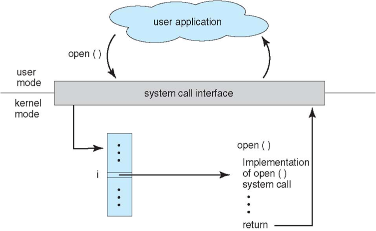

# 操作系统接口

> ## 目录
> 
> 1. 联机用户接口
> 2. shell命令语言
> 3. 系统调用
> 4. 图形用户界面

##  3 系统调用

### 定义

1. 如果一个进程在用户态需要使用内核态的功能，就进行系统调用从而陷入内核，由操作系统代为完成。
    1. 操作系统实现的完成某种特定功能的过程
    2. 为所有运行程序提供访问操作系统的接口
2. 系统调用实现
    1. 编写系统调用处理程序
    2. 设计一张系统调用入口地址表，每个入口地址指向一个系统调用的处理程序，并包含系统调用自带参数的个数
    3. 陷入处理机制需开辟现场保护区，以保存发生系统调用时的处理器现场

3. Linux 的系统调用主要有以下这些：

| Task | Commands |
| :---: | --- |
| 进程控制 | fork(); exit(); wait(); |
| 进程通信 | pipe(); shmget(); mmap(); |
| 文件操作 | open(); read(); write(); |
| 设备操作 | ioctl(); read(); write(); |
| 信息维护 | getpid(); alarm(); sleep(); |
| 安全 | chmod(); umask(); chown(); |
