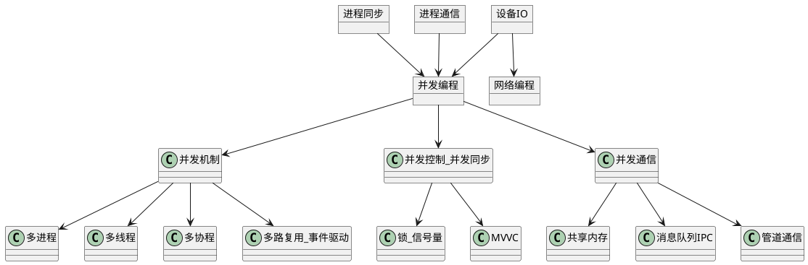

# 并发编程

## 1 并发概述

### 问题重述

1. 什么是并发，
2. 并发编程的应用场景。并发编程与网络编程的关系，并发编程与进程同步、进程通信、设备IO的关系，并发与并行的关系，并发与同步异步的关系
3. 并发编程的核心问题（并发机制、并发同步、并发通信）
4. 并发编程的具体实例（在各种系统和场景下的表现）

### 并发的概念
并发和独占对应。

### 并发编程与其他领域的关系
* 并发编程与网络编程的关系
  * 并发编程主要是应用在**服务端**。并发编程与网络编程不通过。并发编程主要实现的是服务端如何满足大量并发的请求。而网络编程考虑的是客户端和服务器如何建立通信链接，和通信链接的过程和方式。
* 并发编程与设备IO、进程同步、进程通信的关系
  * 是基于Linux的以上理论实现了并发的机制、并发的控制、并发的通信。分别对应设备IO、进程同步、进程通信。
* 并发与并行的关系
  * 并发是宏观上的，并行是微观上的同时运行。
* 并发与同步异步的关系
  * 与同步异步没有任何关系。但是并发的实现方案中，用到了同步思想和异步思想。
  * 关于这一个，可能就是造成一系列困惑的原因，网上众说纷纭。有观点认为，同步和异步都是并发的实现方式。有人认为，并发是异步的。真的恶心。可能这几个观念，从中文的角度，就是很那区分。
  * 同步异步是提交任务的方式，同步指同步提交，是串行的，一个任务结束另一个任务才能提交执行；异步指异步提交，多个任务可以并发运行

### 并发编程的体系结构
并发编程与进程同步、进程通信、设备IO有这直接关系。正在在这些理论的基础上实现了服务端的并发编程。

### 并发编程中的核心问题

1. 并发机制。如何实现并发。这里简单概述一些常见的方案
   1. 多进程机制
   2. 多线程机制
   3. 多协程机制
   4. 单线程的IO多路复用（基于事件响应机制方案）
2. 并发控制。并发任务之间的同步方案，实现资源互斥、操作顺序。
   1. 锁与信号量
   2. MVVC多版本并发控制
3. 并发通信。并发任务之间的数据交换方案
   1. 共享内存
   2. 管道文件
   3. 消息队列

### 并发编程的具体实例
> 针对每一个具体实例，在其相应的学习和开发模块中，都有对应是说明。这里就不再赘述了，有空的话学习Linux的并发编程和网络编程。C++并发编程

> 针对每个领域、每个系统、每个数据库、每个语言。都要解决并发编程的三个核心问题。包括并发机制、并发控制和并发通信问题。

1. Linux并发编程
2. MySQL的并发方案
3. Redis的并发方案
4. C++并发编程
5. Java并发编程
6. Python并发编程
7. Go并发编程

## 2 并发机制

> 这里所谓的什么机制、什么方法。都是设计模式的一部分。通过某种设计模式，实现并发编程：异步回调模式、事件回调模式等。

### 基于多进程、多线程、多协程的并发

1. 在服务器端使用多线程（或多进程）。多线程（或多进程）的目的是让每个连接都拥有独立的线程（或进程），这样任何一个连接的阻塞都不会影响其他的连接。
2. 开启多进程或都线程的方式，在遇到要同时响应成百上千路的连接请求，则无论多线程还是多进程都会严重占据系统资源，降低系统对外界响应效率，而且线程与进程本身也更容易进入假死状态。
3. 很多程序员可能会考虑使用“线程池”或“连接池”。“线程池”旨在减少创建和销毁线程的频率，其维持一定合理数量的线程，并让空闲的线程重新承担新的执行任务。“连接池”维持连接的缓存池，尽量重用已有的连接、减少创建和关闭连接的频率。这两种技术都可以很好的降低系统开销，都被广泛应用很多大型系统，如websphere、tomcat和各种数据库等。
4. “线程池”和“连接池”技术也只是在一定程度上缓解了频繁调用IO接口带来的资源占用。而且，所谓“池”始终有其上限，当请求大大超过上限时，“池”构成的系统对外界的响应并不比没有池的时候效果好多少。所以使用“池”必须考虑其面临的响应规模，并根据响应规模调整“池”的大小。
5. 对应上例中的所面临的可能同时出现的上千甚至上万次的客户端请求，“线程池”或“连接池”或许可以缓解部分压力，但是不能解决所有问题。总之，多线程模型可以方便高效的解决小规模的服务请求，但面对大规模的服务请求，多线程模型也会遇到瓶颈，可以用非阻塞接口来尝试解决这个问题。

### 基于IO多路复用、事件响应机制、事件驱动IO的并发

## 3 并发控制

### 锁与互斥（操作系统和编程语言中实现并发同步的方法）

### 信号量与同步（操作系统和编程语言中实现并发同步的方法）

### MVVC（在数据库中实现事务同步的方法）

## 4 并发通信

### 共享内存

### 管道文件

### 消息队列
