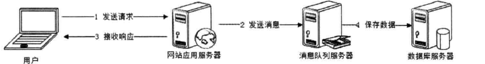

# 网络编程

## 网络编程概述

### 问题重述

1. 什么是网络编程，解决了那些问题？
2. 网络编程与同步异步、阻塞非阻塞的关系
3. 网络编程的核心机制
4. 网络编程的具体实现

### 什么是网络编程

* 既是进程线程通信的一部分
* 也是设备IO（network IO）的一部分。
* 当然也是独立的一部分。
* 解决了两个客户端的通信问题

### 网络编程与同步异步的关系
1. 没有绝对关系，只是在其中一两个步骤中用到了同步思想或者异步思想。无法用同步异步的方式或者阻塞非阻塞的方式，来区分网络编程的类型。

### 网络编程的核心机制
> 这里简单介绍一下网络编程通用的核心的原理和模型。

1. 数据交换和通信方式
   1. socket编程
   2. 消息队列模式

### 网络编程的具体实现

> 每个场景每种语言都有自己的具体实现方案。可以对应到笔记中的其他模块了解网络编程的具体实现。

1. Linux 网络编程
2. C++网络编程库
3. Java网络编程
4. Python网络编程
5. Go网络编程

## 原理和模型

### 阻塞通信

* 普通的socket编程，连接建立过程是阻塞的、读写过程也是阻塞的。

### 非阻塞通信

* 非阻塞的socket，

### 消息队列

使用消息队列将调用异步化，可改善网站的扩展性，使用消息队列将调用异步化，可改善网站的扩展性，还可改善网站系统的性能。

不使用消息队列：

使用消息队列：

在不使用消息队列的情况下，用户的请求数据直接写入数据库，在高并发的情况下，会对数据库造成巨大的压力， 同时也使得响应延迟加剧。在使用消息队列后，用户请求的数据发送给消息队列后立即返回，再由消息队列的消费者进程(通常情况下， 该进程
通常独立部署在专门的服务器集群上)从消息队列中获取数据， 异步写入数据库。由于消息队列服务器处理速度远快于数据库(消息队列服务器也比数据库具有更好的伸缩性)，因此用户的响应延迟可得到有效改善

## 1 Linux