# 基础知识
> 主要用来总结面试过程中的常见问题

> 参考文献
> * [操作系统教程总结](https://blog.csdn.net/yanglingwell/article/details/53745758)
> * [计算机操作系统知识梳理](https://blog.csdn.net/wzk646795873/article/details/79783695)

## 1 操作系统的资源管理技术

* 资源管理解决**物理资源数量不足**和**合理分配资源**这两个问题。

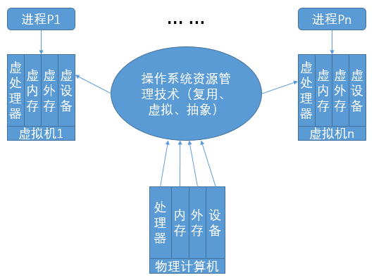

* 操作系统虚拟机为用户提供了一种简单、清晰、易用、高效的计算机模型。虚拟机的每种资源都是物力资源通过复用、虚拟和抽象而得到的产物。**虚拟机提供进程运行的逻辑计算环境**。从概念上来说，一个进程运行在一台虚拟机上，可以认为一个进程就是一台虚拟机，一台虚拟机就是一个进程。

### 复用：空分复用共享和时分复用共享。
* 空分复用共享(space-multiplexed sharing): 将资源从“空间”上分割成更小的单位供不同进程使用。在计算机系统中，内存和外存(磁盘)等是空分复用共享的。
* 时分复用共享(time-multiplexed sharing): 将资源从“时间”上分割成更小的单位供不同进程使用。在计算机系统中，处理器和磁盘机等是时分复用共享的。

### 虚拟：对资源进行转化、模拟或整合。

* 把一个物理资源转变成多个逻辑上的对应物，也可以把多个物理资源变成单个逻辑上的对应物，即创建无须共享独占资源的假象，或创建易用且多于实际物理资源的虚拟资源假象，以达到多用户共享一套计算机物理资源的目的。虚拟技术可用于外部设备(外部设备同时联机操作(SPOOLing)),存储资源(虚拟内存)和文件系统(虚拟文件系统(Virtual File System, VFS))中。
* 复用和虚拟相比较，复用所分割的是实际存在的物理资源，而虚拟则实现假想的同类资源。**虚拟技术解决某类物理资源不足的问题**，提供易用的虚拟资源和更好的运行环境。

### 抽象：屏蔽硬件资源的物理特性和实现细节
* 通过创建软件来屏蔽硬件资源的物理特性和实现细节，简化对硬件资源的操作、控制和使用。
* 复用和虚拟的主要目标是解决**物理资源数量不足的问题**，抽象则用于处理系统复杂性，重点**解决资源易用性**。

## 2 系统调用
* 系统调用： 为给应用程序的运行提供良好环境，内核提供了一系列具有预定功能的服务例程，通过一组称为**系统调用（System Call）**的接口呈现给用户，系统调用把应用程序的请求传送至内核，调用相应的服务例程完成所需处理，将处理结果返回给应用程序。（注：系统调用的编号称为功能号）
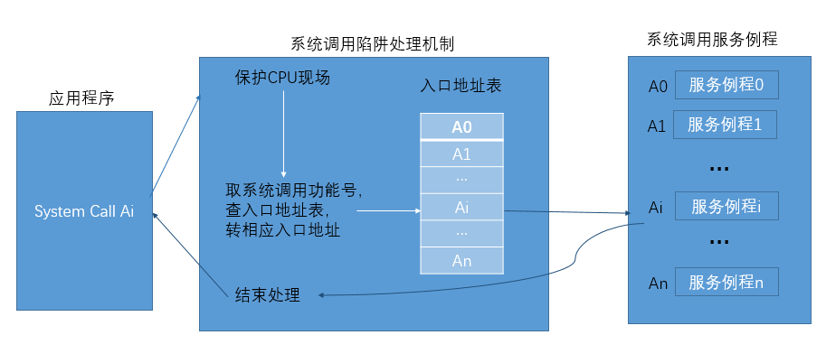


* 系统调用的执行过程： 当CPU执行程序中编写的 **访管指令(supervisor==自陷指令(trap)==中断指令(interrupt)** 等引起处理器中断的机器指令，实现的系统调用，产生异常信号，通过**陷阱机制**(也称**异常处理机制**，当异常或中断发生时，处理器捕捉到一个执行线程，并且将控制权转移到操作系统中某一个固定地址的机制)，处理器的状态由用户态(user mode, 又称目态或普通态)转变为内核态(kerbel mode, 又称管态)，进入操作系统并执行相应服务例程，以获得操作系统服务。当系统调用执行完毕时，处理器再次切换状态，控制返回至发出系统调用的程序。

* 系统调用是应用程序获得操作系统服务的唯一途径。

### 系统调用的作用：

1. 内核可以基于权限和规则对资源访问进行裁决，保证系统的安全性。
2. 系统调用对资源进行抽象，提供一致性接口，避免用户在使用资源时发生错误，且编程效率大大提高。

### 系统调用与函数调用的区别：

* 调用形式和实现方式不同。功能号 VS 地址； 用户态转换到内核态 VS 用户态。
* 被调用代码的位置不同。 动态调用 + 操作系统 VS 静态调用 + 用户级程序。
* 提供方式不同。 操作系统 VS 编程语言。

## 3 操作系统内核

### 定义
* 内核： 是一组程序模块，作为可信软件来提供支持进程并发执行的基本功能和基本操作，通常驻留在内核空间，运行于内核态，具有直接访问硬件设备和所有内存空间的权限，是仅有的能够执行特权指令的程序。

### 内核的功能
1. 中断处理。中断处理是内核中最基本的功能，也是操作系统赖以活动的基础。
2. 时钟管理。时钟管理是内核的基本功能。
3. 短程调度。短程调度的职责是分配处理器，按照一定的策略管理处理器的转让，以及完成保护和恢复现场工作。
4. 原语管理。 原语是内核中实现特定功能的不可中断过程。

* 内核是操作系统对裸机的第一次改造，内核和裸机组成了第一层虚拟机，进程在虚拟机上运行。

## 4 处理器状态：内核态和用户态
### 概念
* 仅在内核态下才能使用的指令称为特权指令，执行这些指令不仅影响运行程序自身，而且还会干扰其他程序及操作系统。 非特权指令在内核态和和用户态下都能工作。
* 现代计算机为处理器建立硬件标志位，称处理器状态位，通常是**程序状态字(Program Status Word, PSW)**中的一位，来将处理器的状态设置为内核态或用户态。

### 用户态向内核态转换的情况：
1. 程序请求操作系统服务， 执行系统调用。
2. 在程序运行时产生中断事件(如I/O操作完成)，运行程序被中断，转向**中断处理程序**处理。
3. 在程序运行时产生异常事件(如在目态下执行特权指令)，运行程序被打断，转向**异常处理程序**工作。

> 以上三种情况都是通过中断机制发生，可以说中断和异常是用户态到内核态转换的仅有途径。

### 用户栈和核心栈
1. 用户栈是用户进程空间中的一块区域。用于保存应用程序的子程序(函数)间相互调用的参数，返回值，返回点和子程序的局部变量。
2. 核心栈是内存中操作系统空间的一块区域。用于保存中断现场和保存操作系统程序(函数)间相互调用的参数，返回值，返回点和程序的局部变量。

## 5 中断（Interupt）

### 定义
* 中断：程序执行过程中遇到急需处理的事件时，暂时终止现行程序在CPU上的运行，转而执行相应的**事件处理程序**，待处理完成后再返回断点或调度其他程序的执行过程。

### 中断的分类：
1. 外中断(又称中断或异步中断)： 来自处理器之外的中断信号，如，时钟中断、键盘中断等。外中断可分为可屏蔽中断和非可屏蔽中断。
2. 内中断(又称异常或同步中断)，来自处理器内部的中断信号，如，访管中断，硬件故障中断，程序性中断等。内中断不能被屏蔽。

### 中断和异常的响应： 

* 发现中断源 → 保护现场 → 转向(中断/异常)事件处理程序执行 → 恢复现场

## 6 进程

### 定义
* 进程：具有独立功能的程序在某个数据集合上的一次运行活动，也**是操作系统进行资源分配和保护的基本单位** 。
1. 从原理角度看，进程是支持程序执行的一种系统机制，它对处理器上运行程序的活动进行抽象。
2. 从实现角度看，进程是一种数据结构，用来准确地刻画运行程序的状态和系统动态变化状况。

### 进程状态的七态模型

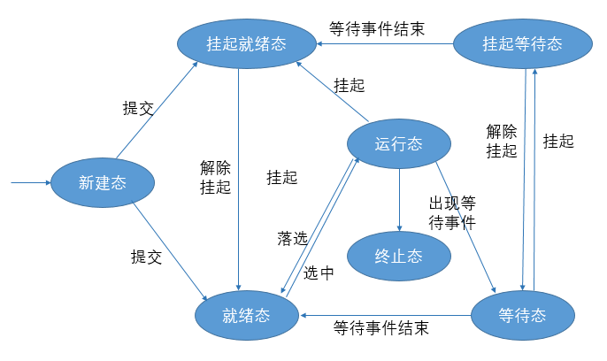

1. 新建态(new): 进程被创建，尚未进入就绪队列。
1. 就绪态(ready): 进程具备运行条件，等待系统分配处理器。
1. 挂起就绪态(ready suspend)：进程具备运行条件，但目前在外存中。
1. 运行态(running): 进程占有处理器正在运行。
1. 终止态(exit): 进程达到正常结束点或被其他原因所终止，下一步将被撤销。
1. 等待态(wait): 又称阻塞态或休眠态。进程正在等待某个事件完成，目前不具备运行条件。
1. 挂起等待态(blocked suspend): 进程正在等待某个事件完成，并且在外存中。

### 概述
* 程序和数据刻画进程的静态特征，称为进程控制块的一种数据结构刻画进程的动态特征。**进程映像(process image)** 包括进程控制块、进程程序块、进程核心块、进程数据块等要素。

* 进程控制块(Process Control Block, PCB)：进程存在的唯一标识，操作系统掌握进程的唯一资料结构和管理进程的主要依据。包括标识信息、现场信息和控制信息等信息。

* 进程队列(process queue)：处于同一状态的所有进程的PCB链接在一起的数据结构。 有两种队列组织方式：链接方式和索引方式。

* 进程切换必定在内核态而非用户态发生。

* 进程可以分为两部分，资源集合和线程集合。进程要支撑线程运行，为线程提供虚拟地址空间和各种资源。进程封装管理信息，线程封装执行信息。

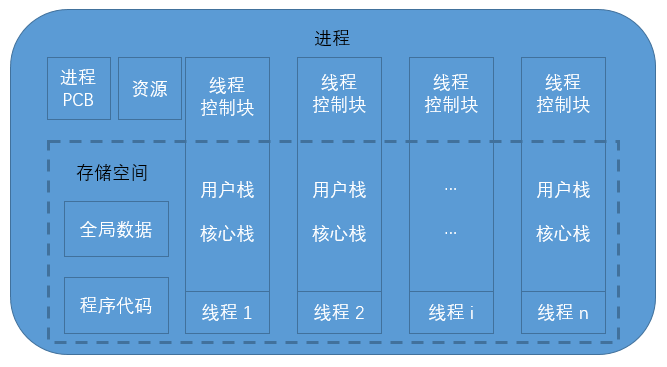

## 7 处理器调度

### 处理器调度层次：

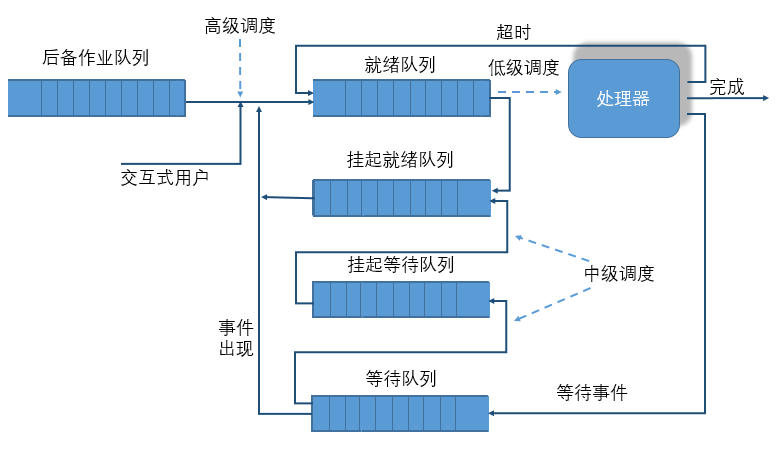

1. **高级调度**： 又称作业调度、长程调度。从输入系统的一批 **作业(job, 用户提交给操作系统计算的一个独立任务)** 中按照预定的调度策略挑选若干作业进入内存，为其分配所需资源并创建对应作业的用户进程。
2. **中级调度**： 又称平衡调度，中程调度。根据内存资源情况决定内存所能容纳的进程数目，并完成外存和内存中进程对换工作。
3. **低级调度**：又称进程调度/线程调度，短程调度。根据某种原则决定就绪队列中那个进程/线程先获得处理器，并将处理器出让给它使用。

### 低级调度算法：
1. 先来先服务(First Come First Server, FCFS)算法。
3. 最短作业优先(Shortest Job First, SJF)算法。
3. 最短剩余时间优先(Shortest Remaining Time First, SRTF)算法： 假设当前某进程/线程正在运行，如果***有新进程/线程移入就绪队列***，若它所需的CPU运行时间比当前运行的进程/线程所需的剩余CPU时间还短，抢占式最短作业优先算法强行剥夺当前执行者的控制权，调度新进程/线程执行。
4. 最高响应比优先(Highest Response Ratio First, HRRF)算法:非剥夺式算法。其中，响应比 = (作业已等待时间 + 作业处理时间) / 作业处理时间。
5. 优先级调度算法：优先级高的选择进程/线程优先选择。
6. 轮转调度(Round-Robin, RR)算法： 也称时间片调度。就绪队列的进程轮流运行一个时间片。
7. 多级反馈队列(Multi-Level Feedback Queue, MLFQ)算法。

### 衡量调度算法的性能指标：
1. 资源利用率: CPU利用率 = CPU有效工作时间/(CPU有效工作时间 + CPU空闲等待时间)
2. 吞吐率： 单位时间内CPU处理作业的个数。
3. 公平性： 确保每个进程都能获得合理的CPU份额和其他资源份额，不会出现饥饿现象。
4. 响应时间： 从交互式进程提交一个请求(命令)直到获得响应之间的时间间隔。
5. 周转时间： 批处理用户从向系统提交作业开始到作业完成为止的时间间隔。平均周转时间：$T=(\sum_{i=1}^n t_i)/n$ ， 其中 $t i$表示作业i的周转时间。平均带权作业周转时间： $T = ( \sum_{i=1}^n w_i ) / n$, 其中 $w_i = t_i / t_k$ 表示作业i的周转时间。 $t_k$表示作业i的运行时间。

## 8 进程的交互
### 概述
* **进程互斥(Mutual Exclusion)**: 若干进程因相互抢夺独占型资源而产生的竞争制约关系。

* **进程同步(Synchronization)**: 为完成共同任务的并发进程基于某个条件来协调其活动，因为需要在某些位置上排定执行的先后次序而等待、传递信息或消息所产生的协作制约关系。

### 资源竞争会引发两个控制问题：
1. **死锁**：一组进程因争夺资源陷入永远等待的状态。
2. **饥饿**：一个可运行进程由于由于其他进程总是优先于它，而被调度程序无限期地拖延而不能被执行。

## 9 临界区管理

### 概念
* 并发进程中与共享变量有关的程序段称为临界区(Critical Section)。共享变量所代表的资源称为临界资源(Critical Resource)，即一次仅能供一个进程使用的资源。

### 临界区调度原则：
1. 择一而入。 一次之多只有一个进程进入临界区内执行。
2. 忙则要等。 如果已有进程在临界区中， 试图进入此临界区的其他进程应等待。
3. 有限等待。 进入临界区内的进程应在有限时间内退出。

### 临界区管理的软件算法：Peterson算法。
* 为每个进程设置标志，当标志值为 true 时表示该进程要求进入临界区，另外再设置一个指示器 turn 以指示可以由哪个进程进入临界区，当 turn = i 时则可由 Pi 进入临界区。
```C++
/* Peterson 算法 */

bool inside[2];
inside[0] = false;
inside[1] = false;
enum { 0, 1 } turn;

/* 进程0 */
process P0(){
inside[0] = true;               //请求...
    turn = 1;
    while(inside[1] && turn == 1) ; //等待...

    /*临界区 */

    inside[0] = false;              //归还...
}

/* 进程1 */
process P1(){
inside[1] = true;               //请求...
    turn = 0;
    while(inside[0] && turn == 0) ; //等待...

    /*临界区 */

    inside[1] = false;              //归还...
}
```

> Peterson算法满足临界区管理的三个原则。

### 临界区管理的硬件设施:
1. 关中断。 在进程进入临界区时关中断，进程退出临界区时开中断。
2. . 测试并设置指令。 利用机器指令TS(Test and Set)实现临界区的上锁和开锁原语操作。
3. 对换指令。 利用对换指令实现临界区的上锁和开锁原语操作。

## 10 信号量(samaphore)和PV操作
### 说明
PV操作都是原语操作， 不可中断。

### 信号量和PV操作
* 信号量
```
// 信号量
typedef struct semaphore {
	int value;                 // 信号量值
	struct pcb* list;          // 指向“等待该信号量的进程队列”的指针
};  
```
* P操作
```
// P操作
void P(semaphore s){
	s.value--;                 // 信号量值减一

    // 如果信号量值小于0， 执行P操作的进程调用sleep(s.list)阻塞自己，
    // 被置成“等待信号量s”状态，并移入s信号量队列，转向进程调度程序。
    if(s.value < 0) sleep(s.list);
}
```
* V操作
```
// V操作
void V(semaphore s){
	s.value++;                 // 信号量值加一

	// 如果信号量小于等于0， 则调用wakeup(s.list)释放一个等待信号量s的进程，
    // 并转换成就绪态， 进程则继续执行。
	if(s.value <= 0) wakeup(s.list);
}
```
1. 若信号量值 s.value 为正值， 此值等于在封锁进程之前对信号量 s 可施行P操作的次数，即，s所代表的实际可用的资源数。
2. 若信号量值 s.value 为负值， 其绝对值等于登记在 s 信号量队列中的等待进程的数目。
3. 通常**P操作意味着请求一个资源**，**V操作意味着释放一个资源**。在一定条件下，P操作也可表示挂起进程的操作，V操作代表唤醒被挂起进程的操作。

### 信号量实现互斥
```
semaphore mutex;
mutex = 1；

//进程Pi， i = 1， 2 ...， n
process Pi(){
	P(mutex);

	/* 临界区 */

	V(mutex);
}
```
## 11 管程
### 概念
* 管程(monitor)：代表**共享资源的数据结构和在其上执行的一组并发进程**就构成管程，管程被请求和释放资源的进程锁调用。
* 信号量机制的缺点：进程自备同步操作，P(S)和V(S)操作大量分散在各个进程中，不易管理，易发生死锁。
* 管程特点：管程封装了同步操作，对进程隐蔽了同步细节，简化了同步功能的调用界面。用户编写并发程序如同编写顺序(串行)程序。

### 引入管程机制的目的：

1. 把分散在各进程中的临界区集中起来进行管理
2. 防止进程有意或无意的违法同步操作；
3. 便于用高级语言来书写程序，也便于程序正确性验证。


### 实现

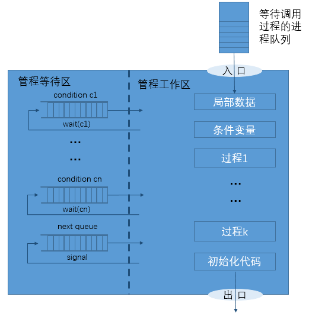
1. 条件变量。 管程内的一种数据结构。只有在管程中才能被访问，进程可以在条件变量上等待或被唤醒。只能通过 wait() 和 signal() 原语操作来控制。
2. wait()原语。 挂起调用进程并释放管程，直至另一个进程在条件变量上执行 signal()。
3. signal() 原语。如果有其他的进程因对条件变量执行 wait() 而被挂起，便释放之。 如果没有进程在等待，那么相当于空操作，信号不被保存。

## 12 死锁

### 死锁的主要解决方法

1. 死锁防止
1. 死锁避免
1. 死锁检测和恢复。

### 死锁产生的必要条件：
1. 互斥条件。 临界资源是独占资源，进程应互斥且排他地使用这些资源。
2. 占有等待条件。 进程在请求资源得不到满足而等待时，不释放已占有的资源。
3. 不剥夺条件。已获资源只能由进程资源释放，不允许被其他程序剥夺。
4. 循环等待条件。 存在循环等待链，其中每个进程都在等待下一个进程所持有的资源。

### 死锁的防止
* 破坏死锁产生的必要条件。
  * 使资源可同时使用(破坏互斥条件)、
  * 静态分配资源(破坏占有和等待条件)、
  * 剥夺调度(破坏不剥夺条件)、
  * 层次分配策略(循环等待条件)等。

### 死锁避免：
* 银行家算法

### 死锁检测和恢复：
* 进程-资源分配图(额…还是去百度吧。)
  * 如果进程-资源分配图中无环路，此时系统没有死锁。
  * 如果进程-资源分配图中有环路，且每个资源类中只有一个资源，则系统发生死锁。
  * 如果进程-资源分配图中有环路，且所涉及的资源类有多个资源，则不一定会发生死锁。

## 13 可变分区存储管理
### 可变分区存储分配算法：
1. 最先适应分配算法。从未分配区的开始位置开始扫描，在找到的第一个能满足长度要求的空闲区上分配存储空间。
2. 下次适应分配算法。从未分配区上次扫描结束处开始顺序查找，在找到的第一个能满足长度要求的空闲区上分配存储空间。
3. 最优适应分配算法。扫描整个未分配区，选择能满足用户进程要求的最小分区分配存储空间。
4. 最坏适应分配算法。扫描整个未分配区，选择能满足用户进程要求的最大分区分配存储空间。
5. 快速适应分配算法。为经常用到的长度的空闲区设立单独的空闲区链表。

## 14 分页存储管理
### 基本概念：
1. 页面。 进程逻辑地址空间分成大小相等的区，每个区称为页面或页。(页面的本质是逻辑地址空间)
2. 页框。 又称页帧。内存物理地址空间分成大小相等的区，其大小和页面大小相等，每个区就是一个页框。(页框的本质是物理地址空间)
3. 逻辑地址。分页存储器的逻辑地址由页号和页内偏移两部分组成。

4. 内存页框表。页框表的表项给出物理块使用情况：0为空闲，1为占用。
5. 页表。页表是操作系统为进程建立的，是程序页面和内存页框的对照表，页表的每一栏指明程序中的某一页面和分得的页框之间的关系。

### 分页存储管理的地址转换
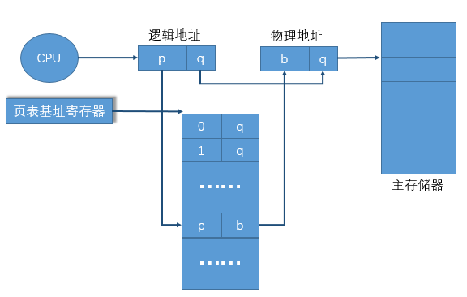
* 翻译快表：也称转换后援缓冲(Translation Look_aside Buffer, TLB)。用来存放进程最近访问的部分页表项。(翻译快表之于页表类似于Cache之于存储器)

* 二级页表：把整个页表分割成许多小页表，每个称为页表页，每个页表页含有若干个页表表项。页表页允许分散对应不连续的页框。为了找到页表页，应建立地址索引，称为页目录表，其表项指出页表页起始地址。
* 二级页表实现逻辑地址到物理地址转换的过程： 由硬件“页目录表基址寄存器”指出当前运行进程的页目录表的内存起始地址，加上“页目录位移”作为索引，可找到页表页在内存的起始地址，再以“页目录位移”作为索引，找到页表页在内存的起始位置，再以“页表页位移”作为索引，找到页表页的表项，此表项中包含一个页面对应的页框号，由页框号和页内偏移便可生成物理地址。

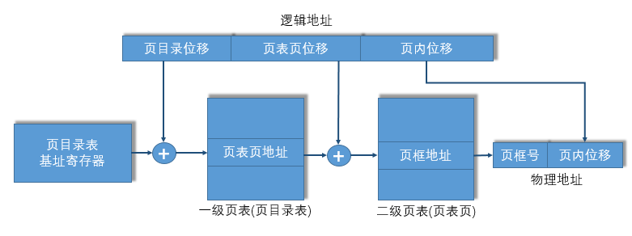
* 类比于书的目录，找某一段内容的时候，先在目录上找到对应的章节，再在对应的章节下面找具体的知识点。比如，我要在《操作系统原理》中查“多级页表”。首先我知道它是在存储管理一章的，于是就找到了“第四章 存储管理”（类似于找到了页目录表）。 然后在第四章下面找“多级页表”（类似于在页目录表下面找具体的页表页）。最后找到“多级页表”对应的页码（类似于在页表页中找到其对应的页框）。最后查阅对应的章节页码（类似于读取对应页框的数据）。

## 15 分段存储管理


### 分段和分页的比较：
1. 分段是信息的逻辑单位，由源程序的逻辑结构及含义所决定，是用户可见的，段长由用户根据需要来确定，段起始地址可以从任何内存地址开始。引入的目的是满足用户模块化程序设计的需要。
2. 分页是信息的物理单位，与源程序的逻辑无关，是用户不可见的，页长由系统(硬件)决定，页面只能从页大小的整数倍地址开始。引入目的是实现离散分配并提高内存利用率。

## 16 虚拟存储管理
### 虚拟存储管理的基本思路：

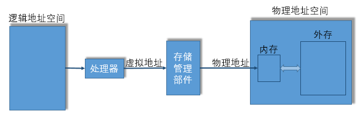

* 把磁盘空间当做内存的一部分，进程的程序和数据部分放在内存中，部分放在磁盘上。程序运行时，它执行的指令或访问的数据在哪里由存储管理负责判断，并针对情况采取响应的措施。

### 请求分页虚存管理
* 将进程信息副本存放在外存中，当它被调度投入运行时，程序和数据没有全部装进内存，仅装入当前使用页面，进程执行过程中访问到不在内存的页面时，产生缺页异常，再由系统自动调入。

### 全局页面替换策略
> 页面替换算法的作用范围是整个系统，不考虑进程的属主：
1. 最佳页面替换算法(Optimal Replacement， OPT)。 淘汰不再访问的页或者距现在最长时间后才访问的页。
2. 先进先出页面替换算法(First in First Out Replacement， FIFO)。淘汰在内存中驻留时间最长的页。
3. 最近最少使用页面替换算法(Least Recently Used Replacement, LRU)。 淘汰最近一段时间内最久未被使用的页面。
4. 第二次机会页面替换算法(Second Chance Replacement， SCR)。 首先检查FIFO页面队列中的队首，这是最早进入内存的页面，如果其“引用位”为0，那么它最早进入且未被引用，此页被淘汰。如果其“引用位”为1，说明虽然它最早进内存，但最近仍在使用，于是将“引用位”清零，并把这个页面移到队尾，把它看做新调入的页面，再给它一次机会。
5. 时钟页面替换算法(Clock Policy Replacement， Clock)。与SCR算法思路一致。只是用循环队列来构造页面队列，队列指针指向可能被淘汰的页面。如果队列指针指向的页的“引用位”为1，则将其置为0，同时队列指针指向下一个页。

### 局部页面替换算法
> 页面替换算法的作用局限于进程自身，要为进程维护称为工作集的一组页面：
1. 局部最佳页面替换算法(Local Minimum Replacement, MIN)。 在t时刻时，若页面P在未来(t, t+delta)时间段内未被引用，则它被淘汰。
2. 工作集置换算法。 在t时刻时，若页面P在未来(t-delta, t)时间段内未被引用，则它被淘汰。
3. 模拟工作集替换算法。
4. 缺页频率替换算法。

## 17 请求段页式虚拟内存管理
* 虚地址以程序的逻辑结构划分为段。
* 实地址划分为位置固定、大小相等的页框(块)。
* 逻辑地址分为三个部分：段号s、段内页号p、页内位移d。对于用户而言，段式虚拟地址应该由段号s和段内位移d’组成，操作系统内部自动把d’解释成段内页号p和页内位移号d。

## 18 I/O硬件原理:I/O控制方式

### 轮询方式
* 又称程序直接控制方式。使用查询指令测试设备控制器的忙闲状态位，确定内存和设备是否能能交换数据。（@杨领well注：所谓轮询，就好比，老湿依次问每一个童鞋：“有问题没？”， 如果没问题，就继续问下一个童鞋。如果这个童鞋有问题，这个老湿就停下了解决这个问题。然后又继续询问下一个童鞋。）

### 中断方式
* 要求CPU和设备控制器及设备之间存在中断请求线，设备控制器的状态寄存器有相应的中断允许位。
1. 进程发出启动I/O指令。
2. 设备控制器检查状态寄存器的内容，执行相应的I/O操作，一旦传输完成，设备控制器通过中断请求线发出I/O中断信号。
3. CPU收到并响应I/O中断后，转向设备的I/O中断处理程序执行。
4. 中断处理程序执行数据读取操作，将I/O缓冲寄存器的内容写入内存。操作结束后退出中断程序恢复之前的状态。
5. 执行中断前之前运行的进程。（类似于老湿在上面讲课，有童鞋问问题时，老湿就记录下自己讲到的位置，然后取回答童鞋的问题，回答完之后，又回到刚刚讲课的地方继续讲课）

### DMA(Direct Memory Access, 直接存储器存取)方式

* 内存和设备之间有一条数据通路成块的传输数据，无须CPU干9预，实际数据传输操作由DMA直接完成。

### 通道方式
* CPU在执行主程序时遇到I/O请求，启动在指定通道上选址的设备，一旦启动成功，通道开始控制设备进行操作，这时CPU就可以执行其他任务并与通道并行工作，直到I/O操作完成；当通道发出I/O操作结束中断时，处理器才响应并停止当前工作，转而处理I/O操作结束时间。

## 19 I/O软件原理
* I/O中断处理程序： 通常是设备驱动程序的组成部分之一。检查设备状态寄存器内容，判断产生中断原因，根据I/O操作的完成情况进行相应处理。若数据传输有错，应向上层软件报告设备出错信息，实施重新执行；若正常结束，应唤醒等待传输的进程，使其转换为就绪态；若有等待传输的I/O命令，应通知相关软件启动下一个I/O请求。
* I/O设备驱动程序：设备驱动程序是设备专有的。把用户提交的逻辑I/O请求转化为物理I/O的启动和执行。同时监督设备是否正确执行，管理数据缓冲区，进行必要的纠错处理。
* 独立于设备的I/O软件
* 用户空间的I/O软件

## 20 缓冲技术
> 这里是指cache。缓存。而不是缓冲buffer。cache的本命缓冲存储器。本质上是一个存储器。
### 缓冲技术的基本思想
* 当进程执行写操作输出数据时，先向系统申请一个输出缓冲区，然后将数据送至缓冲区，若是顺序写请求，则不断地把数据填入缓冲区，直至装满为止，此后进程可以继续计算，同时，系统将缓冲区的内容写在设备上。当进程执行读操作输入数据时，先向系统申请一个输入缓冲区，系统将设备上的一条物理记录读至缓冲区，根据要求把当前所需要的逻辑记录从缓冲区中选出并传送给进程。

### 单缓冲

* 是最简单的缓冲技术，每当有I/O请求时，操作系统就在内存的系统区中开设一个缓冲区。不允许多个进程同时对一个缓冲器操作。

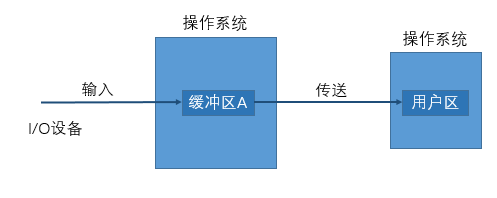

* 双缓冲： CPU可把输出到设备的数据放入其中一个缓冲器(区)、让设备慢慢处理；然后，它又可以从另一个为终端设置的缓冲器(区)中读取所需要的输入数据。

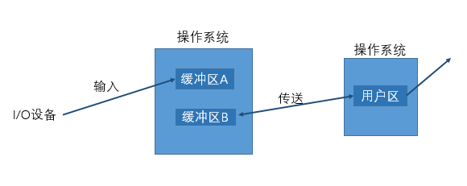

* 多缓冲： 是把多个缓冲区连接起来组成两部分，一部分专门用于输入，另一部分专门用于输出的缓冲结构。

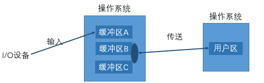

## 21 驱动调度技术

### 磁盘的物理结构：
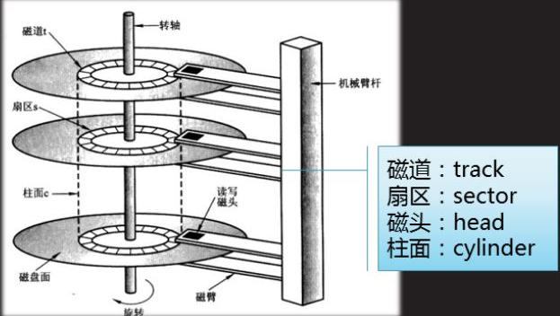
* 磁盘包括多个盘面，每个盘面有一个读写磁头，所有的磁头都固定在唯一的移动臂上同时移动。一个盘面上的读写磁头的轨迹称为磁道，读写磁头下的所有磁道形成柱面，一个磁道又可以划分为多个扇区。在磁盘上定位某个物理记录需要知道其柱面号、磁头号以及扇区号。定位物理记录时，磁头到达指定扇区的时间称为查找时间， 选择磁头号并旋转至指定扇区的时间称为搜索延迟。
### 磁道(柱面)的搜索定位算法：
1. 先来先服务算法(First Come First Server algorithm, FCFS)。
2. 最短查找时间优先算法： 总是执行查找时间最短的请求。
3. 扫描算法： 移动臂来回的扫过所有柱面，扫描处遇到I/O请求便进行处理。
4. 分步扫描算法： 将I/O请求分为长度为N的子队列，按FIFO算法依次处理每个队列，而每个子队列采用扫描算法，处理完一个后再服务下一个队列。
5. 电梯调度算法： 又称LOOK算法。
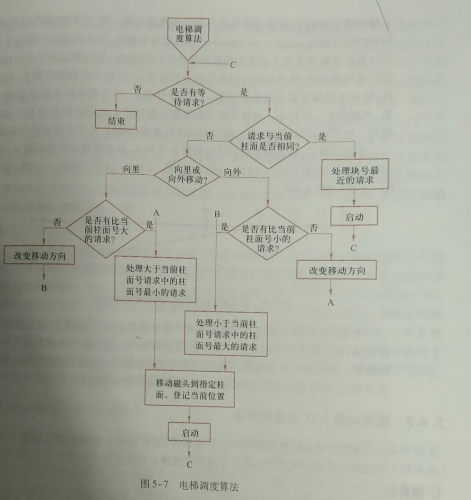
### 磁头号由外向内递增。
6. 循环扫描算法： 移动臂总是从0号柱面至最大号柱面顺序扫描，然后直接返回0号柱面重复进行，归途中不提供服务(而扫描算法归途是要提供服务的)。

## 22 设备独立性
* 设备独立性： 用户通常不指定物理设备，而是指定逻辑设备，使得用户作业和物理设备分离开来，再通过其他途径建立逻辑设备和物理设备之间的映射，设备的这种特性称为设备独立性。

## 23 虚拟设备
### 外部设备同时联机操作(Simultaneous Peripheral Operations On Line, SPPPLing)：
1. 预输入程序。 控制信息从输入设备至输入井，填写预输入表以便在作业执行过程中要求输入信息时可以随时找到其存放位置。
2. 井管理程序。 作业执行过程中要求启动某台设备进程I/O操作时，作业控制程序截获这个要求并调用井管理程序控制从相应输入井读取信息，或将信息送至输出井。
3. 缓输出程序。 当处理器空闲时，操作系统调用缓输出程序执行缓输出，它查看缓输出表是否有输出打印的文件，文件打印前还可能组织作业或文件标题，也可能对从输出井中读出的信息进行格式加工。
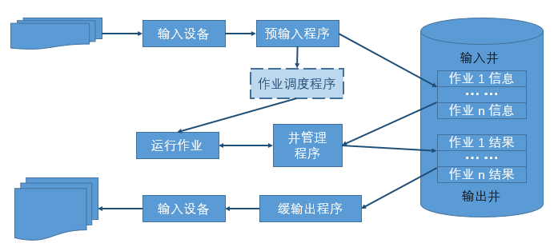
## 24 文件逻辑结构
### 文件的逻辑结构的两种形式：
1. 流式文件。 一种无结构的文件，文件内的数据不再组成记录，只是一串顺序的信息集合，称为字节流文件。
2. 记录式文件。 一种有结构的文件，包含若干逻辑记录，逻辑记录是文件中按信息在逻辑上独立含义所划分的信息单位。

## 25 文件物理结构
* 文件物理结构： 文件的物理结构和组织是指逻辑文件在物理存储空间中的存放方法和组织关系。
* 常见组织方式：顺序文件、连接文件、直接文件和索引文件。


## 26 Q&A
### 1 什么是操作系统？操作系统在计算机系统中的主要作用是什么？
* 定义： 操作系统尚无严格的定义。 一般可把操作系统定义为： 管理系统资源、控制程序执行、改善人机界面、提供各种服务，并合理组织计算机工作流程和为用户方便有效地使用计算机提供良好的运行环境的一种软件系统。

* 作用：
  1. 服务用户。 操作系统作为用户接口和公共服务程序。
  2. 进程交互。 操作系统作为进程执行的控制者和协调者。
  3. 系统实现。 操作系统作为扩展机或虚拟机。
  4. 资源管理。 操作系统作为资源的管理者和控制者。

### 2 什么是多道程序设计？多道程序设计有什么特点？
* 多道程序设计(multiprogramming)： 允许多个作业(程序)同时进入计算机系统的内存并启动交替计算的方法。
* 多道程序设计的特点： 从宏观上看是并行的，从微观上看是串行的。

### 3 计算机操作系统为什么引入进程？
* 刻画程序的并发性。
* 解决资源的共享性。

### 4 在分时系统中，什么是响应时间？它与哪些因素有关？
* 从交互式进程提交一个请求(命令)直到获得响应之间的时间间隔称为响应时间。
* 影响分时操作系统的响应时间的因素很多，如，CPU的处理速度、联机终端的数目、所用时间片的大小、系统调度开销和对换信息量的多少等。
### 5 解释并发性与并行性
* 计算机操作系统中把并行性和并发性明显区分开，主要是从微观的角度来说的，具体是指进程的并行性（多处理机的情况下，多个进程同时运行）和并发性（单处理机的情况下，多个进程在同一时间间隔运行的）。
  * 并行性是指硬件的并行性，两个或多个事件在同一时刻发生。
  * 并发性是指进程的并发性，两个或多个事件在同一时间段内发生。
### 6 试述存储管理的基本功能。
* 存储分配。
* 地址映射。
* 存储保护。
* 存储共享。
* 存储扩充。
### 7 何谓地址转换(重定向)？哪些方法可以实现地址转换？
* 地址重定位： 又称地址转换，地址映射。 可执行程序逻辑地址转换(绑定)为物理地址的过程。

* 实现方法：
  1. 静态地址重定位。 由装载程序实现装载代码模块的加载和地址转换，把它装入分配给进程的内存指定区域，其中的所有逻辑地址修改成内存物理地址。
  2. 动态地址重定位。由装载程序实现装载代码模块的加载和地址转换，把它装入分配给进程的内存指定区域，但对链接程序处理过的应用程序的逻辑地址则不做任何修改，程序内存起始地址被置于硬件专用寄存器 —— 重定位寄存器。程序执行过程中，每当CPU引用内存地址(访问程序和数据)时，由硬件截取此逻辑地址，并在它被发送到内存之前加上重定位寄存器的值，以便实现地址转换。
    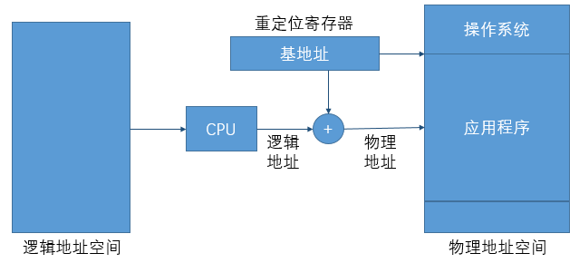
  3. 运行时链接地址重定位

### 8 程序链接的三种方式：
1. 静态链接。在程序装载到内存和运行前，就已将它的所有目标模块及所需要的库函数进行链接和装配成一个完整的可执行程序且此后不可拆分。
2. 动态链接。在程序装入内存前并未事先进行程序各目标模块的链接，而是在程序装载时一边装载一边链接，生成一个可执行文件。
3. 运行时链接。 将某些目标模块或库函数的链接 推迟到执行时才进行。

### 9 什么是文件的共享？介绍文件共享的分类和实现思想。
* 文件共享： 不同进程共同使用同一个文件。
* 文件共享的分类：
  1. 静态共享。 两个或多个进程通过文件链接(一个文件同时属于多个目录，但实际上仅有一处物理存储)达到共享同一个文件的目的，无论进程是否运行，其文件的链接关系都是存在的，因此称为静态共享。
  2. 动态共享。 系统不同的应用程序或同一用户的不同进程并发地访问同一文件，这种共享关系只有当进程存在时才可能出现，一旦进程消亡，其共享关系也就随之消失。
  3. 符号链接共享。


### 10 进程和线程以及它们的区别

1. 进程是对运行时程序的封装,是系统进行资源调度和分配的基本单位,实现操作系统的并发。
2. 线程是进程的子任务,是CPU调度和分派的基本单位,用于保证程序的实时性,实现进程内部的并发。
3. 一个程序至少有一个进程,一个进程至少有一个线程,线程依赖进程的存在。
4. 进程执行过程中拥有独立的内存单元,而多个线程共享进程的内存。

### 11 进程间的通信的几种方式
1. 管道（pipe）及命名管道（named pipe）：管道可用于具有亲缘关系的父子进程间通信，命名管道除了具有管道所具有功能外，还允许无亲缘关系进程的通信。

2. 信号（signal）：是一种比较复杂的通信方式,用于通知接收进程某个事件已经发生。

3. 消息队列：是消息的链接表,克服上两种通信方式中信号量有限的缺点，具有写权限的进程可以按照一定规则向消息队列中添加新信息；对消息队列有读权限得进程则可以从消息队列中读取信息。

4. 共享内存：最有用的进程间通信方式。它使得多个进程可以访问同一块内存空间,不同进程可以及时看到对方进程中对共享内存中数据的更新。这种方式需要依靠某种同步操作,如互斥锁和信号量等。

5. 信号量：主要作为进程之间及同一种进程的不同线程之间的同步和互斥手段。

6. 套接字：这是一致性更为一般进程间通信机制,它可用网络中不同机器之间进程间通信,应用非常广泛。

### 12 线程同步的方式
1. 互斥量Synchronized/lock：采用互斥对象机制,只有拥有互斥对象的线程才有访问公共资源的权限,因为互斥对象只有一个,所以可以保证公共资源不会被多个线程同时访问。

2. 信号量Semaphore：它允许同一时刻多个线程访问同一资源,但需要控制同一时刻访问此资源的最大线程数。

3. 事件（信号），Wait/Notify：通过通知操作的方式来保存多线程同步,还可以方便的实现多线程优先级比较操作。

### 13 什么是死锁？死锁产生的条件？
* 死锁的概念：
  * 在两个或者多个并发进程中，如果每个进程持有某种资源而又等待其它进程释放它或它们现在保持着的资源，在未改变这种状态之前都不能向前推进，称这一组进程产生了死锁。通俗讲,就是两个或者多个进程无限期的阻塞、相互等待的一种状态。

* 死锁产生的四个必要条件
  * 互斥：至少有一个资源必须属于非共享模式，即一次只能被一个进程使用；若其他申请使用该资源，那么申请进程必须等到该资源被释放为止；
  * 占用并等待：一个进程必须占有至少一个资源，并等待另一个资源，而该资源为其他进程所占有；
  * 非抢占；进程不能被抢占,即资源只能被进程在完成任务后资源释放。
  * 循环等待：若干进程之间形成一种头尾相接的环形等待资源关系。

* 死锁处理的基本策略和常用方法:解决死锁的基本方法主要有：预防死锁，避免死锁，检测死锁，解除死锁等思想。
  * 死锁预防。死锁预防基本思想：只要确保死锁发生的四个必要条件至少有一个不成立,就能预防死锁。
    * 打破互斥条件：允许进程同时访问某些资源。但是，有些资源是不能被多个进程所共享的，这是由资源本身属性所决定的，因此，这种办法通常并无实用价值。
    * 打破占用并等待条件：可以实行资源预先分配策略(进程在运行前一次性向系统申请它所需要的全部资源，若所需全部资源得不到满足，则不分配任何资源，此进程暂不运行；只有当系统能满足当前进程所需的全部资源时，才一次性将所申请资源全部分配给该线程)或者只允许进程在没有占用资源时才可以申请资源（一个进程可申请一些资源并使用它们，但是在当前进程申请更多资源之前，它必须全部释放当前所占有的资源）。但是这种策略也存在一些缺点：在很多情况下，无法预知一个进程执行前所需的全部资源，因为进程是动态执行的，不可预知的；同时，会降低资源利用率，导致降低了进程的并发性。
    * 打破非枪占条件：允许进程强行从占有者哪里夺取某些资源,也就是说，但一个进程占有了一部分资源，在其申请新的资源且得不到满足时，它必须释放所有占有的资源以便让其它线程使用。这种预防死锁的方式实现起来困难，会降低系统性能。
    * 打破循环等待条件：实行资源有序分配策略。对所有资源排序编号，所有进程对资源的请求必须严格按资源序号递增的顺序提出，即只有占用了小号资源才能申请大号资源，这样就不回产生环路，预防死锁的发生。
  * 死锁避免：死锁避免的基本思想是动态检测资源分配状态,以确保循环等待条件不成立,从而确保系统处于安全状态。所谓安全状态是指：如果系统能按某个顺序为每个进程分配资源（不超过其最大值），那么系统状态是安全的，换句话说就是，如果存在一个安全序列，那么系统处于安全状态。资源分配图算法和银行家算法是两种经典的死锁避免的算法，其可以确保系统始终处于安全状态。其中，资源分配图算法应用场景为每种资源类型只有一个实例(申请边，分配边，需求边，不形成环才允许分配)，而银行家算法应用于每种资源类型可以有多个实例的场景。
  * 死锁解除：死锁解除的两种常用方法为进程终止和资源抢占。所谓进程终止是指简单地终止一个或多个进程以打破循环等待,分终止所有死锁进程、一次只终止一个进程直到取消死锁循环为止。所谓资源抢占就是指从一个或多个死锁进程哪里抢占一个或多个资源，此时需考虑三问题
    * 选择一个牺牲品。
    * 回滚到安全状态
    * 饥饿（在代价因素中加上回滚次数,回归的越多则越不可能作为牺牲品,避免一个进程总是被回滚）。

### 14 进程有哪几种状态？
* 就绪状态：进程已获得除处理机以外的所需资源，等待分配处理机资源；
* 运行状态：占用处理机资源运行，处于此状态的进程数小于等于CPU数；
* 阻塞状态：进程等待某种条件，在条件满足之前无法执行；

 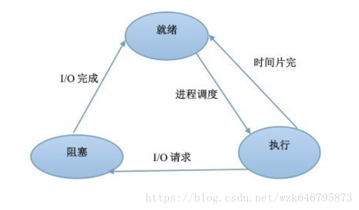

### 15 线程有几种状态？
* 在 Java虚拟机 中，线程从最初的创建到最终的消亡，要经历若干个状态：创建(new)、就绪(runnable/start)、运行(running)、阻塞(blocked)、等待(waiting)、时间等待(time waiting) 和 消亡(dead/terminated)。
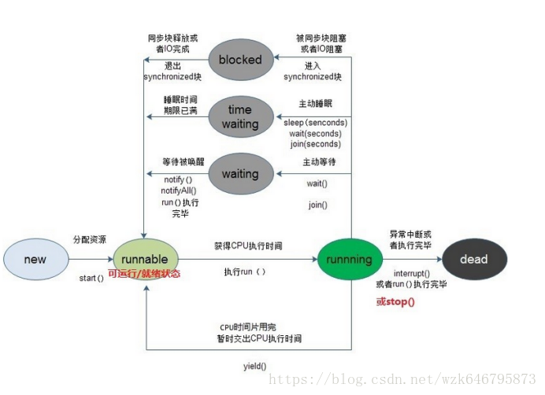

### 16 分页和分段有什么区别（内存管理）？
* 段式存储管理是一种符合用户视角的内存分配管理方案。在段式存储管理中，将程序的地址空间划分为若干段（segment），如代码段，数据段，堆栈段；这样每个进程有一个二维地址空间，相互独立，互不干扰。段式管理的优点是：没有内碎片（因为段大小可变，改变段大小来消除内碎片）。但段换入换出时，会产生外碎片（比如4k的段换5k的段，会产生1k的外碎片）。

* 页式存储管理方案是一种用户视角内存与物理内存相分离的内存分配管理方案。在页式存储管理中，将程序的逻辑地址划分为固定大小的页（page），而物理内存划分为同样大小的帧，程序加载时，可以将任意一页放入内存中任意一个帧，这些帧不必连续，从而实现了离散分离。页式存储管理的优点是：没有外碎片（因为页的大小固定），但会产生内碎片（一个页可能填充不满）。

* 两者不同：
  * 目的不同：分页是由于系统管理的需要而不是用户的需要，它是信息的物理单位；分段的目的是为了能更好地满足用户的需要，它是信息的逻辑单位，它含有一组其意义相对完整的信息；
  * 大小不同：页的大小固定且由系统决定，而段的长度却不固定，由其所完成的功能决定；
  * 地址空间不同：段向用户提供二维地址空间；页向用户提供的是一维地址空间；
  * 信息共享：段是信息的逻辑单位，便于存储保护和信息的共享，页的保护和共享受到限制；
  * 内存碎片：页式存储管理的优点是没有外碎片（因为页的大小固定），但会产生内碎片（一个页可能填充不满）；而段式管理的优点是没有内碎片（因为段大小可变，改变段大小来消除内碎片）。但段换入换出时，会产生外碎片（比如4k的段换5k的段，会产生1k的外碎片）。

### 17 操作系统中进程调度策略有哪几种？
1. FCFS(先来先服务，队列实现，非抢占的)：先请求CPU的进程先分配到CPU。
2. SJF(最短作业优先调度算法)：平均等待时间最短，但难以知道下一个CPU区间长度。
3. 优先级调度算法：优先级越高越先分配到CPU，相同优先级先到先服务，存在的主要问题是：低优先级进程无穷等待CPU，会导致无穷阻塞或饥饿；解决方案：老化。
4. 时间片轮转调度算法(可抢占的)：队列中没有进程被分配超过一个时间片的CPU时间，除非它是唯一可运行的进程。如果进程的CPU区间超过了一个时间片，那么该进程就被抢占并放回就绪队列。
5. 多级队列调度算法：将就绪队列分成多个独立的队列，每个队列都有自己的调度算法，队列之间采用固定优先级抢占调度。其中，一个进程根据自身属性被永久地分配到一个队列中。
6. 多级反馈队列调度算法：与多级队列调度算法相比，其允许进程在队列之间移动：若进程使用过多CPU时间，那么它会被转移到更低的优先级队列；在较低优先级队列等待时间过长的进程会被转移到更高优先级队列，以防止饥饿发生。

### 18 说一说进程同步有哪几种机制？

* 原子操作、信号量机制、自旋锁管程、会合、分布式系统

### 19 什么是虚拟内存？
* 内存发展历程没有内存抽象(单进程，除去操作系统所用的内存之外，全部给用户程序使用) —>有内存抽象（多进程，进程独立的地址空间，交换技术(内存大小不可能容纳下所有并发执行的进程)—> 连续内存分配(固定大小分区(多道程序的程度受限)，可变分区(首次适应，最佳适应，最差适应)，碎片)—> 不连续内存分配（分段，分页，段页式，虚拟内存）

* 虚拟内存。虚拟内存允许执行进程不必完全在内存中。虚拟内存的基本思想是：每个进程拥有独立的地址空间，这个空间被分为大小相等的多个块，称为页(Page)，每个页都是一段连续的地址。这些页被映射到物理内存，但并不是所有的页都必须在内存中才能运行程序。当程序引用到一部分在物理内存中的地址空间时，由硬件立刻进行必要的映射；当程序引用到一部分不在物理内存中的地址空间时，由操作系统负责将缺失的部分装入物理内存并重新执行失败的命令。这样，对于进程而言，逻辑上似乎有很大的内存空间，实际上其中一部分对应物理内存上的一块(称为帧，通常页和帧大小相等)，还有一些没加载在内存中的对应在硬盘上，如图所示。
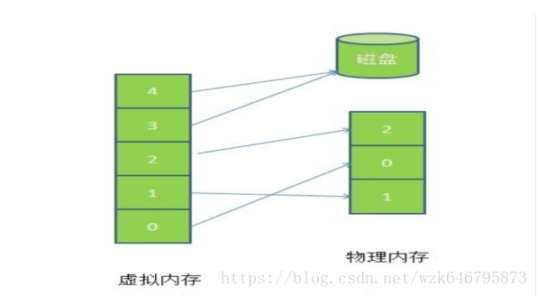
* 由图可以看出，虚拟内存实际上可以比物理内存大。当访问虚拟内存时，会访问MMU（内存管理单元）去匹配对应的物理地址（比如图5的0，1，2）。如果虚拟内存的页并不存在于物理内存中（如图5的3,4），会产生缺页中断，从磁盘中取得缺的页放入内存，如果内存已满，还会根据某种算法将磁盘中的页换出。

* 页面置换算法
  * FIFO先进先出算法：在操作系统中经常被用到，比如作业调度（主要实现简单，很容易想到）；
  * LRU（Least recently use）最近最少使用算法：根据使用时间到现在的长短来判断；
  * LFU（Least frequently use）最少使用次数算法：根据使用次数来判断；
  * OPT（Optimal replacement）最优置换算法：理论的最优，理论；就是要保证置换出去的是不再被使用的页，或者是在实际内存中最晚使用的算法。

* 虚拟内存应用及优点
  * 虚拟内存很适合在多道程序设计系统中使用，许多程序的片段同时保存在内存中。当一个程序等待它的一部分读入内存时，可以把CPU交给另一个进程使用。好处：
  * 在内存中可以保留多个进程，系统并发度提高。
  * 解除了用户与内存之间的紧密约束，进程可以比内存的全部空间还大

### 20 颠簸
* 颠簸本质上是指频繁的页调度行为，具体来讲，进程发生缺页中断，这时，必须置换某一页。然而，其他所有的页都在使用，它置换一个页，但又立刻再次需要这个页。因此，会不断产生缺页中断，导致整个系统的效率急剧下降，这种现象称为颠簸（抖动）。
* 解决策略包括：
  * 如果是因为页面替换策略失误，可以修改替换算法来解决这个问题；
  * 如果是因为运行的程序太多，造成程序无法同时将所有频繁访问的页面调入内存，则要降低多道程序的数量；
  * 否则，还剩下两个办法：终止该进程或增加物理内存容量。

### 21 局部性原理
* 时间上的局部性：最近被访问的页在不久的将来还会被访问；
* 空间上的局部性：内存中被访问的页周围的页也很可能被访问。
