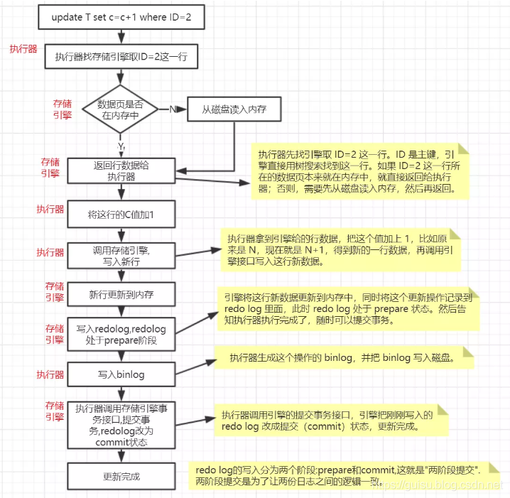

# Mysql 架构原理

> 参考文献
> * [Mysql 架构原理](https://blog.csdn.net/hguisu/article/details/7106342)
## 1 概述

### 分层结构概述
<!--  -->

1. 客户端：各种语言都提供了连接mysql数据库的方法，比如jdbc、php、go等，可根据选择 的后端开发语言选择相应的方法或框架连接mysql

2. server层：包括连接器、查询缓存、分析器、优化器、执行器等，涵盖mysql的大多数核心服务功能，以及所有的内置函数（例如日期、世家、数 学和加密函数等），所有跨存储引擎的功能都在这一层实现，比如存储过程、触发器、视图等。

3. 存储引擎层：负责数据的存储和提取，是真正与底层物理文件打交道的组件。 数据本质是存储在磁盘上的，通过特定的存储引擎对数据进行有组织的存放并根据业务需要对数据进行提取。存储引擎的架构模式是插件式的，支持Innodb，MyIASM、Memory等多个存储引擎。现在最常用的存储引擎是Innodb，它从mysql5.5.5版本开始成为了默认存储引擎。

4. 物理文件层：存储数据库真正的表数据、日志等。物理文件包括：redolog、undolog、binlog、errorlog、querylog、slowlog、data、index等

### 连接器

连接器负责来自客户端的连接、获取用户权限、维持和管理连接。

一个用户成功建立连接后，即使你用管理员账号对这个用户的权限做了修改，也不会影响已经存在连接的权限。修改完成后，只有再新建连接才会使用新的权限设置。

### 查询缓存

mysql拿到一个查询请求后，会先到查询缓存查看之前是否执行过这条语句。前执行过的语句及其结果可能会以key-value对的形式，被直接缓存在内存中。key是查询的语句，value是查询的结果。如果当前sql查询能够直接在查询缓存中找到key，那么这个value就会被直接返回给客户端。

### 分析器

词法分析（识别关键字，操作，表名，列名）

语法分析 (判断是否符合语法）

### 优化器

优化器是在表里面有多个索引的时候，决定使用哪个索引；或者在一个语句有多表关联（join）的时候，决定各个表的连接顺序。优化器阶段完成后，这个语句的执行方案就确定下来了，然后进入执行器阶段。

### 执行器

开始执行的时候，要先判断一下用户对这个表 T 有没有执行查询的权限。如果没有，就会返回没有权限的错误。如果命中查询缓存，会在查询缓存返回结果的时候，做权限验证。查询也会在优化器之前调用 precheck 验证权限。如果有权限，就打开表继续执行。打开表的时候，执行器就会根据表的引擎定义，去调用这个引擎提供的接口。在数据库的慢查询日志中看到一个rows_examined 的字段，表示这个语句执行过程中扫描了多少行，这个值就是在执行器每次调用引擎获取数据航的时候累加的。在有些场景下，执行器调用一次，在引擎内部则扫描了多行，因此引擎扫描行数跟rows_examined并不是完全相同的。

## 2 SQL查询机制

### 执行过程

SQL执行步骤：请求、缓存、SQL解析、优化SQL查询、调用引擎执行，返回结果:
1. 连接：客户端向 MySQL 服务器发送一条查询请求，与connectors交互：连接池认证相关处理。
2. 缓存：服务器首先检查查询缓存，如果命中缓存，则立刻返回存储在缓存中的结果，否则进入下一阶段
3. 解析：服务器进行SQL解析(词法语法)、预处理。
4. 优化：再由优化器生成对应的执行计划。
5. 执行：MySQL 根据执行计划，调用存储引擎的 API来执行查询。
6. 结果：将结果返回给客户端，同时缓存查询结果。

## 3 SQL更新机制和日志记录

### 执行过程
1. 客户端向 MySQL 服务器发送一条更新请求
2. 清除表查询缓存，跟这个有关的查询缓存会失效。这就是一般不建议使用查询缓存的原因。
3. 分析器进行 SQL解析（词法和语法分析），分析这是一条更新语句和。
4. 优化器生成对应的执行计划，优化器决定使用ID这个索引；
5. 执行器负责更新，找到这一行，然后进行更新:
   1. 取数据行: 执行器先找引擎取 ID=2 这一行:  ID 是主键，引擎直接用树搜索找到这一行。如果 ID=2 这一行所在的数据页本来就在内存中，就直接返回给执行器；否则，需要先从磁盘读入内存，然后再返回。)
   2. 更新数据: 执行器拿到引擎给的行数据，把这个值加上 1，比如原来是 N，现在就是 N+1，得到新的一行数据，再调用引擎接口写入这行新数据。
   3. 更新内存: 引擎将这行新数据更新到内存中，
   4. 更新 redo log :同时将这个更新操作记录到 redo log 里面，此时 redo log 处于 prepare 状态。然后告知执行器执行完成了，随时可以提交事务。
   5. 写入binlog:执行器生成这个操作的 binlog，并把 binlog 写入磁盘。
   6. 提交事务: 执行器调用引擎的提交事务接口，引擎把刚刚写入的 redo log 改成提交（commit）状态，更新完成。

### 日志类型

与查询流程不同的是，更新流程涉及两个重要日志模块：redo log（重做日志）和 binlog（归档日志）。redo log是InnoDB存储引擎层的日志，binlog是MySQL Server层记录的日志， 两者都是记录了某些操作的日志(不是所有)自然有些重复（但两者记录的格式不同）。

redo log在数据库重启恢复的时候被使用，因为其属于物理日志的特性，恢复速度远快于逻辑日志。而binlog和undo log属于的逻辑日志。