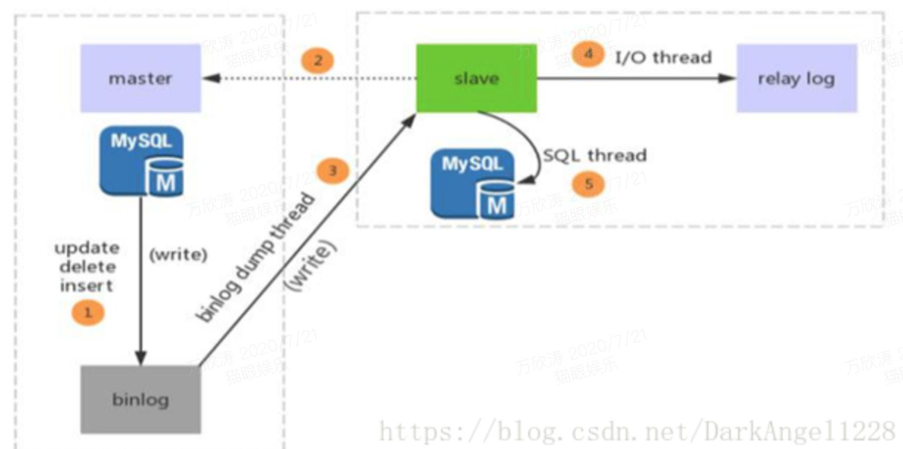
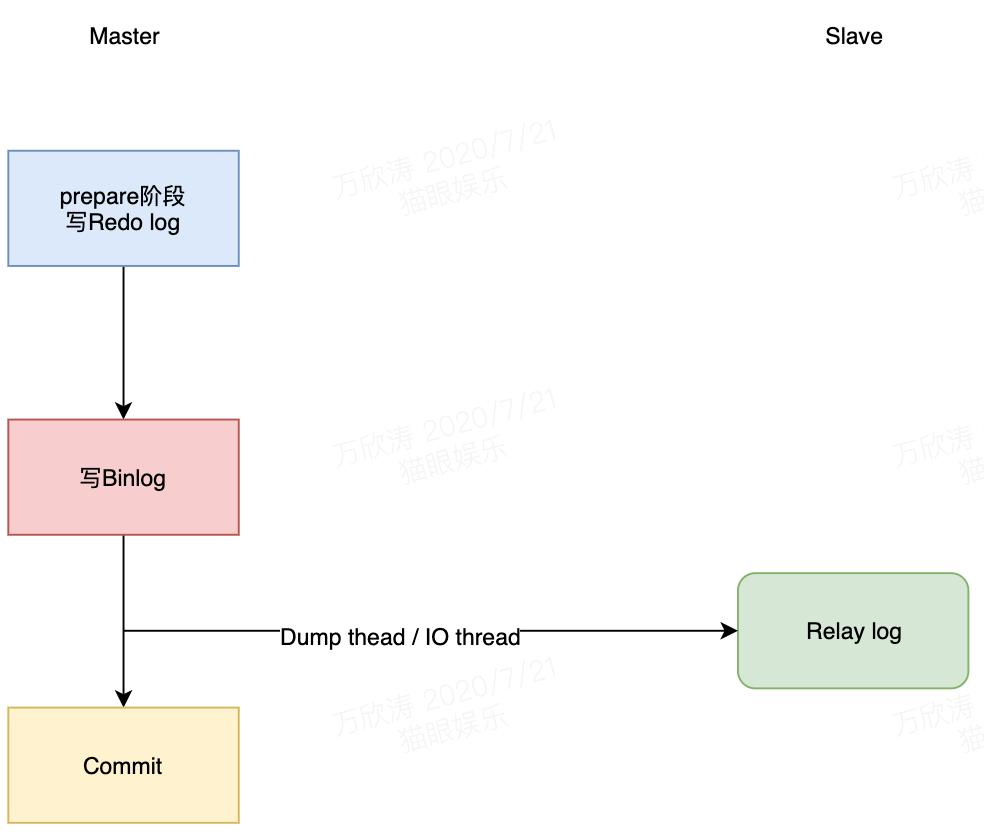
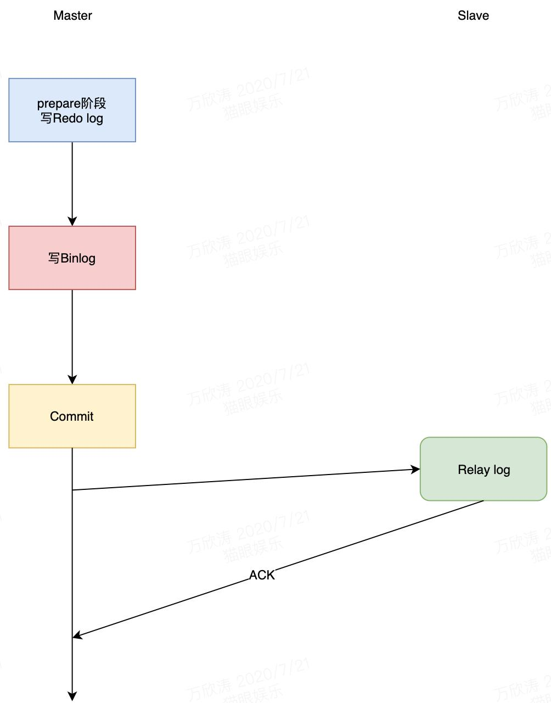

# MySQL分库分表和主从分离

## 1 概述

### 分库分表的原因

当一张表的数据达到几千万时，查询一次所花的时间会变多，如果有联合查询的话，有可能会死在那儿了。分表的目的就在于此，减小数据库的负担，缩短查询时间。
* 用户请求量太大。因为单服务器TPS，内存，IO都是有限的。解决方法：分散请求到多个服务器上； 其实用户请求和执行一个sql查询是本质是一样的，都是请求一个资源，只是用户请求还会经过网关，路由，http服务器等。

* 单库太大。单个数据库处理能力有限；单库所在服务器上磁盘空间不足；单库上操作的IO瓶颈 解决方法：切分成更多更小的库

* 单表太大。CRUD都成问题；索引膨胀，查询超时。解决方法：切分成多个数据集更小的表。

### 分库分表的形式

* 单库单表。单库单表是最常见的数据库设计，例如，有一张用户(user)表放在数据库db中，所有的用户都可以在db库中的user表中查到。

* 单库多表。随着用户数量的增加，user表的数据量会越来越大，当数据量达到一定程度的时候对user表的查询会渐渐的变慢，从而影响整个DB的性能。如果使用mysql, 还有一个更严重的问题是，当需要添加一列的时候，mysql会锁表，期间所有的读写操作只能等待。可以通过某种方式将user进行水平的切分，产生两个表结构完全一样的user_0000,user_0001等表，user_0000 + user_0001 + …的数据刚好是一份完整的数据。

* 多库多表。随着数据量增加也许单台DB的存储空间不够，随着查询量的增加单台数据库服务器已经没办法支撑。这个时候可以再对数据库进行水平区分。

## 2 分库分表

### 水平切分

水平切分又称为 Sharding，它是将同一个表中的记录拆分到多个结构相同的表中。
* 水平分库：系统绝对并发量上来了，分表难以根本上解决问题，并且还没有明显的业务归属来垂直分库。
* 水平分表：系统绝对并发量并没有上来，只是单表的数据量太多，影响了SQL效率，加重了CPU负担，以至于成为瓶颈。

当一个表的数据不断增多时，Sharding 是必然的选择，它可以将数据分布到集群的不同节点上，从而缓存单个数据库的压力。

* 主要特点
  * 每个库的结构都一样；
  * 每个库的数据都不一样，没有交集；
  * 所有库的并集是全量数据；

### 垂直切分

垂直切分是将一张表按列切分成多个表，通常是按照列的关系密集程度进行切分，也可以利用垂直切分将经常被使用的列和不经常被使用的列切分到不同的表中。

在数据库的层面使用垂直切分将按数据库中表的密集程度部署到不同的库中，例如将原来的电商数据库垂直切分成商品数据库、用户数据库等。

如果把业务切割得足够独立，那把不同业务的数据放到不同的数据库服务器将是一个不错的方案，而且万一其中一个业务崩溃了也不会影响其他业务的正常进行，并且也起到了负载分流的作用，大大提升了数据库的吞吐能力。
* 垂直分库：系统绝对并发量上来了，并且可以抽象出单独的业务模块。
* 垂直分表：系统绝对并发量并没有上来，表的记录并不多，但是字段多，并且热点数据和非热点数据在一起，单行数据所需的存储空间较大。以至于数据库缓存的数据行减少，查询时会去读磁盘数据产生大量的随机读IO，产生IO瓶颈。

* 主要特点
  * 每个库的结构都不一样；
  * 每个库的数据也不一样，没有交集；
  * 所有库的并集是全量数据；

### Sharding 策略

- 映射法：哈希取模hash(key) % N。Snowflake算法。
  - HASH取模方法优点： 能保证数据较均匀的分散落在不同的库、表中，减轻了数据库压力
  - HASH取模方法缺点： 扩容麻烦、迁移数据时每次都需要重新计算hash值分配到不同的库和表

- 范围法：可以是 ID 范围、时间范围、地理范围。
  - RANGE方法优点： 扩容简单，提前建好库、表就好
  - RANGE方法缺点： 大部分读和写都访会问新的数据，有IO瓶颈，这样子造成新库压力过大，不建议采用。

- 映射表：使用单独的一个数据库来存储映射关系。

### Sharding 工具

* sharding-sphere：jar，前身是sharding-jdbc；
* TDDL：jar，Taobao Distribute Data Layer；
* Mycat：中间件。

### Sharding 存在的问题

1. 事务问题。使用分布式事务来解决，比如 XA 接口。

2. 连接。可以将原来的连接分解成多个单表查询，然后在用户程序中进行连接。

3. ID 唯一性
   - 使用全局唯一 ID（GUID）
   - 为每个分片指定一个 ID 范围。
   - 分布式 ID 生成器能够计算出sharding ID

4. 维度的问题。假如用户购买了商品,需要将交易记录保存取来，如果按照用户的纬度分表，则每个用户的交易记录都保存在同一表中，所以很快很方便的查找到某用户的 购买情况，但是某商品被购买的情况则很有可能分布在多张表中，查找起来比较麻烦。反之，按照商品维度分表，可以很方便的查找到此商品的购买情况，但要查找 到买人的交易记录比较麻烦。所以常见的解决方式有：
   * 通过扫表的方式解决，此方法基本不可能，效率太低了。
   * 记录两份数据，一份按照用户纬度分表，一份按照商品维度分表。
   * 通过搜索引擎解决，但如果实时性要求很高，又得关系到实时搜索。

### 分库分表时机

单表1000万条记录一下,写入读取性能是比较好的. 这样在留点buffer,那么单表全是数据字型的保持在800万条记录以下, 有字符型的单表保持在500万以下。

不管是IO瓶颈，还是CPU瓶颈，最终都会导致数据库的活跃连接数增加，进而逼近甚至达到数据库可承载活跃连接数的阈值。在业务Service来看就是，可用数据库连接少甚至无连接可用。

* IO 瓶颈
  * 第一种：磁盘读IO瓶颈，热点数据太多，数据库缓存放不下，每次查询时会产生大量的IO，降低查询速度 -> 分库和垂直分表。
  * 第二种：网络IO瓶颈，请求的数据太多，网络带宽不够 -> 分库。

* CPU瓶颈
  * 第一种：SQL问题，如SQL中包含join，group by，order by，非索引字段条件查询等，增加CPU运算的操作 -> SQL优化，建立合适的索引，在业务Service层进行业务计算。
  * 第二种：单表数据量太大，查询时扫描的行太多，SQL效率低，CPU率先出现瓶颈 -> 水平分表。

## 3 主从同步

### 主从分离
将数据库的写操作和读操作进行分离， 使用多个从库副本（Slaver Replication）负责读，使用主库（Master）负责写， 从库从主库同步更新数据，保持数据一致。架构上就是数据库主从同步。 从库可以水平扩展，所以更多的读请求不成问题。通过此方式可以有效的提高DB集群的 QPS.

1. **读写分离**：在从服务器可以执行查询工作，降低主服务器压力;（主库写，从库读，降压）读写分离
2. **容灾**：在从主服务器进行备份，避免备份期间影响主服务器服务;容灾
3. **提高可用性**：当主服务器出现问题时，可以切换到从服务器。提高可用性

### 主从同步过程
Mysql服务器之间的主从同步是基于二进制日志BINLOG机制，主服务器使用二进制日志来记录数据库的变动情况，从服务器通过读取和执行该日志文件来保持和主服务器的数据一致。

1. SQL语句操作变化存入BinLog日志中
2. slave上线，连接到master服务器，进行数据同步
3. dump thread线程把Binlog数据发送到slave中
4. slave启动之后，创建一个I/O线程，读取master传过来的Binlog内容并写入到Relay log.
5. slave还会创建一个SQL线程，从Relay log里面读取内容，从Exec_Master_Log_Pos位置开始执行读取到的更新事件，将更新内容写入到slave的db.

### 主从同步方法

1. 异步复制。MySQL 默认的复制策略，Master处理事务过程中，将其写入Binlog就会通知Dump thread线程处理，然后完成事务的提交，不会关心是否成功发送到任意一个slave中

2. 半同步复制。Master处理事务过程中，提交完事务后，必须等至少一个Slave将收到的binlog写入relay log返回ack才能继续执行处理用户的事务。

3. 增强半同步复制。半同步的问题是因为等待ACK的点是Commit之后，此时Master已经完成数据变更，用户已经可以看到最新数据，当Binlog还未同步到Slave时，发生主从切换，那么此时从库是没有这个最新数据的，用户又看到老数据。增强半同步将等待ACK的点放在提交Commit之前，此时数据还未被提交，外界看不到数据变更，此时如果发送主从切换，新库依然还是老数据，不存在数据不一致的问题。

4. 组复制。MySQL在引擎层完成Prepare操作写Redo日志之后，会被MySQL的预设Hook拦截进入MGR层。MGR层将事务信息打包通过Paxos协议发送到全部节点上，只要集群中过半节点回复ACK，那么将告诉所有节点数据包同步成功，然后每个节点开始自己认证（certify）通过就开始写Binlog，提交事务或者写relay log，数据同步，如果认证不通过则rollback。总结：MGR内部实现了分布式数据一致性协议，paxos通过其来保证数据一致性。

