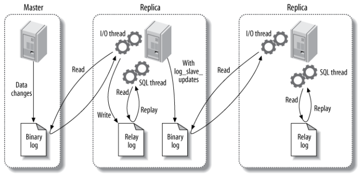
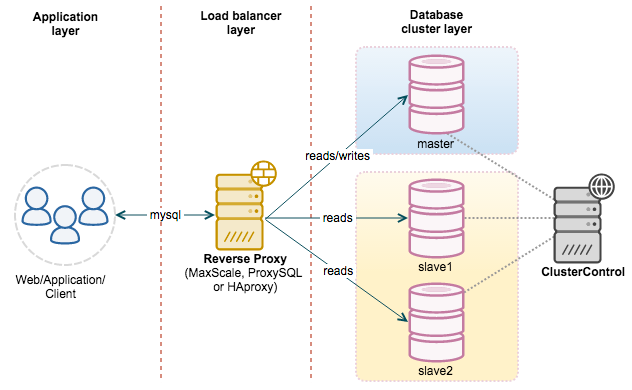

## 主从库

### 主从复制

主要涉及三个线程：binlog 线程、I/O 线程和 SQL 线程。

-   **binlog 线程**  ：负责将主服务器上的数据更改写入二进制日志（Binary log）中。
-   **I/O 线程**  ：负责从主服务器上读取二进制日志，并写入从服务器的中继日志（Relay log）。
-   **SQL 线程**  ：负责读取中继日志，解析出主服务器已经执行的数据更改并在从服务器中重放（Replay）。

### 读写分离

主服务器处理写操作以及实时性要求比较高的读操作，而从服务器处理读操作。

读写分离能提高性能的原因在于：

- 主从服务器负责各自的读和写，极大程度缓解了锁的争用；
- 从服务器可以使用 MyISAM，提升查询性能以及节约系统开销；
- 增加冗余，提高可用性。

读写分离常用代理方式来实现，代理服务器接收应用层传来的读写请求，然后决定转发到哪个服务器。
