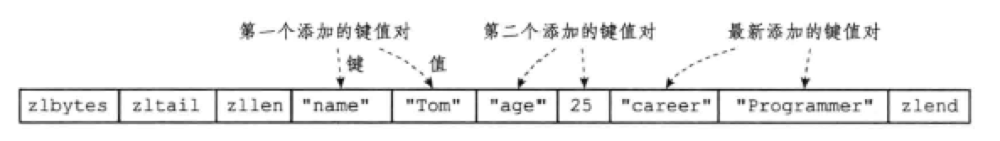
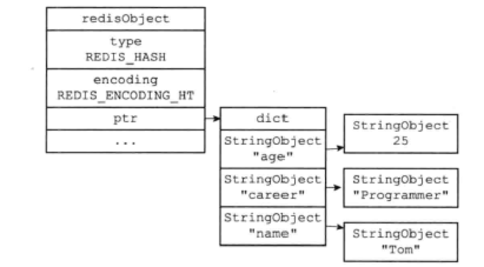
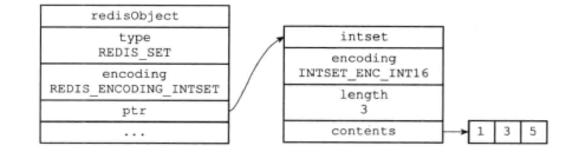

# 数据类型

- [数据类型](#数据类型)
  - [0 数据类型](#0-数据类型)
    - [对象说明](#对象说明)
    - [对象代码实现](#对象代码实现)
    - [对象编码encoding](#对象编码encoding)
    - [对象类型type](#对象类型type)
  - [1 字符串对象STRING](#1-字符串对象string)
    - [字符串实现](#字符串实现)
    - [编码的转换](#编码的转换)
    - [字符串命令](#字符串命令)
  - [2 列表对象LIST](#2-列表对象list)
    - [列表实现](#列表实现)
    - [编码转换](#编码转换)
    - [列表命令](#列表命令)
  - [3 哈希对象HASH](#3-哈希对象hash)
    - [哈希实现](#哈希实现)
    - [编码转换](#编码转换-1)
    - [哈希命令](#哈希命令)
  - [4 集合对象SET](#4-集合对象set)
    - [集合实现](#集合实现)
    - [编码的转换](#编码的转换-1)
    - [集合命令](#集合命令)
  - [5 有序集合的对象ZSET](#5-有序集合的对象zset)
    - [编码的转换](#编码的转换-2)
    - [有序集合命令](#有序集合命令)
  - [6 类型检查与命令多态](#6-类型检查与命令多态)
  - [7 内存回收](#7-内存回收)
  - [8 对象共享](#8-对象共享)
  - [9 对象的空转时长](#9-对象的空转时长)


## 0 数据类型

关于数据类型的说明。从C++标准库的角度来说，实现的数据结构主要可以如下方式进行划分
* 线性数据结构
  * vector(数组)
  * list(链表)
  * deque(双端队列)
* 非线性数据结构
  * set(集合)
    * set红黑树实现的有序set
    * unordered_set哈希实现的无序的set
  * map(映射map、字典dict、哈希hash)
    * map红黑树实现的有序map
    * unordered_set哈希实现的无序的map
* 扩展数据结构
  * stack(栈)
  * queue(队列)
  * priority_queue(优先队列、堆)


这里实现的数据类型，在底层的数据结构，抽象出来的新的数据结构。作为初学者，不需要了解底层数据类型转换，只需要建立起唯一的常见的对应关系即可。
* 字符串对象——SDS动态字符串
* 链表对象——双向链表
* 集合对象——字典dict(只有键。键的哈希函数值)
* 哈希对象——字典dict(键值对。键的哈希函数值，哈希函数值对应的对象)
* 有序链表——跳表

### 对象说明

Redis并没有使用SDS、双端链表、字典、跳表、压缩列表、整数集合来实现键值对数据库，而是基于这些数据结构创建了一个对象系统。这个系统包含字符串对象、列表对象、哈希对象、集合对象和有序集合对象。

通过这五种类型的对象，Redis可以在执行命令之前，根据对象的类型判断一个对象是否执行给定的命令。使用对象的好处是，可以针对不同的场景，为对象设置多种不同的数据结构的实现，从而优化使用效率。

除此之外，Redis还实现了引用计数的内存回收机制。当程序不再需要某个对象的时候，它所占用的内存会被自动释放。另外，Redis还用引用计数实现了对象共享，让多个数据库键共享同一个对象来节约内存。

最后，Redis的对象带有访问时间记录信息，空转时长较大的键可能被优先删除。


### 对象代码实现

Redis使用对象来表示数据库中的键和值。创建一个新键值对时，至少会创建两个对象，一个对象用作键，一个对象用作值。每个对象都由一个redisObject结构表示： 

```c
typedef struct redisObject {
  unsigned type: 4; // 类型
  unsigned encoding: 4; // 编码
  void *ptr; // 指向底层实现数据结构的指针
  // ...
} robj;
```

### 对象编码encoding

对象的ptr指向对象的底层实现数据结构，而这些数据结构由对象的encoding决定，它可以是：

| encoding常量                  | 对应的底层数据结构    |
| --------------------------- | ------------ |
| REDIS\_ENCODING\_INT        | long类型的整数    |
| REDIS\_ENCODING\_EMBSTR     | embstr编码的SDS |
| REDIS\_ENCODING\_RAW        | SDS          |
| REDIS\_ENCODING\_HT         | 字典           |
| REDIS\_ENCODING\_LINKEDLIST | 双端链表         |
| REDIS\_ENCODING\_ZIPLIST    | 压缩列表         |
| REDIS\_ENCODING\_INTSET     | 整数集合         |
| REDIS\_ENCODING\_SKIPLIST   | 跳跃表和字典       |

* 每种类型的对象至少使用了两种编码。
* 使用OBJECT ENCODING命令可以查看一个数据库键的值对象的编码。


### 对象类型type

| 对象类型type | 可以存储的值 | 操作 |
| :--: | :--: | -- |
| REDIS_STRING | 字符串、整数或者浮点数 | 对整个字符串或者字符串的其中一部分执行操作</br> 对整数和浮点数执行自增或者自减操作 |
| REDIS_LIST | 有序列表 | 从两端压入或者弹出元素 </br> 对单个或者多个元素进行修剪，</br> 只保留一个范围内的元素 |
| REDIS_SET | 无序集合 | 添加、获取、移除单个元素</br> 检查一个元素是否存在于集合中</br> 计算交集、并集、差集</br> 从集合里面随机获取元素 |
| REDIS_HASH | 无序字典 | 添加、获取、移除单个键值对</br> 获取所有键值对</br> 检查某个键是否存在|
| REDIS_ZSET | 有序集合 | 添加、获取、删除元素</br> 根据分值范围或者成员来获取元素</br> 计算一个键的排名 |

* 对象的键总是一个字符串对象，值可以是字符串对象、列表对象、哈希对象、集合对象、有序集合对象。
* 但数据库执行TYPE命令时，返回的结果为数据库键对应的值对象的类型，而不是键对象的类型。


## 1 字符串对象STRING

### 字符串实现


字符串对象的编码可以是**int、raw或embstr**。

1. 如果字符串对象保存的是整数值，且可以用long类型表示，那么字符串对象会将整数值保存在ptr中（将void* 转换成 long），并将编码设置为**int**。
2. 如果字符串对象保存到是一个字符串值，且长度大于32字节，那么字符串对象使用**SDS**来保存这个字符串值，并将编码设置为raw。
3. 如果字符串对象保存到是一个字符串值，且长度小于等于32字节，那么字符串对象使用**embstr编码**的方式来存储这个字符串值。

embstr编码是专门用来保存短字符串的优化方式。和raw编码一样，都是用redisObject结构和sdshdr结构来表示字符串对象，但raw会调用两次内存分配函数分别创建redisObject结构和sdshdr结构，而embstr则通过一次内存分配一块连续空间，依次包含两个结构：

| redisObject                    | sdshdr             |
| ------------------------------ | ------------------ |
| type \| encoding \| ptr \| ... | free \| len \| buf |

embstr的好处：

1. 内存分配次数降为一次。
2. 释放字符串对象只要一次内存释放函数。
3. 因为内存连续，可以更好地利用缓存。

PS. 用`long double`类型表示的浮点数在Redis中也是作为字符串值存储的。程序会先将浮点数转成字符串值，然后再保存转换的字符串值。

### 编码的转换

int编码和embstr编码的字符串对象可以被转换为raw编码的字符串对象。

1. 对int编码的字符串对象执行一些命令，可使其不再是整数值，而是字符串值，那么编码也就变为raw了。如APPEND。
2. 对embstr编码的字符串，执行修改命令，也会变成raw对象。如APPEND。

### 字符串命令

用于字符串键的所有命令都是针对字符串对象来构建的。


```html
> set hello world
OK
> get hello
"world"
> del hello
(integer) 1
> get hello
(nil)
```

| 命令  | int编码的实现方法| embstr编码的实现方法| raw编码的实现方法|
| ---------- | --------|--------- | ---------- |
| SET        | int编码保存值  | embstr编码保存值  | raw编码保存值                                 |
| GET        | 拷贝对象所保存的整数值，将这个拷贝转换为字符串值，然后向客户端返回这个字符串值  | 直接向客户端返回字符串值    | 直接向客户端返回字符串值     |
| APPEND     | 将对象转换为raw编码，然后按raw方式执行此操作                | 将对象转换为raw编码，然后按raw方式执行此操作                | 调用sdscatlen函数，将给定字符串追加到现有字符串的末尾          |
| INCBYFLOAT | 取出整数值并将其转换为long double的浮点数，对这个浮点数进行加法计算，然后将结果保存起来 | 取出整数值并将其转换为long double的浮点数，对这个浮点数进行加法计算，然后将结果保存起来。如果字符串值不能被转换为浮点数，那么客户端会报错 | 取出整数值并将其转换为long double的浮点数，对这个浮点数进行加法计算，然后将结果保存起来。如果字符串值不能被转换为浮点数，那么客户端会报错 |
| INCBY      | 对整数值进行加法计算，得出的结果作为整数被保存起来                | 不能执行此命令，客户端报错                            | 不能执行此命令，客户端报错                            |
| DECBY      | 对整数值进行减法计算，得出的结果作为整数被保存起来                | 不能执行此命令，客户端报错                            | 不能执行此命令，客户端报错                            |
| STRLEN     | 拷贝对象保存的整数值，将这个拷贝转换为字符串值，计算并返回这个字符串值的长度   | 调用sdslen函数，返回字符串的长度                      | 调用sdslen函数，返回字符串的长度                      |
| SETRANGE   | 将对象转换为raw编码，然后按raw方式执行此命令                | 将对象转换为raw编码，然后按raw方式执行此命令                | 将字符串特定索引上的值设置为给定的字符                      |
| GETRANGE   | 拷贝对象保存的整数值，将这个拷贝转换为字符串，然后取出返回字符串指定索引上的字符 | 直接取出并返回给定索引上的字符                          | 直接取出并返回给定索引上的字符                          |

## 2 列表对象LIST

### 列表实现

列表对象的编码是**ziplist或linkedlist**。

使用ziplist时，每个压缩列表的节点保存了一个列表元素。使用linkedlist时，每个链表节点保存了一个字符串对象，而每个字符串对象都保存了一个列表元素。

**字符串对象是Redis五种类型的对象中唯一一种会被嵌套的对象**。注意其他类型不会被嵌套。也就是说，字典中不可能包含链表，链表中的元素不可能是字典！！！

### 编码转换

当列表对象同时满足以下两个条件时，使用ziplist编码：

1. 保存的字符串对象的长度都小于64字节。
2. 保存的元素数量小于512个。

否则就是用linkedlist编码。

> 以上两个条件的上限可以修改，使用list-max-ziplist-value选项和list-max-ziplist-entries选项。

### 列表命令


```html
> rpush list-key item
(integer) 1
> rpush list-key item2
(integer) 2
> rpush list-key item
(integer) 3

> lrange list-key 0 -1
1) "item"
2) "item2"
3) "item"

> lindex list-key 1
"item2"

> lpop list-key
"item"

> lrange list-key 0 -1
1) "item2"
2) "item"
```


| 命令      | ziplist编码的实现                             | linkedlist编码的实现                          |
| ------- | ---------------------------------------- | ---------------------------------------- |
| LPUSH   | 调用ziplistPush函数，将新元素压入表头                 | 调用listAddNodeHead函数，将新元素压入表头             |
| RPUSH   | 调用ziplistPush函数，将新元素压入表尾                 | 调用listAddNodeTail函数，将新元素压入表尾             |
| LPOP    | 调用ziplistIndex定位表头节点，返回节点保存的元素后，调用ziplistDelete删除表头结点 | 调用lsitFrist定位表头节点，返回节点保存的元素后，调用listDelNode删除表头结点 |
| RPOP    | 调用ziplistIndex定位表尾节点，返回节点保存的元素后，调用ziplistDelete删除表尾结点 | 调用listLast定位表尾节点，返回节点保存的元素后，调用listDelNode删除表尾结点 |
| LINDEX  | 调用ziplistIndex                           | 调用listIndex                              |
| LLEN    | 调用ziplistLen                             | 调用listLength                             |
| LINSERT | 插入新节点到表头或表尾时，使用ziplistPush；其他位置使用ziplistInsert | 调用listInsertNode                         |
| LREM    | 遍历节点，调用ziplistDelete删除包含给定元素的节点          | 遍历节点，调用listDelNode删除包含给定元素的节点            |
| LTRIM   | 调用ziplistDeleteRange函数删除不再指定索引范围内的节点     | 遍历节点，调用listDelNode                       |
| LSET    | 调用ziplistDelete，先删除给定索引上的节点，然后调用ziplistInsert插入新节点 | 调用listIndex函数，定位给定索引上的节点，然后通过赋值操作更新节点的值  |

## 3 哈希对象HASH

### 哈希实现


哈希对象的编码可以是ziplist或hashtable。

使用ziplist时，每当有新的键值对要加入哈希对象时，程序先保将存了**键**的压缩列表对象推入到表尾，然后再将保存了**值**的节点推入到表尾。因此：

1. 保存了同一键值对的两个节点总是挨在一起。
2. 先添加的键值对会被放在表头，后添加的在表尾。



使用hashtable时，哈希对象中的每个**键值对都使用一个字典键值对**来保存：

- 字典的每个键都是一个字符串对象，对象中保存了键值对的键。
- 字典的每个值都是一个字符串对象，对象中保存了键值对的值。



### 编码转换

当哈希对象同时满足以下两个条件时，使用ziplist编码：

1. 哈希对象保存的所有键值对的键和值的字符串长度都小于64字节。
2. 哈希对象保存的键值对数量小于512个。

否则就使用hashtable编码。

> 以上两个条件的上限可以修改，使用hash-max-ziplist-value选项和hah-max-ziplist-entries选项。

### 哈希命令


```html
> hset hash-key sub-key1 value1
(integer) 1
> hset hash-key sub-key2 value2
(integer) 1
> hset hash-key sub-key1 value1
(integer) 0

> hgetall hash-key
1) "sub-key1"
2) "value1"
3) "sub-key2"
4) "value2"

> hdel hash-key sub-key2
(integer) 1
> hdel hash-key sub-key2
(integer) 0

> hget hash-key sub-key1
"value1"

> hgetall hash-key
1) "sub-key1"
2) "value1"
```

| 命令      | ziplist编码的实现                             | hashtable编码的实现                   |
| ------- | ---------------------------------------- | -------------------------------- |
| HSET    | ziplistPush将元素压入表尾，然后再ziplistPush将值压入表尾  | dictAdd添加新节点                     |
| HGET    | ziplistFind查找指定键对应的节点，再ziplistNext将指针移动到键节点旁边的值节点，返回直值节点 | dictFind查找给定键，然后dictGetVal返回对应的值 |
| HEXISTS | ziplistFind查找指定键对应的节点                    | dictFind                         |
| HDEL    | ziplistFind，然后删除键节点和值节点                  | dictDelete                       |
| HLEN    | ziplistLen，然后除以2                         | dictSize                         |
| HGETALL | 遍历ziplist，ziplistGet返回所有的键和值             | 遍历字典，dictGetKey返回键，dictGetVal返回值 |

## 4 集合对象SET

### 集合实现

集合对象的编码可以使intset或hashtable。

1. inset编码，集合对象的所有元素都被保存在整数集合中。

   

2. hashtable编码，字典的每个键都是一个字符串对象，每个字符串对象都包含了一个集合元素，字典的值全部为NULL。

   

### 编码的转换

当集合对象同时满足一下两个条件时，使用inset编码：

1. 所有元素都是整数值。
2. 元素数量不超过512个。

> 第二个的上限修改，查看set-max-intset-entries选项。

### 集合命令

```html
> sadd set-key item
(integer) 1
> sadd set-key item2
(integer) 1
> sadd set-key item3
(integer) 1
> sadd set-key item
(integer) 0

> smembers set-key
1) "item"
2) "item2"
3) "item3"

> sismember set-key item4
(integer) 0
> sismember set-key item
(integer) 1

> srem set-key item2
(integer) 1
> srem set-key item2
(integer) 0

> smembers set-key
1) "item"
2) "item3"
```

| 命令          | intset编码的实现                 | hashtable编码的实现                |
| ----------- | --------------------------- | ----------------------------- |
| SADD        | intsetAdd                   | dictAdd                       |
| SCARD       | intsetLen                   | dictSize                      |
| SISMEMBER   | intsetFind                  | dictFind                      |
| SMEMBERS    | 遍历集合，使用intsetGet返回元素        | 遍历字典，使用dictGetKey返回元素         |
| SRANDMEMBER | intsetRandom随机返回一个元素        | dictGetRandomKey              |
| SPOP        | intsetRandom，然后intsetRemove | dictGetRandomKey，然后dictDelete |
| SREM        | intsetRemove                | dictDelete                    |

## 5 有序集合的对象ZSET

有序集合的编码是ziplist或skiplist。

1. ziplist编码：每个集合元素使用两个紧挨在一起的ziplist节点来存储。第一个节点保存元素的成员（member），第二元素保存元素的分值（score）。元素按分值的从小到大排序。
2. skiplist编码：一个zset结构同时包含一个字典和一个跳跃表。跳跃表按分值从小到大保存了所有集合元素，每个跳跃表节点都保存了一个集合元素，节点的object保存了元素的成员，score保存了元素的分值。字典为有序集合创建了一个从成员到分值的映射，字典中的每个键值对都保存了一个集合元素，键保存了元素的成员，值保存了元素的分值。

### 编码的转换

有序集合满足以下两个条件时，使用ziplist编码：

1. 元素数量小于128。
2. 元素成员的长度小于64个字节。

> 两个条件的上限参考zset-max-ziplist-entries和zset-max-ziplist-value选项。

### 有序集合命令


```html
> zadd zset-key 728 member1
(integer) 1
> zadd zset-key 982 member0
(integer) 1
> zadd zset-key 982 member0
(integer) 0

> zrange zset-key 0 -1 withscores
1) "member1"
2) "728"
3) "member0"
4) "982"

> zrangebyscore zset-key 0 800 withscores
1) "member1"
2) "728"

> zrem zset-key member1
(integer) 1
> zrem zset-key member1
(integer) 0

> zrange zset-key 0 -1 withscores
1) "member0"
2) "982"
```

| 命令        | ziplist编码的实现                | zset编码的实现                              |
| --------- | --------------------------- | -------------------------------------- |
| ZADD      | ziplistInsert将成员和分值两个节点分别插入 | zslInsert，将新元素插入跳跃表，然后dictAdd将新元素关联到字典 |
| ZCARD     | ziplistLen，然后除以2            | 访问跳跃表的length                           |
| ZCOUNT    | 遍历列表，统计分值在给定范围内的节点的数量       | 遍历跳跃表                                  |
| ZRANGE    | 从头到尾遍历                      | 从头到尾遍历跳跃表                              |
| ZREVRANGE | 从尾向头遍历                      | 从尾向头遍历                                 |
| ZRANK     | 从头到尾遍历，查找给定成员，并记录经过节点的数量    | 从头到尾遍历，查找给定成员，并记录经过节点的数量               |
| ZREVRANK  | 从尾向头遍历，查找给定成员，并记录经过节点的数量    | 从尾向头遍历，查找给定成员，并记录经过节点的数量               |
| ZREM      | 遍历，删除包含给定成员的节点及旁边的分值节点      | 遍历跳跃表，删除节点，并在字典中解除被删除元素的成员和分值的关联       |
| ZSCORE    | 遍历查找成员节点，返回旁边的分值节点          | 从字典中取出给定成员的分值                          |

## 6 类型检查与命令多态

在执行一个类型特定的命令之前，Redis会先检查输入键的类型是否正确，然后再决定是否执行。类型检查是通过redisObject的type属性来的。

除此之外，Redis还会根据值对象的编码方式，选择正确的实现命令来执行。这就是多态。

LLEN命令的执行过程：


## 7 内存回收 

Redis为对象系统构建了一个引用计数垃圾回收。每个对象的引用计数由redisObject结构的refcount保存。

| 操作          | 引用计数的变化 |
| ----------- | ------- |
| 创建一个新对象     | 初始化为1   |
| 对象被一个新程序使用  | +1      |
| 对象不再被一个程序使用 | -1      |

当计数变为0时，对象占用的内存就会被释放。

## 8 对象共享

refcount还可用于对象共享：

1. 将数据库键的值指向现有的值对象。
2. refcount++。

Redis在初始化服务器时，创建了10000个字符串对象，包含0 ~ 9999的所有整数值，用于共享。

> 数量通过redis.h/REDIS\_SHARED\_INTSETGERS常量控制。

使用OBJECT REFCOUNT可查看值对象的引用计数。

**但Redis只对包含整数值的字符串对象共享**。即只有共享对象和目标对象完全相同的情况下。一个共享对象保存的值越复杂，验证共享对象和目标对象是否相同的操作也就越复杂。

## 9 对象的空转时长

redisObject最后一个属性lru，记录了对象最后一次被访问的时间，用OBJECT IDLETIME可查看。

如果服务器打开了maxmemory属性，lru对象可用于回收内存。
