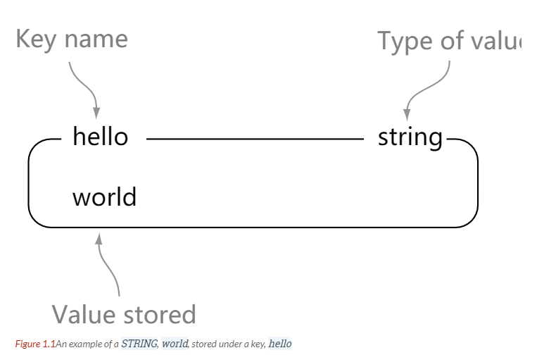

# 数据类型

## 0 数据类型

| 数据类型 | 可以存储的值 | 操作 |
| :--: | :--: | -- |
| String | 字符串、整数或者浮点数 | 对整个字符串或者字符串的其中一部分执行操作  对整数和浮点数执行自增或者自减操作 |
| List | 列表 | 从两端压入或者弹出元素   对单个或者多个元素进行修剪，  只保留一个范围内的元素 |
| Set | 无序集合 | 添加、获取、移除单个元素  检查一个元素是否存在于集合中  计算交集、并集、差集  从集合里面随机获取元素 |
| Hash | 无序字典 | 添加、获取、移除单个键值对  获取所有键值对  检查某个键是否存在|
| Zset | 有序集合 | 添加、获取、删除元素  根据分值范围或者成员来获取元素  计算一个键的排名 |

