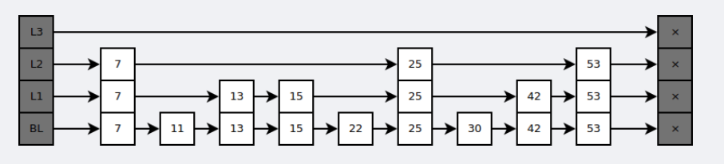
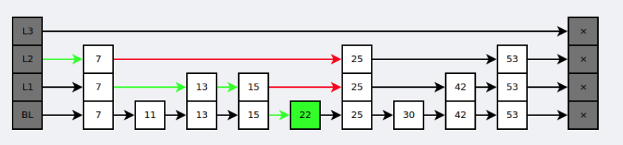

# 底层数据结构

> 参考文献
> * [底层数据结构](https://www.cnblogs.com/ysocean/p/9080942.html#_label1)

- [底层数据结构](#底层数据结构)
  - [1 动态字符串SDS](#1-动态字符串sds)
    - [SDS 代码实现](#sds-代码实现)
    - [SDS 特点（与C字符串的不同）](#sds-特点与c字符串的不同)
    - [SDS API](#sds-api)
  - [2 链表](#2-链表)
    - [双向链表 代码实现](#双向链表-代码实现)
    - [链表 特点](#链表-特点)
    - [链表 API](#链表-api)
  - [3 字典](#3-字典)
    - [字典的实现](#字典的实现)
    - [哈希算法](#哈希算法)
    - [解决键冲突](#解决键冲突)
    - [Rehash](#rehash)
    - [哈希表的扩展与收缩](#哈希表的扩展与收缩)
    - [渐进式rehash](#渐进式rehash)
    - [字典API](#字典api)
  - [4 跳表](#4-跳表)
    - [跳表 代码实现](#跳表-代码实现)
    - [跳表使用](#跳表使用)
    - [跳跃表API](#跳跃表api)
  - [5 整数集合——特殊情况](#5-整数集合特殊情况)
    - [整数集合的实现](#整数集合的实现)
    - [升级](#升级)
    - [升级的好处](#升级的好处)
    - [降级](#降级)
    - [整数集合API](#整数集合api)
  - [6 压缩列表——特殊情况](#6-压缩列表特殊情况)
    - [压缩列表的构成](#压缩列表的构成)
    - [压缩列表节点的构成](#压缩列表节点的构成)
    - [连锁更新](#连锁更新)
    - [压缩列表API](#压缩列表api)


## 1 动态字符串SDS
Redis构建了 简单动态字符串（simple dynamic string，SDS）来表示字符串值。

SDS还被用作缓冲区：AOF缓冲区，客户端状态中的输入缓冲区。

### SDS 代码实现

每个sds.h/sdshdr结构表示一个SDS值：

```c
struct sdshdr {
  // 记录buf数组中已使用字节的数量
  // 等于SDS所保存字符串的长度
  int len;
  
  // 记录buf数组中未使用字节的数量
  int free;
  
  // 字节数组，用于保存字符串
  char buf[];
}
```


SDS遵循C字符串以空字符结尾的管理，空字符不计算在len属性中。这样，SDS可以重用一部分C字符串函数库，如printf。

### SDS 特点（与C字符串的不同）

- **常数复杂度获取字符串长度**。
  - C字符串必须遍历整个字符串才能获得长度，复杂度是O(N)。
  - SDS在len属性中记录了SDS的长度，复杂度为O(1)。

- **杜绝缓冲区溢出**。
  - C字符串不记录长度的带来的另一个问题是缓冲区溢出。假设s1和s2是紧邻的两个字符串，对s1的strcat操作，有可能污染s2的内存空间。
  - SDS的空间分配策略杜绝了缓冲区溢出的可能性：但SDS API修改SDS时，会先检查SDS的空间是否满足修改所需的要求，不满足的话，API会将SDS的空间扩展至执行修改所需的大小，然后再执行实际的修改操作。

- **减少修改字符串时带来的内存重分配次数**。
  - 每次增长或缩短一个C字符串，程序都要对保存这个C字符串的数组进行一次内存重分配操作。Redis作为数据库，数据会被平凡修改，如果每次修改字符串都会执行一次内存重分配的话，会对新嗯呢该造成影响。
  - SDS通过未使用空间接触了字符串长度和底层数组长度的关联：在SDS中，buf数组的长度不一定就是字符数量+1，数组里面可以包含未使用的字节，由free属性记录。对于未使用空间，SDS使用了空间预分配和惰性空间释放两种优化策略：
    1. 空间预分配：当SDS的API对SDS修改并需要空间扩展时，程序不仅为SDS分配修改所需的空间，还会分配额外的未使用空间（取决于长度是否小于1MB）。
    2. 惰性空间释放：当SDS的API需要缩短时，程序不立即触发内存重分配，而是使用free属性将这些字节的数量记录下来，并等待将来使用。与此同时，SDS API也可以让我们真正师范未使用空间，防止内存浪费。

- **二进制安全**。
  - C字符串中的字符必须复合某种编码（如ASCII），除了字符串末尾之外，字符串里不能包含空字符。这些限制使得C字符串只能保存文本，而不是不能保存二进制数据。
  - SDS API会以处理二进制的方式处理SDS存放在buf数组中的数据，写入时什么样，读取时就是什么样。

- **兼容部分C字符串函数**。遵循C字符串以空字符结尾的管理，SDS可以重用<string.h>函数库。

  ​

| C字符串                | SDS                 |
| ------------------- | ------------------- |
| 获取长度的复杂度O(N)        | O(1)                |
| API不安全，缓冲区溢出        | API安全，不会缓冲区溢出       |
| 修改字符串长度必然导致内存重分配    | 修改字符串长度不一定导致内存重分配   |
| 只能保存文本数据            | 可以保存文本或二进制数据        |
| 可使用所有<string.h>库的函数 | 可使用部分<string.h>库的函数 |

### SDS API

| 函数          | 作用                                | 时间复杂度     |
| ----------- | --------------------------------- | :-------- |
| sdsnew      | 创建一个包含给定C字符串的SDS                  | O(N)      |
| sdsempty    | 创建一个不包含任何内容的SDS                   | O(1)      |
| sdsfree     | 释放SDS                             | O(N)      |
| sdslen      | 返回SDS已使用的字节数                      | O(1)      |
| sdsavail    | 返回SDS未使用的字节数                      | O(1)      |
| sdsdup      | 创建一个给定SDS的副本                      | O(N)      |
| sdsclear    | 清空SDS保存的字符串内容                     | O(1)，惰性释放 |
| sdscat      | 将给定C字符串拼接到SDS字符串的末尾               | O(N)      |
| sdscatsds   | 将给定SDS字符串拼接到另一个SDS的末尾             | O(N)      |
| sdscpy      | 复制                                | O(N)      |
| sdsgrowzero | 用空字符将SDS扩展至给定长度                   | O(N)      |
| sdsrange    | 保留SDS给定区间内的数据，不在区间内的数据会被覆盖或清除     | O(N)      |
| sdstrim     | 接受一个SDS和C字符为参数，从SDS中移除C字符串中出现过的字符 | O(N^2)    |
| sdscmp      | 比较                                | O(N)      |


## 2 链表

Redis构建了自己的链表实现。列表键的底层实现之一就是链表。

发布、订阅、慢查询、监视器都用到了链表。Redis服务器还用链表保存多个客户端的状态信息，以及构建客户端输出缓冲区。

### 双向链表 代码实现

链表节点用adlist.h/listNode结构来表示

```c
typedef struct listNode {
  struct listNode *prev;
  struct listNode *next;
  void *value;
} listNode;
```


adlist.h/list来持有链表: 

```c
typedef struct list {
  listNode *head;
  listNode *tail;
  unsigned long len;
  void *(dup)(void *ptr); // 节点复制函数
  void (*free)(void *ptr); // 节点释放函数
  int (*match)(void *ptr, void *key); // 节点值对比函数
} list;
```

 

### 链表 特点

1. 双向无环。表头结点的prev和表尾节点的next都指向NULL
2. 带表头指针和表尾指针
3. 带链表长度计数器
4. 多态。使用void*指针来保存节点值，并通过list结构的dup、free。match三个属性为节点值设置类型特定函数

### 链表 API

| 函数                                       | 作用                                    | 复杂度    |
| ---------------------------------------- | ------------------------------------- | ------ |
| listSetDupMethod, listSetFreeMethod, listSetMatchMethod | 将给定函数设置为链表的节点值复制/释放/对比函数              | O(1)   |
| listGetDupMethod, listGetFreeMethod, listGetMatchMethod |                                       | O(1)   |
| listLength                               | 返回链表长度                                | O(1)   |
| listFrist                                | 返回表头结点                                | O(1)   |
| listLast                                 | 返回表尾结点                                | O(1)   |
| listPrevNode, listNextNode               | 返回给定节点的前置/后置节点                        | O(1)   |
| listNodeValue                            | 返回给定节点目前正在保存的值                        | O(1)   |
| listCreate                               | 创建一个不包含任何节点的新链表                       | O(1)   |
| listAddNodeHead, listAddNodeTail         | 将一个包含给定值的新节点添加到表头/表尾                  | O(1)   |
| listSearchKey                            | 查找并返回包含给定值的节点                         | *O(N)* |
| listIndex                                | 返回链表在给定索引上的节点                         | *O(N)* |
| listDelNote                              | 删除给定节点                                | *O(N)* |
| listRotate                               | 将链表的表尾结点弹出，然后将被弹出的节点插入到链表的表头，成为新的表头结点 | O(1)   |
| listDup                                  | 复制一个给定链表的副本                           | *O(N)* |
| listRelease                              | 释放给定链表，及所有节点                          | *O(N)* |


## 3 字典

**Redis的数据库就是使用字典来作为底层实现的**，对数据库的增删改查都是构建在字典的操作之上。

**字典还是哈希键的底层实现之一**，但一个哈希键包含的键值对比较多，又或者键值对中的元素都是较长的字符串时，Redis就会用字典作为哈希键的底层实现。

### 字典的实现

Redis的字典使用**哈希表**作为底层实现，每个哈希表节点就保存了字典中的一个键值对。

Redis字典所用的**哈希表**由dict.h/dictht结构定义：

```c
typedef struct dictht {
  // 哈希表数组
  dictEntry **table;
  // 哈希表大小
  unsigned long size;
  // 哈希表大小掩码，用于计算索引值，总是等于size - 1
  unsigned long sizemask;
  // 该哈希表已有节点的数量
  unsigned long used;
} dictht;
```

**哈希表节点**使用dictEntry结构表示，每个dictEntry结构都保存着一个键值对：

```c
typedef struct dictEntry {
  void *key; // 键
  
  // 值
  union {
    void *val;
    uint64_t u64;
    int64_t s64;
  } v;
  
  // 指向下个哈希表节点，形成链表。一次解决键冲突的问题
  struct dictEntry *next;
}
```


Redis中的**字典**由dict.h/dict结构表示：

```c
typedef struct dict {
  dictType *type; // 类型特定函数
  void *privdata; // 私有数据
  
  /*
  哈希表
  一般情况下，字典只是用ht[0]哈希表，ht[1]只会在对ht[0]哈希表进行rehash时是用
  */
  dictht ht[2]; 
  
  // rehash索引，但rehash不在进行时，值为-1
  // 记录了rehash的进度
  int trehashidx; 
} dict;
```

type和privdata是针对不同类型的键值对，为创建多态字典而设置的：

- type是一个指向dictType结构的指针，每个dictType都保存了一簇用于操作特定类型键值对的函数，Redis会为用途不同的字典设置不同的类型特定函数。
- privdata保存了需要传给那些类型特定函数的可选参数。

```c
typedef struct dictType {
  // 计算哈希值的函数
  unsigned int (*hashFunction) (const void *key);
  
  // 复制键的函数
  void *(*keyDup) (void *privdata, const void *obj);
  
  // 对比键的函数
  void *(*keyCompare) (void *privdata, const void *key1, const void *key2);
  
  // 销毁键的函数
  void (*keyDestructor) (void *privdata, void *key);
  
  // 销毁值的函数
  void (*valDestructor) (void *privdata, void *obj);
} dictType;
```

### 哈希算法

Redis计算哈希值和索引值的方法如下：

```python
# 使用字典设置的哈希函数，计算key的哈希值
hash = dict.type.hashFucntion(key)
# 使用哈希表的sizemask属性和哈希值，计算出索引值
# 根据情况的不同，ht[x]可以使ht[0]或ht[1]
index = hash & dict.ht[x].sizemask
```

当字典被用作数据库或哈希键的底层实现时，使用MurmurHash2算法来计算哈希值，即使输入的键是有规律的，算法人能有一个很好的随机分布性，计算速度也很快。

### 解决键冲突

Redis使用链地址法解决键冲突，每个哈希表节点都有个next指针。

 

### Rehash

随着操作的不断执行，哈希表保存的键值对会增加或减少。为了让哈希表的负载因子维持在合理范围，需要对哈希表的大小进行扩展或收缩，即通过执行rehash（重新散列）来完成：

1. 为字典的ht[1]哈希表分配空间：
   1. 如果执行的是扩展操作，ht[1]的大小为第一个大于等于ht[0].used * 2 的2^n
   2. 如果执行的是收缩操作，ht[1]的大小为第一个大于等于ht[0].used的2^n

2. 将保存在ht[0]中的所有键值对rehash到ht[1]上。rehash是重新设计的计算键的哈希值和索引值

3. 释放ht[0]，将ht[1]设置为ht[0]，并为ht[1]新建一个空白哈希表

### 哈希表的扩展与收缩

满足一下任一条件，程序会自动对哈希表执行扩展操作：

1. 服务器目前没有执行BGSAVE或BGREWRITEAOF，且哈希表负载因子大于等于1
2. 服务器正在执行BGSAVE或BGREWRITEAOF，且负载因子大于5

其中负载因子的计算公式：

```python
# 负载因子 = 哈希表已保存节点数量 / 哈希表大小
load_factor = ht[0].used / ht[0].size
```

注：执行BGSAVE或BGREWRITEAOF过程中，Redis需要创建当前服务器进程的子进程，而多数操作系统都是用写时复制来优化子进程的效率，所以在子进程存在期间，服务器会提高执行扩展操作所需的负载因子，从而尽可能地避免在子进程存在期间扩展哈希表，避免不避免的内存写入，节约内存。

### 渐进式rehash

将ht[0]中的键值对rehash到ht[1]中的操作不是一次性完成的，而是分多次渐进式的：

1. 为ht[1]分配空间
2. 在字典中维持一个索引计数器变量rehashidx，设置为0，表示rehash工作正式开始
3. rehash期间，**每次对字典的增删改查操作**，会顺带将ht[0]在rehashidx索引上的所有键值对rehash到ht[1]，rehash完成之后，rehashidx属性的值+1
4. 最终ht[0]会全部rehash到ht[1]，这是将rehashidx设置为-1，表示rehash完成

渐进式rehash过程中，字典会有两个哈希表，字典的增删改查会在两个哈希表上进行。

### 字典API

| 函数               | 作用              | 时间复杂度 |
| ---------------- | --------------- | ----- |
| dictCreate       | 创建一个新的字典        | O(1)  |
| dictAdd          | 添加键值对           | O(1)  |
| dictReplace      | 添加键值对，如已存在，替换原有 | O(1)  |
| dictFetchValue   | 返回给定键的值         | O(1)  |
| dictGetRandomKey | 随机返回一个键值对       | O(1)  |


## 4 跳表

跳跃表是一种**有序数据结构**，它通过在每个节点中维持多个指向其他节点的指针，从而达到快速访问的目的。

跳跃表支持**平均O(logN)**、**最坏O(N)** 的查找，还可以通过顺序性操作来批量处理节点。

Redis使用跳跃表作为**有序集合键的底层实现**之一，如果有序集合包含的元素数量较多，或者有序集合中元素的成员是比较长的字符串时，Redis使用跳跃表来实现有序集合键。

在集群节点中，**跳跃表也被Redis用作内部数据结构**。

### 跳表 代码实现


Redis的跳跃表由redis.h/zskiplistNode和redis.h/zskiplist两个结构定义，其中zskiplistNode代表跳跃表节点，zskiplist保存跳跃表节点的相关信息，比如节点数量、以及指向表头/表尾结点的指针等。


1. 由很多层结构组成；
2. 每一层都是一个有序的链表，排列顺序为由高层到底层，都至少包含两个链表节点，分别是前面的head节点和后面的nil节点；
3. 最底层的链表包含了所有的元素；
4. 如果一个元素出现在某一层的链表中，那么在该层之下的链表也全都会出现（上一层的元素是当前层的元素的子集）；
5. 链表中的每个节点都包含两个指针，一个指向同一层的下一个链表节点，另一个指向下一层的同一个链表节点；


跳跃表是基于多指针有序链表实现的，可以看成多个有序链表。

```c
typedef struct zskiplist {
  struct zskiplistNode *header, *tail;
  unsigned long length;
  int leve;
} zskiplist;
```

zskiplist结构包含：

- header：指向跳跃表的表头结点
- tail：指向跳跃表的表尾节点
- level：记录跳跃表内，层数最大的那个节点的层数（表头结点不计入）
- length：记录跳跃表的长度， 即跳跃表目前包含节点的数量（表头结点不计入）

```c
typedef struct zskiplistNode {
  struct zskiplistLevel {
    struct zskiplistNode *forward;
    unsigned int span; // 跨度
  } level[];
  
  struct zskiplistNode *backward;
  double score;
  robj *obj;
} zskiplistNode;
```

zskiplistNode包含：

- level：节点中用L1、L2、L3来标记节点的各个层，每个层都有两个属性：前进指针和跨度。前进指针用来访问表尾方向的其他节点，跨度记录了前进指针所指向节点和当前节点的距离（图中曲线上的数字）。
  - level数组可以包含多个元素，每个元素都有一个指向其他节点的指针，程序可以通过这些层来加快访问其他节点。层数越多，访问速度就越快。没创建一个新节点的时候，根据幂次定律（越大的数出现的概率越小）随机生成一个介于1-32之间的值作为level数组的大小。这个大小就是层的高度。
  - 跨度用来计算排位（rank）：在查找某个节点的过程中，将沿途访问过的所有层的跨度累计起来，得到就是目标节点的排位。


- 后退指针：BW，指向位于当前节点的前一个节点。只能回退到前一个节点，不可跳跃。
- 分值（score）：节点中的1.0/2.0/3.0保存的分值，节点按照各自保存的分值从小到大排列。节点的分值可以相同。
- 成员对象（obj）：节点中的o1/o2/o3。它指向一个字符串对象，字符串对象保存着一个SDS值。

> 注：表头结点也有后退指针、分值和成员对象，只是不被用到。


与红黑树等平衡树相比，跳跃表具有以下优点：

- 插入速度非常快速，因为不需要进行旋转等操作来维护平衡性；
- 更容易实现；
- 支持无锁操作。

### 跳表使用

**遍历所有节点的路径**
1. 访问跳跃表的表头，然后从第四层的前景指正到表的第二个节点。
2. 在第二个节点时，沿着第二层的前进指针到表中的第三个节点。
3. 在第三个节点时，沿着第二层的前进指针到表中的第四个节点。
4. 但程序沿着第四个程序的前进指针移动时，遇到NULL。结束遍历。

**查找指定的值**
在查找时，从上层指针开始查找，找到对应的区间之后再到下一层去查找。


### 跳跃表API

| 函数                              | 作用                              | 时间复杂度              |
| ------------------------------- | ------------------------------- | ------------------ |
| zslCreate                       | 创建一个跳跃表                         | O(1)               |
| zslFree                         | 释放跳跃表，以及表中的所有节点                 | O(N)               |
| zslInsert                       | 添加给定成员和分值的新节点                   | 平均O(logN)，最坏O(N)   |
| zslDelete                       | 删除节点                            | 平均O(logN)，最坏O(N)   |
| zslGetRank                      | 返回包含给定成员和分值的节点在跳跃表中的排位          | 平均O(logN)，最坏O(N)   |
| zslGetElementByRank             | 返回给定排位上的节点                      | 平均O(logN)，最坏O(N)   |
| zslIsInRange                    | 给定一个range，跳跃表中如果有节点位于该range，返回1 | O(1)，通过表头结点和表尾节点完成 |
| zslFirstInRange， zslLastInRange | 返回第一个/最后一个符合范围的节点               | 平均O(logN)，最坏O(N)   |
| zslDeleteRangeByScore           | 删除所有分值在给定范围内的节点                 | O(N)               |
| zslDeleteRangeByRank            | 删除所有排位在给定范围内的节点                 | O(N)               |


## 5 整数集合——特殊情况

整数集合（intset）是集合键的底层实现之一，当一个集合只包含整数值元素，并且数量不多时，Redis采用整数集合作为集合键的底层实现。

### 整数集合的实现

整数集合，可以保存int16\_t、int32\_t或者int64\_t的整数值，且元素不重复，intset.h/intset结构表示一个整数集合：

```c
typedef struct intset {
  uint32_t encoding; // 决定contents保存的真正类型
  uint32_t length;
  int8_t contents[]; // 各项从小到大排序
} inset;
```


上图中，contents数组的大小为sizeof(int16\_t) * 5 = 80位。

### 升级

每当添加一个新元素到整数集合中，且新元素的类型比现有所有元素的类型都要长时，整数集合需要先升级（update），然后才能添加新元素：

1. 根据新元素的类型，扩展底层数组的空间大小，并未新元素分配空间。
2. 将底层数组现有元素转换成与新元素相同的类型，并放置在正确的位置上（从后向前遍历）。放置过程中，维持底层数组的有序性质不变。
3. 将新元素添加到底层数组里。

因为每次升级都可能对所有元素进行类型转换，所以复杂度为*O(N)*。

PS. 因为引发升级的新元素长度比当前元素都大，所以它的值要么大于当前所有元素，要么就小于。前种情况放置在底层数组的末尾，后种情况放置在头部。

### 升级的好处

升级有两个好处

1. 提升整数集合的灵活性

   我们可以随意地将int16\_t、int32\_t添加到集合中，不必担心出现类型错误，毕竟C是个静态语言。

2. 尽可能解约内存

   避免用一个int64\_t的数组包含所有元素

### 降级

**整数集合不支持降级**。

### 整数集合API

| 函数            | 作用         | 时间复杂度              |
| ------------- | ---------- | ------------------ |
| intsetNew     | 创建一个新的整数集合 | O(1)               |
| intsetAdd     | 添加指定元素     | O(N)               |
| intsetRemove  | 移除指定元素     | O(N)               |
| intsetFind    | 检查给定值是否存在  | 因为底层数组有序，所以O(logN) |
| insetRandom   | 随机返回一个元素   | O(1)               |
| intsetGet     | 返回给定索引上的元素 | O(1)               |
| intsetLen     | 返回元素个数     | O(1)               |
| intsetBlobLen | 返回占用的内存字节数 | O(1)               |


## 6 压缩列表——特殊情况

压缩列表（ziplist）是列表键和哈希键的底层实现之一。当一个列表键只包含少量列表键，并且每个列表项要么就是小整数值，要么就是长度较短的字符串，那么Redis就会使用压缩列表来实现列表键。

当一个哈希键只包含少量键值对，并且每个键值对要么是小整数值，要么是长度较短的字符串，Redis就会使用压缩列表来实现哈希键。

### 压缩列表的构成

压缩列表是Redis为了节约内存而开发的，由一系列特殊编码的连续内存块组成的顺序型（sequential）数据结构。一个压缩列表可以包含多个节点（entry），每个节点可以保存一个字节数组或者一个整数值。

压缩列表的各组成部分：

> zlbytes | zltail | zllen | entry1 | entry2 | … | entryN | zlend  

其中，

| 属性      | 类型        | 长度   | 用途                                       |
| ------- | --------- | ---- | ---------------------------------------- |
| zlbytes | uint32\_t | 4字节  | 记录压缩列表占用的内存字节数：在内存重分配，或计算zlend的位置时使用     |
| zltail  | uint32\_t | 4字节  | 记录表尾结点距离起始地址的字节数：通过这个偏移量，程序可以直接确定表尾结点的地址 |
| zllen   | uint16\_t | 2字节  | 记录节点数量：但这个属性小于UINT16\_MAX（65535）时，这个属性的值就是节点的数量。如果等于UINT16\_MAX，节点的真实数量要遍历整个压缩列表才能得到 |
| entryX  | 列表节点      | 不定   | 各个节点，节点的长度由保存的内容决定                       |
| zlend   | uint8\_t  | 1字节  | 特殊值0xFF，标记压缩列表的尾端                        |

### 压缩列表节点的构成

压缩列表的节点可以保存一个字节数组或者一个整数值。压缩节点的各个组成部分：
* previous_entry_length 
* encoding
* content 

**previous_entry_length**

previous_entry_length以字节为单位，记录前一个节点的长度。previous_entry_length属性的长度可以是1字节或5字节：

1. 若前一节点的长度小于254字节，那么previous_entry_length属性的长度就是1字节。前一节点的长度保存在其中。
2. 若前一节点的长度大于254字节，那么previous_entry_length属性的长度就是5字节：其中属性的第一个字节被设置为0xFE（十进制254），而之后的四个字节则用于保存前一节点的长度。

程序可以通过指针运算，根据当前节点的起始地址来计算出前一个结点的起始地址。压缩列表的从尾向头遍历就是据此实现的。

**encoding**

节点的encoding记录了节点的content属性所保存的数据的类型和长度：

- 1字节、2字节或者5字节长，值的最高位为00、01或10的是字节数组编码：这种编码表示节点的content保存的是字节数组，数组的长度由编码除去最高两位置后的其他位记录。
- 1字节长。值的最高位以11开头的是整数编码：表示content保存着整数值，整数值的类型和长度由编码除去最高两位之后的其他位记录。

**content**

content保存节点的值，可以使字节数组或整数，值的类型和长度由encoding属性决定。

保存字节数组“hello world”的节点：

| previoid_entry_length | encoding | content       |
| --------------------- | -------- | ------------- |
| ...                   | 00001011 | "hello world" |

保存整数10086的节点：

| previoid_entry_length | encoding | content |
| --------------------- | -------- | ------- |
| ...                   | 11000000 | 10086   |

### 连锁更新 

因为previoid_entry_length的长度限制，添加或删除节点都有可能引发「连锁更新」。在最坏的情况下，需要执行*N*次重分配操作，而每次空间重分配的最坏复杂度是*O(N)*，合起来就是*O(N^2)*。

尽管如此，连锁更新造成性能问题的概率还是比较低的：

1. 压缩列表里有多个连续的、长度介于250和253字节之间的节点，连锁更新才有可能触发。
2. 即使出现连锁更新，只要需要更新的节点数量不多，性能也不会受影响。

### 压缩列表API

| 函数                 | 作用                     | 复杂度                                      |
| ------------------ | ---------------------- | ---------------------------------------- |
| ziplistNew         | 创建新的压缩列表               | O(1)                                     |
| ziplistPush        | 创建一个包含给定值的新节点，并添加到表头或尾 | 平均O(N)，最坏O(N^2)                          |
| ziplistInsert      | 将包含给定值的新节点插入到给定节点之后    | 平均O(N)，最坏O(N^2)                          |
| ziplistIndex       | 返回给定索引上的节点             | O(N)                                     |
| ziplistFind        | 查找并返回给定值的节点            | 因为节点的值可能是一个数组，所以检查节点值和给定值是否相同的复杂度为O(N)，查找整个列表的复杂度为O(N^2) |
| ziplistNext        | 返回给定节点的下一个节点           | O(1)                                     |
| ziplistPrev        | 返回给定节点的前一个节点           | O(1)                                     |
| ziplistGet         | 获取给定节点所保存的值            | O(1)                                     |
| ziplistDelete      | 删除给定节点                 | 平均O(N)，最坏O(N^2)                          |
| ziplistDeleteRange | 删除在给定索引上的连续多个节点        | 平均O(N)，最坏O(N^2)                          |
| ziplistBlobLen     | 返回压缩列表占用的内存字节数         | O(1)                                     |
| ziplistLen         | 返回包含的节点数量              | 节点数量小于65535时为O(1)，否则为O(N)                |
