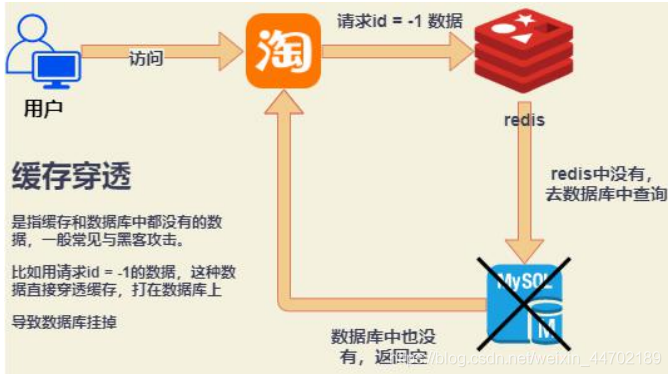
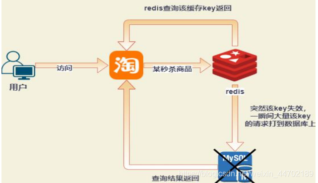
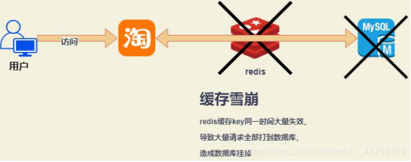

## 1 缓存使用

### 缓存步骤

1. 前台请求，后台先从缓存中取数据，取到直接返回结果，
2. 取不到时从数据库中取，数据库取到更新缓存，并返回结果，
3. 数据库也没取到，那直接返回空结果

### 缓存预热

缓存预热就是系统上线后，将相关的缓存数据直接加载到缓存系统。这样就可以避免在用户请求的时候，先查询数据库，然后再将数据缓存的问题！用户直接查询事先被预热的缓存数据！

解决方法：
1、直接写个缓存刷新页面，上线时手工操作下
2、数据量不大，可以在项目启动的时候自动进行加载
3、定时刷新缓存

 

### 缓存降级

当访问量剧增、服务出现问题（如响应时间慢或不响应）或非核心服务影响到核心流程的性能时，仍然需要保证服务还是可用的，即使是有损服务。系统可以根据一些关键数据进行自动降级，也可以配置开关实现人工降级。

降级的最终目的是保证核心服务可用，即使是有损的。而且有些服务是无法降级的（如加入购物车、结算）。

在进行降级之前要对系统进行梳理，看看系统是不是可以丢卒保帅；从而梳理出哪些必须誓死保护，哪些可降级

 
## 2 Redis作为缓存可能会出现的问题

### 缓存穿透

问题：当有大量用户不走我们设置的键值，就会直接走数据库，就会给数据库造成极大的压力，导致数据库也挂了。查询的数据在数据库中并不存在，缓存中没有，仍然去数据库中查询，从而可能压跨数据库。如果有人恶意攻击，查询没有的数据，缓存将相当于失效了。

解决：

1. 参数过滤和提醒，引导用户走我们的设置的键值，对参数进行校验，不合法参数进行拦截。使用布隆过滤器(BloomFilter)或者压缩 filter 提前拦截
2. 对不合法的参数进行空对象缓存，并设置较短的过期时间。将这个空对象设置到缓存里边去。下次再请求的时候，就可以从缓存里边获取了。这种情况我们一般会将空对象设置一个较短的过期时间
3. 拉黑该 IP 地址。

### 缓存击穿
问题：数据在数据库中存在，但在 redis 中的某个时间节点过期了，此时刚好有大量请求发送过来，发现此时缓存过期，都会区数据库查询，这时候大并发的请求可能会把数据库压垮。

解决：
1. 热点数据设置永不过期
2. 加上互斥锁：上面的现象是多个线程同时去查询数据库的这条数据，那么我们可以在第一个查询数据的请求上使用一个互斥锁来锁住它，其他的线程走到这一步拿不到锁就等着，等第一个线程查询到了数据，然后将数据放到 redis 缓存起来。后面的线程进来发现已经有缓存了，就直接走缓存

### 缓存雪崩

问题：当我们的缓存失效或者redis挂了，那么这个时候的请求都会直接走数据库，就会给数据库造成极大的压力，导致数据库也挂了

解决：

1. 对缓存设置不同的过期时间，这样就不会导致缓存同时失效。随机设置 key 失效时间，避免大量 key 集体失效。
2. 建立redis集群，保证服务的可靠性。若是集群部署，可将热点数据均匀分布在不同的 Redis 库中也能够避免 key全部失效问题

### 缓存与数据库读写一致

问题：如果一直是读的话，是没问题的，但是更新操作会导致数据库已经更新了，缓存还是旧的数据

解决：

并发下解决数据库与缓存不一致的思路：将删除缓存、修改数据库、读取缓存等的操作积压到队列里边，实现串行化。

- 先删除缓存，再更新数据库。在高并发下表现不如意，在原子性被破坏时表现优异

- 先更新数据库，再删除缓存(Cache Aside Pattern设计模式)。在高并发下表现优异，在原子性被破坏时表现不如意

## 总结
1. 雪崩是大面积的key缓存失效；
2. 穿透是redis里不存在这个缓存key；
3. 击穿是redis某一个热点 key 突然失效，