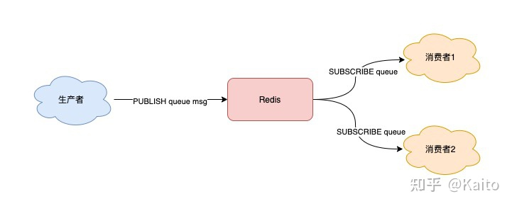

> 参考文献
> * [redis做消息队列](https://www.zhihu.com/question/20795043)


## 1 List队列


List 底层的实现就是一个「链表」，在头部和尾部操作元素，时间复杂度都是 O(1)，这意味着它非常符合消息队列的模型。如果把 List 当作队列，你可以这么来用。

### 读非阻塞的消息队列


* 生产者使用 LPUSH 发布消息：

```
127.0.0.1:6379> LPUSH queue msg1
(integer) 1
127.0.0.1:6379> LPUSH queue msg2
(integer) 2
```

* 消费者这一侧，使用 RPOP 拉取消息：

```
127.0.0.1:6379> RPOP queue
"msg1"
127.0.0.1:6379> RPOP queue
"msg2"
```


* 但这里有个小问题，当队列中已经没有消息了，消费者在执行 RPOP 时，会返回 NULL。
```
127.0.0.1:6379> RPOP queue
(nil)   // 没消息了
```

* 而我们在编写消费者逻辑时，一般是一个「死循环」，这个逻辑需要不断地从队列中拉取消息进行处理，伪代码一般会这么写：
```
while true:
    msg = redis.rpop("queue")
    // 没有消息，继续循环
    if msg == null:
        continue
    // 处理消息
    handle(msg)
```

* 如果此时队列为空，那消费者依旧会频繁拉取消息，这会造成「CPU 空转」，不仅浪费 CPU 资源，还会对 Redis 造成压力。怎么解决这个问题呢？
* 也很简单，当队列为空时，我们可以「休眠」一会，再去尝试拉取消息。代码可以修改成这样：
```
while true:
    msg = redis.rpop("queue")
    // 没有消息，休眠2s
    if msg == null:
        sleep(2)
        continue
    // 处理消息        
    handle(msg)
```

* 这就解决了 CPU 空转问题。这个问题虽然解决了，但又带来另外一个问题：当消费者在休眠等待时，有新消息来了，那消费者处理新消息就会存在「延迟」。


### 读阻塞式消息队列


* 那如何做，既能及时处理新消息，还能避免 CPU 空转呢？Redis 是否存在这样一种机制：如果队列为空，消费者在拉取消息时就「阻塞等待」，一旦有新消息过来，就通知我的消费者立即处理新消息呢？
* 幸运的是，Redis 确实提供了「阻塞式」拉取消息的命令：BRPOP / BLPOP，这里的 B 指的是阻塞（Block）。

```
while true:
    // 没消息阻塞等待，0表示不设置超时时间
    msg = redis.brpop("queue", 0)
    if msg == null:
        continue
    // 处理消息
    handle(msg)
```

解决了消息处理不及时的问题，你可以再思考一下，这种队列模型，有什么缺点？我们一起来分析一下：

* 不支持重复消费：消费者拉取消息后，这条消息就从 List 中删除了，无法被其它消费者再次消费，即不支持多个消费者消费同一批数据
* 消息丢失：消费者拉取到消息后，如果发生异常宕机，那这条消息就丢失了


## 2 发布订阅模型

它正好可以解决前面提到的第一个问题：重复消费。即多组生产者、消费者的场景，我们来看它是如何做的。Redis 提供了 PUBLISH / SUBSCRIBE 命令，来完成发布、订阅的操作。


### 简单订阅发布机制



假设你想开启 2 个消费者，同时消费同一批数据，就可以按照以下方式来实现。首先，使用 SUBSCRIBE 命令，启动 2 个消费者，并「订阅」同一个队列。
```
// 2个消费者 都订阅一个队列
127.0.0.1:6379> SUBSCRIBE queue
Reading messages... (press Ctrl-C to quit)
1) "subscribe"
2) "queue"
3) (integer) 1
```

此时，2 个消费者都会被阻塞住，等待新消息的到来。之后，再启动一个生产者，发布一条消息。
```
127.0.0.1:6379> PUBLISH queue msg1
(integer) 1
```

这时，2 个消费者就会解除阻塞，收到生产者发来的新消息。
```
127.0.0.1:6379> SUBSCRIBE queue
// 收到新消息
1) "message"
2) "queue"
3) "msg1"
```

看到了么，使用 Pub/Sub 这种方案，既支持阻塞式拉取消息，还很好地满足了多组消费者，消费同一批数据的业务需求。

### 订阅多个发布者


除此之外，Pub/Sub 还提供了「匹配订阅」模式，允许消费者根据一定规则，订阅「多个」自己感兴趣的队列。

```
// 订阅符合规则的队列
127.0.0.1:6379> PSUBSCRIBE queue.*
Reading messages... (press Ctrl-C to quit)
1) "psubscribe"
2) "queue.*"
3) (integer) 1
```

这里的消费者，订阅了 queue.* 相关的队列消息。之后，生产者分别向 queue.p1 和 queue.p2 发布消息。
```
127.0.0.1:6379> PUBLISH queue.p1 msg1
(integer) 1
127.0.0.1:6379> PUBLISH queue.p2 msg2
(integer) 1
```

这时再看消费者，它就可以接收到这 2 个生产者的消息了。
```
127.0.0.1:6379> PSUBSCRIBE queue.*
Reading messages... (press Ctrl-C to quit)
...
// 来自queue.p1的消息
1) "pmessage"
2) "queue.*"
3) "queue.p1"
4) "msg1"

// 来自queue.p2的消息
1) "pmessage"
2) "queue.*"
3) "queue.p2"
4) "msg2"
```

### 完整的订阅发布流程
一个完整的发布、订阅消息处理流程是这样的：

消费者订阅指定队列，Redis 就会记录一个映射关系：队列->消费者
生产者向这个队列发布消息，那 Redis 就从映射关系中找出对应的消费者，把消息转发给它


Pub/Sub 的处理方式却不一样，当消息积压时，有可能会导致消费失败和消息丢失！


### Pub/Sub 特点

1. 支持发布 / 订阅，支持多组生产者、消费者处理消息
2. 消费者下线，数据会丢失
3. 不支持数据持久化，Redis 宕机，数据也会丢失
4. 消息堆积，缓冲区溢出，消费者会被强制踢下线，数据也会丢失

### Pub/sub List对比

List 其实是属于「拉」模型，而 Pub/Sub 其实属于「推」模型。


## 3 趋于成熟的队列：Stream

当我们在使用一个消息队列时，希望它的功能如下：

1. 支持阻塞等待拉取消息
1. 支持发布 / 订阅模式
1. 消费失败，可重新消费，消息不丢失
1. 实例宕机，消息不丢失，数据可持久化
1. 消息可堆积

### 典型过程


Stream 通过 XADD 和 XREAD 完成最简单的生产、消费模型：

* XADD：发布消息
* XREAD：读取消息


使用 XADD 命令发布消息，其中的「*」表示让 Redis 自动生成唯一的消息 ID。这个消息 ID 的格式是「时间戳-自增序号」。

生产者发布 2 条消息：
```
// *表示让Redis自动生成消息ID
127.0.0.1:6379> XADD queue * name zhangsan
"1618469123380-0"
127.0.0.1:6379> XADD queue * name lisi
"1618469127777-0"
```


消费者拉取消息：
```
// 从开头读取5条消息，0-0表示从开头读取
127.0.0.1:6379> XREAD COUNT 5 STREAMS queue 0-0
1) 1) "queue"
   1) 1) 1) "1618469123380-0"
         1) 1) "name"
            1) "zhangsan"
      1) 1) "1618469127777-0"
         1) 1) "name"
            1) "lisi"
```


如果想继续拉取消息，需要传入上一条消息的 ID：
```
127.0.0.1:6379> XREAD COUNT 5 STREAMS queue 1618469127777-0
(nil)
```
没有消息，Redis 会返回 NULL。


### 其他特性

1) Stream 是否支持「阻塞式」拉取消息？

可以的，在读取消息时，只需要增加 BLOCK 参数即可。
```
// BLOCK 0 表示阻塞等待，不设置超时时间
127.0.0.1:6379> XREAD COUNT 5 BLOCK 0 STREAMS queue 1618469127777-0
```
这时，消费者就会阻塞等待，直到生产者发布新的消息才会返回。

2) Stream 是否支持发布 / 订阅模式？

也没问题，Stream 通过以下命令完成发布订阅：
```
XGROUP：创建消费者组
XREADGROUP：在指定消费组下，开启消费者拉取消息
```

3) 消息处理时异常，Stream 能否保证消息不丢失，重新消费？

除了上面拉取消息时用到了消息 ID，这里为了保证重新消费，也要用到这个消息 ID。

当一组消费者处理完消息后，需要执行 XACK 命令告知 Redis，这时 Redis 就会把这条消息标记为「处理完成」。
```
// group1下的 1618472043089-0 消息已处理完成
127.0.0.1:6379> XACK queue group1 1618472043089-0
```
如果消费者异常宕机，肯定不会发送 XACK，那么 Redis 就会依旧保留这条消息。

待这组消费者重新上线后，Redis 就会把之前没有处理成功的数据，重新发给这个消费者。这样一来，即使消费者异常，也不会丢失数据了。
```
// 消费者重新上线，0-0表示重新拉取未ACK的消息
127.0.0.1:6379> XREADGROUP GROUP group1 consumer1 COUNT 5 STREAMS queue 0-0
// 之前没消费成功的数据，依旧可以重新消费
1) 1) "queue"
   2) 1) 1) "1618472043089-0"
         2) 1) "name"
            2) "zhangsan"
      2) 1) "1618472045158-0"
         2) 1) "name"
            2) "lisi"
```

4) Stream 数据会写入到 RDB 和 AOF 做持久化吗？

Stream 是新增加的数据类型，它与其它数据类型一样，每个写操作，也都会写入到 RDB 和 AOF 中。

我们只需要配置好持久化策略，这样的话，就算 Redis 宕机重启，Stream 中的数据也可以从 RDB 或 AOF 中恢复回来。

5) 消息堆积时，Stream 是怎么处理的？

其实，当消息队列发生消息堆积时，一般只有 2 个解决方案：

* 生产者限流：避免消费者处理不及时，导致持续积压
* 丢弃消息：中间件丢弃旧消息，只保留固定长度的新消息


在发布消息时，你可以指定队列的最大长度，防止队列积压导致内存爆炸。
```
// 队列长度最大10000
127.0.0.1:6379> XADD queue MAXLEN 10000 * name zhangsan
"1618473015018-0"
当队列长度超过上限后，旧消息会被删除，只保留固定长度的新消息。
```
这么来看，Stream 在消息积压时，如果指定了最大长度，还是有可能丢失消息的。