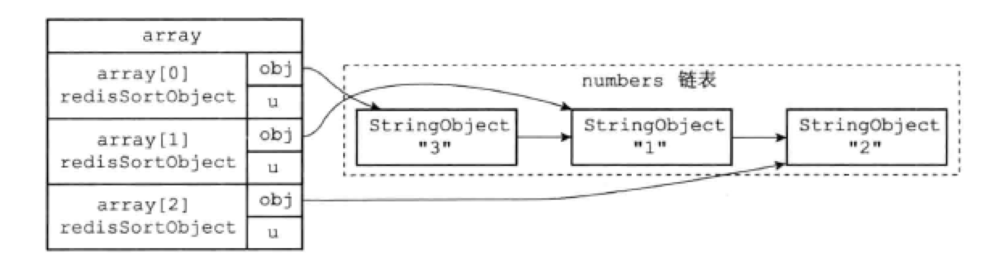
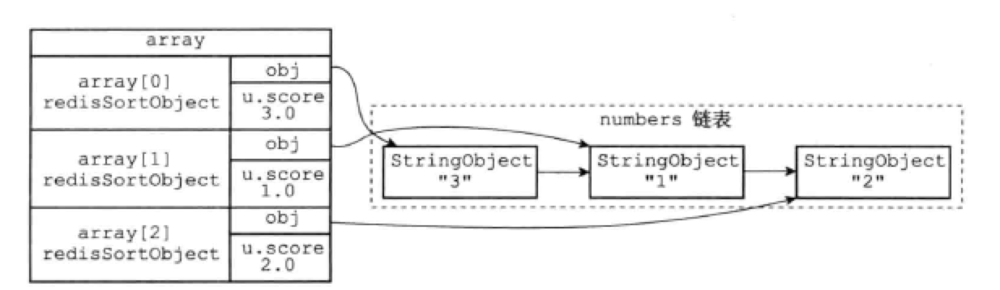
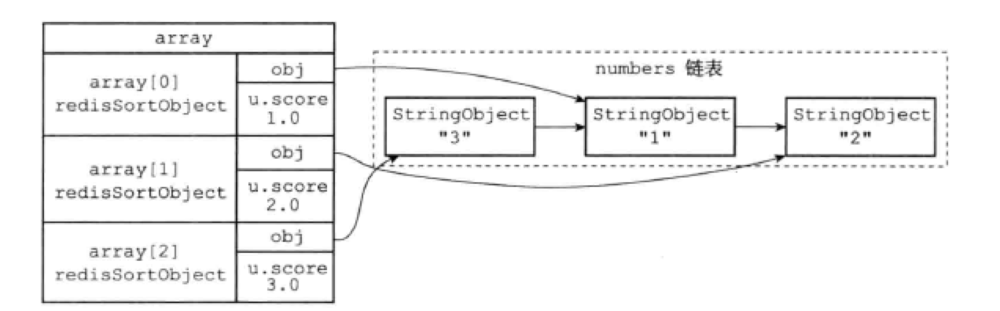

Redis的`SORT`命令可以对列表键、集合键或者有序集合键的值进行排序。

# 21.1 `SORT <key>`命令的实现

`SORT <key>` 可以对一个包含数字值的键key进行排序，假设：

> PRUSH numbers 3 1 2
>
> SORT numbers

1. 创建一个和numbers长度相同的数组，每个元素都是一个`redis.h/redisSortObject`结构。

   

2. 遍历数组，将每个元素的`obj`指针指向numbers列表的各个项，构成一一对应关系。

   

3. 遍历数组，将各个`obj`指针所指向的列表项转换为一个`double`类型的浮点数，并将这个浮点数保存在相应数组项的`u.score`属性中。

   

4. 根据数组项`u.score`的值，对数组进行数字值排序。

   

5. 遍历数组，将各个数组项的`obj`指针所指向的列表项作为排序结果返回给客户端。

```c
typedef struct _redisSortObject {
  // 被排序的值
  robj *obj;
  
  // 权重
  union {
    // 排序数字值时使用
    double score;
    
    // 排序带有BY选项的字符串值使用
    robj *cmpobj;
  } u;
} redisSortObject;
```

# 21.2 `ALPHA`选项的实现

> SORT <key> ALPHA

可以对包含字符串值的键进行排序，例如：

> SADD fruits apple banana cherry
>
> SORT fruits ALPHA

1. 创建一个`redisSortObject`数组，长度等于fruits集合。
2. 遍历数组，将各个元素的`obj`指针指向fruits集合的各个元素。
3. 根据`obj`指针所指向的集合元素，对数组进行字符串排序。
4. 遍历数组，一次将数组项的`obj`指针指向的元素返回给客户端。

# 21.3 `ASC`和`DESC`选项的实现

`SORT`默认是升序排序，所以`SORT <key>`和`SORT <key> ASC`是等价的。`DESC`可以降序排序。

升序和降序都是使用**快速排序**完成的。

# 21.4 `BY`选项的实现

默认情况下，`SORT`命令使用被排序键包含的元素作为排序的权重，元素本身决定了元素排序后的位置。

通过`BY`选项，`SORT`可以指定某些字符串键或某个哈希键所包含的某些域（field）作为元素的权重。

不同的是，排序用到的`redisSortObject`数组元素指向权重键。

# 21.5 带有`ALPHA`和`BY`选项的实现

`BY`选项默认权重键保存的是数字值，针对字符串值还是要配合`ALPHA`选型。

# 21.6 `LIMIT`选项的实现

默认情况下，`SORT`返回排序后的所有元素。`LIMIT`选项可以只返回一部分已排序的元素：

> SORT <key> ALPHA LIMIT <offset>  <count>

其中：

- `offset`表示要跳过的已排序元素数量。
- `count`表示跳过给定数量的已排序元素后，要返回的元素数量。

`LIMIT`生效，还是要排序伸个数组，最后返回元素的时候，根据`offset`和`count`的索引。

# 21.7 `GET`选项的实现

默认情况下，`SORT`排序之后，总是返回被排序键所包含的元素。`GET`可以返回指定模式的键的值。

# 21.8 `STORE`选项的实现

默认情况下，`SORT`只向客户端返回结果，要保存结果，使用`SORTE`选项。

# 21.9 多个选项的执行顺序

如果按照选项来划分，`SORT`命令可以分为四步：

1. 排序：使用`ALPHA`、`ASC`、`DESC`、`BY`选项。
2. 限制结果集的长度：使用`LIMIT`选项。
3. 获取外部键：使用`GET`选项。
4. 保存结果集：使用`STORE`选项。
5. 先客户端返回结果集。

调用`SORT`命令时，除了`GET`选项之外，改变选项的位置不会影响`SORT`的顺序。

# 导航

[目录](README.md)

上一章：[20. Lua脚本](ch20.md)

下一章：[22. 二进制位数组](ch22.md)
