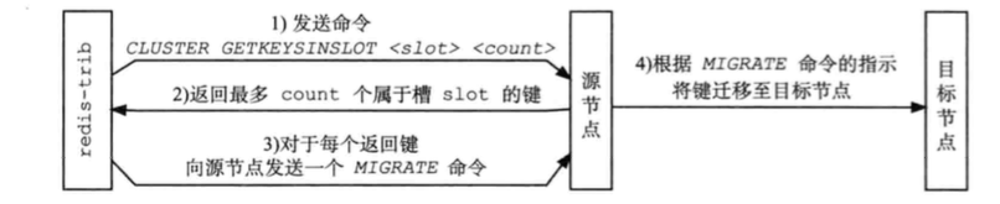

Redis集群是分布式的数据库方案，通过分片（sharing）来进行数据共享，并提供复制或故障转移功能。

# 17.1 节点

一个Redis集群通常由多个节点（node）组成。开始时每个node都是独立的，要将其连接起来：

> CLUSTER MEET <ip> <port>

## 启动节点

一个节点就是运行在集群模式下的Redis服务器，根据`cluster-endabled`配置选项是否为yes来决定是否开启集群模式。

节点在集群模式下会继续使用单机模式的组件，如：

- 文件事件处理器
- 时间事件处理器
- 使用数据库来保存键值对数据
- RDB和AOF持久化
- 发布与订阅
- 复制模块
- Lua脚本

节点会继续使用`redisServer`结构保存服务器的状态，`redisClient`结构保存客户端的状态，集群模式下的数据，保存在`cluster.h/clusterNode`、`cluster.h/clusterLink`、`cluster.h/clusterState`结构中。

## 集群数据结构

`cluster.h/clusterNode`保存了一个节点的当前状态，如节点的创建时间、名字、配置纪元、IP和端口等。每个节点都有一个自己的`clusterNode`结构，并为集群中的其它节点创建一个相应的`clusterNode`结构。`clusterNode`结构的`link`属性是一个`clusterLink`结构，保存了连接节点所需的有关信息，如套接字、缓冲区。

每个节点都有一个`clusterState`，记录了当前节点所在集群的状态。

```c
struct clusterNode {
  // 创建节点的时间
  mstime_t ctime;
  
  // 节点的名字，40个十六进制字符串
  char name[REDIS_CLUSTER_NAMELEN];
  
  // 节点标识，记录节点的角色(主从)、状态(在线或下线)
  int flags;
  
  // 当前的配置纪元
  uint64_t configEpoch;
  
 char ip[REDIS_IP_STR_LEN];
 int port;
  
  // 保存连接节点所需的有关信息
  clusterLink *link;
};

typedef struct clusterLink {
  // 连接的创立时间
  mstime_t ctime;
  
  // TCP 套接字描述符
  itn fd;
  
  // 输出缓冲区
  sds sndbuf;
  
  // 输入缓冲区
  sds recvbuf;
  
  // 与这个连接相关联的节点，没有就为NULL
  struct clusterNode *node;
} clusterLink;

typedef struct clusterState {
  // 指向当前节点的指针
  clusterNode *myself;
  
  // 集群当前的配置纪元，用于故障转移
  uint64_t currentEpoch;
  
  // 集群当前的状态：在线还是下线
  int state;
  
  // 集群中至少处理着一个槽的节点的数量
  int size;
  
  // 集群节点的名单，包括myself，键为节点的名字，值为节点对应的clusterNode结构
  dict *nodes;
} clusterState;
```

## CLUSTER MEET命令的实现

通过向节点A发送`CLUSTER MEET`命令，客户端可以让接受命令的节点A将另一个节点B接入到A所在的集群中。

收到`CLUSTER MEET`命令的节点A，会进行以下操作：

1. 为节点B创建一个`clusterNode`结构，并将该结构添加到自己的`clusterState.nodes`字典。
2. 节点A根据`CLUSTER MEET`命令的IP和端口，先节点B发送`MEET`消息。
3. 节点B收到`MEET`消息，为节点A创建一个`clusterNode`结构，并加入字典。
4. 节点B回给节点A一条`PONG`消息。
5. 节点A收到`PONG`，知道节点B已经接收了自己的`MEET`消息。
6. 节点A向节点B返回一条`PING`消息。
7. 节点B收到`PING`之后，双方握手完成。


# 17.2 槽指派

Redis集群通过分片的方式保存数据库中的键值对：集群中的整个数据库被分为16384个槽（slot），数据库中的每个键都属于其中的一个，集群中的每个节点可以处理0个或最多16384个槽。

当数据库中的16384个槽都有节点在处理时，集群处于上线状态（ok），如果任何一个槽都没有得到处理，就处于下线状态（fail）。

`CLUSTER MEET`只是将节点连接起来，集群仍处于下线状态，通过向节点发送`CLUSTER ADDSLOTS`，可以为一个或多个槽指派（assign）给节点负责。

> CLUSTER ADDSLOTS <slot> [slot ...]

## 记录节点的槽指派信息

```c
struct clusterNode {
  unsigned char slots[16384/8];
  int numslots;
};
```

`slots`数组中的索引`i`上的二进制位的值来判断节点是否负责处理槽`i`。`numslots`记录节点负责处理的槽的数量，即`slots`数组中二进制1的数量。

## 传播节点的槽指派信息

一个节点除了会将自己处理的槽记录在`clusterNode`结构中的`slots`和`numslots`属性之外，还会将自己的`slots`数组通过消息发送给集群中的其它节点。

节点A通过消息从节点B接收到节点B的`slots`数组会，会在自己的`clusterState.nodes`字典中查找节点B对应的`clusterNode`结构，并对结构中的`slots`数组进行更新。

最终，集群中的每个节点都知道数据库中的16384个槽分别被指派给了哪些节点。

## 记录集群所有槽的指派信息

`clusterState`结构中的`slots`数组记录了所有16384个槽的指派信息：

```c
typedef struct clusterState {
  clusterNode *slots[16384];
} clusterState;
```

如果槽指派信息只保存在各个节点的`clusterNode.slots`数组中，那么检查某个槽被指派给哪个节点，就需要遍历`clusterState.nodes`字典中的所有`clusterNode`结构。`clusterState.slots`数组就解决了这个问题。

反过来，纵然有了`clusterState.slots`，`clusterNode.slots`仍有必要：

- 传播节点的槽指派信息时，只需要发送`clusterNode.slots`即可。

## CLUSTER ADDSLOTS命令的实现

`CLUSTER ADDSLOTS`命令接受一个或多个槽作为参数，并将所有输入的槽指派给接收该命令的节点负责：

```python
def CLUSTER_ADDSLOTS(*all_input_slots):
    # 遍历所有输入槽，检查它们是否都是未指派
    for i in all_input_slots:
        
        # 如果有一个槽已指派，那么返回错误
        if clusterState.slots[i] != NULL:
            reply_error()
            return
        
    # 再次遍历
    for i in all_input_slots:
		
        # 设置clusterState结构的slots数组
        clusterState.slots[i] = clusterState.myself
        
        # 访问代表当前节点的clusterNode结构的slots数组
        setSlotBit(clusterState.myself.slots, i)
        
```

# 17.3 在集群中执行命令

客户端向节点发送与数据库键有关的命令时，接收命令的节点会计算出命令要处理的键属于哪个槽，并检查这个槽是否被指派给了自己：

- 如果指派给了自己，节点直接执行命令。
- 否则，节点向客户端返回一个`MOVED`错误，指引客户端转向（redirect）到正确的节点，再次发送命令。

## 计算键属于哪个槽

```python
def slot_number(key):
    return CRC16(key) & 16383
```

使用`CLUSTER KEYSLOT <key>`能查看键属于哪个槽。

## 判断槽是否由当前节点负责处理

节点计算出键所属的槽`i`之后，会检查自己在`clusterState.slots`数组中的第`i`项，判断键所在的槽是不是自己负责。

## MOVED错误

`MOVED`错误的格式为：

> MOVED <slot> <ip>:<port>

客户端通常会与集群中的多个节点创建套接字连接，所谓的节点转向就是换一个套接字来发送命令。

## 节点数据库的实现

节点与单击服务器的一个区别是：节点只能使用0号数据库。

另外，除了将键值对保存在数据库里之外，节点会用`clusterState`结构中的`slots_to_keys`跳跃表来保存槽与键之间的关系：

```c
typdef struct clusterState {
  zskiplist *slots_to_keys;
} clusterState;
```

`slots_to_keys`的每个分值（score）都是一个槽号，每个节点的成员（member）都是一个数据库键：

- 每当节点往数据库中添加新的键值对时，节点会将键与槽号关联到`slots_to_keys`。
- 删除键值对时，节点也会接触`slots_to_keys`中键与槽号的关联。

通过在`slots_to_keys`中记录各个数据库键所属的槽，节点可以很方便地对属于某个槽的键进行批量操作，如`CLUSTER GETKEYINSLOT <slot> <count>`。

# 17.4 重新分片

Redis集群的重新分片指的是将任意数量已经指派给某个节点的槽改为指派给另一个节点，且相关槽所属的键也从源节点移动到目标节点。重新分片可以在线（online）进行，分片过程中，集群不需要下线，且源节点和目标节点都可以继续处理命令请求。

重新分片是由Redis的集群管理软件`redis-trib`负责的，Redis提供了重新分片所需的所有命令，`redis-trib`则通过向源节点和目标节点发送命令来实现重新分片：

1. 向目标节点发送`CLUSTER SETSLOT <slot> IMPORTING <source_id>`命令，让目标节点准备好导入源节点中属于槽slot的键值对。
2. 向源节点发送`CLUSTER SETSLOT <slot> MIGRATING <target_id>`命令，让源节点准备好迁移键值对。
3. 向源节点发送`CLUSTER GETKEYINSLOT <slot> <count>`命令，获得最多count个属于槽slot的键值对的键名。
4. 对于步骤3获得的每个键名，向源节点发送一个`MIGRATE <target_ip> <target_port> <key_name> 0 <timeout>`命令，将选中的键原子地从原籍诶单迁移到目标节点。
5. 充分执行步骤3和4，知道所有键值对都被迁移至目标及诶单
6. 向集群中的任一节点发送`CLUSTER SETSLOT <slot> NODE <target_id>`命令，将槽slot指派给目标节点，这一指派信息通过消息传送至整个集群。



# 17.5 ASK 错误

在重新分片期间，源节点向目标节点迁移一个槽的过程中，可能会出现：属于被迁移槽的一部分键值对保存在源节点中，而另一部分保存在目标节点中。

当客户端向源节点发送一个与数据库键有关的命令，且要处理的键恰好就属于正在被迁移的槽时：

- 源节点现在自己的数据库中查找键，如果找到，直接执行命令。
- 否则，源节点向客户端返回`ASK`错误，指引客户端转向正在导入槽的目标节点，再次发送命令。

## CLUSTER SETSLOT IMPORTING 命令的实现

`clusterState`结构的`importing_slots_from`数组记录了当前节点正在从其它节点导入的槽：

```c
typedef struct clusterState {
  clusterNode *importing_slots_from[16384;
} clusterState;
```

如果`importing_slots_from[i]`指向一个`clusterNode`结构，表示当前节点正在从`clusterNode`所代表的节点导入槽`i`。

`CLUSTER SETSLOT <i> IMPORTING <source_id>` 命令，可以将目标节点的`importing_slots_from[i]`置为`source_id`所代表节点的`clusterNode`结构。

## CLSUTER SETSLOT MIGRATING 命令的实现

`clusterState`结构的`migrating_slots_to`数组记录了当前节点正在迁移至其它节点的槽：

```c
typedef struct clusterState {
  clusterNode *migrating_slots_to[16384;
} clusterState;
```

如果`migrating_slots_to[i]`指向一个`clusterNode`结构，表示当前节点正在将槽`i`迁移至`clusterNode`所代表的节点。

`CLUSTER SETSLOT <i> MIGRATING <target_id>` 命令，可以将源节点的`migrating_slots_to[i]`置为`target_id`所代表节点的`clusterNode`结构。

## ASK 错误

节点收到一个关于键`key`的命令请求，先查找`key`所属的槽`i`是否自爱自己的数据库里，如果在，直接执行命令。

如果不在，节点会检查自己的`clusterState.migrating_slots_to[i]`，看槽`i`是否正在被迁移。如果是，返回客户端一个`ASK`错误。

接到`ASK`错误的客户端根据错误提供的IP地址和端口，转向目标节点，先向其发送一个`ASKING`命令，之后再重新发送原来要执行的命令。如果不先发送一个`ASKING`命令，那么会被节点拒绝执行，并返回MOVED错误。

## ASKING 命令

`ASKING`命令唯一要做的就是打开发送该命令的客户端的`REDIS_ASKING`标识。该标识是一次性标识，节点执行了一个带有该标识的客户端发来的命令后，标识就被移除。

## ASK 错误和MOVED 错误的区别

- `MOVED`错误代表槽的负责权已经转移。
- `ASK`错误是迁移槽过程中的临时措施。接收`ASK`指引的转向，不会对客户端今后发送关于槽`i`的命令请求有任何影响，客户端仍会将请求发送至目前负责处理槽`i`的节点，除非`ASK`错误再次出现。

# 17.6 复制与故障转移

Redis集群中的master用于处理槽，slave用于复制某个master，并在被复制的master下线时，代替master继续处理命令请求。

## 设置slave

向一个节点发送命令：

> CLUSTER REPLICATE <node_id>

可以让接受命令的节点成为`node_id`所指定节点的slave，并开始对master进行复制：

1. 接收命令的节点先在自己的`clusterState.nodes`字典中找到`node_id`对应节点的`clusterNode`结构，并将自己的`clusterState.myself.slaveof`指针指向这个结构，以此来记录正在复制的master。
2. 节点修改自己在`clusterState.myself.flags`中的属性，打开`REDIS_NODE_SLAVE`标识。
3. 节点调用复制代码，并根据`clusterState.myself.slaveof`指向的`clusterNode`结构保存的IP地址和端口号，对主节点进行复制。

一个节点成为master，并开始复制某个master这一信息会通过消息发送给集群中的其它节点。集群中的所有节点都会在代表主节点的`clusterNode`结构的`slaves`和`numslaves`属性中记录正在复制这个master的slave名单：

```c
struct clusterNode {
  // 正在复制这个master的slave数量
  int numslaves;
  
  // 正在复制这个master的slave的clusterNode结构
  struct clusterNode **slaves;
};
```

## 故障检测

集群中的每个节点都会定期向其它节点发送`PING`消息，检测对方是否在线。各个节点都会通过消息来交换其它节点的状态信息。

当一个master A通过消息得知master B认为master C进入疑似下线状态，A会在自己的`clusterState.nodes`字典中找到C对应的`clusterNode`结构，并将B的下线报告添加到`clusterNode`结构的`fail_reposts`链表中：

```c
struct clusterNode {
  // 一个链表，记录了所有其它节点对该节点的下线报告
  list *fail_reports;
};
```

每个下线报告由一个`clusterNodeFailReport`结构表示：

```c
struct clusterNodeFailReport {
  // 报告目标节点已经下线的节点
  struct clusterNode *node;
  
  // 最后一次从node节点收到下线报告的时间，用这个来检查报告是否过期，过期则删除
  mstime_t time;
} typedef clusterNodeFailReports;
```

如果在一个集群里，半数以上负责处理槽的master都将某个master X报告为疑似下线，那么X就被标记为下线。将X标记为下线的节点向集群广播关于X的`FAIL`消息，收到消息的节点会立即将X标记为已下线。

## 故障转移

当一个slave发现自己正在复制的master已下线，会开始对其进行故障转移：

1. 复制master的所有从节点里，会有一个slave被选中。
2. 被选中的slave执行`SALVEOF no one`命令，成为新的master。
3. 新master会撤销所有对已下线master的槽指派，并指派给自己。
4. 新master向集群广播一条`PONG`消息，宣布自己成为master。
5. 新master开始接收和处理自己负责的槽有关的命令请求。

## 选举新的master

新的master是选举产生的：

1. 集群中的配置纪元是一个自增计数器，初始值为0。
2. 集群中的某个节点开始一次故障转移操作时，集群配置纪元的值+1。
3. 对于每个配置纪元，集群中每个负责处理槽的master都有一次投票机会，而第一个向master要求投票的slave将获得投票权。
4. 当slave发现自己正在复制的master已下线，会广播一条`CLUSTERMSG_TYPE_FAILOVER_AUTH_REQUEST`，要求收到消息的master给自己投票。
5. 如果一个master有投票权（正在处理槽），且未投票给其它slave，那么master会向要求投票的slave返回一条`CLUSTERMSG_TYPE_FAILOVER_AUTH_ACK`消息，表示支持它成为新master。
6. 每个参与选举的slave都会接收到`CLUSTERMSG_TYPE_FAILOVER_AUTH_ACK`消息，根据消息的个数来统计自己获得几票。
7. 一个slave收集到大于N/2+1的支持票后，会当选新master。
8. 因为每个配置纪元里，拥有投票权的master只有一票，因此新的master只会有一个。
9. 如果一个配置纪元中没有选举出新master，那么集群进入一个新的配置纪元，继续选举。

# 17.7 消息

集群中的节点通过消息来通信，消息主要分为以下5种：

- `MEET`消息：加入当前集群
- `PING`消息：检测在线
- `PONG`消息：回复`MEET`和`PING`
- `FAIL`消息：进入`FAIL`状态
- `PUBLISH`消息：节点接收到`PUBLISH`消息，会执行这个命令，并向集群广播一条`PUBLISH`消息，所有接收到这条`PUBLISH`消息的节点都会执行相同的`PUBLISH`命令。

一个消息由消息头（header）和消息正文（body）组成。

## 消息头

每个消息头都由一个`cluster.h/clusterMsg`结构表示：

```c
typedef struct {
  // 消息的长度，包括消息头和消息正文
  uint32_t totlen;
  
  // 消息的类型
  uint16_t type;
  
  // 消息正文包含的节点信息数量
  // 只在发送MEET、PING、PONG这三种Gossip协议的消息时使用
  uint16_t count;
  
  // 发送者所处的配置纪元
  uint64_t currentEpoch;
  
  // 如果发送者是一个master，那么这里记录的是发送者的配置纪元
  // 如果发送者是一个slave，那么这里记录的是发送者正在复制的master的配置纪元
  uint64_t configEpoch;
  
  // 发送者的名字(ID)
  char sender[REDIS_CLUSTER_NAMELEN];
  
  // 发送者目前的槽指派信息
  unsigned char myslots[REDIS_CLUSTER_SLOTS/8];
  
  // 如果发送者是一个slave，那么这里记录的是它正在复制的master的名字
  // 如果发送者是一个master，那么这里记录的是REDIS_NODE_NULL_NAME
  char slaveof[REDIS_CLUSTER_NAMELEN];
  
  // 发送者的端口号
  uint16_t port;
  
  // 发送者的标识值
  uint16_t flags;
  
  // 发送者所处集群的状态
  unsigned char state;
  
  // 消息的正文
  union clusterMsgData data;
} cllusterMsg;

union clusterMsgData {
  struct {
    // 每条 MEET、PING、PONG 消息都包含两个 clusterMsgDataGossip 结构
    clusterMsgDataGossip[1];
  } ping;
  
  // FAIL 消息的正文
  struct {
    clusterMsgDataFail about;
  } fail;
  
  // PUBLISH 消息的正文
  struct {
    clusterMsgDataPublish msg;
  } publish;
};
```

`clusterMsg`结构的`currentEpoch`、`sender`、`myslots`等属性记录了发送者的节点信息，接收者可以根据这些信息，在自己的`clusterState.nodes`字典中找到发送者对应的`clusterNode`结构进行更新。

## MEET、PING、PONG 消息的实现

Redis集群中的各个节点通过Gossip协议来交换节点的状态信息，其中Gossip协议由`MEET`、`PING`、`PONG`三种消息实现，这三种消息的正文都是由两个`cluster.h/clusterMsgDataGossip`结构组成。

每次发送`MEET`、`PING`、`PONG`消息时，发送者从自己的已知节点中随机选出两个，将它们的信息保存到两个`cluster.h/clusterMsgDataGossip`结构中。

```c
typedef struct {
  // 节点的名字
  char nodename[REDIS_CLUSTER_NAMELEN];
  
  // 最后一次向该节点发送 PING 消息的时间戳
  uint32_t ping_sent;
  
  // 最后一次从该节点接收到 PONG 消息的时间戳
  uint32_t pong_received;
  
  // 节点的IP
  char ip[16];
  
  // 节点的端口
  uint16_t port;
  
  // 节点的标识符
  uint16_t flags;
} clusterMsgDataGossip;
```

接收者收到信息，访问正文中的两个`clusterMsgDataGossip`结构，根据自己是否认识其中的被选中节点来选择操作：

- 被选中节点不存在于接收者的已知节点列表：根据IP和端口跟其握手。
- 被选中节点存在于接收者的已知节点列表：根据`clusterMsgDataGossip`记录的信息，更新被选中节点的`clusterNode`结构。

## FAIL 信息的实现

当集群里的master A将master B标记为已下线（FAIL）时，A将集群广播关于B的`FAIL`消息，接收到消息的节点都将B标记为已下线。为了避免Gossip协议的延迟，`FAIL`消息正文采用`cluster.h/clusterMsgDataFail`结构表示：

```c
typedef struct {
  char nodename[REDIS_CLUSTER_NAMELEN];
} clusterMsgDataFail;
```

## PUBLISH 消息的实现

向某个节点发送：

> PUBLISH <channel> <message>

会导致集群中的所有及诶单都向`channel`发送`message`消息。

`PUBLISH`消息的正文由`cluster.h/clusterMsgDataPublish`结构表示：

```c
typedef struct {
  uint32_t channel_len;
  uint32_t message_len;
  
  // 8字节是为了对齐其他消息结构，实际长度由保存的内容决定
  // bulk_data 保存了channel参数和message参数
  unsigned char bulk_data[8];
} clusterMsgDataPublish;
```

# 导航

[目录](README.md)

上一章：[16. Sentinel](ch16.md)

下一章：[18. 发布与订阅](ch18.md)
