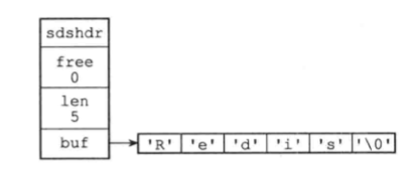

Redis里，C字符串只会作为字符串字面量用在一些无需对字符串值进行修改的地方，比如打印日志。Redis构建了 简单动态字符串（simple dynamic string，SDS）来表示字符串值。

在Redis里，包含字符串值的键值对在底层都是由SDS实现的。除此之外，SDS还被用作缓冲区：AOF缓冲区，客户端状态中的输入缓冲区。

# 2.1 SDS的定义

每个sds.h/sdshdr结构表示一个SDS值：

```c
struct sdshdr {
  // 记录buf数组中已使用字节的数量
  // 等于SDS所保存字符串的长度
  int len;
  
  // 记录buf数组中未使用字节的数量
  int free;
  
  // 字节数组，用于保存字符串
  char buf[];
}
```

示例：



SDS遵循C字符串以空字符结尾的管理，空字符不计算在len属性中。这样，SDS可以重用一部分C字符串函数库，如printf。

# 2.2 SDS与C字符串的区别

- 常数复杂度获取字符串长度

  C字符串必须遍历整个字符串才能获得长度，复杂度是O(N)。

  SDS在len属性中记录了SDS的长度，复杂度为O(1)。

- 杜绝缓冲区溢出

  C字符串不记录长度的带来的另一个问题是缓冲区溢出。假设s1和s2是紧邻的两个字符串，对s1的strcat操作，有可能污染s2的内存空间。

  SDS的空间分配策略杜绝了缓冲区溢出的可能性：但SDS API修改SDS时，会先检查SDS的空间是否满足修改所需的要求，不满足的话，API会将SDS的空间扩展至执行修改所需的大小，然后再执行实际的修改操作。

- 减少修改字符串时带来的内存重分配次数

  每次增长或缩短一个C字符串，程序都要对保存这个C字符串的数组进行一次内存重分配操作。

  Redis作为数据库，数据会被平凡修改，如果每次修改字符串都会执行一次内存重分配的话，会对新嗯呢该造成影响。SDS通过未使用空间接触了字符串长度和底层数组长度的关联：在SDS中，buf数组的长度不一定就是字符数量+1，数组里面可以包含未使用的字节，由free属性记录。对于未使用空间，SDS使用了空间预分配和惰性空间释放两种优化策略：

  1. 空间预分配：当SDS的API对SDS修改并需要空间扩展时，程序不仅为SDS分配修改所需的空间，还会分配额外的未使用空间（取决于长度是否小于1MB）。
  2. 惰性空间释放：当SDS的API需要缩短时，程序不立即触发内存重分配，而是使用free属性将这些字节的数量记录下来，并等待将来使用。与此同时，SDS API也可以让我们真正师范未使用空间，防止内存浪费。

- 二进制安全

  C字符串中的字符必须复合某种编码（如ASCII），除了字符串末尾之外，字符串里不能包含空字符。这些限制使得C字符串只能保存文本，而不是不能保存二进制数据。

  SDS API会以处理二进制的方式处理SDS存放在buf数组中的数据，写入时什么样，读取时就是什么样。

- 兼容部分C字符串函数

  遵循C字符串以空字符结尾的管理，SDS可以重用<string.h>函数库。

  ​

总结:

| C字符串                | SDS                 |
| ------------------- | ------------------- |
| 获取长度的复杂度O(N)        | O(1)                |
| API不安全，缓冲区溢出        | API安全，不会缓冲区溢出       |
| 修改字符串长度必然导致内存重分配    | 修改字符串长度不一定导致内存重分配   |
| 只能保存文本数据            | 可以保存文本或二进制数据        |
| 可使用所有<string.h>库的函数 | 可使用部分<string.h>库的函数 |

# 2.3 SDS API

| 函数          | 作用                                | 时间复杂度     |
| ----------- | --------------------------------- | :-------- |
| sdsnew      | 创建一个包含给定C字符串的SDS                  | O(N)      |
| sdsempty    | 创建一个不包含任何内容的SDS                   | O(1)      |
| sdsfree     | 释放SDS                             | O(N)      |
| sdslen      | 返回SDS已使用的字节数                      | O(1)      |
| sdsavail    | 返回SDS未使用的字节数                      | O(1)      |
| sdsdup      | 创建一个给定SDS的副本                      | O(N)      |
| sdsclear    | 清空SDS保存的字符串内容                     | O(1)，惰性释放 |
| sdscat      | 将给定C字符串拼接到SDS字符串的末尾               | O(N)      |
| sdscatsds   | 将给定SDS字符串拼接到另一个SDS的末尾             | O(N)      |
| sdscpy      | 复制                                | O(N)      |
| sdsgrowzero | 用空字符将SDS扩展至给定长度                   | O(N)      |
| sdsrange    | 保留SDS给定区间内的数据，不在区间内的数据会被覆盖或清除     | O(N)      |
| sdstrim     | 接受一个SDS和C字符为参数，从SDS中移除C字符串中出现过的字符 | O(N^2)    |
| sdscmp      | 比较                                | O(N)      |

# 导航

[目录](README.md)

下一章：[3. 链表](ch3.md)


