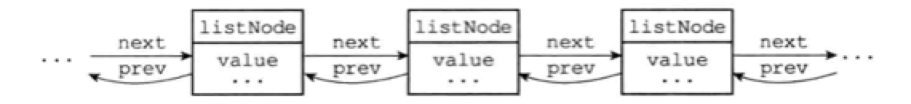
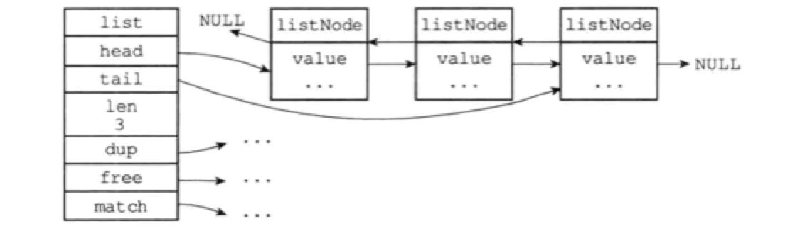

Redis构建了自己的链表实现。列表键的底层实现之一就是链表。发布、订阅、慢查询、监视器都用到了链表。Redis服务器还用链表保存多个客户端的状态信息，以及构建客户端输出缓冲区。

# 3.1 链表和链表节点的实现

链表节点用adlist.h/listNode结构来表示

```c
typedef struct listNode {
  struct listNode *prev;
  struct listNode *next;
  void *value;
} listNode;
```

 

adlist.h/list来持有链表: 

```c
typedef struct list {
  listNode *head;
  listNode *tail;
  unsigned long len;
  void *(dup)(void *ptr); // 节点复制函数
  void (*free)(void *ptr); // 节点释放函数
  int (*match)(void *ptr, void *key); // 节点值对比函数
} list;
```

 

Redis的链表实现可总结如下：

1. 双向
2. 无环。表头结点的prev和表尾节点的next都指向NULL
3. 带表头指针和表尾指针
4. 带链表长度计数器
5. 多态。使用void*指针来保存节点值，并通过list结构的dup、free。match三个属性为节点值设置类型特定函数

# 3.2 链表和链表节点的API

| 函数                                       | 作用                                    | 复杂度    |
| ---------------------------------------- | ------------------------------------- | ------ |
| listSetDupMethod, listSetFreeMethod, listSetMatchMethod | 将给定函数设置为链表的节点值复制/释放/对比函数              | O(1)   |
| listGetDupMethod, listGetFreeMethod, listGetMatchMethod |                                       | O(1)   |
| listLength                               | 返回链表长度                                | O(1)   |
| listFrist                                | 返回表头结点                                | O(1)   |
| listLast                                 | 返回表尾结点                                | O(1)   |
| listPrevNode, listNextNode               | 返回给定节点的前置/后置节点                        | O(1)   |
| listNodeValue                            | 返回给定节点目前正在保存的值                        | O(1)   |
| listCreate                               | 创建一个不包含任何节点的新链表                       | O(1)   |
| listAddNodeHead, listAddNodeTail         | 将一个包含给定值的新节点添加到表头/表尾                  | O(1)   |
| listSearchKey                            | 查找并返回包含给定值的节点                         | *O(N)* |
| listIndex                                | 返回链表在给定索引上的节点                         | *O(N)* |
| listDelNote                              | 删除给定节点                                | *O(N)* |
| listRotate                               | 将链表的表尾结点弹出，然后将被弹出的节点插入到链表的表头，成为新的表头结点 | O(1)   |
| listDup                                  | 复制一个给定链表的副本                           | *O(N)* |
| listRelease                              | 释放给定链表，及所有节点                          | *O(N)* |

# 导航

[目录](README.md)

上一章：[2. 简单动态字符串](ch2.md)

下一章：[4. 字典](ch4.md)

