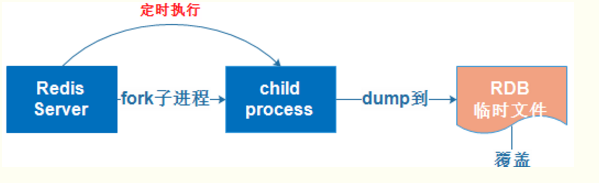

# Redis持久化
> 参考文献
> * [https://www.cnblogs.com/shizhengwen/p/9283824.html](https://www.cnblogs.com/shizhengwen/p/9283824.html)
## 概述
* Redis是一种高级key-value数据库。它跟memcached类似，不过数据可以持久化，而且支持的数据类型很丰富。有字符串，链表，集 合和有序集合。支持在服务器端计算集合的并，交和补集(difference)等，还支持多种排序功能。所以Redis也可以被看成是一个数据结构服务 器。
* Redis的所有数据都是保存在内存中，然后不定期的通过异步方式保存到磁盘上(这称为“半持久化模式”)；也可以把每一次数据变化都写入到一个append only file(aof)里面(这称为“全持久化模式”)。 

* 由于Redis的数据都存放在内存中，如果没有配置持久化，redis重启后数据就全丢失了，于是需要开启redis的持久化功能，将数据保存到磁盘上，当redis重启后，可以从磁盘中恢复数据。redis提供两种方式进行持久化：
  * 一种是RDB持久化（原理是将Reids在内存中的数据库记录定时dump到磁盘上的RDB持久化），
  * 另外一种是AOF（append only file）持久化（原理是将Reids的操作日志以追加的方式写入文件）。
* 那么这两种持久化方式有什么区别呢，改如何选择呢？网上看了大多数都是介绍这两种方式怎么配置，怎么使用，就是没有介绍二者的区别，在什么应用场景下使用。

## 2 二者的区别
* RDB持久化是指在指定的时间间隔内将内存中的数据集快照写入磁盘，实际操作过程是fork一个子进程，先将数据集写入临时文件，写入成功后，再替换之前的文件，用二进制压缩存储。


* AOF持久化以日志的形式记录服务器所处理的每一个写、删除操作，查询操作不会记录，以文本的方式记录，可以打开文件看到详细的操作记录。


## 3 二者优缺点
### RDB存在哪些优势呢？
1. 一旦采用该方式，那么你的整个Redis数据库将只包含一个文件，这对于文件备份而言是非常完美的。比如，你可能打算每个小时归档一次最近24小时的数据，同时还要每天归档一次最近30天的数据。通过这样的备份策略，一旦系统出现灾难性故障，我们可以非常容易的进行恢复。

2. 对于灾难恢复而言，RDB是非常不错的选择。因为我们可以非常轻松的将一个单独的文件压缩后再转移到其它存储介质上。

3. 性能最大化。对于Redis的服务进程而言，在开始持久化时，它唯一需要做的只是fork出子进程，之后再由子进程完成这些持久化的工作，这样就可以极大的避免服务进程执行IO操作了。

4. 相比于AOF机制，如果数据集很大，RDB的启动效率会更高。

### RDB又存在哪些劣势呢？

1. 如果你想保证数据的高可用性，即最大限度的避免数据丢失，那么RDB将不是一个很好的选择。因为系统一旦在定时持久化之前出现宕机现象，此前没有来得及写入磁盘的数据都将丢失。

2. 由于RDB是通过fork子进程来协助完成数据持久化工作的，因此，如果当数据集较大时，可能会导致整个服务器停止服务几百毫秒，甚至是1秒钟。

### AOF的优势有哪些呢？
1. 该机制可以带来更高的数据安全性，即数据持久性。Redis中提供了3中同步策略，即每秒同步、每修改同步和不同步。事实上，每秒同步也是异步完成的，其效率也是非常高的，所差的是一旦系统出现宕机现象，那么这一秒钟之内修改的数据将会丢失。而每修改同步，我们可以将其视为同步持久化，即每次发生的数据变化都会被立即记录到磁盘中。可以预见，这种方式在效率上是最低的。至于无同步，无需多言，我想大家都能正确的理解它。

2. 由于该机制对日志文件的写入操作采用的是append模式，因此在写入过程中即使出现宕机现象，也不会破坏日志文件中已经存在的内容。然而如果我们本次操作只是写入了一半数据就出现了系统崩溃问题，不用担心，在Redis下一次启动之前，我们可以通过redis-check-aof工具来帮助我们解决数据一致性的问题。

3. 如果日志过大，Redis可以自动启用rewrite机制。即Redis以append模式不断的将修改数据写入到老的磁盘文件中，同时Redis还会创建一个新的文件用于记录此期间有哪些修改命令被执行。因此在进行rewrite切换时可以更好的保证数据安全性。

4. AOF包含一个格式清晰、易于理解的日志文件用于记录所有的修改操作。事实上，我们也可以通过该文件完成数据的重建。

### AOF的劣势有哪些呢？

1. 对于相同数量的数据集而言，AOF文件通常要大于RDB文件。RDB 在恢复大数据集时的速度比 AOF 的恢复速度要快。

2. 根据同步策略的不同，AOF在运行效率上往往会慢于RDB。总之，每秒同步策略的效率是比较高的，同步禁用策略的效率和RDB一样高效。

### 二者选择的标准

就是看系统是愿意牺牲一些性能，换取更高的缓存一致性（aof），还是愿意写操作频繁的时候，不启用备份来换取更高的性能，待手动运行save的时候，再做备份（rdb）。rdb这个就更有些 eventually consistent的意思了。

## 4 常用配置
### RDB持久化配置
* Redis会将数据集的快照dump到dump.rdb文件中。此外，我们也可以通过配置文件来修改Redis服务器dump快照的频率，在打开6379.conf文件之后，我们搜索save，可以看到下面的配置信息：

```
save 900 1              #在900秒(15分钟)之后，如果至少有1个key发生变化，则dump内存快照。

save 300 10            #在300秒(5分钟)之后，如果至少有10个key发生变化，则dump内存快照。

save 60 10000        #在60秒(1分钟)之后，如果至少有10000个key发生变化，则dump内存快照
```

### AOF持久化配置
* 在Redis的配置文件中存在三种同步方式，它们分别是：
```
appendfsync always     #每次有数据修改发生时都会写入AOF文件。

appendfsync everysec  #每秒钟同步一次，该策略为AOF的缺省策略。

appendfsync no          #从不同步。高效但是数据不会被持久化。
```

 