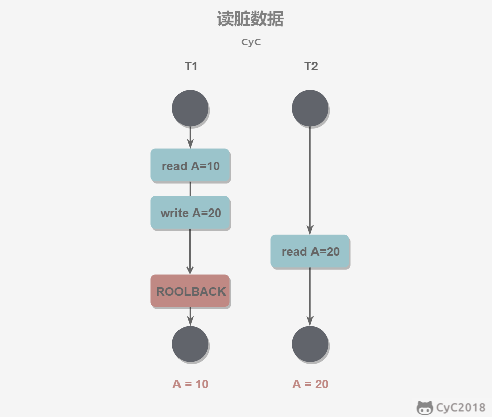
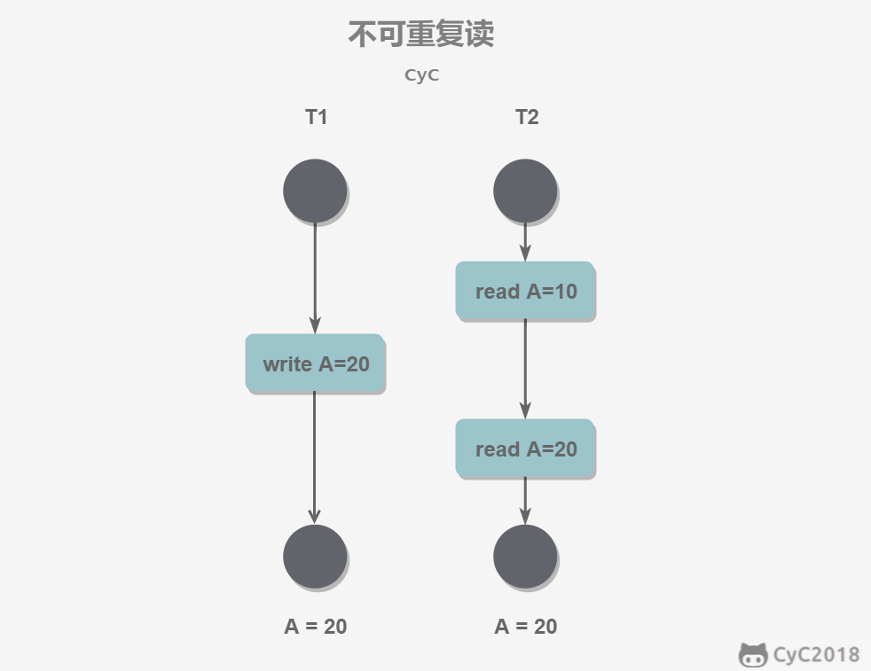
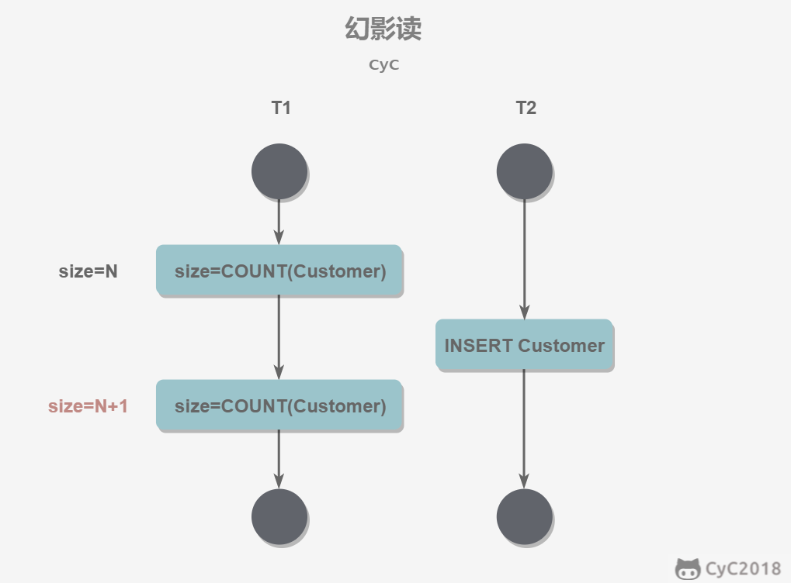
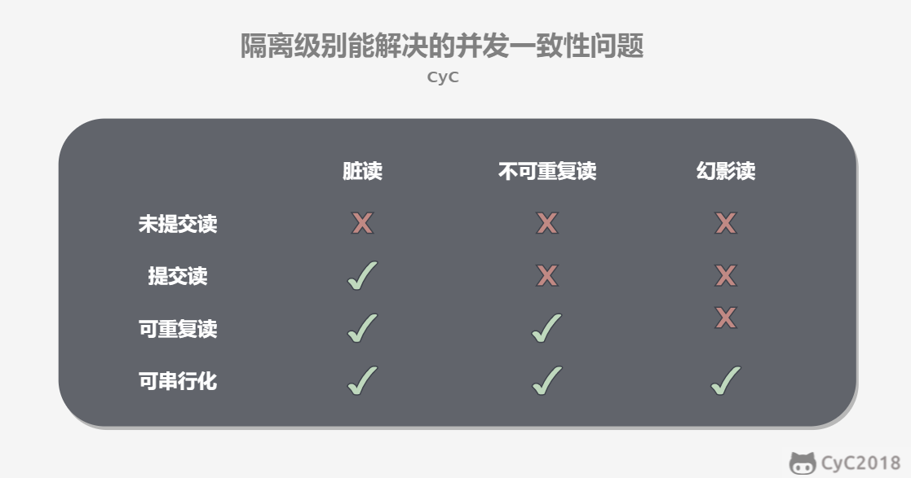
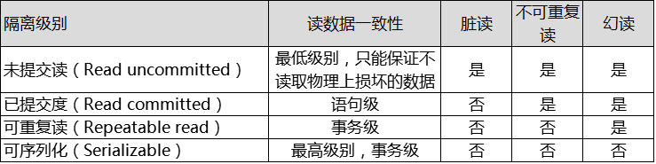

# 并发控制

> 参考文献
>
> - [锁与并发](https://www.cnblogs.com/luyucheng/p/6297752.html)

## 1 事务的特性

### 概念

事务指的是满足 ACID 特性的一组操作，可以通过 Commit 提交一个事务，也可以使用 Rollback 进行回滚。

### ACID

1. 原子性（Atomicity）事务被视为不可分割的最小单元，事务的所有操作要么全部提交成功，要么全部失败回滚。回滚可以用回滚日志（Undo Log）来实现，回滚日志记录着事务所执行的修改操作，在回滚时反向执行这些修改操作即可。

2. 一致性（Consistency）数据库在事务执行前后都保持一致性状态。在一致性状态下，所有事务对同一个数据的读取结果都是相同的。

3. 隔离性（Isolation）一个事务所做的修改在最终提交以前，对其它事务是不可见的。

4. 持久性（Durability）一旦事务提交，则其所做的修改将会永远保存到数据库中。即使系统发生崩溃，事务执行的结果也不能丢失。系统发生崩溃可以用重做日志（Redo Log）进行恢复，从而实现持久性。与回滚日志记录数据的逻辑修改不同，重做日志记录的是数据页的物理修改。

事务的 ACID 特性概念简单，但不是很好理解，主要是因为这几个特性不是一种平级关系：

- 只有满足一致性，事务的执行结果才是正确的。
- 在无并发的情况下，事务串行执行，隔离性一定能够满足。此时只要能满足原子性，就一定能满足一致性。
- 在并发的情况下，多个事务并行执行，事务不仅要满足原子性，还需要满足隔离性，才能满足一致性。
- 事务满足持久化是为了能应对系统崩溃的情况。

### AUTOCOMMIT

MySQL 默认采用自动提交模式。也就是说，如果不显式使用`START TRANSACTION`语句来开始一个事务，那么每个查询操作都会被当做一个事务并自动提交。

## 2 并发一致性问题

在并发环境下，事务的隔离性很难保证，因此会出现很多并发一致性问题。

1. 脏读（Dirty Reads）：一个事务可以读取另一个尚未提交事务的修改数据 。
2. 不可重复读（Non-Repeatable Reads）：同一个事务中，多次查询某个数据，却得到不同的结果。
3. 幻影读（Phantom Reads）：一个事务按相同的查询条件重新读取以前检索过的数据，却发现其他事务插入了满足其查询条件的新数据。

### 脏读

读脏数据指在不同的事务下，当前事务可以读到另外事务未提交的数据。例如：T1 修改一个数据但未提交，T2 随后读取这个数据。如果 T1 撤销了这次修改，那么 T2 读取的数据是脏数据。

### 不可重复读

不可重复读指在一个事务内多次读取同一数据集合。在这一事务还未结束前，另一事务也访问了该同一数据集合并做了修改，由于第二个事务的修改，第一次事务的两次读取的数据可能不一致。例如：T2 读取一个数据，T1 对该数据做了修改。如果 T2 再次读取这个数据，此时读取的结果和第一次读取的结果不同。

### 幻影读

- 事务 A 按照一定条件进行数据读取， 期间事务 B 插入了相同搜索条件的新数据，事务 A 再次按照原先条件进行读取时，发现了事务 B 新插入的数据 称为幻读。幻读本质上也属于不可重复读的情况，T1 读取某个范围的数据，T2 在这个范围内插入新的数据，T1 再次读取这个范围的数据，此时读取的结果和和第一次读取的结果不同。

产生影响：

- 会造成一个事务中先产生的锁，无法锁住后加入的满足条件的行。
- 产生数据一致性问题，在一个事务中，先对符合条件的目标行做变更，而在事务提交前有新的符合目标条件的行加入。这样通过 binlog 恢复的数据是会将所有符合条件的目标行都进行变更的。

产生原因：

- 行锁只能锁住行，即使把所有的行记录都上锁，也阻止不了新插入的记录。

应对方法

- 将两行记录间的空隙加上锁，阻止新记录的插入；这个锁称为间隙锁。
- 间隙锁与间隙锁之间没有冲突关系。跟间隙锁存在冲突关系的，是往这个间隙中插入一个记录这个操作。

> 产生并发不一致性问题的主要原因是破坏了事务的隔离性，解决方法是通过并发控制来保证隔离性。并发控制可以通过封锁来实现，但是封锁操作需要用户自己控制，相当复杂。数据库管理系统提供了事务的隔离级别，让用户以一种更轻松的方式处理并发一致性问题。

## 3 事务隔离级别

### 解决方案

“脏读”、“不可重复读”和“幻读”，其实都是数据库**读一致性问题**，必须由数据库提供一定的事务隔离机制来解决。数据库实现事务隔离的方式，基本上可分为以下两种：

1. 多级锁协议。在读取数据前，对其加锁，阻止其他事务对数据进行修改。
2. 多版本并发控制（MultiVersion Concurrency Control，MVCC）。不用加任何锁，通过一定机制生成一个数据请求时间点的一致性数据快照（Snapshot)，并用这个快照来提供一定级别（语句级或事务级）的一致性读取。从用户的角度来看，好像是数据库可以提供同一数据的多个版本。这种技术也经常称为多版本数据库。

### 隔离级别

> MySQL 中默认的事务处理级别就是**REPEATABLE-READ 可重复读**。

1. 未提交读（READ UNCOMMITTED）事务中的修改，即使没有提交，对其它事务也是可见的。允许脏读
2. 提交读（READ COMMITTED）一个事务只能读取已经提交的事务所做的修改。换句话说，一个事务所做的修改在提交之前对其它事务是不可见的。
3. 可重复读（REPEATABLE READ）保证在同一个事务中多次读取同一数据的结果是一样的。
4. 可串行化（SERIALIZABLE）强制事务串行执行，这样多个事务互不干扰，不会出现并发一致性问题。该隔离级别需要加锁实现，因为要使用加锁机制保证同一时间只有一个事务执行，也就是保证事务串行执行。

数据库的事务隔离越严格，并发副作用越小，但付出的代价也就越大，因为事务隔离实质上就是使事务在一定程度上 “串行化”进行，这显然与“并发”是矛盾的。

定义了 4 个事务隔离级别，每个级别的隔离程度不同，允许出现的副作用也不同，应用可以根据自己的业务逻辑要求，通过选择不同的隔离级别来平衡 “隔离”与“并发”的矛盾。

