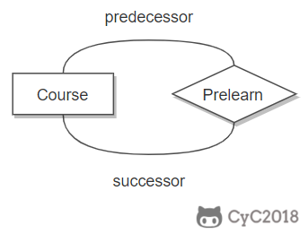
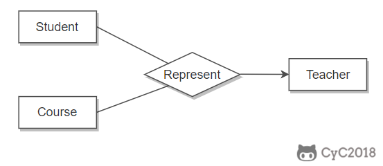
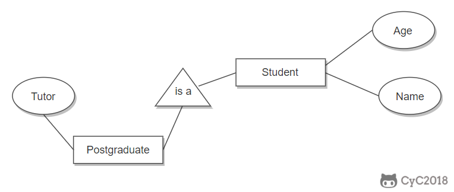

# 设计篇——设计步骤
## 1 ER 图

### 定义
Entity-Relationship，有三个组成部分：实体、属性、联系。

用来进行关系型数据库系统的概念设计。

### 实体的三种联系

包含一对一，一对多，多对多三种。

- 如果 A 到 B 是一对多关系，那么画个带箭头的线段指向 B；
- 如果是一对一，画两个带箭头的线段；
- 如果是多对多，画两个不带箭头的线段。

下图的 Course 和 Student 是一对多的关系。

### 表示出现多次的关系

一个实体在联系出现几次，就要用几条线连接。

下图表示一个课程的先修关系，先修关系出现两个 Course 实体，第一个是先修课程，后一个是后修课程，因此需要用两条线来表示这种关系。

### 联系的多向性

虽然老师可以开设多门课，并且可以教授多名学生，但是对于特定的学生和课程，只有一个老师教授，这就构成了一个三元联系。

### 表示子类

用一个三角形和两条线来连接类和子类，与子类有关的属性和联系都连到子类上，而与父类和子类都有关的连到父类上。

