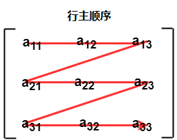

# 数组


## 1 数组的简介

### 定义
* 数组是存储在**连续内存位置**的**相同类型数据项**的集合，是最简单的**线性数据结构**。
  * 数组的每个数据元素都可以使用下表索引运算符，进行**随机访问**。
  * 数组可以有一个或**多个维度**。
  * 每个元素具有**相同的数据类型**并且具有相同的大小，即int = 4个字节。

```
int arr[10];
char arr[10]; 
float arr[5];
```


### 优点
* 数组为同一类型的变量组提供单一名称，因此很容易记住数组中所有元素的名称。
* 遍历数组是一个非常简单的过程，只需要递增数组的基址，就可以逐个访问每个元素。
* 可以使用索引直接访问数组中的任何元素。


### 时间复杂性

| 算法 | 平均情况 | 最坏情况 |
|----|------|------|
| 访问 | O(1) | O(1) |
| 搜索 | O(n) | O(n) |
| 插入 | O(n) | O(n) |
| 删除 | O(n) | O(n) |

### 空间复杂性

* 在数组中，最坏情况下的空间复杂度是O(n)。

## 2 数组的类型
### 一维数组

* 一维（或单维）数组是一种线性数组，其中元素的访问是以行或列索引的单一下标表示。
* C++ 将高维维数组存储为一维数组。因此，如果我们将 A 定义为也包含 M * N 个元素的二维数组，那么实际上 A[i][j] 就等于 A[i * N + j]。


### 多维数组

* 普通数组采用一个整数来作下标。多维数组（高维数组）的概念特别是在数值计算和图形应用方面非常有用。我们在多维数组之中采用一系列有序的整数来标注，如在[ 3,1,5 ] 。这种整数列表之中整数的个数始终相同，且被称为数组的“维度”。关于每个数组维度的边界称为“维”。维度为 k 的数组通常被称为 k 维。
* 多维数组的数组名字，在表达式中自动转换为数组首元素地址值，但这个首元素实际上是去除数组下标第一维之后的数组剩余部分。

## 3 数组的存储和实现
### 数组存储

* 数组的所有数据元素都存储在主存储器中的连续位置。
* 数组名称表示主存储器中的基地址或第一个元素的地址。
* 数组的每个元素都由适当的索引表示。可以用三种方式定义数组的索引。
    * 0(从零开始索引)：数组的第一个元素是arr[0]。
    * 1(基于一个索引)：数组的第一个元素是arr [1]。
    * n(基于n的索引)：基于数组的第一个元素，可以定位任何随机索引值。


### 数组实现
* C++内置数组数据类型。
```
int a[4];
double b[3][9];//内置数组
```
* STL提供两种灵活的数组结构。

```
array<int, 5> arr = {1, 2, 3, 4, 5};//STL模板数组
vector<int> vec ={3,4,3};//STL模板向量，可变长度的数组
```

## 4 数组的操作

### 基础操作
* 创建
* 遍历
* 插入
* 删除

### 创建
```
// 定义数组
int size =20;//容量
int numbers =10;//数据量
int a[20]={1,3,4,5,6,7,4,2,4,5};
```
### 遍历
```C++
// 数组遍历
for(int i=0;i<10;i++){
    cout<<a[i];
}
```
### 插入
```C++
//数组插入,尾插入
int value=9;
if(numbers<size){
    a[numbers]=value;
    numbers++;
}
else{
    cout<<"overflow"<<endl;
}
// 数组插入，头插入
int value=10;
if(numbers<size){
    for(int i=1;i<=numbers,i++){
        a[numbers]=a[numbers-i];
    }
    a[0]=value;
}
else{
    cout<<"overflow"<<endl;
}
```
### 删除
```C++
// 删除
int aim=8;
if(aim>=numbers){
    cout<<"overbound"<<endl;
}
else{
    for(int i=aim;i<numbers-1;i++){
        a[i]=a[i+1];
    }
}
```

## 5 二维数组(矩阵)

### 二维数组的表示
* 二维数组的大小等于行数和数组中存在的列数的乘积。
* 一般将二维数组映射到一维数组，存储在内存中。
  * 一个3 X 3的二维数组如下图所示。需要将此数组映射到一维数组，存储到内存中。


### 二维数组的存储——行主顺序

* 在行主排序中，二维数组的所有行连续地存储在存储器中。上图中所示数组，它按行主顺序的存储器分配如下所示




### 二维数组的存储——列主顺序

* 根据列主排序，二维数组的所有列都连续地存储在存储器中。 上面图像中所示数组的存储器分配给出如下


### 计算二维数组随机元素的地址

* 由于存在两种不同的将二维数组存储到存储器中的技术，因此也有两种不同的公式来计算二维数组的随机元素的地址。
  * 按行主顺序如果数组由a[m][n]声明，其中m是行数，而n是列数，则以行主顺序存储的数组的元素a[i][j]的地址计算为
```
Address(a[i][j]) = B. A. + (i * n + j) * size
```
  * 按列主顺序如果数组由a[m][n]声明，其中m是行数，而n是列数，则以列主顺序存储的数组的元素a[i][j]的地址计算为，
```
Address(a[i][j]) = ((j*m)+i)*Size + BA
```
