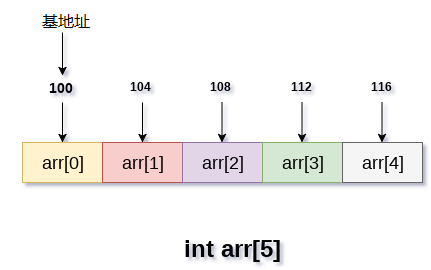
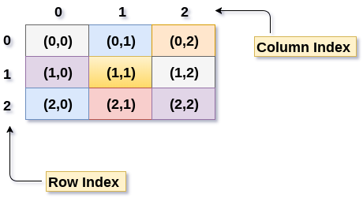
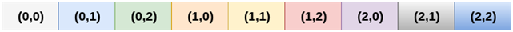
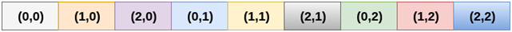
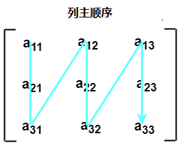

# 数组


## 简介

### 数组定义
* 数组是存储在连续内存位置的相似类型数据项的集合。
* 数组是最简单的线性数据结构，它的每个数据元素都可以使用索引号随机访问。
* 数组可以有一个或多个维度。
* 每个元素具有相同的数据类型并且具有相同的大小，即int = 4个字节。

```
int arr[10]; char arr[10]; 
float arr[5];
```


### 数组的优点
* 数组为同一类型的变量组提供单一名称，因此很容易记住数组中所有元素的名称。
* 遍历数组是一个非常简单的过程，只需要递增数组的基址，就可以逐个访问每个元素。
* 可以使用索引直接访问数组中的任何元素。

### 一维数组

* 一维（或单维）数组是一种线性数组，其中元素的访问是以行或列索引的单一下标表示。
* C++ 将高维维数组存储为一维数组。因此，如果我们将 A 定义为也包含 M * N 个元素的二维数组，那么实际上 A[i][j] 就等于 A[i * N + j]。


### 多维数组

* 普通数组采用一个整数来作下标。多维数组（高维数组）的概念特别是在数值计算和图形应用方面非常有用。我们在多维数组之中采用一系列有序的整数来标注，如在[ 3,1,5 ] 。这种整数列表之中整数的个数始终相同，且被称为数组的“维度”。关于每个数组维度的边界称为“维”。维度为 k 的数组通常被称为 k 维。
* 多维数组的数组名字，在表达式中自动转换为数组首元素地址值，但这个首元素实际上是去除数组下标第一维之后的数组剩余部分。

### 时间复杂性

| 算法 | 平均情况 | 最坏情况 |
|----|------|------|
| 访问 | O(1) | O(1) |
| 搜索 | O(n) | O(n) |
| 插入 | O(n) | O(n) |
| 删除 | O(n) | O(n) |

### 空间复杂性

* 在数组中，最坏情况下的空间复杂度是O(n)。


### 数组的存储

数组的所有数据元素都存储在主存储器中的连续位置。 数组名称表示主存储器中的基地址或第一个元素的地址。 数组的每个元素都由适当的索引表示。可以用三种方式定义数组的索引。

* 0(从零开始索引)：数组的第一个元素是arr[0]。
* 1(基于一个索引)：数组的第一个元素是arr [1]。
* n(基于n的索引)：基于数组的第一个元素，可以定位任何随机索引值。




## 2 二维数组(矩阵)

### 二维数组的表示
* 创建二维数组和实现关系数据库表看起来有相似的数据结构，在计算机存储器中，二维数组存储技术类似于一维数组的存储技术。
* 二维数组的大小等于行数和数组中存在的列数的乘积。 确实需要将二维数组映射到一维数组，以便将它们存储在内存中。
* 一个3 X 3的二维数组如下图所示。 但是，需要将此数组映射到一维数组，以便将其存储到内存中。



### 二维数组的存储——行主顺序

* 在行主排序中，二维数组的所有行连续地存储在存储器中。 考虑一下上图中所示数组，它按行主顺序的存储器分配如下所示




### 二维数组的存储——列主顺序

* 根据列主排序，二维数组的所有列都连续地存储在存储器中。 上面图像中所示数组的存储器分配给出如下




### 计算二维数组随机元素的地址

由于存在两种不同的将二维数组存储到存储器中的技术，因此也有两种不同的公式来计算二维数组的随机元素的地址。
* 按行主顺序如果数组由a[m][n]声明，其中m是行数，而n是列数，则以行主顺序存储的数组的元素a[i][j]的地址计算为
```
Address(a[i][j]) = B. A. + (i * n + j) * size
```
* 按列主顺序如果数组由a[m][n]声明，其中m是行数，而n是列数，则以列主顺序存储的数组的元素a[i][j]的地址计算为，
```
Address(a[i][j]) = ((j*m)+i)*Size + BA
```


