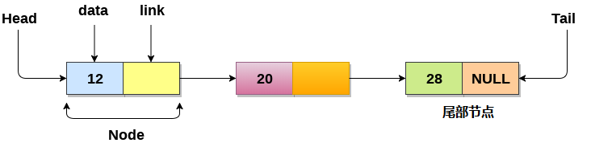
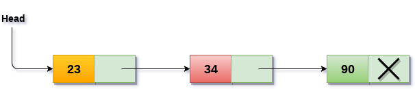
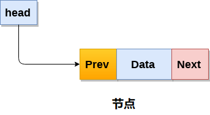
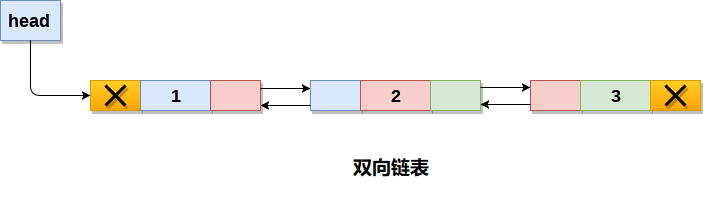
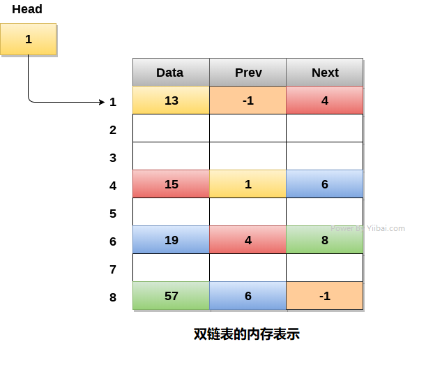
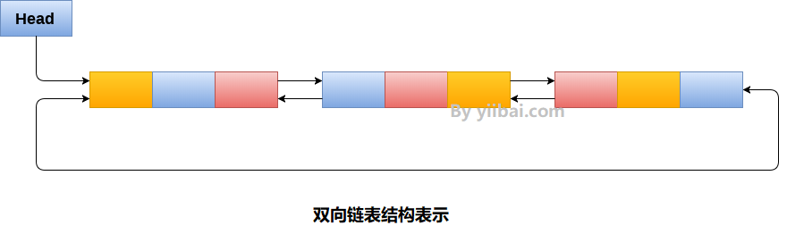

# 链表

## 0 简介

### 链表概念

* 链表是一种随机存储在内存中的叫做节点的对象集合。节点包含两个字段，即存储在该地址的数据和包含下一个节点地址的指针。链表的最后一个节点包含指向null的指针。





### 链表用途
* 链表不需要连续存在于存储器中。节点可以是存储器中的任何位置并链接在一起以形成链表。这实现了空间的优化利用。
* 链表大小仅限于内存大小，不需要提前声明。
* 空节点不能出现在链表中。
* 在单链表中存储基元类型或对象的值。

### 链表与数组的对比

* 数组有以下限制：
  * 在程序中使用数组之前，必须事先知道数组的大小。
  * 增加数组的大小是一个耗时的过程。在运行时几乎不可能扩展数组的大小。
  * 数组中的所有元素都需要连续存储在内存中。在数组中插入任何元素都需要移动元素之前所有的数据。

* 链表是可以克服数组所有限制的数据结构。 链表是非常有用的，因为，

  * 它动态分配内存。链表的所有节点都是非连续存储在存储器中，并使用指针链接在一起。
  * 大小调整不再是问题，因为不需要在声明时定义大小。链表根据程序的需求增长，并且仅限于可用的内存空间。


## 1 单链表

### 概念
* 单链表是有序元素集的集合。元素的数量可以根据程序的需要而变化。 单链表中的节点由两部分组成：数据部分和链接部分。
* 节点的数据部分存储将由节点表示的实际信息，而节点的链接部分存储其直接后继的地址。
* 单向链或单链表可以仅在一个方向上遍历。也就是说每个节点只包含下一个节点的指针，因此不能反向遍历链表。





### 链表复杂度

| 操作 | 平均复杂度 | 最坏复杂度 |
|----|-------|-------|
| 访问 | θ(n)  | θ(n)  |
| 搜索 | θ(n)  | θ(n)  |
| 插入 | θ(1)  | θ(1)  |
| 删除 | θ(1)  | θ(1)  |


### 数据结构

```C
struct node   
{  
    int data;   
    struct node *next;  
};  
struct node *head, *ptr;   
ptr = (struct node *)malloc(sizeof(struct node *));
```

### 基本操作
* 创建
* 遍历、搜索、查找（同一类操作）
* 插入（尾插入、头插入、中间插入）
* 删除


### 实现
```
```

## 2 双链表

### 概念

双向链表是一种复杂类型的链表，它的节点包含指向序列中前一个节点和下一个节点的指针。 因此，在双向链表中，节点由三部分组成：节点数据，指向下一个节点的指针(next指针)，指向前一个节点的指针(prev指针)。




### 双链表的数据存储

* 双向链表的内存表示如下图所示。 通常，双向链表为每个节点消耗更多空间，因此它有更广泛的基本操作，例如：插入和删除。 但是，可以轻松地操作链表中的元素，因为链表在两个方向(向前和向后)都保存指针。



### 数据结构

```C
struct node   
{  
    struct node *prev;   
    int data;  
    struct node *next;   
}
```

### 基本操作
* 创建
* 遍历、搜索
* 插入
* 删除


### 实现
```
```

## 3 循环单向链表

### 概念
* 在循环单链表中，链表的最后一个节点包含指向链表的第一个节点的指针。可以有循环单向链表以及循环双链表。
* 遍历一个循环单链表，直到到达开始的同一个节点。循环单链表类似于链表，但它没有开始也没有结束。任何节点的下一部分都不存在NULL值。


### 数据存储

链表的最后一个节点包含链表的第一个节点的地址。


### 基本操作
* 创建
* 遍历、搜索
* 插入
* 删除


### 实现
```
```

## 4 循环双向链表

### 概念

* 循环双向链表是一种更复杂的数据结构类型，它的节点包含指向其前一节点以及下一节点的指针。
* 循环双向链表在任何节点中都不包含NULL。
* 链表的最后一个节点包含列表的第一个节点的地址。
* 链表的第一个节点还包含的前一个指针是指向最后一个节点的地址。



### 数据存储

* 起始节点包含最后一个(也是前一个)节点的地址，即8和下一个节点，即4。链表的最后一个节点，存储在地址8并包含数据6，包含链表的第一个节点的地址


### 基本操作
* 创建
* 遍历、搜索
* 插入
* 删除


### 实现
```
```