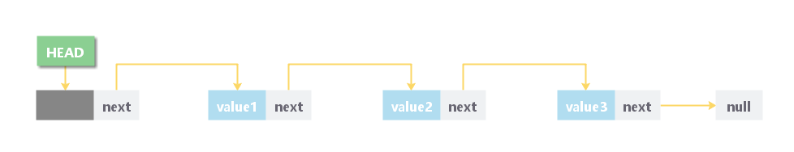

# 单链表

## 1 简介
### 概念
* 单链表是有序元素集的集合。元素的数量可以根据程序的需要而变化。 单链表中的节点由两部分组成：数据部分和链接部分。
* 节点的数据部分存储将由节点表示的实际信息，而节点的链接部分存储其直接后继的地址。
* 单向链或单链表可以仅在一个方向上遍历。也就是说每个节点只包含下一个节点的指针，因此不能反向遍历链表。




### 链表复杂度

| 操作 | 平均复杂度 | 最坏复杂度 |
|----|-------|-------|
| 访问 | θ(n)  | θ(n)  |
| 搜索 | θ(n)  | θ(n)  |
| 插入 | θ(1)  | θ(1)  |
| 删除 | θ(1)  | θ(1)  |


## 2 链表的存储和实现
### 链表的存储

* 链表不需要连续存在于存储器中。节点可以是存储器中的任何位置并链接在一起以形成链表。这实现了空间的优化利用。

### 链表的实现
* 链表通过结构体和指针实现
```C++
struct node   
{  
    int data;   
    struct node *next;  
};  
struct node *head, *ptr;   
ptr = (struct node *)malloc(sizeof(struct node *));
```
* C++ STL提供了链表的实现

```
#include<list>

list<int> li;
forward_list<int> li;
```

## 3 链表的操作
### 基本操作
* 创建
* 遍历、搜索、查找（同一类操作）
* 插入（尾插入、头插入、中间插入）
* 删除

### 实现
```C++
#include<stdio.h>  
#include<stdlib.h>  
struct node
{
    int data;
    struct node *next;
};
struct node *head;

void beginsert();
void lastinsert();
void randominsert();
void begin_delete();
void last_delete();
void random_delete();
void display();
void search();

int main()
{
    int choice = 0;
    while (choice != 9)
    {
        printf("\n\n********* 主菜单 *********\n");
        printf("从以下菜单列表中选择一个选项操作 ...\n");
        printf("===============================================\n");
        printf("1.插入到开头\n");
        printf("2.插入到结尾\n");
        printf("3.插入任何随机位置\n");
        printf("4.从头部删除\n");
        printf("5.从尾部删除\n");
        printf("6.删除指定位置后的节点\n");
        printf("7.搜索元素\n");
        printf("8.显示链表中的数据\n");
        printf("9.退出\n\n"); 
        printf("===============================================\n");
        printf("请输入您的选择：");
        scanf("%d", &choice);
        switch (choice)
        {
        case 1:
            beginsert();
            break;
        case 2:
            lastinsert();
            break;
        case 3:
            randominsert();
            break;
        case 4:
            begin_delete();
            break;
        case 5:
            last_delete();
            break;
        case 6:
            random_delete();
            break;
        case 7:
            search();
            break;
        case 8:
            display();
            break;
        case 9:
            exit(0);
            break;
        default:
            printf("请输入有效的选项...");
        }
    }
    return 0;
}
void beginsert()
{
    struct node *ptr;
    int item;
    ptr = (struct node *) malloc(sizeof(struct node *));
    if (ptr == NULL)
    {
        printf("内存不够！\n");
    }
    else
    {
        printf("请输入一个整数值：");
        scanf("%d", &item);
        ptr->data = item;
        ptr->next = head;
        head = ptr;
        printf("节点已经成功插入\n");
    }

}
void lastinsert()
{
    struct node *ptr, *temp;
    int item;
    ptr = (struct node*)malloc(sizeof(struct node));
    if (ptr == NULL)
    {
        printf("内存不够！\n");
    }
    else
    {
        printf("请输入一个整数值：");
        scanf("%d", &item);
        ptr->data = item;
        if (head == NULL)
        {
            ptr->next = NULL;
            head = ptr;
            printf("节点已经成功插入\n");
        }
        else
        {
            temp = head;
            while (temp->next != NULL)
            {
                temp = temp->next;
            }
            temp->next = ptr;
            ptr->next = NULL;
            printf("节点已经成功插入\n");

        }
    }
}
void randominsert()
{
    int i, loc, item;
    struct node *ptr, *temp;
    ptr = (struct node *) malloc(sizeof(struct node));
    if (ptr == NULL)
    {
        printf("内存不够！\n");
    }
    else
    {
        printf("请输入一个整数值：");
        scanf("%d", &item);
        ptr->data = item;
        printf("输入要插入的位置：");
        scanf("%d", &loc);
        temp = head;
        for (i = 0;i < loc;i++)
        {
            temp = temp->next;
            if (temp == NULL)
            {
                printf("此处不能插入节点\n");
                return;
            }

        }
        ptr->next = temp->next;
        temp->next = ptr;
        printf("节点已经成功插入\n");
    }
}
void begin_delete()
{
    struct node *ptr;
    if (head == NULL)
    {
        printf("链表为空，没有什么可以删除！\n");
    }
    else
    {
        ptr = head;
        head = ptr->next;
        free(ptr);
        printf("已经删除头部节点 ...\n");
    }
}
void last_delete()
{
    struct node *ptr, *ptr1;
    if (head == NULL)
    {
        printf("链表为空，没有什么可以删除！\n");
    }
    else if (head->next == NULL)
    {
        head = NULL;
        free(head);
        printf("唯一的节点已经被删除了...\n");
    }

    else
    {
        ptr = head;
        while (ptr->next != NULL)
        {
            ptr1 = ptr;
            ptr = ptr->next;
        }
        ptr1->next = NULL;
        free(ptr);
        printf("已删除最后一个节点...\n");
    }
}
void random_delete()
{
    struct node *ptr, *ptr1;
    int loc, i;
    printf("输入要在此节点之后执行删除的节点的位置：");
    scanf("%d", &loc);
    ptr = head;
    for (i = 0;i < loc;i++)
    {
        ptr1 = ptr;
        ptr = ptr->next;

        if (ptr == NULL)
        {
            printf("不能删除\n");
            return;
        }
    }
    ptr1->next = ptr->next;
    free(ptr);
    printf("\n第 %d 个节点已经被删除了", loc + 1);
}
void search()
{
    struct node *ptr;
    int item, i = 0, flag;
    ptr = head;
    if (ptr == NULL)
    {
        printf("链表为空！\n");
    }
    else
    {
        printf("请输入要搜索的项目：");
        scanf("%d", &item);
        while (ptr != NULL)
        {
            if (ptr->data == item)
            {
                printf("在 %d 位置找到数据项\n", i + 1);
                flag = 0;
            }
            else
            {
                flag = 1;
            }
            i++;
            ptr = ptr->next;
        }
        if (flag == 1)
        {
            printf("数据项未找到\n");
        }
    }

}

/**
 * 显示链表中的数据 
 */
void display()
{
    struct node *ptr;
    ptr = head;
    if (ptr == NULL)
    {
        printf("链表为空，没有数据可以显示。");
    }
    else
    {
        printf("链表中的数据值如下所示：\n");
        printf("--------------------------------------------------\n");
        while (ptr != NULL)
        {
            printf("\n%d", ptr->data);
            ptr = ptr->next;
        }
    }
    printf("\n\n\n");

}
```