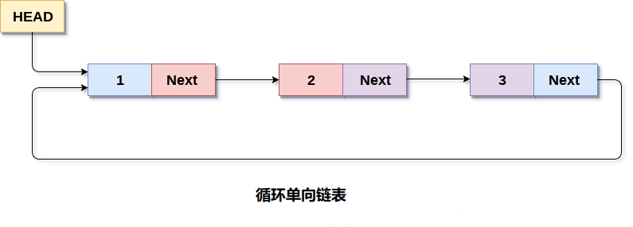
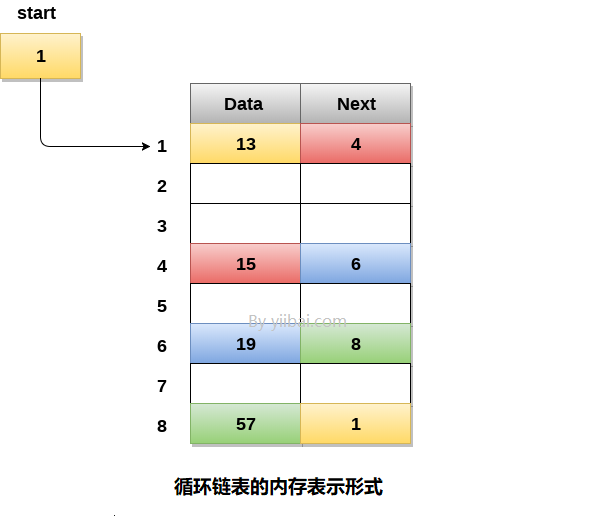

# 循环单向链表
## 1 简介
### 概念
* 在循环单链表中，链表的最后一个节点包含指向链表的第一个节点的指针。可以有循环单向链表以及循环双链表。
* 遍历一个循环单链表，直到到达开始的同一个节点。循环单链表类似于链表，但它没有开始也没有结束。任何节点的下一部分都不存在NULL值。



## 2 数据存储和实现

### 数据存储

链表的最后一个节点包含链表的第一个节点的地址。



### 数据实现

* 链表通过结构体和指针实现
```C++
struct node   
{  
    int data;   
    struct node *next;  
};  
struct node *head, *ptr;   
ptr = (struct node *)malloc(sizeof(struct node *));
```
* C++ STL提供了链表的实现

```
#include<list>

list<int> li;
forward_list<int> li;
```

## 3 操作


### 基本操作
* 创建
* 遍历、搜索
* 插入
* 删除


### 实现
```C++
#include<stdio.h>  
#include<stdlib.h>  
struct node
{
    int data;
    struct node *next;
};
struct node *head;

void beginsert();
void lastinsert();
void randominsert();
void begin_delete();
void last_delete();
void random_delete();
void display();
void search();
int main()
{
    int choice = 0;
    while (choice != 7)
    {
        printf("*********Main Menu*********\n");
        printf("Choose one option from the following list ...\n");
        printf("===============================================\n");
        printf("1.Insert in begining\n2.Insert at last\n");
        printf("3.Delete from Beginning\n4.Delete from last\n");
        printf("5.Search for an element\n6.Show\n7.Exit\n");
        printf("Enter your choice?\n");
        scanf("%d", &choice);
        switch (choice)
        {
        case 1:
            beginsert();
            break;
        case 2:
            lastinsert();
            break;
        case 3:
            begin_delete();
            break;
        case 4:
            last_delete();
            break;
        case 5:
            search();
            break;
        case 6:
            display();
            break;
        case 7:
            exit(0);
            break;
        default:
            printf("Please enter valid choice..");
        }
    }
}
void beginsert()
{
    struct node *ptr, *temp;
    int item;
    ptr = (struct node *)malloc(sizeof(struct node));
    if (ptr == NULL)
    {
        printf("OVERFLOW");
    }
    else
    {
        printf("Enter the node data?");
        scanf("%d", &item);
        ptr->data = item;
        if (head == NULL)
        {
            head = ptr;
            ptr->next = head;
        }
        else
        {
            temp = head;
            while (temp->next != head)
                temp = temp->next;
            ptr->next = head;
            temp->next = ptr;
            head = ptr;
        }
        printf("node inserted\n");
    }

}
void lastinsert()
{
    struct node *ptr, *temp;
    int item;
    ptr = (struct node *)malloc(sizeof(struct node));
    if (ptr == NULL)
    {
        printf("OVERFLOW\n");
    }
    else
    {
        printf("Enter Data?");
        scanf("%d", &item);
        ptr->data = item;
        if (head == NULL)
        {
            head = ptr;
            ptr->next = head;
        }
        else
        {
            temp = head;
            while (temp->next != head)
            {
                temp = temp->next;
            }
            temp->next = ptr;
            ptr->next = head;
        }

        printf("node inserted\n");
    }

}

void begin_delete()
{
    struct node *ptr;
    if (head == NULL)
    {
        printf("UNDERFLOW");
    }
    else if (head->next == head)
    {
        head = NULL;
        free(head);
        printf("node deleted\n");
    }

    else
    {
        ptr = head;
        while (ptr->next != head)
            ptr = ptr->next;
        ptr->next = head->next;
        free(head);
        head = ptr->next;
        printf("node deleted\n");

    }
}
void last_delete()
{
    struct node *ptr, *preptr;
    if (head == NULL)
    {
        printf("UNDERFLOW");
    }
    else if (head->next == head)
    {
        head = NULL;
        free(head);
        printf("node deleted\n");

    }
    else
    {
        ptr = head;
        while (ptr->next != head)
        {
            preptr = ptr;
            ptr = ptr->next;
        }
        preptr->next = ptr->next;
        free(ptr);
        printf("node deleted\n");

    }
}

void search()
{
    struct node *ptr;
    int item, i = 0, flag = 1;
    ptr = head;
    if (ptr == NULL)
    {
        printf("Empty List\n");
    }
    else
    {
        printf("Enter item which you want to search?\n");
        scanf("%d", &item);
        if (head->data == item)
        {
            printf("item found at location %d", i + 1);
            flag = 0;
        }
        else
        {
            while (ptr->next != head)
            {
                if (ptr->data == item)
                {
                    printf("item found at location %d ", i + 1);
                    flag = 0;
                    break;
                }
                else
                {
                    flag = 1;
                }
                i++;
                ptr = ptr->next;
            }
        }
        if (flag != 0)
        {
            printf("Item not found\n");
        }
    }

}

void display()
{
    struct node *ptr;
    ptr = head;
    if (head == NULL)
    {
        printf("nothing to print");
    }
    else
    {
        printf("printing values ... \n");

        while (ptr->next != head)
        {

            printf("%d\n", ptr->data);
            ptr = ptr->next;
        }
        printf("%d\n", ptr->data);
    }

}
```
